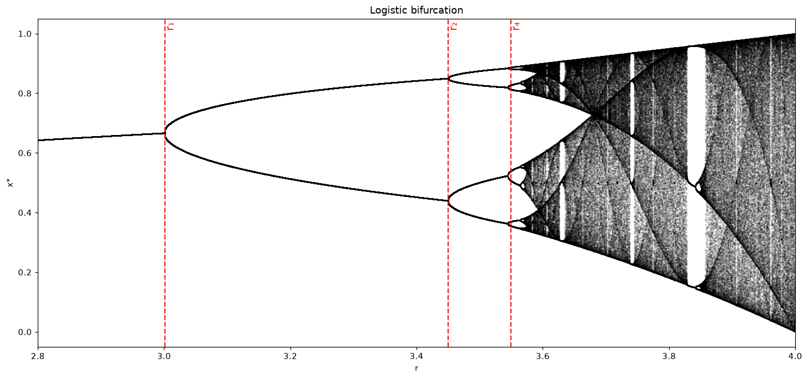
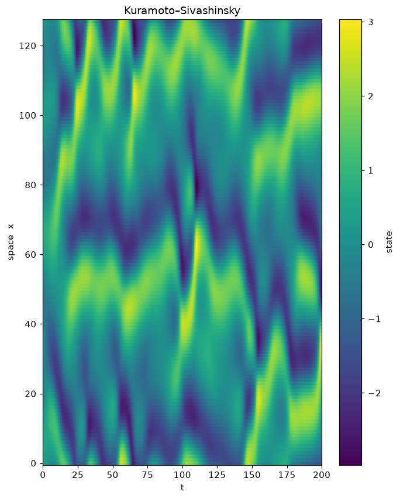

# TSDynamics

[](https://pypi.org/project/tsdynamics/)
[](https://github.com/El3ssar/TSDynamics/actions/workflows/ci.yml)
[](https://github.com/El3ssar/TSDynamics/actions/workflows/release.yml)
[](https://el3ssar.github.io/TSDynamics/)
[](https://pypi.org/project/tsdynamics/)
[](https://codecov.io/gh/El3ssar/TSDynamics)

**Dynamical systems in Python: 151 built-in systems, a native Rust integration
engine, and a chaos-analysis toolkit — with the simplest system-definition
contract anywhere.**

You write the math (one symbolic method); TSDynamics lowers it to a native Rust
engine and handles integration, Lyapunov spectra, bifurcation diagrams, Poincaré
sections, attractors & basins — and even the documentation page for your system.

<p align="center">
  <br>
  <em>A built-in Lorenz attractor — integrated, spun, and saved to a GIF (code below).</em>
</p>

```python
import tsdynamics as ts

lor = ts.Lorenz()
traj = lor.integrate(final_time=100.0, dt=0.01)
traj["x"]                              # named component access
lor.lyapunov_spectrum()                # → [0.91, ~0, -14.57]
ts.kaplan_yorke_dimension(_)           # → ~2.06
```

📖 **Documentation: <https://el3ssar.github.io/TSDynamics/>**

---

## Define your own system

```python
import tsdynamics as ts

class Rossler(ts.ContinuousSystem):
    params = {"a": 0.2, "b": 0.2, "c": 5.7}
    dim = 3
    variables = ("x", "y", "z")            # optional niceties

    @staticmethod
    def _equations(y, t, *, a, b, c):
        x, yv, z = y(0), y(1), y(2)
        return (-yv - z, x + a * yv, b + z * (x - c))
```

That's the whole contract. The class auto-registers: every analysis tool works
on it, the test-suite sweeps it, and the docs build renders its equations
(LaTeX, straight from the symbolics) and its attractor — zero extra steps. Delay
systems use `y(0, t - tau)`; maps implement `_step`/`_jacobian` (signature order
validated at import); SDEs add a `_diffusion` term.

## From equations to figures

Every system produces a `Trajectory`, and every `Trajectory` knows how to plot
itself (`to_plot_spec` auto-detects the right kind from the data). The plot is a
backend-neutral *spec* you tweak fluently, then `render` or `save` to matplotlib,
plotly (interactive), or a three.js / JSON export.

**Bifurcation diagram of the logistic map**, with the period-doubling onsets
marked — `orbit_diagram` is one call, and `.bifurcation_points()` finds the
cascade ($r_1 = 3$, $r_2 = 1 + \sqrt6 \approx 3.449$, …):

```python
import numpy as np, tsdynamics as ts
from tsdynamics.viz import Annotation

orbit = ts.orbit_diagram(ts.Logistic(), "r", np.linspace(2.8, 4.0, 2000))
pts = orbit.bifurcation_points()

spec = orbit.to_plot_spec().relabel(x="r", y="x*", title="Logistic bifurcation")
spec.style(color="k", s=0.2, alpha=0.5)                  # tiny semi-transparent dots
spec.annotations = [
    Annotation("vline", x=pts[i], text=lbl, style={"color": "red", "linestyle": "--"})
    for i, lbl in [(0, " r₁"), (1, " r₂"), (3, " r₄")]
]
spec.save("bifurcation.png", size=(1600, 700))
```



**A PDE, too** — the Kuramoto–Sivashinsky equation is a built-in spatially
extended system; its space–time field is auto-detected and drawn as a heatmap:

```python
ks = ts.KuramotoSivashinsky(N=128, L=22.0)
traj = ks.integrate(final_time=200.0, dt=0.25)
traj.to_plot_spec().save("ks.png")        # 128-mode space–time field
```

<p align="center">
  
</p>

The spinning attractor at the top is the same `to_plot_spec`, animated:

```python
traj = ts.Lorenz().integrate(final_time=100.0, dt=0.01)
spec = traj.to_plot_spec()
spec.style(axes=False).trail(None).camera(spin=0.4)      # full curve, no axes, rotate
spec.animate(fps=30, duration=10, loop=True)
spec.save("lorenz.gif")
```

## A taste of the analysis layer

```python
import numpy as np, tsdynamics as ts

# Poincaré section of the Rössler attractor (root-refined crossings)
section = ts.poincare_section(ts.Rossler(), plane=("y", 0.0, "up"), n=500)

# Fixed points of the Hénon map, with stability
ts.fixed_points(ts.Henon())
# [FixedPoint([-1.1314 -0.3394], unstable), FixedPoint([0.6314 0.1894], unstable)]

# Maximal Lyapunov exponent — no Jacobian needed
ts.max_lyapunov(ts.Lorenz(ic=[1, 1, 1]), dt=0.05)        # ≈ 0.9
```

Plus: **attractors & basins** of any flow or map, correlation/Rényi **fractal
dimensions**, **permutation/sample/dispersion entropy**, **RQA** (recurrence
quantification), **surrogate** hypothesis tests, **delay embedding** (Takens,
optimal τ, Cao/FNN), GALI & the 0–1 chaos test, and Lyapunov exponents **from a
bare time series** (Kantz/Rosenstein).

## Highlights

- **Three families, one interface** — ODEs, delay-differential equations
  (including **DDE Lyapunov spectra**) and discrete maps, all on the same native
  Rust engine, all implementing one stepping protocol — so every analysis tool
  works on every system.
- **151 built-in systems** with literature parameters: Lorenz, Rössler, Chua,
  21 Sprott flows, Mackey–Glass, Hénon, Kuramoto–Sivashinsky, … each with an
  auto-generated docs page.
- **Native engine, zero warmup** — equations lower to a Rust engine (an SSA-tape
  interpreter, with a Cranelift JIT alongside) in-process; parameters are runtime
  values, so changing them is free and there is no compile step or cache.
- **Composition** — a `PoincareMap` of a flow *is* a discrete map, so
  `orbit_diagram(PoincareMap(Rossler(), ("y", 0.0)), "c", values)` draws the
  bifurcation diagram of a *flow* in one line.
- **Backend-neutral plotting** — one `PlotSpec` IR renders to matplotlib, plotly
  (interactive + animated HTML), three.js, or JSON, with a fluent styling/theming
  vocabulary.

## Install

```bash
pip install tsdynamics            # or: uv add tsdynamics
```

A prebuilt `abi3` wheel (manylinux / musllinux / macOS / Windows) bundles the
native Rust engine — no Rust toolchain and no C compiler needed to install or
run. Optional plotting extra: `tsdynamics[plot]` (matplotlib). Building from the
sdist needs a Rust toolchain (the build backend is
[maturin](https://www.maturin.rs/)).

## Development

```bash
git clone https://github.com/El3ssar/TSDynamics && cd TSDynamics
uv sync --group dev --group docs
uv run pytest -m "not slow" --no-cov     # fast tier
uv run pytest --no-cov                   # full local suite
TSD_DOCS_FIGURES=0 uv run mkdocs serve   # docs preview
```

Releases are automated: conventional-commit PR titles drive
[semantic-release](https://python-semantic-release.readthedocs.io/) on merge —
see [CONTRIBUTING](https://el3ssar.github.io/TSDynamics/project/contributing/).

## License

MIT © Daniel Estevez
