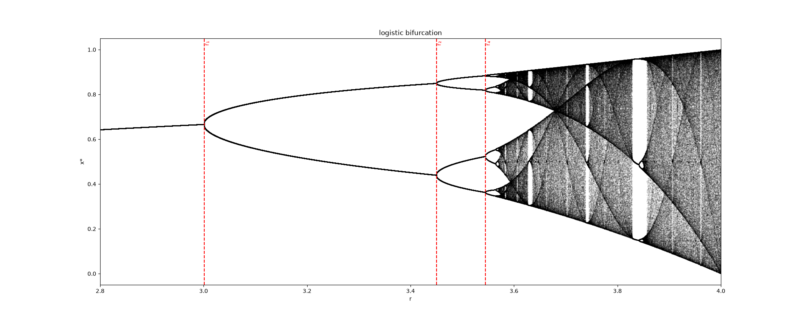
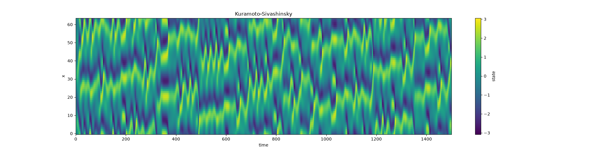

# TSDynamics

[](https://pypi.org/project/tsdynamics/)
[](https://github.com/El3ssar/TSDynamics/actions/workflows/ci.yml)
[](https://github.com/El3ssar/TSDynamics/actions/workflows/release.yml)
[](https://el3ssar.github.io/TSDynamics/)
[](https://pypi.org/project/tsdynamics/)
[](https://codecov.io/gh/El3ssar/TSDynamics)

**Dynamical systems in Python: 177 built-in systems, a native Rust integration
engine, and a chaos-analysis toolkit — with the simplest system-definition
contract anywhere.**

You write the math (one symbolic method); TSDynamics lowers it to a native Rust
engine and handles integration, Lyapunov spectra, bifurcation diagrams, Poincaré
sections, attractors & basins — and even the documentation page for your system.

<p align="center">
  <br>
  <em>A built-in Lorenz attractor — integrated, spun, and saved to a GIF (code below).</em>
</p>

```python
import tsdynamics as ts

lor = ts.Lorenz()
traj = lor.integrate(final_time=100.0, dt=0.01)
traj["x"]                              # named component access

exps = lor.lyapunov_spectrum()         # → [0.91, ~0, -14.58]
ts.kaplan_yorke_dimension(exps)        # → ~2.06
```

📖 **Documentation: <https://el3ssar.github.io/TSDynamics/>**

---

## Define your own system

```python
import tsdynamics as ts

class Rossler(ts.ContinuousSystem):
    params = {"a": 0.2, "b": 0.2, "c": 5.7}
    dim = 3
    variables = ("x", "y", "z")            # optional niceties

    @staticmethod
    def _equations(y, t, *, a, b, c):
        x, yv, z = y(0), y(1), y(2)
        return (-yv - z, x + a * yv, b + z * (x - c))
```

That's the whole contract. The class auto-registers: every analysis tool works
on it, the test-suite sweeps it, and the docs build renders its equations
(LaTeX, straight from the symbolics) and its attractor — zero extra steps. Delay
systems use `y(0, t - tau)`; maps implement `_step`/`_jacobian` (signature order
validated at import); SDEs add a `_diffusion` term.

## From equations to figures

Every system produces a `Trajectory`, and every `Trajectory` knows how to plot
itself (`to_plot_spec` auto-detects the right kind from the data). The plot is a
backend-neutral *spec* you tweak fluently, then `render` or `save` to matplotlib,
plotly (interactive), or a three.js / JSON export.

**Bifurcation diagram of the logistic map**, with the period-doubling onsets
marked — `orbit_diagram` is one call, and `.bifurcation_points()` finds the
cascade ($r_1 = 3$, $r_2 = 1 + \sqrt6 \approx 3.449$, …):

```python
import numpy as np, tsdynamics as ts
from tsdynamics.viz import Annotation

orbit = ts.orbit_diagram(ts.Logistic(), "r", np.linspace(2.8, 4.0, 2000))
pts = orbit.bifurcation_points()

spec = orbit.to_plot_spec().relabel(x="r", y="x*", title="Logistic bifurcation")
spec.style(color="k", markersize=0.2, alpha=0.5)         # tiny semi-transparent dots
spec.annotations = [
    Annotation("vline", x=pts[i], text=lbl, style={"color": "red", "linestyle": "--"})
    for i, lbl in [(0, " r₁"), (1, " r₂"), (3, " r₄")]
]
spec.save("bifurcation.png", size=(1600, 700))
```



**A PDE, too** — the Kuramoto–Sivashinsky equation is a built-in spatially
extended system; its space–time field is auto-detected and drawn as a heatmap:

```python
import tsdynamics as ts

ks = ts.KuramotoSivashinsky(N=128, L=22.0)
traj = ks.integrate(final_time=200.0, dt=0.25)
traj.to_plot_spec().save("ks.png")        # 128-mode space–time field
```


<p align="center">
  
</p>


**Named plots, one front door.** Beyond the auto-detected default, `ts.plot`
takes the name of a **plot transform** — 35 of them, from `nullclines` and
`streamlines` to `ftle`, `cobweb`, `invariant_density` and `trace_determinant`.
Each declares which *primitives* can draw it, so you pick the drawing without
touching a backend:

```python
import tsdynamics as ts

vdp = ts.VanDerPol(params={"mu": 1.0})
ts.plot(vdp, "flow_speed", "nullclines", "streamlines")   # overlay, order-free
ts.plot(ts.Logistic(params={"r": 3.5}), "cobweb")
```

A transform owns no new math — it adapts an estimator from `tsdynamics.analysis`.
The [gallery](https://el3ssar.github.io/TSDynamics/visualization/gallery/) is
generated from the registry, so every picture there is produced by the snippet
printed beside it.

The spinning attractor at the top is the same `to_plot_spec`, animated:

```python
import tsdynamics as ts

traj = ts.Lorenz().integrate(final_time=100.0, dt=0.01)
spec = traj.to_plot_spec()
spec.style(axes=False).trail(None).camera(spin=0.4)      # full curve, no axes, rotate
spec.animate(fps=30, duration=10, loop=True)
spec.save("lorenz.gif")
```

## A taste of the analysis layer

```python
import numpy as np, tsdynamics as ts

# Poincaré section of the Rössler attractor (root-refined crossings)
section = ts.poincare_section(ts.Rossler(), plane=("y", 0.0, "up"), n=500)

# Fixed points of the Hénon map, with stability
list(ts.fixed_points(ts.Henon()))
# [FixedPoint([-1.131354 -0.339406], unstable, |λ|max=3.2598),
#  FixedPoint([0.631354 0.189406], unstable, |λ|max=1.9237)]

# Maximal Lyapunov exponent — no Jacobian needed
ts.max_lyapunov(ts.Lorenz(ic=[1, 1, 1]), dt=0.05)        # ≈ 0.90
```

Plus: **attractors & basins** of any flow or map, correlation/Rényi **fractal
dimensions**, **RQA** (recurrence quantification), **delay embedding** (Takens,
optimal τ, Cao/FNN), **periodic orbits** (shooting, Davidchack–Lai, rigorous
interval enclosure), GALI, the 0–1 chaos test & Hunt–Ott expansion entropy, and
Lyapunov exponents **from a bare time series** (Kantz/Rosenstein).

## Highlights

- **Four families, one interface** — **ODEs**, **DDEs**, **SDEs** and
  **discrete maps** all implement the same stepping protocol
  (`reinit` / `step` / `state` / `trajectory`), so every analysis composes over
  all of them.

- **177 built-in systems** with literature parameters (142 ODEs, 26 maps, 6 DDEs, 3 SDEs).

- **Native engine**: equations lower to a Rust engine in-process and run on a
  built-in Cranelift JIT (or a bit-for-bit identical SSA-tape interpreter);
  parameters are runtime values, so changing them is free, and nothing is ever
  written to disk.

- **`dt` samples, `rtol` decides** — the output grid and the accuracy knob are
  separate. The adaptive steppers use genuine dense output, so a coarse `dt` is
  cheap without being less accurate, and `max_step=` is there when you need to
  bound the step explicitly. Defaults are `rtol=1e-9` / `atol=1e-12`.

- **Composition** — a `PoincareMap` of a flow *is* a discrete map, so
  `orbit_diagram(PoincareMap(Rossler(), ("y", 0.0)), "c", values)` draws the
  bifurcation diagram of a *flow* in one line.

- **Backend-neutral plotting** — one `PlotSpec` IR renders to matplotlib, plotly
  (interactive + animated HTML), three.js, or JSON, with a fluent styling/theming
  vocabulary.

## Install

```bash
pip install tsdynamics            # or: uv add tsdynamics
```

A prebuilt `abi3` wheel (manylinux / musllinux / macOS / Windows) bundles the
native Rust engine. No Rust toolchain and no C compiler needed to install or
run. Optional plotting extra: `tsdynamics[plot,interactive]` (matplotlib, plotly).

## Development

```bash
git clone https://github.com/El3ssar/TSDynamics && cd TSDynamics
uv sync --group dev --group docs
make test                                # change-scoped fast tier (the loop)
make test-slow                           # change-scoped slow tier
make test-all                            # whole fast tier — pre-push sanity
TSD_DOCS_FIGURES=0 uv run mkdocs serve   # docs preview
```

The suite is registry-driven — every test is parametrized over all 177 systems —
so a plain `pytest` is thousands of items. `make test` runs only what your diff
touches, which is what CI does too.

Releases are automated: conventional-commit PR titles drive
[semantic-release](https://python-semantic-release.readthedocs.io/) on merge.
See [CONTRIBUTING](https://el3ssar.github.io/TSDynamics/project/contributing/).

## License

MIT © Daniel Estevez
