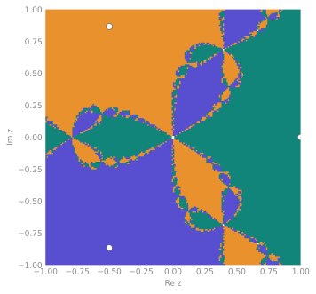

<span class="ts-kicker">Analysis · Attractors & basins</span>

# Attractors & basins

A Lyapunov exponent or a fractal dimension describes *one* attractor. But many
systems are **multistable**: several attractors coexist, and which one you reach
depends entirely on where you start. That is a global question — it lives in the
whole state space, not on a single orbit — and it is the one this toolkit
answers. It locates the attractors a system has in a region, paints the basin of
initial conditions feeding each, quantifies how tangled the boundaries between
them are, tracks how those basins deform as a parameter moves, and measures how
robust an attractor is to a perturbation.

| Function | Answers | Reads |
|---|---|---|
| [`find_attractors`](#locating-attractors) | what attractors exist | a system + region |
| [`basins_of_attraction`](#painting-basins) | which initial condition goes where | a system + `Grid` |
| [`basin_fractions`](#basin-stability) | each basin's volume share | a system + region |
| [`basin_entropy`](#boundary-structure) | is the boundary fractal? | a label image |
| [`uncertainty_exponent`](#boundary-structure) | boundary dimension $D_0$ | a label image |
| [`wada_property`](#boundary-structure) | do ≥ 3 basins share a boundary? | a label image |
| [`continuation`](#continuation-tipping-resilience) | attractors versus a parameter | a system |
| [`tipping_points`](#continuation-tipping-resilience) | where a basin dies | a `ContinuationResult` |
| [`resilience`](#continuation-tipping-resilience) | distance to the boundary | a `BasinsResult` |

Everything is built on one engine — a recurrence finite-state machine
(Datseris & Wagemakers 2022) — so the same machinery drives maps and flows
alike. On a supported engine run (an ODE flow, or a map whose `_step` lowers) the
whole per-initial-condition march runs in one sequential Rust kernel call,
bit-identical to the pure-Python fallback.

## A bistable example

The running example is the damped **two-well Duffing oscillator**,

$$\ddot{x} = x - x^3 - \delta\,\dot{x},$$

a unit mass in the double-well potential $V(x) = -\tfrac12 x^2 + \tfrac14 x^4$
with linear damping $\delta$. The two wells sit at $x = \pm 1$; with damping,
every trajectory eventually rolls into one of them, and *which* one is exactly
the basin question. It is a two-line system:

```python
import numpy as np
import tsdynamics as ts
from tsdynamics import data

class DuffingTwoWell(ts.ContinuousSystem):
    """Damped two-well Duffing: x'' = x - x**3 - delta * x'."""
    params = {"delta": 0.3}
    dim = 2
    variables = ("x", "y")

    @staticmethod
    def _equations(Y, t, *, delta):
        x, y = Y(0), Y(1)
        return (y, x - x**3 - delta * y)

sys = DuffingTwoWell()

# two nearby starts, two different wells:
sys.integrate(final_time=60.0, dt=0.05, ic=[ 1.5, 0.5]).y[-1]   # ≈ [ 1.0, 0.0]
sys.integrate(final_time=60.0, dt=0.05, ic=[-1.5, 0.5]).y[-1]   # ≈ [-1.0, 0.0]
```

That two stable states coexist is what makes the basin question meaningful.
(The delay and stochastic families are **not** supported here — their state is
not a finite-dimensional point the cell tessellation can bin — and raise a clear
`TypeError`.)

## Locating attractors

`find_attractors` tessellates a search region into cells, draws random initial
conditions from it, and follows each trajectory cell by cell with a small
finite-state machine: while it keeps landing in *new* cells it is transient; once
it recurrently re-visits cells it has located an **attractor** (the recurrent
cell set). Near-coincident attractors are proximity-merged (`merge_tol`).

```python
region = data.Box(np.array([-2.0, -2.0]), np.array([2.0, 2.0]))

att = ts.find_attractors(sys, region, resolution=40, n_seeds=200,
                         dt=0.5, max_steps=2000, seed=0)

att                         # AttractorSet(2 attractors, 0/200 diverged)
[a.center for a in att]     # ≈ [[-1.0, 0.0], [1.0, 0.0]]  — the two well bottoms
att.centers                 # the same, as an (n_attractors, dim) array
```

Flows step by `dt` between cell checks, maps by one iteration. A raised or
non-finite step is treated as divergence; a finite excursion outside the box is
counted by a lost-counter, and a trajectory that never settles within
`max_steps` is reported as diverged. Each `Attractor` carries its sampled
`.points`, its representative `.center`, and the number of `.cells` it occupies.

!!! note "Tune `resolution` to the attractor scale"
    Too coarse and the tessellation merges genuinely distinct attractors; too
    fine and a chaotic trajectory never recurs into the same cell, so it is never
    recognised as settled. Size the cells to the attractor's own scale. The
    per-seed march is **sequential by design** — earlier seeds leave persistent
    cell labels that let later seeds settle cheaply, and that shared,
    order-dependent labelling is exactly what makes the sweep amortise.

## Painting basins

`basins_of_attraction` runs that finder from **every cell of a `Grid` of initial
conditions** and labels each with the attractor it reaches — a colour map of
state space. Build the grid with `data.Grid(lo, hi, counts)` (or the terse
`data.region([(lo, hi, n), ...])`).

```python
grid = data.Grid(np.array([-2.0, -2.0]), np.array([2.0, 2.0]), (60, 60))
basins = ts.basins_of_attraction(sys, grid, dt=0.5, max_steps=2000)

basins.n_attractors        # 2
basins.labels              # int array, one attractor id per cell (−1 = diverged)
basins.labels.shape        # (60, 60)
basins.fractions           # {1: ≈ 0.50, 2: ≈ 0.50}  — basin volume share per id
basins.diverged_fraction   # 0.0  — nothing escaped the box
```

`basins.labels` is a plain integer array, ready to plot (attractor id per cell, with
`-1` marking diverged/unsettled cells). For the two-well Duffing the two basins
split the plane roughly in half along the smooth stable manifold of the origin
saddle.

!!! note "Imaging a slice of a higher-dimensional flow"
    For a flow whose state space is larger than the 2-D picture you want, pass a
    separate full-dimension `recurrence` box: the basin is painted over the 2-D
    `Grid` of initial conditions while the recurrence FSM runs in the full space
    (free axes pinned with `counts == 1`). This is how the magnetic pendulum's
    famous fractal basins are imaged from its higher-dimensional phase space.

## Basin stability

`basin_fractions` skips the image and Monte-Carlo–samples the region instead —
**basin stability** in the sense of Menck et al. (2013): the probability that a
random initial condition lands on each attractor, with a binomial standard error
$\sqrt{p(1-p)/n}$ that depends only on the fraction and the sample count, never
on the dimension.

```python
bf = ts.basin_fractions(sys, region, n=400, dt=0.5, max_steps=2000, seed=0)

bf.fractions        # {1: ≈ 0.53, 2: ≈ 0.47}
bf.dominant         # 1  — the id with the largest basin
bf.standard_error   # {1: ≈ 0.025, 2: ≈ 0.025}
bf.diverged         # 0.0
```

Because it never forms an image, `basin_fractions` scales to high dimension where
a full grid would be impossible — and it is the workhorse `continuation` sweeps
below.

### Validation systems

These three examples pin the fractions to values you can check by symmetry:

| System | Basins | Each fraction |
|---|---|---|
| Two-well Duffing (above) | 2 | $\approx 1/2$ |
| Newton's method on $z^3 = 1$ (a map) | 3 (symmetric) | $\approx 1/3$ |
| Magnetic pendulum | 3, *fractal* boundary | Wada (see below) |

## Boundary structure

Once you have a basin *label image* — a `.labels` array — three metrics read
it directly and do **no** further integration, so they run instantly. They answer
the question a smooth-boundary two-well system and a fractal-boundary map answer
very differently: *how predictable is the outcome near the boundary?*

For the smooth two-well Duffing basin the answer is "very": the boundary is a
clean curve.

```python
be = ts.basin_entropy(basins.labels)
be.sb, be.sbb              # ≈ 0.24, 0.53
be.fractal_boundary        # False   (Sbb ≈ 0.53 < ln 2 ≈ 0.693)

ue = ts.uncertainty_exponent(basins.labels)
ue.alpha                   # ≈ 0.88  — near 1: a thin, nearly-smooth boundary
ue.boundary_dimension      # ≈ 1.12  — D₀ = D − α
```

A **fractal** basin tells a different story. The figure below is Newton's method
on $z^3 = 1$ — three roots, three basins, and a Julia-set boundary where every
boundary point touches all three colours. That is the **Wada** property, and
`wada_property` detects it:

<div class="ts-ref" markdown>

<div class="ts-item" markdown>

```python
from tsdynamics import Grid
from tsdynamics.analysis import basins as bas

class NewtonMap(ts.DiscreteMap):
    """Newton on z**3 - 1 = 0 → three roots, Wada basins."""
    params: dict = {}
    dim = 2
    variables = ("re", "im")
    _jacobian_fd_check = False

    @staticmethod
    def _step(X):
        z = complex(X[0], X[1])
        z = (2.0 * z**3 + 1.0) / (3.0 * z**2)
        return (z.real, z.imag)

    @staticmethod
    def _jacobian(X):
        return ((0.0, 0.0), (0.0, 0.0))

res = bas.basins_of_attraction(
    NewtonMap(), Grid([-1.0, -1.0], [1.0, 1.0], (200, 200)),
    consecutive_recurrences=8, attractor_locate_steps=5, max_steps=200)

res.fractions                    # {1: ≈ 1/3, 2: ≈ 1/3, 3: ≈ 1/3}
wr = ts.wada_property(res.labels)
wr.is_wada, wr.n_basins          # True, 3
wr.fractions[-1]                 # 1.0  — every boundary cell sees all 3 basins
```

The three basins interleave on a fractal boundary: no matter how finely you
localise an initial condition near the boundary, its fate stays uncertain —
final-state sensitivity in its purest form.

</div>
<figure class="ts-fig" markdown>
{ loading=lazy }
<figcaption>Basins of Newton's method on $z^3 = 1$: every point in the complex plane is coloured by which of the three roots (the cube roots of unity) it converges to, and the three basins interleave on a fractal Julia-set boundary — the Wada hallmark, where every boundary point touches all three colours.</figcaption>
</figure>

</div>

The three metrics, in one place:

=== "basin_entropy"

    The basin entropy $S_b$ and boundary basin entropy $S_{bb}$ (Daza et al.
    2016) measure label diversity per box; **$S_{bb} > \ln 2$ is a sufficient
    condition for a fractal boundary**, exposed as `.fractal_boundary`.

    ```python
    import numpy as np
    rng = np.random.default_rng(0)
    riddled = rng.integers(1, 4, size=(200, 200))   # a maximally-mixed boundary

    be = ts.basin_entropy(riddled)
    be.sb, be.sbb              # ≈ 1.06, 1.06
    be.fractal_boundary        # True   (Sbb > ln 2)
    ```

=== "uncertainty_exponent"

    The fraction of $\varepsilon$-uncertain cells scales as
    $f(\varepsilon)\sim\varepsilon^{\alpha}$ (Grebogi et al. 1983); a **small
    $\alpha$** means a thick, fractal boundary where the outcome is rarely
    predictable, and the boundary box-counting dimension is $D_0 = D - \alpha$.

    ```python
    ue = ts.uncertainty_exponent(res.labels)   # the Newton basin image
    ue.alpha                   # small → fractal, final-state-sensitive boundary
    ue.boundary_dimension      # D₀ = D − α
    ```

=== "wada_property"

    The grid test of Daza et al. (2015) for the **Wada property**: with three or
    more basins, a boundary cell is Wada-complete when its neighbourhood contains
    *every* basin colour, and the fraction of such cells tends to one for a
    genuine Wada boundary. A sufficient grid criterion, not a topological proof.

    ```python
    wr = ts.wada_property(res.labels)
    wr.is_wada, wr.n_basins        # True, 3   (for the Newton map)
    ```

## Continuation, tipping, resilience

Multistability is not static — as a parameter drifts, basins grow, shrink, and
sometimes vanish outright. `continuation` re-finds the attractors at each value
of a swept parameter and **matches** them across values by state-space distance
(greedy nearest; Datseris, Rossi & Wagemakers 2023), so a single attractor keeps
its id along its branch. `min_fraction` drops the tiny spurious sets the
recurrence finder can report near unstable equilibria.

Tilt the two-well Duffing with a constant force $F$ — as $F$ grows past a fold,
the shallower well disappears, and one basin annihilates:

```python
class TiltedDuffing(ts.ContinuousSystem):
    """x'' = x - x**3 - delta * x' + F  — a fold as F grows."""
    params = {"delta": 0.3, "F": 0.0}
    dim = 2
    variables = ("x", "y")

    @staticmethod
    def _equations(Y, t, *, delta, F):
        x, y = Y(0), Y(1)
        return (y, x - x**3 - delta * y + F)

cont = ts.continuation(TiltedDuffing(), "F", np.linspace(0.0, 0.6, 13),
                       region, n=300, resolution=60, dt=0.5, max_steps=1500, seed=0)

cont.fractions        # {1: [0.52, 0.45, …, nan, nan], 2: [0.48, 0.55, …, 1.0]}
                      #   attractor 1 vanishes past the fold → nan (basin gone)
tips = ts.tipping_points(cont)
[(e["kind"], e["attractor"], round(e["value"], 2)) for e in tips]
# → [("disappear", 1, 0.4)]   — one well's basin annihilates at F ≈ 0.4
```

`tipping_points` reads off the parameter values where a basin's share crosses a
threshold (default $0$ — true appearance / annihilation); raise the threshold to
flag basins shrinking past a safety margin. Each event is a dict with
`"value"`, `"attractor"`, `"kind"` (`"appear"` / `"disappear"`), and the
`"before"` / `"after"` fractions.

`resilience` measures, for a chosen attractor in a painted `BasinsResult`, the
distance from the attractor to the nearest cell of another basin — the largest
perturbation it can absorb without tipping (Halekotte & Feudel 2020):

```python
r = ts.resilience(basins, attractor_id=1)   # from the two-well basin image
float(r)                                     # ≈ 0.61  — distance to the boundary
```

Larger means more resilient. A resilient attractor sits deep inside its own
basin; one hugging the boundary can be tipped by a small kick.

## See also

- [Tutorials](../tutorials/index.md) — runnable end-to-end walkthroughs
- [Fixed & periodic points](fixed-points.md) — the equilibria and limit cycles the attractors often are
- [Lyapunov spectra](lyapunov.md) — the local stretching rate on a single attractor
- [Systems](../systems/index.md) — the built-in catalogue of maps and flows

## References

- C. Grebogi, S. W. McDonald, E. Ott and J. A. Yorke, "Final state sensitivity: an obstruction to predictability", *Phys. Lett. A* **99**, 415 (1983).
- P. J. Menck, J. Heitzig, N. Marwan and J. Kurths, "How basin stability complements the linear-stability paradigm", *Nat. Phys.* **9**, 89 (2013).
- A. Daza, A. Wagemakers, M. A. F. Sanjuán and J. A. Yorke, "Testing for basins of Wada", *Sci. Rep.* **5**, 16579 (2015).
- A. Daza, A. Wagemakers, B. Georgeot, D. Guéry-Odelin and M. A. F. Sanjuán, "Basin entropy: a new tool to analyze uncertainty in dynamical systems", *Sci. Rep.* **6**, 31416 (2016).
- L. Halekotte and U. Feudel, "Minimal fatal shocks in multistable complex networks", *Sci. Rep.* **10**, 11374 (2020).
- G. Datseris and A. Wagemakers, "Effortless estimation of basins of attraction", *Chaos* **32**, 023104 (2022).
- G. Datseris, K. L. Rossi and A. Wagemakers, "Framework for global stability analysis of dynamical systems", *Chaos* **33**, 073151 (2023).
