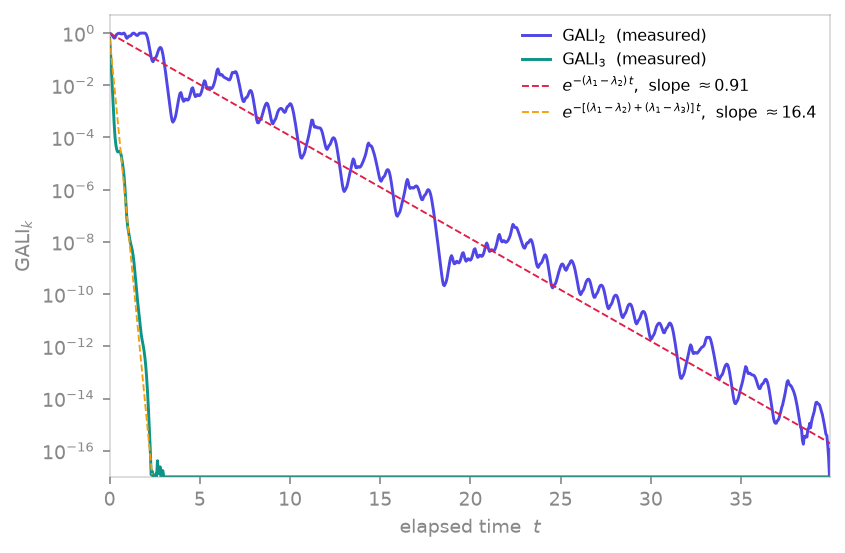

<span class="ts-kicker">Analysis · 06</span>

# Chaos indicators

Sometimes you only need a verdict — *is this orbit chaotic?* — not the whole
Lyapunov spectrum. TSDynamics ships three fast, literature-validated tests
that answer it from different angles: an alignment index of tangent vectors,
a single scalar drawn from one observable, and a derivative-volume growth
rate that estimates topological entropy.

<figure markdown>
{ loading=lazy }
<figcaption>On the chaotic Lorenz attractor both alignment indices collapse exponentially, and the decay rate is fixed by the Lyapunov gaps: GALI₂ falls at λ₁−λ₂ ≈ 0.91 (λ₂ ≈ 0 along the flow) while GALI₃ falls at (λ₁−λ₂)+(λ₁−λ₃) ≈ 16.4, hitting the floating-point floor almost immediately — the measured curves (indigo/teal) tracking the predicted Skokos-law slopes (dashed).</figcaption>
</figure>

| Function | Answers | Chaotic ⇒ | Regular ⇒ |
|---|---|---|---|
| [`gali`](#gali-generalized-alignment-index) | tangent-vector volume | exponential decay | $\sim O(1)$ / power law |
| [`zero_one_test`](#zeroone-test) | scalar $K\in[0,1]$ | $K\approx 1$ | $K\approx 0$ |
| [`expansion_entropy`](#expansion-entropy) | $H_0$ (topological entropy) | $H_0 > 0$ | $H_0 \approx 0$ |

Maps use the compiled analytic `_jacobian`; flows use a self-contained RK4
variational core. Both are backend-free (fast tier) — no engine compile.

## GALI — Generalized Alignment Index

`gali` evolves $k$ deviation vectors along the orbit and tracks the volume of
the parallelepiped they span (Skokos, Bountis & Antonopoulos 2007). For a
chaotic orbit every deviation vector aligns with the most-expanding direction,
so the volume collapses **exponentially**,
$\mathrm{GALI}_k \sim e^{-[(\lambda_1-\lambda_2)+\dots+(\lambda_1-\lambda_k)]\,t}$;
for regular (quasi-periodic) motion it stays $O(1)$ or decays only by a power
law. The deviation vectors are *not* re-orthonormalised — only per-column
renormalised — which is what lets the volume actually shrink.

```python
import tsdynamics as ts

g = ts.gali(ts.Lorenz(), 2, final_time=40.0, dt=0.05)
g.values[0], g.values[-1]   # ≈ 1.0  →  ~1e-16  (exponential collapse: chaotic)
g.is_discrete               # False
g.decay_rate()              # ≈ 0.9  →  λ₁ − λ₂ (the Skokos law)
```

`GALIResult` carries the full decay curve: `g.k`, `g.times`, `g.values`,
`g.is_discrete`. `g.decay_rate()` fits the log-slope of `g.values` to recover
the exponent gap, and `g.is_chaotic()` thresholds the final value.

!!! note "GALI on a flow integrates its variational core"
    `gali` on a map (`ts.Henon()`) is immediate; on a flow the deviation
    vectors are integrated by the internal RK4 core, so it is slower. The
    decay rate of $\mathrm{GALI}_2$ on the Lorenz attractor reproduces
    $\lambda_1-\lambda_2 \approx 0.906$ (with $\lambda_2 = 0$ along the flow),
    the Skokos law — see [Lyapunov spectra](lyapunov.md) for the spectrum.

## Zero–one test

`zero_one_test` answers the question from a **single scalar observable** — no
phase-space reconstruction, no Jacobian (Gottwald & Melbourne 2004). It drives
a translation variable by the observable, measures the asymptotic growth of its
mean-square displacement, and correlates that against linear growth to return
$K \in [0,1]$: $K \approx 1$ for chaos (Brownian-like, unbounded diffusion),
$K \approx 0$ for regular motion (bounded).

```python
chaotic  = ts.Logistic(params={"r": 4.0}).trajectory(3000, transient=500, ic=[0.4])
periodic = ts.Logistic(params={"r": 3.5}).trajectory(3000, transient=500, ic=[0.4])

ts.zero_one_test(chaotic.y[:, 0])    # ≈ 0.998  (chaotic)
ts.zero_one_test(periodic.y[:, 0])   # ≈ 0.0    (period-4 window)
```

The input is a bare 1-D series (or a multi-component array plus `component=`).
The test medians over `n_c` random drive frequencies `c_range` to suppress
resonances; pass `seed=` for a reproducible draw. It is designed for
**noise-free deterministic** signals — strong observational noise pushes $K$
toward 1 spuriously, so pre-filter or cross-check with a
[surrogate test](surrogate.md).

## Expansion entropy

`expansion_entropy` estimates the **topological entropy** $H_0$ — and, for a
smooth system, the sum of the positive Lyapunov exponents — from the growth of
a derivative-volume integral over a chosen region (Hunt & Ott 2015). It Monte-
Carlo samples initial conditions in a `Box`, accumulates the local expansion
factor $|\det Df|$ restricted to expanding directions, and reads the entropy
off the log-growth slope; points that leave the region are dropped (the
survivor count is reported).

```python
from tsdynamics import Box

# Unit-height tent map: |f'| ≡ 2 everywhere ⇒ H = ln 2, exactly
ts.expansion_entropy(ts.Tent(params={"mu": 1.0}),
                     Box([0.0], [1.0]), n_samples=200, steps=18).entropy
# ≈ 0.6931  ( = ln 2 )

# Hénon map: reproduces its topological entropy
h = ts.expansion_entropy(ts.Henon(), Box([-1.6, -0.5], [1.6, 0.5]),
                         n_samples=400, steps=12)
float(h)          # ≈ 0.447   (h_top ≈ 0.465, Newhouse–Pignataro)
```

The region **must** match the system dimension. For a **flow** pass
`final_time=` and `dt=` instead of `steps=`; passing `dt=` to a map raises
(it has no meaning there). `ExpansionEntropyResult` carries `entropy`,
`stderr`, the `times` / `log_growth` curve, `n_samples`, `n_survivors`,
`fit_slice` and `intercept` — inspect the curve and pass `fit_range=(lo, hi)`
to fix the scaling region for a publishable number.

## Known values

| System | Quantity | Value | Source |
|---|---|---|---|
| Logistic, `r = 4` | `zero_one_test` | $K \approx 1.0$ | run above |
| Logistic, `r = 3.5` | `zero_one_test` | $K \approx 0$ | run above |
| Tent, `mu = 1` | `expansion_entropy` | $\ln 2 \approx 0.693$ | run above (exact) |
| Hénon (defaults) | `expansion_entropy` | $\approx 0.447$ | run; lit. $h_{\text{top}}\!\approx\!0.465$ |
| Lorenz | $\mathrm{GALI}_2$ decay | $\lambda_1-\lambda_2 \approx 0.9$ | run above; lit. $\approx 0.906$ (Skokos law) |

## See also

- [Lyapunov spectra](lyapunov.md) — the full quantifier these indicators stand in for
- [Theory · Lyapunov exponents](../theory/lyapunov.md) — the tangent-space math
- [Recurrence & RQA](recurrence.md) — a complementary, geometry-based chaos diagnostic

## References

- Skokos, Bountis & Antonopoulos (2007), *Physica D* **231**, 30.
- Gottwald & Melbourne (2004), *Proc. R. Soc. A* **460**, 603.
- Hunt & Ott (2015), *Chaos* **25**, 097618.
