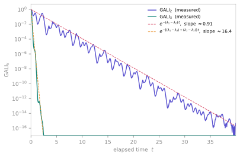

<span class="ts-kicker">Analysis · Chaos indicators</span>

# Chaos indicators

Sometimes you do not want the whole Lyapunov spectrum — you want a *verdict*.
Is this orbit chaotic or regular? TSDynamics ships three fast,
literature-validated tests that answer it from three different angles: the
alignment of tangent vectors, a single scalar drawn from one observable, and
the growth of a derivative-volume that estimates topological entropy. Each is
cheap, each returns a result you can threshold, and together they cross-check
one another.

<figure markdown>
{ loading=lazy }
<figcaption>On the chaotic Lorenz attractor both alignment indices collapse exponentially, and their decay rates are fixed by the Lyapunov gaps: GALI₂ (indigo) falls at $\lambda_1-\lambda_2 \approx 0.91$ (with $\lambda_2 \approx 0$ along the flow), while GALI₃ (teal) falls at $(\lambda_1-\lambda_2)+(\lambda_1-\lambda_3) \approx 16.4$, hitting the floating-point floor almost at once — the measured curves tracking the predicted Skokos-law slopes (dashed).</figcaption>
</figure>

| Function | Reads | Chaotic ⇒ | Regular ⇒ |
|---|---|---|---|
| [`gali`](#gali-generalized-alignment-index) | tangent-vector volume | exponential decay | $\sim O(1)$ / power law |
| [`zero_one_test`](#the-01-test) | scalar $K \in [-1, 1]$ | $K \approx 1$ | $K \approx 0$ |
| [`expansion_entropy`](#expansion-entropy) | $H$ (topological entropy) | $H > 0$ | $H \approx 0$ |

Maps use the compiled analytic Jacobian; flows use a self-contained RK4
variational core. Both are backend-free (the fast tier — no engine compile
step), so these tests are cheap to sweep over a parameter or an ensemble.

## GALI — Generalized Alignment Index

`gali` evolves $k$ deviation vectors along the orbit and tracks the volume of
the parallelepiped they span (Skokos, Bountis & Antonopoulos 2007). Written as
a wedge product of the normalised deviation vectors,

$$
\mathrm{GALI}_k(t) = \lVert \hat w_1(t) \wedge \dots \wedge \hat w_k(t) \rVert
    = \prod_{i=1}^{k} \sigma_i,
$$

it is the product of the singular values $\sigma_i$ of the matrix of deviation
vectors. For a **chaotic** orbit every vector rotates toward the
most-expanding direction, so the volume collapses **exponentially** at a rate
set by the leading Lyapunov gaps,

$$
\mathrm{GALI}_k(t) \sim
    e^{-[(\lambda_1-\lambda_2)+\dots+(\lambda_1-\lambda_k)]\,t}.
$$

For **regular** (quasi-periodic) motion it stays $O(1)$ or decays only by a
power law. Crucially the deviation vectors are *not* re-orthonormalised — only
per-column renormalised — which is exactly what lets the spanned volume
actually shrink.

```python
import tsdynamics as ts

g = ts.gali(ts.systems.Lorenz(), 2, final_time=40.0, dt=0.05, ic=[1.0, 1.0, 1.0])

g.values[0], g.values[-1]   # ≈ 1.0  →  ~1e-16   (exponential collapse: chaotic)
g.is_chaotic()              # True
g.decay_rate()              # ≈ 0.82  →  λ₁ − λ₂  (the Skokos law; lit. ≈ 0.906)
g.is_discrete               # False
```

The `GALIResult` carries the full decay curve — `g.k`, `g.times`, `g.values`,
`g.is_discrete` — and `float(g)` is the final value, so the result drops
straight into a threshold test. `g.decay_rate()` fits the log-slope over the
samples above the numerical floor to recover the exponent-gap sum, and
`g.is_chaotic()` thresholds the final value. Note `k` is the second positional
argument, and must satisfy $2 \le k \le \dim$.

```python
# GALI_3 on Lorenz: the second gap (λ₁ − λ₃ ≈ 15.5) is added on top, so it
# decays far faster — the teal curve in the figure above.
ts.gali(ts.systems.Lorenz(), 3, final_time=40.0, dt=0.05,
        ic=[1.0, 1.0, 1.0]).decay_rate()   # ≈ 18.4  (lit. gap sum ≈ 16.4)

# On a map GALI is immediate (analytic Jacobian, no integration):
ts.gali(ts.systems.Henon(), 2, n=60).is_chaotic()    # True
```

!!! note "GALI on a flow integrates its variational core"
    `gali` on a map is immediate; on a flow the deviation vectors are advanced
    by the internal RK4 variational core, so it is slower. The measured decay
    rate of $\mathrm{GALI}_2$ on Lorenz ($\approx 0.82$ over this short orbit)
    approximates the Skokos-law gap $\lambda_1 - \lambda_2 \approx 0.906$ (with
    $\lambda_2 = 0$ along the flow); a short, un-renormalised horizon is a
    finite-time estimate, so the number brackets rather than nails the exponent
    gap. See [Lyapunov spectra](lyapunov.md) for the spectrum itself.

    GALI characterises a **specific** orbit, so an explicit `ic` that escapes
    the basin raises rather than being silently swapped for a random one — pass
    an `ic` from a known basin point, or omit it to roll (and, if it diverges,
    retry) a random one.

## The 0–1 test

`zero_one_test` answers the question from a **single scalar observable** — no
phase-space reconstruction, no Jacobian at all (Gottwald & Melbourne 2004,
2009). For each of many random frequencies $c$ it drives a skew translation,

$$
p_c(n) = \sum_{j=1}^{n} \phi_j \cos(jc), \qquad
q_c(n) = \sum_{j=1}^{n} \phi_j \sin(jc),
$$

and measures the asymptotic growth of the mean-square displacement of
$(p_c, q_c)$. Regular dynamics keep the translation **bounded** (growth
$K_c \approx 0$); chaotic dynamics make it **diffuse** like a random walk
(linear growth, $K_c \approx 1$). The returned $K$ is the median of $K_c$ over
the frequencies, computed by the regularised correlation method of the 2009
paper.

```python
ts.zero_one_test(ts.systems.Logistic(params={"r": 4.0}), n=5000, ic=[0.1])   # ≈ 0.998  (chaotic)
ts.zero_one_test(ts.systems.Logistic(params={"r": 3.5}), n=5000, ic=[0.1])   # ≈ 0.0    (period-4 window)
```

The first argument may be a **system** — integrated (a flow) or iterated (a
map / Poincaré / stroboscopic view) internally to produce the observable — or a
bare 1-D series read directly (the *data* overload):

```python
x = ts.systems.Logistic(params={"r": 4.0}).iterate(steps=5000, ic=[0.1]).component("x")
ts.zero_one_test(x)          # ≈ 0.998   (the data overload — horizon keywords don't apply)
```

The test medians over `n_c` random drive frequencies drawn from `c_range`
(defaulting to the interval that avoids the resonances near $c = 0, \pi$); pass
`seed=` for a reproducible draw, and `return_distribution=True` to also get the
per-frequency $K_c$ array. The `ZeroOneResult` is a drop-in for its $K$ value
and also carries the translation plane $(p_c, q_c)$ — a bounded blob for
regular motion, a diffusing cloud for chaos — which `result.plot()` renders as a
phase portrait.

!!! warning "Noise-free deterministic signals only"
    The 0–1 test is designed for deterministic data, and successive samples
    must be **decorrelated** — every iterate for a map, but a *coarse* `dt`
    (or a Poincaré / stroboscopic view) for a flow. Strong observational noise
    pushes $K$ spuriously toward 1, so pre-filter, sample sparsely, or
    cross-check with an independent indicator (GALI or the Lyapunov
    spectrum) before trusting the verdict. The correlation method
    returns a Pearson coefficient, so $K \in [-1, 1]$ in principle (a regular
    orbit can give a small negative $K$); $K > 0.5$ is the usual threshold.

## Expansion entropy

`expansion_entropy` estimates the **topological entropy** $H$ — and, for a
smooth system, the sum of the positive Lyapunov exponents — from the growth of
a derivative-volume integral over a chosen region (Hunt & Ott 2015). Writing
$G(A)$ for the product of the singular values of $A$ that exceed 1 (the volume
the linearised dynamics expand a unit ball into, restricted to expanding
directions),

$$
E(t) = \frac{1}{N}\!\!\sum_{\text{orbits staying in } S}\!\! G\big(DF^{t}\big),
\qquad H = \lim_{t\to\infty} \frac{\ln E(t)}{t},
$$

estimated by Monte-Carlo sampling $N$ initial conditions in a region $S$ and
reading $H$ off the slope of $\ln E(t)$ against $t$. Points that leave the
region are dropped, and the survivor count is reported.

```python
from tsdynamics import Box

# Unit-height tent map: |f'| ≡ 2 everywhere ⇒ E(t) = 2^t ⇒ H = ln 2, exactly
ts.expansion_entropy(ts.systems.Tent(params={"mu": 1.0}),
                     Box([0.0], [1.0]), n_samples=200, n=18).entropy
# ≈ 0.6931  ( = ln 2 )

# Hénon map: reproduces its topological entropy
h = ts.expansion_entropy(ts.systems.Henon(), Box([-1.6, -0.5], [1.6, 0.5]),
                         n_samples=400, n=12)
float(h)              # ≈ 0.447   (h_top ≈ 0.465, Newhouse–Pignataro)
h.n_survivors, h.n_samples     # (295, 400) — how many stayed in S
```

The `region` is the second positional argument; omit it and the (10 %-expanded)
bounding box of a burn-in orbit is used. It **must** match the system
dimension. For a **flow** pass `final_time=` and `dt=` instead of `n=` (passing
`dt=` to a map raises — it has no meaning there):

```python
ts.expansion_entropy(ts.systems.Lorenz(), Box([-20.0, -25.0, 0.0], [20.0, 25.0, 50.0]),
                     n_samples=300, final_time=3.0, dt=0.1).entropy
# ≈ 1.16   (a positive rate — Lorenz is chaotic)
```

The `ExpansionEntropyResult` carries `entropy`, `stderr`, the
`times` / `log_growth` curve, `n_samples`, `n_survivors` and `fit_slice`.
As with every scaling estimate, inspect the growth curve and pass
`fit_range=(lo, hi)` to pin the linear region for a publishable number — a
short horizon keeps the raw (un-renormalised) tangent product from overflowing,
but too short a horizon leaves no scaling region.

## Known values

Every number here is reproduced by the calls on this page — the exact ones for
uniformly-expanding maps, the approximate ones for chaotic attractors.

| System | Quantity | Value | Source |
|---|---|---|---|
| Logistic, `r = 4` | `zero_one_test` | $K \approx 1.0$ | run above |
| Logistic, `r = 3.5` | `zero_one_test` | $K \approx 0$ | run above (period-4 window) |
| Tent, `μ = 1` | `expansion_entropy` | $\ln 2 \approx 0.693$ | run above (exact) |
| Hénon (defaults) | `expansion_entropy` | $\approx 0.447$ | run; lit. $h_{\text{top}} \approx 0.465$ |
| Lorenz | $\mathrm{GALI}_2$ decay | $\lambda_1 - \lambda_2 \approx 0.82$ | run above; lit. $\approx 0.906$ (Skokos law) |

## See also

- [Lyapunov spectra](lyapunov.md) — the full quantifier these three indicators stand in for
- [Recurrence & RQA](recurrence.md) — a complementary, geometry-based chaos diagnostic
- [Fixed points & periodic orbits](fixed-points.md) — the regular attractors these tests must *not* flag as chaotic

## References

- Skokos, Bountis & Antonopoulos, "Geometrical properties of local dynamics … the Generalized Alignment Index (GALI) method", *Physica D* **231** (2007) 30.
- Gottwald & Melbourne, "A new test for chaos in deterministic systems", *Proc. R. Soc. Lond. A* **460** (2004) 603.
- Gottwald & Melbourne, "On the implementation of the 0–1 test for chaos", *SIAM J. Appl. Dyn. Syst.* **8** (2009) 129.
- Hunt & Ott, "Defining chaos", *Chaos* **25** (2015) 097618.
