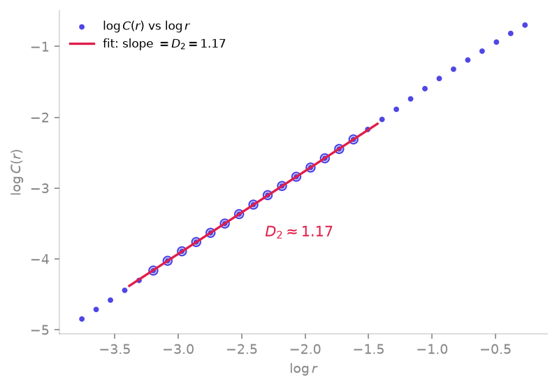

<span class="ts-kicker">Analysis · 08</span>

# Fractal dimensions

How many directions does an attractor genuinely fill? Fractal dimensions
answer that with a non-integer number — the geometric companion to the
[Lyapunov spectrum](lyapunov.md). TSDynamics estimates the whole family
($D_0$, $D_1$, $D_2$, the generalized $D_q$ and a fixed-mass variant)
from a point set, each fit on an **automatically selected** power-law
scaling region you can inspect and override.

Every estimator accepts a [`Trajectory`](../reference/base.md), a raw
`(n, d)` array, or a 1-D series, and returns a `DimensionResult`.

| Function | Estimates | Note |
|---|---|---|
| [`correlation_dimension`](#correlation-dimension-d_2) | $D_2$ | Grassberger–Procaccia |
| [`box_counting_dimension`](#the-generalized-spectrum) | $D_0$ | capacity, $q=0$ |
| [`information_dimension`](#the-generalized-spectrum) | $D_1$ | entropy, $q=1$ |
| [`generalized_dimension`](#the-generalized-spectrum) | $D_q$ | Rényi, any $q$ |
| [`dimension_spectrum`](#the-generalized-spectrum) | $D_q$ vs $q$ | sweeps $q$ |
| [`fixed_mass_dimension`](#fixed-mass-estimator) | $D_2$ | robust at high $D$ |

## Correlation dimension $D_2$

`correlation_dimension` estimates $D_2$ from the Grassberger–Procaccia
correlation sum (Grassberger & Procaccia 1983): the fraction of point
pairs closer than $\varepsilon$ scales as $C(\varepsilon)\sim
\varepsilon^{D_2}$, so $D_2$ is the slope of $\log C$ vs $\log\varepsilon$.

<figure markdown>
{ loading=lazy }
<figcaption>The Grassberger–Procaccia correlation sum of a Hénon attractor on log–log axes: the slope of the straight scaling region (rose line, points circled) between the small-$r$ noise floor and the large-$r$ saturation knee is the correlation dimension $D_2\approx1.17$, read off directly by <code>correlation_dimension</code>.</figcaption>
</figure>

```python
import tsdynamics as ts

traj = ts.Henon().trajectory(8000, transient=500, ic=[0.1, 0.1])
res = ts.correlation_dimension(traj, theiler_window=10)
float(res)            # ≈ 1.27   (Hénon attractor)
res.stderr            # slope uncertainty of the fit
```

The `theiler_window` excludes pairs closer than `w` samples in time, which
would otherwise inflate $C$ from mere temporal continuity rather than
geometric proximity (Theiler 1986) — always set it for a measured series.
`correlation_sum` exposes the raw curve $(\varepsilon, C(\varepsilon))$ if
you want to fit it yourself.

!!! note "Sanity checks you can run"
    A line or circle of points returns $D\approx1$; a filled 2-D region
    returns $D\approx2$. Both are one-liners and good fixtures:

    ```python
    import numpy as np
    t = np.linspace(0, 2 * np.pi, 4000, endpoint=False)
    circle = np.column_stack([np.cos(t), np.sin(t)])
    float(ts.correlation_dimension(circle))         # ≈ 1.02

    sq = np.random.default_rng(0).random((5000, 2))
    float(ts.correlation_dimension(sq))             # ≈ 1.91
    ```

## The generalized spectrum

The Rényi (generalized) dimensions $D_q$ partition state space into boxes
of size $\varepsilon$ and weight each box by its probability raised to the
$q$ (Hentschel & Procaccia 1983):

$$
D_q = \frac{1}{q-1}\,
      \lim_{\varepsilon\to0}
      \frac{\log \sum_i p_i^{\,q}}{\log \varepsilon}.
$$

`generalized_dimension(data, q)` computes any $D_q$;
`box_counting_dimension` ($q=0$, the capacity $D_0$) and
`information_dimension` ($q=1$, the entropy dimension $D_1$) are named
wrappers. `dimension_spectrum` sweeps a list of `qs` and returns a
`dict[q, DimensionResult]` — the $D_q$ curve is non-increasing in $q$, and
flat only for a uniform (monofractal) measure.

```python
ts.box_counting_dimension(traj)         # D0 ≈ 1.21
ts.information_dimension(traj)           # D1 ≈ 1.24
ts.generalized_dimension(traj, q=2.0)    # D2 ≈ 1.22
ts.dimension_spectrum(traj, qs=[0, 1, 2])
# {0.0: D0≈1.21, 1.0: D1≈1.24, 2.0: D2≈1.22}
```

## Fixed-mass estimator

`fixed_mass_dimension` inverts the question: instead of counting neighbours
within a fixed radius, it measures the radius enclosing a fixed number $k$
of neighbours and tracks how that radius scales with $k$ (Badii & Politi
1985). Because the sampling density adapts to the measure, it stays
well-behaved where the fixed-radius correlation sum starves of pairs — the
estimator of choice for **higher-dimensional** attractors.

```python
ts.fixed_mass_dimension(traj)            # ≈ 1.27   (agrees with D2)
```

## Inspect and override the fit

Every estimator picks the linear region of its log–log curve
automatically, but the answer is only as good as that region. The
`DimensionResult` carries the full curve and the chosen window, and the
two helpers in `tsdynamics.analysis.dimensions` let you audit or refit it:

```python
from tsdynamics.analysis.dimensions import local_slopes, fit_scaling_region

res = ts.correlation_dimension(traj, theiler_window=10)
res.x, res.y           # log ε , log C(ε)  — the scaling curve
res.fit_slice          # (lo, hi) indices the dimension was fit over

local_slopes(res.x, res.y)              # point-wise slope — flat ⇒ scaling
fit = fit_scaling_region(res.x, res.y, min_window=6, tol=1.2)
fit.slope, fit.lo, fit.hi, fit.stderr   # a ScalingFit over the plateau
```

`local_slopes` returns the running derivative of the curve; a genuine
fractal shows a **plateau** between the noise floor (small $\varepsilon$)
and the saturation knee (large $\varepsilon$). `fit_scaling_region` finds
the longest sufficiently-flat window (`tol` is the slope-spread budget) and
returns a `ScalingFit`. Pass a tighter `tol` or larger `min_window` when
the automatic region drifts into a curved tail.

!!! warning "Finite data limits the answer"
    A reliable $D$ needs roughly $10^{D}$ points and a clean plateau spanning
    at least a decade in $\varepsilon$. Above $D\approx5$, prefer
    `fixed_mass_dimension`, and never trust a number without looking at
    `local_slopes(res.x, res.y)` first.

## Known values

| Set | Estimator | Value | Source |
|---|---|---|---|
| Hénon attractor | `correlation_dimension` | $D_2\approx1.27$ | run above |
| Hénon attractor | `box_counting_dimension` | $D_0\approx1.21$ | run above |
| Lorenz attractor | `correlation_dimension` | $D_2\approx2.05$ | literature (Grassberger & Procaccia 1983) |
| Circle of points | any | $D\approx1$ | sanity check |
| Filled square | any | $D\approx2$ | sanity check |

!!! note "Lorenz is a flow"
    The Lorenz $D_2\approx2.05$ above is a **literature** value — integrating
    a flow long enough to populate the attractor is slow, so it is cited
    rather than run inline. Reconstruct it from one coordinate first via
    [delay embedding](embedding.md), then call `correlation_dimension` on the
    reconstructed cloud.

## See also

- [Delay embeddings](embedding.md) — reconstruct the cloud before measuring $D$
- [Lyapunov spectra](lyapunov.md) — the dynamical companion (Kaplan–Yorke dimension)
- [Tutorial · Equations to basins](../tutorials/equations-to-basins.md) — the full pipeline

## References

- Grassberger & Procaccia (1983), *Phys. Rev. Lett.* **50**, 346.
- Hentschel & Procaccia (1983), *Physica D* **8**, 435.
- Theiler (1986), *Phys. Rev. A* **34**, 2427.
- Badii & Politi (1985), *J. Stat. Phys.* **40**, 725.
