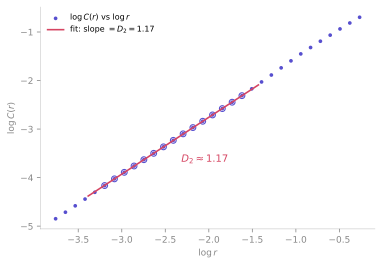

<span class="ts-kicker">Analysis · Fractal dimensions</span>

# Fractal dimensions

How many directions does an attractor genuinely fill? A strange attractor is
not a smooth manifold — it folds a bounded volume onto a set with detailed
structure at every scale, and the honest way to count its degrees of freedom is
a *non-integer* dimension. TSDynamics estimates the whole family — the
correlation dimension $D_2$, the generalized Rényi spectrum $D_q$ (with the
capacity $D_0$ and information $D_1$ as named cases), and a fixed-mass variant
robust into the sparse tails — each fit on a power-law scaling region the
library **selects automatically and lets you inspect**.

Every estimator reads a [`Trajectory`](index.md), a raw `(N, dim)` array, or a
1-D series interchangeably, and returns a `DimensionResult` that behaves as the
dimension number in arithmetic (`float(result)`) while carrying the log–log
curve and the fitted window.

| Function | Estimates | Method |
| -------- | --------- | ------ |
| [`correlation_dimension`](#correlation-dimension) | $D_2$ | Grassberger–Procaccia correlation sum |
| [`box_counting_dimension`](#the-generalized-spectrum) | $D_0$ | box counting ($q=0$, capacity) |
| [`information_dimension`](#the-generalized-spectrum) | $D_1$ | box counting ($q=1$, entropy) |
| [`generalized_dimension`](#the-generalized-spectrum) | $D_q$ | box counting, any Rényi order |
| [`dimension_spectrum`](#the-generalized-spectrum) | $D_q$ vs $q$ | sweeps $q$ on one partition |
| [`fixed_mass_dimension`](#fixed-mass-robust-into-the-tails) | $D$ | nearest-neighbour (fixed mass) |

## Correlation dimension

The Grassberger–Procaccia correlation sum counts the fraction of point pairs
closer than a radius $r$,

$$
C(r) = \frac{2}{N_\text{pairs}} \sum_{i<j}
       \Theta\!\big(r - \lVert x_i - x_j \rVert\big),
$$

and on a fractal it scales as $C(r) \sim r^{D_2}$. The correlation dimension is
therefore the slope of $\log C(r)$ against $\log r$ — but only across the
*scaling region*, the straight middle of the curve. It bends away below (the
finite-sampling noise floor) and above (saturation at the attractor diameter),
so the slope must be read off the linear stretch, not the whole range.

<div class="ts-ref" markdown>

<div class="ts-item" markdown>
`correlation_dimension` computes the sum, then reads $D_2$ off the
automatically selected scaling region. On the Hénon attractor:

```python
import tsdynamics as ts

pts = ts.systems.Henon().run(steps=8000, ic=[0.1, 0.1]).y[500:]

res = ts.analysis.correlation_dimension(pts, n_radii=32, min_window=8)
float(res)        # 1.171   (the fitted slope D2)
res.stderr        # 0.002   (slope uncertainty over the window)
res.fit_region    # (3, 13) inclusive indices of the fitted region
```

The `.y[500:]` slice drops the transient before the orbit lands on the
attractor. The figure plots exactly this result: every point of the log–log
curve (indigo), the fitted region circled, and the slope $D_2$ drawn as the
line.
</div>
<figure class="ts-fig" markdown>
{ loading=lazy }
<figcaption><span class="lbl">FIG 1</span> · the Grassberger–Procaccia correlation sum of the Hénon attractor on log–log axes; the slope of the straight scaling region (between the small-<em>r</em> noise floor and the large-<em>r</em> saturation knee) is <em>D</em>₂ ≈ 1.17.</figcaption>
</figure>

</div>

**The Theiler window.** Temporally adjacent samples of a densely sampled flow
sit spuriously close in state space and inflate $C(r)$ at small $r$, biasing
$D_2$ *downward*. Pass `theiler=w` to count only pairs separated by more than
$w$ samples in time (Theiler 1986) — always set it for a measured flow. The
Hénon map above is already decorrelated iterate-to-iterate, so no window is
needed; for a reconstructed flow use a few autocorrelation times.

The raw curve is available on its own via `correlation_sum(pts)`, which returns
`(radii, C)` if you want to fit it yourself.

!!! note "Sanity checks you can run in two lines"
    A curve of points returns $D \approx 1$; a filled 2-D region returns
    $D \approx 2$. Both are good fixtures for a new pipeline:

    ```python
    import numpy as np
    t = np.linspace(0, 2 * np.pi, 4000, endpoint=False)
    circle = np.column_stack([np.cos(t), np.sin(t)])
    float(ts.analysis.correlation_dimension(circle))        # 1.022

    square = np.random.default_rng(0).random((5000, 2))
    float(ts.analysis.correlation_dimension(square))        # 1.906
    ```

## The generalized spectrum

The Rényi (generalized) dimensions partition state space into boxes of side
$\epsilon$ and weight each occupied box by its probability $p_i(\epsilon)$
raised to a power $q$ (Hentschel & Procaccia 1983):

$$
D_q = \frac{1}{q-1}\,\lim_{\epsilon \to 0}
      \frac{\log \sum_i p_i(\epsilon)^q}{\log \epsilon},
\qquad
D_1 = \lim_{\epsilon \to 0}
      \frac{\sum_i p_i \log p_i}{\log \epsilon}.
$$

The order $q$ tunes *which part of the measure dominates*: $q=0$ counts every
occupied box equally (the capacity, or box-counting, dimension $D_0$); $q=1$ is
the information dimension $D_1$, weighted by the Shannon entropy of the measure;
$q=2$ is the correlation dimension again. For a uniform (monofractal) measure
the spectrum is flat; a $D_q$ that *decreases* with $q$ is the signature of
**multifractality** — the attractor's measure is spread unevenly.

```python
pts = ts.systems.Henon().run(steps=8000, ic=[0.1, 0.1]).y[500:]

ts.analysis.box_counting_dimension(pts)         # D0 = 1.279  (capacity)
ts.analysis.information_dimension(pts)          # D1 = 1.230  (entropy)
ts.analysis.generalized_dimension(pts, q=2.0)   # D2 = 1.167
ts.analysis.generalized_dimension(pts, q=1.5)   # D_1.5 = 1.208  (any real q >= 0)
```

`box_counting_dimension` and `information_dimension` are thin wrappers over
`generalized_dimension` at $q=0$ and $q=1$. Negative orders are rejected: the
box-counting partition function is dominated by rarely-visited boxes there and
becomes unreliable — reach for `fixed_mass_dimension` if you need the sparse-tail
regime.

To read the whole spectrum at once, `dimension_spectrum` computes the box
occupancies **once per scale** and reuses them across every $q$, so the full
curve costs barely more than a single $D_q$:

```python
spec = ts.analysis.dimension_spectrum(pts, qs=[0, 1, 2, 3, 4])
{q: round(float(r), 3) for q, r in spec.items()}
# {0.0: 1.279, 1.0: 1.230, 2.0: 1.167, 3.0: 1.099, 4.0: 1.141}
```

It returns a plain `dict[float, DimensionResult]`. In theory $D_q$ is
non-increasing in $q$ ($D_0 \ge D_1 \ge D_2 \ge \dots$), and that descending
trend is the multifractal fingerprint. On a finite sample the leading orders
here fall cleanly ($1.279 \to 1.230 \to 1.167 \to 1.099$), but the estimate at
large $q$ is noisier — the partition function is then dominated by the
most-populated boxes and the fitted slope can wobble slightly (the $q=4$ value
ticks back up to $1.141$), so read the low-$q$ end as the reliable part of the
spectrum.

!!! note "Grid-origin debiasing is automatic"
    A box count at a single fixed grid origin is biased by where the box
    boundaries happen to fall: a cluster straddling a boundary is split across
    two boxes and inflates the count. For every scale, `generalized_dimension`
    sweeps several grid-origin offsets and keeps the one yielding the *fewest*
    occupied boxes — the minimal cover closest to the true covering number
    $N(\epsilon)$. This flattens the $D_q$ spectrum of a self-similar
    monofractal (e.g. the middle-thirds Cantor set, $D_q = \log 2/\log 3$ for
    all $q$). Pass `offsets=(0.0,)` to recover the naive single-origin
    partition.

## Fixed-mass — robust into the tails

The correlation sum fixes a radius and counts the enclosed mass. The fixed-mass
method inverts the question: it fixes the mass — the neighbour count $k$ — and
measures the radius $r_k$ needed to enclose it (Badii & Politi 1985;
Grassberger 1985). On a fractal $k/N \sim r_k^{D}$, so averaging over reference
points,

$$
\langle \log r_k \rangle \approx \frac{1}{D}\,\psi(k) + \text{const},
$$

and $D$ is the slope of the digamma $\psi(k)$ against $\langle\log r_k\rangle$.
(The digamma — *not* $\log k$ — is the bias-free abscissa: for a fixed mass the
enclosing radius is a random order statistic, and the digamma correction removes
the $O(1/k)$ bias $\log k$ carries at small $k$.)

```python
ts.analysis.fixed_mass_dimension(pts)           # 1.266   (agrees with D2)
```

Because it adapts the radius to the *local* density, the fixed-mass estimator
keeps a usable signal-to-noise ratio deep into the sparse tails of an attractor,
where a fixed-radius correlation sum simply runs out of pairs. It is the
estimator of choice for **higher-dimensional** attractors.

## Inspect and override the fit

Every estimator picks the linear region of its log–log curve automatically, but
the number is only as good as that region. The `DimensionResult` carries the
full curve and the chosen window, and two helpers in
`tsdynamics.analysis.dimensions` let you audit or refit it:

```python
from tsdynamics.analysis.dimensions import local_slopes, fit_scaling_region

res = ts.analysis.correlation_dimension(pts, n_radii=32, min_window=8)
res.x, res.y            # log r , log C(r)  — the scaling curve
res.fit_region          # (lo, hi) indices the dimension was fit over

local_slopes(res.x, res.y)      # point-wise slope: a plateau ⇒ scaling
fit = fit_scaling_region(res.x, res.y, min_window=6, tol=1.2)
fit.slope, fit.lo, fit.hi, fit.stderr   # a ScalingFit over the plateau
```

`local_slopes` returns the running derivative of the curve; a genuine fractal
shows a **plateau** between the noise floor (small $r$) and the saturation knee
(large $r$), and its height is the dimension. `fit_scaling_region` scans every
contiguous window, keeps those whose straight-line residual is within `tol` of
the best, and returns the *widest* one — a long clean stretch preferred over a
short near-perfect one (Theiler 1990). Tighten `tol` or raise `min_window` when
the automatic region drifts into a curved tail.

### `trusted`: an unresolved estimate is flagged, not withheld

Every `DimensionResult` carries a boolean **`trusted`**. When the estimator can
see that its own scaling region did not resolve — no plateau, or a generalized
spectrum whose $D_q$ *rises* with $q$, which it cannot physically do — it returns
the number anyway and sets `trusted=False`, and the `repr` says `UNTRUSTED` with
the reason:

```python
res = ts.analysis.box_counting_dimension(pts)
res.trusted            # False when the scaling region did not resolve
float(res)             # still gives you the number
```

This is deliberate: refusing to return would deny you the diagnostic curve that
shows *why* it failed. Treat `trusted=False` as "look at `local_slopes` before
quoting this", not as a crash — and never quote an untrusted value without
saying so.

!!! warning "Finite data limits the answer"
    A reliable $D$ wants roughly $10^{D}$ points and a clean plateau spanning at
    least a decade in scale. Above $D \approx 5$ prefer `fixed_mass_dimension`,
    and never trust a number without looking at `local_slopes(res.x, res.y)`
    first — the automatic fit can be fooled by a short spurious flat.

## Known values

| Set | Estimator | Value | Source |
| --- | --------- | ----- | ------ |
| Hénon attractor | `correlation_dimension` | $D_2 \approx 1.17$ | run above |
| Hénon attractor | `box_counting_dimension` | $D_0 \approx 1.28$ | run above |
| Hénon attractor | `fixed_mass_dimension` | $D \approx 1.27$ | run above |
| Lorenz attractor | $D_2$ | $\approx 2.05$ | literature (Grassberger & Procaccia 1983) |
| Circle of points | any | $D \approx 1$ | sanity check |
| Filled square | any | $D \approx 2$ | sanity check |

!!! note "Lorenz is a flow — reconstruct first"
    The Lorenz $D_2 \approx 2.05$ is a *literature* value: integrating a flow
    long enough to populate its attractor densely is slow, so it is cited rather
    than run inline. In practice you reconstruct the cloud from one observable
    via [delay embedding](embedding.md), then call `correlation_dimension` on
    the reconstruction — a full observable-to-dimension pipeline recovers
    $D_2 \approx 1.9$ for the (three-dimensional) Rössler attractor.

## See also

- [Delay embeddings](embedding.md) — reconstruct the point cloud from a single
  signal before measuring $D$ (and remember the Theiler window on the result)
- [Lyapunov spectra](lyapunov.md) — the dynamical companion; the Kaplan–Yorke
  dimension is a fractal dimension read straight off the spectrum
- [Recurrence & RQA](recurrence.md) — a complementary, geometry-based view of
  the same structure

## References

- P. Grassberger and I. Procaccia, "Characterization of strange attractors",
  *Phys. Rev. Lett.* **50**, 346 (1983).
- H. G. E. Hentschel and I. Procaccia, "The infinite number of generalized
  dimensions of fractals and strange attractors", *Physica D* **8**, 435 (1983).
- R. Badii and A. Politi, "Statistical description of chaotic attractors: The
  dimension function", *J. Stat. Phys.* **40**, 725 (1985).
- P. Grassberger, "Generalizations of the Hausdorff dimension of fractal
  measures", *Phys. Lett. A* **107**, 101 (1985).
- J. Theiler, "Spurious dimension from correlation algorithms applied to limited
  time-series data", *Phys. Rev. A* **34**, 2427 (1986).
- J. Theiler, "Estimating fractal dimension", *J. Opt. Soc. Am. A* **7**, 1055
  (1990).
