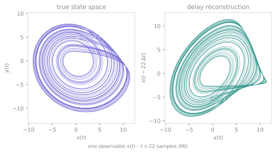

<span class="ts-kicker">Analysis · Delay embeddings</span>

# Delay embeddings

Most of the analysis toolkit wants a *state-space cloud* — a point per instant
in the system's phase space. But an experiment usually hands you a single scalar
channel: a voltage, a concentration, a brightness. Takens' embedding theorem
says that is enough. From one generic observable $x(t)$ of a deterministic
system you can reconstruct a trajectory whose attractor is diffeomorphic to the
true one — same topology, same invariants (correlation dimension, Lyapunov
spectrum) — by stacking time-delayed copies of the single signal into a vector:

$$
y_i = \big(x_i,\; x_{i+\tau},\; x_{i+2\tau},\; \dots,\; x_{i+(m-1)\tau}\big).
$$

Takens (1981) guarantees this delay-coordinate map is an embedding for a generic
observable once $m > 2d$, where $d$ is the box-counting dimension of the original
attractor. Two choices make the reconstruction good in practice — the delay
$\tau$ and the dimension $m$ — and TSDynamics provides a principled heuristic for
each. All three functions live under `tsdynamics.analysis.embedding` and are
re-exported at the top level:

```python
import tsdynamics as ts
from tsdynamics.analysis.embedding import (
    embed, optimal_delay, mutual_information, autocorrelation,
    embedding_dimension, cao_dimension, false_nearest_neighbors,
)
```

## The reconstruction, from one channel

The figure makes the theorem concrete. On the left is the *true* $(x, y)$
projection of the Rössler attractor; on the right is a delay reconstruction built
from the **single observable $x(t)$** — the $y$ channel is never used, yet the
reconstructed loop is topologically the same object.

<div class="ts-ref" markdown>

<div class="ts-item" markdown>
```python
ros = ts.systems.Rossler()
traj = ros.run(final_time=400.0, dt=0.05, ic=[1.0, 0.0, 0.0])
x = traj.y[1000:, 0]        # keep ONLY the x channel

tau = ts.analysis.optimal_delay(x, method="mi", max_delay=120)   # 25 samples
emb = ts.analysis.embed(x, dimension=3, delay=tau)
emb.shape                   # (6951, 3)
emb[:, 0], emb[:, 1]        # (x(t), x(t+tau)) — the reconstructed plane
```

`embed(data, dimension, delay)` builds the
$(N - (m-1)\tau) \times m$ matrix of delay vectors, one reconstructed state per
row in temporal order. The returned `Embedding` behaves as that bare array —
index it, slice it, `np.asarray()` it — so it drops straight into the point-set
analyses.
</div>
<figure class="ts-fig" markdown>
{ loading=lazy }
<figcaption><span class="lbl">FIG 1</span> · left: the true (x, y) projection of the Rössler attractor. Right: a Takens reconstruction from the single observable x(t) at a mutual-information-chosen delay — the same loop, recovered from one channel.</figcaption>
</figure>

</div>

The reconstruction feeds the geometric quantifiers directly. Because the rows
keep the original sampling order, an index-based Theiler window still removes
temporally-correlated pairs:

```python
ts.analysis.correlation_dimension(emb, theiler=tau)   # ≈ 1.74  (Rössler D2, from x alone)
```

`embed` also does **multivariate** embedding: pass a multi-component trajectory
(or a 2-D array) *without* `components=` and it stacks per-channel delay
coordinates into one joint reconstruction, with an optional per-channel
`dimension` / `delay`.

## Choosing the delay

The delay trades two failures against each other. Too small, and successive
coordinates $x_i$ and $x_{i+\tau}$ are nearly identical — the reconstruction
collapses onto the diagonal (redundancy). Too large, and on a chaotic signal
they become causally unrelated, so the reconstruction folds noise into the
geometry (irrelevance). The good $\tau$ sits between.

The recommended nonlinear criterion is the **first local minimum of the
time-delayed mutual information** (Fraser & Swinney 1986): the lag at which
$x_{i+\tau}$ adds the most *new* information about the state while still being
dynamically related to $x_i$.

```python
tau = ts.analysis.optimal_delay(x, method="mi", max_delay=120)   # 25   (first MI minimum)

mi = ts.analysis.mutual_information(x, max_delay=120)
mi.optimal_lag          # 25   — the same lag, read off the curve
mi.plot()               # the I(tau) diagnostic, with the chosen tau marked
```

`optimal_delay` returns a count that behaves as the integer $\tau$ — it prints,
formats and indexes as that integer — so it drops straight into `embed`. The linear alternatives are the classic
autocorrelation rules — `method="acf"` (first lag where the autocorrelation
falls to $1/e$) and `method="acf_zero"` (first zero crossing); the raw curve is
available via `autocorrelation(x)`. On the Rössler $x$ channel the $1/e$ rule
gives $\tau \approx 22$, close to the mutual-information choice.

## Choosing the dimension

The dimension must be large enough to **unfold** the attractor — to remove the
false crossings a low-dimensional projection creates where two distant states
happen to overlap. TSDynamics offers two complementary neighbour-based
estimators, unified behind `embedding_dimension`.

**Cao's averaged false neighbours** (Cao 1997) tracks, for each point, how the
distance to its nearest neighbour changes when one extra delay coordinate is
added. The dimension-averaged ratio $E_1(d) = E(d+1)/E(d)$ rises to and then
**saturates at 1**; the smallest $d$ past which it stops changing is the minimum
embedding dimension. A second quantity $E_2(d)$ stays $\approx 1$ for *random*
data, so Cao's method also separates determinism from noise — its advantage over
a single threshold.

**Kennel's false nearest neighbours** (Kennel, Brown & Abarbanel 1992) calls a
neighbour *false* when adding a coordinate pushes it far apart — its proximity
was a projection artefact. The false-neighbour fraction decays to zero at the
correct dimension.

```python
m_cao = ts.analysis.embedding_dimension(x, method="cao", delay=tau, max_dim=8)
int(m_cao)              # 4      (drops straight into embed)
m_cao.afn_e1            # the E1(d) saturation curve
m_cao.plot()            # E1 / E2 vs d, with the chosen m marked

m_fnn = ts.analysis.embedding_dimension(x, method="fnn", delay=tau, max_dim=8)
int(m_fnn)              # 3      (Kennel FNN — matches Rössler's true dim)
```

Both return an `EmbeddingDimension`: `int(result)` is the recommended $m$, and
the per-dimension diagnostic is carried so you can inspect the
saturation/decay rather than trust a single number. The two estimators need not
agree to the integer — Cao's saturation threshold and Kennel's tolerances are
conservative in different directions — so on a marginal case take $m$ from the
*shape* of the curve, and when in doubt embed one dimension higher.

!!! note "Set a Theiler window on densely sampled flows"
    Both dimension estimators find each point's nearest *spatial* neighbour, and
    on a densely sampled flow the true nearest neighbour is often just the next
    sample in time — a temporal artefact, not a geometric one. Pass
    `theiler=w` (a few autocorrelation times) to exclude neighbours closer than
    $w$ samples in time. For the same reason, Cao's $E_1$/$E_2$ curves are
    unreliable at exactly $d = 1$ (the 1-D nearest-neighbour gap can be
    arbitrarily small); the recommended $m$ is read off the plateau past $d=1$,
    so this does not affect the result.

## The full pipeline

Delay, dimension, embed, analyse — from one channel to a dimension estimate:

```python
x = ts.systems.Rossler().run(final_time=400.0, dt=0.05, ic=[1.0, 0.0, 0.0]).y[1000:, 0]

tau = ts.analysis.optimal_delay(x, method="mi", max_delay=120)     # 25
m = int(ts.analysis.embedding_dimension(x, method="fnn", delay=tau, max_dim=8))  # 3
emb = ts.analysis.embed(x, dimension=m, delay=tau)
ts.analysis.correlation_dimension(emb, theiler=tau)                # ≈ 1.71
```

This is the standard route to a fractal dimension or a data-driven Lyapunov
exponent when you have a recording but no equations —
[`lyapunov_from_data`](lyapunov.md) does its own internal embedding for exactly
this reason.

## See also

- [Fractal dimensions](dimensions.md) — the reconstruction's most common
  consumer; remember the `theiler=tau` window on an embedded flow
- [Lyapunov spectra](lyapunov.md) — `lyapunov_from_data` estimates the maximal
  exponent from a delay embedding of a measured series
- [Recurrence & RQA](recurrence.md) — recurrence plots are built on the same
  $(m, \tau)$ reconstruction

## References

- F. Takens, "Detecting strange attractors in turbulence", in *Dynamical Systems
  and Turbulence*, Lecture Notes in Mathematics **898**, 366 (1981).
- A. M. Fraser and H. L. Swinney, "Independent coordinates for strange attractors
  from mutual information", *Phys. Rev. A* **33**, 1134 (1986).
- L. Cao, "Practical method for determining the minimum embedding dimension of a
  scalar time series", *Physica D* **110**, 43 (1997).
- M. B. Kennel, R. Brown and H. D. I. Abarbanel, "Determining embedding
  dimension for phase-space reconstruction using a geometrical construction",
  *Phys. Rev. A* **45**, 3403 (1992).
