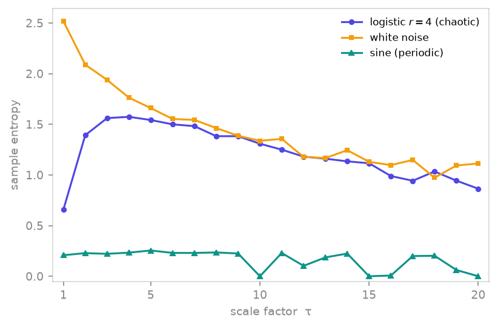

<span class="ts-kicker">Analysis · 10</span>

# Entropy & complexity

Information-theoretic complexity of a measured signal: how unpredictable,
how irregular, how compressible it is. TSDynamics ships the common named
estimators — permutation, dispersion, sample/approximate, multiscale entropy
and Lempel–Ziv complexity — over **one composable core**: an *outcome space*
symbolises the series, a *probability estimator* turns counts into
probabilities, and an *information measure* reduces them to a number.

| Function | Measures | Reference |
|---|---|---|
| [`permutation_entropy`](#permutation-entropy) | ordinal-pattern Shannon entropy | Bandt & Pompe (2002) |
| [`weighted_permutation_entropy`](#permutation-entropy) | amplitude-weighted variant | Fadlallah et al. (2013) |
| [`dispersion_entropy`](#amplitude-and-regularity-entropies) | amplitude-class entropy | Rostaghi & Azami (2016) |
| [`sample_entropy`](#amplitude-and-regularity-entropies) | template self-similarity | Richman & Moorman (2000) |
| [`approximate_entropy`](#amplitude-and-regularity-entropies) | regularity statistic | Pincus (1991) |
| [`multiscale_entropy`](#multiscale-entropy) | sample entropy across scales | Costa, Goldberger & Peng (2002) |
| [`lz76_complexity`](#lempelziv-complexity) / [`lz76_entropy`](#lempelziv-complexity) | LZ76 production complexity | Lempel & Ziv (1976) |

All take a 1-D series, a [`Trajectory`](integrate.md) (pick a channel with
`component=`), or a 2-D array; the named entropies return a normalised value in
$[0, 1]$ by default.

## Permutation entropy

`permutation_entropy` symbolises the series by the **rank order** of each
length-`m` window — the Bandt–Pompe ordinal patterns (Bandt & Pompe 2002) —
and takes the Shannon entropy of the pattern distribution, normalised by
$\log_2 m!$. It is robust, fast, and invariant to any monotone rescaling of
amplitude.

```python
import numpy as np
import tsdynamics as ts

t = np.linspace(0, 8 * np.pi, 4000)
ts.permutation_entropy(np.sin(t), m=3)                  # ≈ 0.396  (smooth, low)
ts.permutation_entropy(np.random.default_rng(0).standard_normal(4000), m=3)
#                                                       # ≈ 1.000  (white noise)

log = ts.Logistic(params={"r": 4.0})
x = log.trajectory(3000, transient=500, ic=[0.1234]).y[:, 0]
ts.permutation_entropy(x, m=3)                          # ≈ 0.833  (chaos)
```

The value tracks predictability: a **constant / fixed-point** signal uses one
pattern → $0$; deterministic chaos sits high but below noise; white noise
saturates near $1$.

```python
fp = ts.Logistic(params={"r": 2.8}).trajectory(2000, transient=1500).y[:, 0]
ts.permutation_entropy(fp, m=3)                         # ≈ 0.0  (stable fixed point)
```

`weighted_permutation_entropy` weights each pattern by the window's variance,
so large-amplitude (dynamically important) excursions count more than
near-flat noise — useful when a spiky signal sits on a noisy baseline.

!!! note "Pattern resolution needs samples"
    Estimating $m!$ pattern probabilities reliably wants $N \gg m!$ points.
    Use `m=3`–`5` for typical records; the embedding delay `tau` (default `1`)
    can be raised for oversampled flows.

## Amplitude and regularity entropies

Three estimators that read amplitude structure directly:

=== "Dispersion"

    `dispersion_entropy` maps amplitudes to `c` classes (a normal-CDF
    quantisation), then takes the Shannon entropy of length-`m` dispersion
    patterns (Rostaghi & Azami 2016) — sensitive to amplitude *and* order,
    unlike the rank-only permutation entropy.

    ```python
    ts.dispersion_entropy(x, c=6, m=2)        # ≈ 0.719  (logistic r=4)
    ```

=== "Sample"

    `sample_entropy` is the negative log conditional probability that two
    length-`m` template windows that match within tolerance `r` still match at
    length `m + 1` (Richman & Moorman 2000) — self-match-free, so it is the
    bias-corrected successor to approximate entropy. `r` defaults to
    $0.2\,\sigma$ of the series.

    ```python
    ts.sample_entropy(x, m=2)                 # ≈ 0.644  (logistic r=4)
    ```

=== "Approximate"

    `approximate_entropy` is the original regularity statistic (Pincus 1991):
    like sample entropy but counting self-matches, which biases it on short
    records. Kept for comparability with the historical literature.

    ```python
    ts.approximate_entropy(x, m=2)            # ≈ 0.660  (logistic r=4)
    ```

## Multiscale entropy

`multiscale_entropy` repeats sample entropy over **coarse-grained** copies of
the series — non-overlapping block averages at scales $1, 2, \dots$ — to
separate genuine long-range complexity from short-range noise (Costa,
Goldberger & Peng 2002). It returns one value per scale.

<figure markdown>
{ loading=lazy }
<figcaption>Multiscale sample entropy of three signals: white noise (amber) starts highest but decays monotonically with scale, while logistic-map chaos (indigo) rises and holds a high plateau — its long-range complexity survives coarse-graining — and the periodic sine (teal) stays flat near zero.</figcaption>
</figure>

```python
ts.multiscale_entropy(x, scales=5)
# array([0.659, 1.392, 1.571, 1.592, 1.545])     # logistic r=4
```

A flat or rising curve marks structure that survives coarse-graining (the
hallmark of complex, correlated dynamics); a curve that decays toward zero is
the signature of uncorrelated noise. Pass any `entropy_fn=` to coarse-grain a
different measure.

## Lempel–Ziv complexity

`lz76_complexity` counts the **distinct factors** in the LZ76 parse of the
symbolised series — the number of new substrings needed to build it
left-to-right (Lempel & Ziv 1976) — a compression-based complexity that needs
no embedding dimension. `lz76_entropy` is the entropy-rate normalisation
$c(n)\,\log_k n / n$, which converges to the source entropy rate for an ergodic
source.

```python
ts.lz76_complexity(x, normalize=True)         # ≈ 1.01  (logistic r=4)
ts.lz76_entropy(x)                            # ≈ 1.01
```

Real-valued input is binarised by `symbolize`/`threshold` (default: split at
the `"median"`); pass a categorical series to skip that step. The factorisation
runs in-process via the default `provider="native"`.

!!! note "Optional accelerated provider"
    `provider="lzcomplexity"` routes the parse through the optional
    `lzcomplexity` C++ package (install the `[lz]` extra,
    `pip install "tsdynamics[lz]"`). Without it that provider raises
    `ImportError` — the `"native"` default always works.

## The composable core

The named functions are presets over three swappable pieces. `entropy()` wires
an `OutcomeSpace` (`OrdinalPatterns`, `Dispersion`, `UniqueValues`) to an
`InformationMeasure` (`Shannon`, `Renyi`, `Tsallis`), so you can build estimators
the presets don't cover — Rényi or Tsallis ordinal entropy, dispersion patterns
under a non-Shannon measure, and so on.

```python
from tsdynamics.analysis.entropy.core import OrdinalPatterns, Renyi, Shannon

# permutation_entropy(x, m=3) is exactly this preset:
ts.entropy(x, outcomes=OrdinalPatterns(m=3), measure=Shannon(base=2.0),
           normalize=True)                    # ≈ 0.833

# the Rényi-2 ordinal entropy of the same series:
ts.entropy(x, outcomes=OrdinalPatterns(m=3), measure=Renyi(q=2.0))
```

An `OutcomeSpace` exposes `encode(x)` (the integer symbol stream),
`counts(x)`, and a `cardinality` (the alphabet size); an `InformationMeasure`
exposes `apply(p)` (a probability vector → scalar) and `maximum(k)` (the value
that normalises to $1$). Implement either interface to drop in a custom
symbolisation or measure.

## What it measures

| Signal | Permutation entropy (`m=3`) | Note |
|---|---|---|
| Stable fixed point | `≈ 0.0` | one ordinal pattern |
| Smooth sine | `≈ 0.40` | a few patterns, low |
| Logistic chaos `r=4` | `≈ 0.83` | deterministic but rich |
| White noise | `≈ 1.0` | all patterns equiprobable |

(All values above were computed from the runnable snippets on this page.)

## See also

- [Recurrence & RQA](recurrence.md) — complexity from the recurrence structure
- [Surrogate data](surrogate.md) — is the entropy you measured significant?
- [Transforms](../transforms/index.md) — spectral entropy and feature extraction
