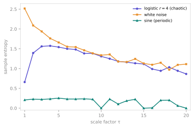

<span class="ts-kicker">Analysis · Entropy & complexity</span>

# Entropy & complexity

How *unpredictable* is a signal? Entropy measures answer that without a model of
the dynamics — from a single measured series they quantify how much new
information each sample carries, distinguishing periodic order from deterministic
chaos from stochastic noise. TSDynamics ships the standard family (permutation,
dispersion, sample, approximate, multiscale, and Lempel–Ziv) and — the design
that ties them together — a **composable core** that builds any of them from
three orthogonal choices.

Every scalar entropy reads a 1-D array, a 2-D array (with `component=`), or a
[`Trajectory`](index.md) (with `component=` naming a variable), so they consume
the trajectory lingua franca directly. The named measures live under
`tsdynamics.analysis.entropy`:

```python
from tsdynamics.analysis.entropy import (
    permutation_entropy, weighted_permutation_entropy,
    dispersion_entropy, sample_entropy, approximate_entropy,
    multiscale_entropy, lz76_complexity, lz76_entropy,
)
```

## The composable core

An entropy estimate of a time series is three independent decisions stacked on
top of one another:

1. an **outcome space** — how a real-valued series is turned into a finite set
   of discrete symbols and counted (ordinal patterns, dispersion patterns,
   amplitude bins, raw symbols);
2. a **probability estimator** — how outcome counts become a probability vector
   (maximum likelihood / relative frequency, or additive smoothing for short
   series);
3. an **information measure** — the functional applied to that vector (Shannon,
   Rényi, or Tsallis).

`entropy(...)` composes the three; every named function below is a thin wrapper
that fixes the outcome space. Building an estimator explicitly makes the choices
visible — and lets you mix combinations the named wrappers do not expose:

```python
import numpy as np
from tsdynamics.analysis.entropy import (
    entropy, OrdinalPatterns, Dispersion, AmplitudeBinning,
    MLE, AddConstant, Shannon, Renyi, Tsallis,
)

noise = np.random.default_rng(0).standard_normal(5000)

# Shannon entropy of ordinal (permutation) patterns — this IS permutation_entropy
entropy(noise, outcomes=OrdinalPatterns(m=4), measure=Shannon(base=2),
        normalize=True)                                    # 0.999

# swap in the Rényi (order q=2) measure over the same outcome space
entropy(noise, outcomes=OrdinalPatterns(m=3), measure=Renyi(q=2.0),
        normalize=True)                                    # 1.000

# Laplace-smoothed dispersion patterns for a short series (regularises zeros)
entropy(noise[:200], outcomes=Dispersion(c=6, m=2), prob=AddConstant(a=1.0),
        normalize=True)                                    # 0.993
```

With `normalize=True` the result is divided by the measure's maximum over the
outcome alphabet, mapping it to $[0, 1]$: `0` for a perfectly ordered signal,
`1` for uniform symbol usage. `probabilities(x, outcomes)` returns the raw
outcome distribution if you want to plot or reuse it.

## Permutation entropy

The most widely used ordinal measure (Bandt & Pompe 2002). Each length-$m$
window is encoded by the permutation that *sorts* it — its ordinal pattern — and
the Shannon entropy of the pattern distribution is the permutation entropy. It
depends only on the *relative rankings* of samples, so it is invariant under any
strictly monotonic transform of the data and needs no amplitude thresholds,
which makes it robust for noisy experimental series.

```python
import tsdynamics as ts

logistic = ts.systems.Logistic(params={"r": 4.0})
chaotic = logistic.iterate(steps=5000, ic=[0.1234]).y[500:, 0]

permutation_entropy(chaotic, dimension=4)                 # 0.742  (chaos)
permutation_entropy(np.random.default_rng(0).standard_normal(5000),
                    dimension=4)                          # 0.999  (noise)
permutation_entropy(np.sin(np.linspace(0, 50 * np.pi, 5000)),
                    dimension=4)                          # 0.258  (periodic)
permutation_entropy(np.arange(1000.0))                    # 0.000  (monotone)
```

`weighted_permutation_entropy` restores sensitivity to amplitude — each pattern
is weighted by the variance of its window, so abrupt large-amplitude events
count more than tiny fluctuations sharing the same ordinal pattern
(Fadlallah et al. 2013).

## Dispersion entropy

Where permutation entropy discards amplitude, dispersion entropy keeps it
(Rostaghi & Azami 2016). The series is mapped through the normal CDF onto $c$
amplitude classes, embedded with order $m$, and the Shannon entropy of the
resulting *dispersion patterns* over the $c^m$ alphabet is returned. It is
markedly faster than sample entropy while staying robust to noise:

```python
dispersion_entropy(noise, c=6, dimension=2)               # 0.999
```

!!! note "White noise normalises to slightly below 1 at finite length"
    With `normalize=True` the entropy is divided by $\log_b(c^m)$, the log of
    the *full* dispersion-pattern alphabet (the canonical Rostaghi & Azami
    convention). A finite series can populate at most $n - (m-1)\tau$ of those
    $c^m$ patterns, so even ideal white noise sits just under 1 — approaching it
    only as $n \to \infty$. This is expected, not a defect.

## Sample & approximate entropy

These are correlation-integral statistics rather than members of the
outcome-space family: they count how often short template windows *recur* within
a tolerance $r$, and are reported in nats.

Sample entropy (Richman & Moorman 2000) is $\text{SampEn} = -\ln(A/B)$, where
$B$ and $A$ count template pairs (excluding self-matches) that stay within
Chebyshev tolerance $r$ over windows of length $m$ and $m+1$. Excluding
self-matches removes the length bias of the older approximate entropy, making
the statistic largely independent of series length:

```python
sample_entropy(noise)                                     # 2.206  (irregular)
sample_entropy(np.sin(np.linspace(0, 50 * np.pi, 5000)))  # 0.074  (regular)
```

The default tolerance is $r = 0.2\,\sigma$. `approximate_entropy` (Pincus 1991)
is the earlier, self-matching variant — prefer sample entropy when its
downward short-series bias matters.

## Multiscale entropy

A single-scale entropy cannot tell a $1/f$-correlated process from white noise —
both look highly irregular at the finest scale. Multiscale entropy
(Costa et al. 2002) resolves this by measuring an entropy on *coarse-grained*
copies of the series: for each scale factor the series is split into
non-overlapping windows of that length and each replaced by its mean, then the
entropy is recomputed. The *shape* of the resulting curve is the discriminator.

<div class="ts-ref" markdown>

<div class="ts-item" markdown>
```python
mse_chaotic = ts.multiscale_entropy(chaotic, scales=20)
mse_noise = ts.multiscale_entropy(noise, scales=20)

mse_noise[0] > mse_noise[-1]   # True — uncorrelated noise decays with scale
```

White noise starts high and **decays** as coarse-graining averages away its
uncorrelated fine structure; a structured signal with correlations across
scales holds a roughly flat (or rising) profile. The figure contrasts three
canonical cases at matched settings: chaotic logistic ($r=4$), white noise, and
a smooth sine.

Following Costa et al., when the chosen entropy takes a tolerance $r$ it is
**fixed across all scales** from the *original* series' standard deviation
(default $r = 0.15\,\sigma$), so the profile reflects structure rather than the
shrinking variance of the coarse-grained signal. Any of this package's scalar
entropies can drive it via `entropy_fn=`.
</div>
<figure class="ts-fig" markdown>
{ loading=lazy }
<figcaption><span class="lbl">FIG 1</span> · multiscale sample entropy vs scale factor. White noise (amber) decays with scale; the chaotic logistic map (indigo) holds high complexity across scales; the periodic sine (teal) stays near zero.</figcaption>
</figure>

</div>

## Lempel–Ziv complexity

The LZ76 complexity $c(S)$ of a symbol sequence is the number of factors in its
exhaustive-history parse — each factor a substring not seen before (Lempel & Ziv
1976; Kaspar & Schuster 1987). It is a threshold-free structural measure: a
periodic sequence parses into few factors, an incompressible one into many. The
normalised density $h \approx c(S)\,\log_k(n)/n$ (with $k$ the alphabet size)
converges to the source entropy rate, so LZ76 doubles as a fast entropy
estimator.

Continuous signals are symbolised first — median-threshold binarisation is the
standard choice — while strings and integer arrays are treated as already
symbolic:

```python
lz76_complexity("0001101001000101", symbolize=None)      # 6.0  (Kaspar–Schuster)
lz76_complexity("aaaaaaaa", symbolize=None)               # 2.0  (constant)

lz76_entropy(noise)                                       # 1.037  (irregular)
lz76_entropy(np.sin(np.linspace(0, 50 * np.pi, 5000)))    # 0.012  (periodic)
```

`lz76_entropy(x)` is `lz76_complexity(x, normalize=True)`; `lz76_factors`
returns the factor-boundary indices if you want to inspect the parse.

!!! note "Different measures, different questions"
    These estimators are *not* interchangeable numbers. Permutation entropy is
    ordinal and monotone-invariant; dispersion and weighted-permutation entropy
    restore amplitude; sample entropy measures template recurrence; LZ76
    measures compressibility. They agree on the qualitative ranking (periodic <
    chaotic < random) but not on absolute values — the "regular vs random"
    ordering is the robust signal, and TSDynamics' own test suite checks that
    five independent complexity measures concur on it.

## Choosing a measure

| You want… | Reach for | Why |
| --------- | --------- | --- |
| A fast, robust, threshold-free default | `permutation_entropy` | ordinal, monotone-invariant, noise-tolerant |
| Amplitude sensitivity kept | `dispersion_entropy`, `weighted_permutation_entropy` | encode magnitude, not just rank |
| The physiologic / template-recurrence standard | `sample_entropy` | length-bias-free correlation integral |
| To separate correlated structure from noise | `multiscale_entropy` | the *shape* across scales discriminates |
| A model-free compressibility / entropy-rate estimate | `lz76_complexity` / `lz76_entropy` | symbolic, threshold-free |
| A combination the wrappers don't expose | `entropy(...)` | compose outcome × estimator × measure |

## See also

- [Fractal dimensions](dimensions.md) — a complementary, geometric view of the
  same complexity
- [Recurrence & RQA](recurrence.md) — recurrence-based quantifiers of structure
- [Surrogates](surrogate.md) — test whether a complexity value is significant
  against a stochastic null
- [Delay embeddings](embedding.md) — the reconstruction step ordinal-pattern and
  sample-entropy embeddings share

## References

- C. Bandt and B. Pompe, "Permutation entropy: a natural complexity measure for
  time series", *Phys. Rev. Lett.* **88**, 174102 (2002).
- B. Fadlallah, B. Chen, A. Keil and J. Príncipe, "Weighted-permutation entropy:
  a complexity measure for time series incorporating amplitude information",
  *Phys. Rev. E* **87**, 022911 (2013).
- M. Rostaghi and H. Azami, "Dispersion entropy: a measure for time-series
  analysis", *IEEE Signal Process. Lett.* **23**, 610 (2016).
- S. M. Pincus, "Approximate entropy as a measure of system complexity",
  *Proc. Natl. Acad. Sci. USA* **88**, 2297 (1991).
- J. S. Richman and J. R. Moorman, "Physiological time-series analysis using
  approximate entropy and sample entropy", *Am. J. Physiol. Heart Circ.
  Physiol.* **278**, H2039 (2000).
- M. Costa, A. L. Goldberger and C.-K. Peng, "Multiscale entropy analysis of
  complex physiologic time series", *Phys. Rev. Lett.* **89**, 068102 (2002).
- A. Lempel and J. Ziv, "On the complexity of finite sequences", *IEEE Trans.
  Inf. Theory* **22**, 75 (1976).
- F. Kaspar and H. G. Schuster, "Easily calculable measure for the complexity of
  spatiotemporal patterns", *Phys. Rev. A* **36**, 842 (1987).
