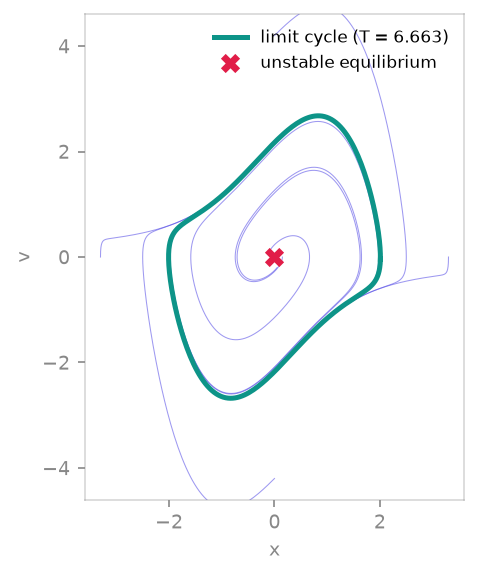

<span class="ts-kicker">Analysis · 05</span>

# Fixed points & periodic orbits

The invariant sets that organise a dynamical system — fixed points, equilibria
and periodic orbits — for **maps and flows**, each returned with its
linear-stability data.

<figure markdown>
{ loading=lazy }
<figcaption>Van der Pol (μ = 1): trajectories (indigo) spiral off the unstable equilibrium at the origin (rose ✕, from `fixed_points`) and onto the isolated limit cycle (teal, T ≈ 6.663, from `periodic_orbit` by single shooting).</figcaption>
</figure>

| Function | Finds | For |
|---|---|---|
| [`fixed_points`](#fixed-points-and-equilibria) | `f(x) = x` / `f(x) = 0` | maps + flows |
| [`periodic_orbits`](#periodic-orbits-of-maps) | period-`p` cycles | maps |
| [`periodic_orbit`](#periodic-orbits-of-flows-shooting) | a limit cycle | flows |
| [`estimate_period`](#estimating-a-period) | dominant period | any signal |

## Fixed points and equilibria

`fixed_points` solves `f(x) = x` for a discrete map, or the equilibrium
condition `f(x) = 0` for a flow, by multi-start root finding and classifies each
solution from the Jacobian spectrum.

```python
import tsdynamics as ts

ts.fixed_points(ts.Henon())
# [FixedPoint([-1.131354 -0.339406], unstable, |λ|max=3.2598),
#  FixedPoint([ 0.631354  0.189406], unstable, |λ|max=1.9237)]

ts.fixed_points(ts.Lorenz())                 # the origin and the two C± equilibria
# [FixedPoint([-8.485281 -8.485281 27.], unstable, Re(λ)max=+0.0940),
#  FixedPoint([-0. -0. -0.], unstable, Re(λ)max=+11.8277),
#  FixedPoint([ 8.485281  8.485281 27.], unstable, Re(λ)max=+0.0940)]
```

Stability uses the right convention for each family: a **map** fixed point is
stable iff every multiplier $|\lambda_i| < 1$; a **flow** equilibrium is stable
iff every eigenvalue has $\operatorname{Re}\lambda_i < 0$. The `FixedPoint.continuous`
flag records which convention was applied and switches the `repr` gauge
(`|λ|max` vs `Re(λ)max`).

### How it works

1. **Seeding** — `n_seeds` random points are drawn from a search `box`
   (default: a burn-in orbit's bounding box padded by 50 %), plus points
   sampled from a short orbit, biasing the search toward the relevant region.
2. **Root finding** — each seed runs Newton on the residual using the exact
   analytic Jacobian.
3. **Dedup & classify** — converged roots closer than `dedup_tol` are merged
   and each survivor is classified from $J(x^\*)$.

### Reaching unstable points: Schmelcher–Diakonos / Davidchack–Lai

For maps, `method="sd"` / `"dl"` engage *stabilising transformations* that turn
an unstable fixed point into a contracting one, so it can be found by iteration.
Both cycle a set of orthogonal $\{-1,0,1\}$ matrices $C$ (one $\pm1$ per row and
column — $2^d\,d!$ of them); for each, the Davidchack–Lai step

$$
x_{k+1} = x_k + \big(\beta\,\lVert g\rVert\,C^{\mathsf T} - G_k\big)^{-1} g(x_k),
\qquad g(x) = f(x) - x,\; G_k = Df(x_k) - I,
$$

is a Newton step regularised by $\beta\lVert g\rVert C^{\mathsf T}$ — it reduces
to plain Newton as $\beta\to0$ and recovers Newton's quadratic rate near the root
(the regulariser self-anneals). Schmelcher–Diakonos (`method="sd"`) is the
explicit step $x_{k+1} = x_k + \lambda\,C\,g(x_k)$.

```python
# at r = 4 both logistic fixed points {0, 0.75} are unstable
ts.fixed_points(ts.Logistic(params={"r": 4.0}), region=([-0.2], [1.2]), method="dl")
```

## Periodic orbits of maps

A period-$p$ orbit is a fixed point of the $p$-fold composition $f^{p}$, so
`periodic_orbits` runs the same Davidchack–Lai root finder on
$g(x) = f^{p}(x) - x$, recovers each orbit by forward iteration, and keeps only
orbits of **minimal** period $p$ (a period-2 orbit is also a fixed point of
$f^4$; `prime=True` drops such divisor-period contaminants), merging the cyclic
shifts of one orbit.

```python
ts.periodic_orbits(ts.Logistic(params={"r": 3.2}), 2)
# [PeriodicOrbit(p=2, stable, |μ|max=0.1600, n=2)]    # x = (r+1 ± √((r+1)(r−3)))/2r

ts.periodic_orbits(ts.Logistic(params={"r": 3.83}), 3)
# [PeriodicOrbit(p=3, unstable, |μ|max=1.6523, n=3),  # the saddle …
#  PeriodicOrbit(p=3, stable,   |μ|max=0.3299, n=3)]  # … and the stable node
```

The period-3 example is the saddle-node pair born at the tangent bifurcation
$r = 1 + \sqrt{8} \approx 3.8284$ — Davidchack–Lai finds **both** the stable node
and the unstable saddle, where seeding on the attractor alone would only reveal
the stable one.

## Periodic orbits of flows (shooting)

`periodic_orbit` finds a limit cycle of an autonomous flow by **single
shooting**: Newton on the unknowns $(x_0, T)$ solving $\varphi_T(x_0) - x_0 = 0$,
plus an orthogonality phase condition $f(x_0)\cdot\delta x = 0$ that removes the
trivial time-shift degeneracy. The monodromy matrix $M = \mathrm{d}\varphi_T/\mathrm{d}x_0$
comes from integrating the variational equation alongside the state, and its
eigenvalues are the **Floquet multipliers**.

```python
class VanDerPol(ts.ContinuousSystem):          # autonomous van der Pol oscillator
    params = {"mu": 1.0}
    dim = 2
    variables = ("x", "v")

    @staticmethod
    def _equations(y, t, mu):
        return [y(1), mu * (1 - y(0) * y(0)) * y(1) - y(0)]

orb = ts.periodic_orbit(VanDerPol(params={"mu": 1.0}),
                        ic=[2.0, 0.0], period_guess=6.0, transient=20.0)
orb.period          # ≈ 6.6633  (the μ = 1 Van der Pol limit-cycle period)
orb.multipliers     # one trivial multiplier ≈ 1 (the flow direction) …
orb.stable          # … and the other inside the unit circle → stable
```

A periodic orbit always carries one trivial Floquet multiplier $\approx 1$ along
the flow; stability is read from the *other* multipliers. Shooting has a small
basin of attraction, so seed it well — `burn_in` forward-integrates the guess
onto a stable cycle first, and `period_guess` defaults to an
[`estimate_period`](#estimating-a-period) read of a burn-in trajectory.

!!! note "Centres are degenerate"
    A conservative centre (e.g. an undamped harmonic oscillator) has a
    *continuum* of periodic orbits, so the shooting Jacobian is singular and
    Newton collapses onto the equilibrium. `periodic_orbit` detects the
    zero-amplitude collapse and raises — shooting needs an isolated (hyperbolic)
    cycle.

## Estimating a period

`estimate_period` reads the dominant period of a sampled signal — a
[`Trajectory`](../reference/base.md), a 1-D array, or a multi-component array
(the highest-variance channel is used by default) — by the first
autocorrelation peak (default) or the dominant spectral frequency.

```python
traj = VanDerPol(params={"mu": 1.0}).integrate(final_time=300.0, dt=0.01)
ts.estimate_period(traj)                 # ≈ 6.66
ts.estimate_period(signal, dt=0.01, method="fft")
```

## The result records

```python
fp = ts.fixed_points(ts.Henon())[0]
fp.x, fp.eigenvalues, fp.stable, fp.continuous

orb = ts.periodic_orbits(ts.Logistic(params={"r": 3.2}), 2)[0]
orb.points        # the orbit, shape (n_points, dim)
orb.period        # int p (maps) or float T (flows)
orb.multipliers   # eig(Df^p) (maps) or Floquet multipliers (flows)
orb.stable, orb.continuous, orb.residual
```

## See also

- [Orbit & bifurcation diagrams](orbit-diagrams.md) — where orbits are born and lost
- [Lyapunov spectra](lyapunov.md) — the average stretching rates of an attractor
- [Reference · Analysis](../reference/analysis.md) — full signatures

## References

- Schmelcher & Diakonos (1997), *Phys. Rev. Lett.* **78**, 4733.
- Davidchack & Lai (1999), *Phys. Rev. E* **60**, 6172.
