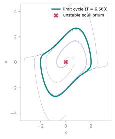

<span class="ts-kicker">Analysis · Fixed points & periodic orbits</span>

# Fixed points & periodic orbits

Every attractor, every bifurcation, every route to chaos is organised by a
skeleton of invariant sets — the equilibria a flow can rest at, the fixed points
a map holds, the periodic orbits both can loop on. Find that skeleton and you
understand the phase portrait: the stable pieces are what you observe, the
unstable ones are the saddles that route trajectories between them. This page
locates all of them, for **maps and flows**, each returned with its
linear-stability data.

| Function | Finds | For |
| --- | --- | --- |
| [`fixed_points`](#fixed-points-and-equilibria) | $f(x) = x$ / $f(x) = 0$ | maps + flows |
| [`periodic_orbits`](#periodic-orbits-of-maps) | period-$p$ cycles | maps |
| [`periodic_orbit`](#periodic-orbits-of-flows-single-shooting) | a limit cycle | flows |
| [`estimate_period`](#estimating-a-period) | dominant period | any signal |

## Fixed points and equilibria

A **map** fixed point solves $f(x) = x$; a **flow** equilibrium solves
$f(x) = 0$ on the right-hand side. `fixed_points` finds both by multi-start root
finding on the exact analytic Jacobian and classifies each solution from the
Jacobian spectrum, using the right convention for the family — a map fixed point
is stable iff every multiplier $|\lambda_i| < 1$, a flow equilibrium iff every
eigenvalue has $\operatorname{Re}\lambda_i < 0$.

<div class="ts-ref" markdown>

<div class="ts-item" markdown>
```python
import tsdynamics as ts

ts.analysis.fixed_points(ts.systems.Henon())
# [FixedPoint([-1.131354 -0.339406], unstable, |λ|max=3.2598),
#  FixedPoint([0.631354 0.189406], unstable, |λ|max=1.9237)]

ts.analysis.fixed_points(ts.systems.Lorenz())   # the origin and the two C± equilibria
# [FixedPoint([-8.485281 -8.485281 27.], unstable, Re(λ)max=+0.0940),
#  FixedPoint([0. 0. 0.], unstable, Re(λ)max=+11.8277),   # the origin (±0 signs vary)
#  FixedPoint([ 8.485281  8.485281 27.], unstable, Re(λ)max=+0.0940)]
```

The `FixedPoint.continuous` flag records which convention was applied and
switches the `repr` gauge (`|λ|max` for a map, `Re(λ)max` for a flow). The
result is a list-like `FixedPointSet` with `.stable` / `.unstable` sublists and
an `.eigenvalue_plane()` spectrum plot; each `FixedPoint` carries `.x`,
`.eigenvalues`, `.stable`, and the `.plot` result surface.
</div>

<figure class="ts-fig" markdown>
{ loading=lazy }
<figcaption><span class="lbl">FIG 1</span> · autonomous Van der Pol (μ = 1): trajectories (indigo) spiral off the unstable equilibrium at the origin (rose ✕, from <code>fixed_points</code>) and onto the isolated limit cycle (teal, T ≈ 6.663, from <code>periodic_orbit</code> by single shooting).</figcaption>
</figure>

</div>

### How it works

1. **Seeding** — `n_seeds` random points are drawn from a search `region`
   (default: a burn-in orbit's bounding box padded by 50 %), plus a subsample of
   a short orbit, biasing the search toward where the dynamics actually live.
2. **Root finding** — each seed runs Newton on the residual using the exact
   analytic Jacobian.
3. **Dedup & classify** — converged roots closer than `dedup_tol` are merged,
   and each survivor is classified from $J(x^\*)$.

For a flow the equilibria are often *off* the attractor — the Lorenz origin and
the two $C^\pm$ centres sit outside the chaotic hull the orbit visits — so when
`region` is the automatic burn-in box it seeds the search but does not clip the
results, and genuine off-attractor equilibria are kept.

### Reaching unstable points: Schmelcher–Diakonos / Davidchack–Lai

Plain Newton has no bias toward stability, but its basin can still miss a
strongly unstable fixed point. For **maps**, `method="sd"` / `"dl"` engage
*stabilising transformations* that turn an unstable fixed point into a
contracting one, so it can be reached by iteration. Both cycle a set of
orthogonal $\{-1, 0, 1\}$ matrices $C$ (one $\pm 1$ per row and column — $2^d\,d!$
of them); for each, the Davidchack–Lai step

$$
x_{k+1} = x_k + \big(\beta\,\lVert g\rVert\,C^{\mathsf T} - G_k\big)^{-1} g(x_k),
\qquad g(x) = f(x) - x,\quad G_k = Df(x_k) - I,
$$

is a Newton step regularised by $\beta\lVert g\rVert\,C^{\mathsf T}$: it reduces
to plain Newton as $\beta \to 0$ and recovers Newton's quadratic rate near the
root (the regulariser self-anneals). Schmelcher–Diakonos (`method="sd"`) is the
explicit step $x_{k+1} = x_k + \lambda\,C\,g(x_k)$.

```python
# at r = 4 both logistic fixed points {0, 0.75} are unstable; DL still reaches them
ts.analysis.fixed_points(ts.systems.Logistic(params={"r": 4.0}),
                region=[(-0.2, 1.2)], method="dl")
# [FixedPoint([-0.], unstable, |λ|max=4.0000),
#  FixedPoint([ 0.75], unstable, |λ|max=2.0000)]
```

### Rigorous enumeration: `method="interval"`

Any multi-start method can *silently miss* a root whose basin no seed landed in.
`method="interval"` removes that risk. The **Krawczyk** operator brackets *every*
root inside the (required) `region` by interval branch-and-prune, certifying
existence **and** uniqueness per sub-box — so the returned set is provably
complete (up to floating-point round-off), it needs no `seed`, and it is often
faster than multi-start on the analytic systems it applies to. It works for maps
**and** flows:

```python
# all 27 equilibria of the Thomas system, rigorously, in one box
ts.analysis.fixed_points(ts.systems.Thomas(),
                region=[(-6, 6), (-6, 6), (-6, 6)], method="interval")
# → 27 equilibria  (where a 200-seed Newton finds only 23)
```

The interval residual and Jacobian are built by forward-mode automatic
differentiation over intervals (an `IntervalJet` pushed through the map's `_step`
or the flow's symbolic right-hand side — no symbolic diff), covering
`sin`/`cos`/`exp`/`log`/`sqrt`/`cosh`/`tanh`/`abs` and integer powers. A kernel it
cannot enclose — a comparison, a modulo, a non-integer power — raises
`InvalidInputError` pointing back at `method="newton"`. The arithmetic is
plain-float (rigorous to round-off, machine-precise roots).

## Periodic orbits of maps

A period-$p$ orbit is a fixed point of the $p$-fold composition $f^{p}$, so
`periodic_orbits` runs the same Davidchack–Lai root finder on
$g(x) = f^{p}(x) - x$, recovers each orbit by forward iteration, keeps only
orbits of **minimal** period $p$ (`prime=True` drops divisor-period
contaminants — a period-2 orbit is also a fixed point of $f^4$), and merges the
cyclic shifts of one orbit.

```python
ts.analysis.periodic_orbits(ts.systems.Logistic(params={"r": 3.2}), 2)
# [PeriodicOrbit(p=2, stable, |μ|max=0.1600, n=2)]

ts.analysis.periodic_orbits(ts.systems.Logistic(params={"r": 3.83}), 3, seed=0)
# [PeriodicOrbit(p=3, unstable, |μ|max=1.6523, n=3),   # the saddle …
#  PeriodicOrbit(p=3, stable,   |μ|max=0.3299, n=3)]   # … and the stable node
```

The period-3 example is the saddle–node pair born at the tangent bifurcation
$r = 1 + \sqrt{8} \approx 3.8284$ — Davidchack–Lai finds **both** the stable node
and the unstable saddle, where seeding on the attractor alone would reveal only
the stable one. Stability of a map orbit is read from the eigenvalues of $Df^{p}$
at an orbit point (the multipliers), judged against the unit circle.

## Periodic orbits of flows (single shooting)

`periodic_orbits` finds a limit cycle of an autonomous flow by **single
shooting**: Newton on the unknowns $(x_0, T)$ solving $\varphi_T(x_0) - x_0 = 0$,
plus an orthogonality phase condition $f(x_0)\cdot\delta x = 0$ that removes the
trivial time-shift degeneracy. The **monodromy matrix**
$M = \mathrm{d}\varphi_T/\mathrm{d}x_0$ comes from integrating the variational
equation alongside the state, and its eigenvalues are the **Floquet
multipliers**.

```python
class VanDerPolCycle(ts.ContinuousSystem):     # autonomous van der Pol oscillator
    params = {"mu": 1.0}
    variables = ("x", "v")

    def _equations(y, t, mu):
        return [y(1), mu * (1 - y(0) * y(0)) * y(1) - y(0)]

orbits = ts.analysis.periodic_orbits(VanDerPolCycle(params={"mu": 1.0}), 6.0,
                                     ic=[2.0, 0.0], transient=20.0)
print(orbits)
# OrbitSet  1 orbit of period 6 · 1 stable, 0 unstable   (VanDerPolCycle)
#     [0] T = 6.66329  stable  |μ|max = 1  x0 = [ 2.0082 -0.0416]

orb = orbits[0]
orb.period       # ≈ 6.6633  (the μ = 1 Van der Pol limit-cycle period)
orb.multipliers  # one trivial multiplier ≈ 1 (the flow direction) …
orb.stable       # … and the other inside the unit circle → stable
```

**One verb, one return type.** A flow's limit cycle comes back as an `OrbitSet`
of one, exactly as a map's period-$p$ orbits do — the second positional argument
is the *period*: an integer period for a map, a period **guess** for a flow.

A periodic orbit always carries one trivial Floquet multiplier $\approx 1$ along
the flow direction; stability is read from the *other* multipliers. Shooting has
a small basin, so seed it well: `transient` forward-integrates the guess onto a
stable cycle first (widening the Newton basin), and the guess itself defaults to
an [`estimate_period`](#estimating-a-period) read of a burn-in trajectory.

!!! note "Centres are degenerate"
    A conservative centre — an undamped harmonic oscillator, for instance — has a
    *continuum* of periodic orbits, so the shooting Jacobian is singular and
    Newton collapses onto the equilibrium. `periodic_orbit` detects the
    zero-amplitude collapse (`min_amplitude`) and raises: shooting needs an
    isolated, hyperbolic cycle, not a member of a family.

## Estimating a period

Shooting needs a period guess, and often you just want to *know* a
signal's period. `estimate_period` reads the dominant period of a sampled signal
— a `Trajectory` (the sampling step is read from its time grid), a 1-D array, or
a multi-component array (the highest-variance channel by default) — by the first
autocorrelation peak (default) or the dominant spectral frequency:

```python
traj = VanDerPol(params={"mu": 1.0}).run(final_time=300.0, dt=0.01, ic=[2.0, 0.0])
ts.analysis.estimate_period(traj)                  # ≈ 6.66

signal = traj["x"]                        # or any bare 1-D series of your own
ts.analysis.estimate_period(signal, dt=0.01, method="fft")
```

Both estimators refine the peak parabolically to sub-sample resolution, so a
coarse grid still gives an accurate period. The result is a `ScalarResult` —
`float(result)` is the number, and it carries the diagnostic curve for plotting.

## The result records

```python
fp = ts.analysis.fixed_points(ts.systems.Henon())[0]
fp.x, fp.eigenvalues, fp.stable, fp.continuous

orb = ts.analysis.periodic_orbits(ts.systems.Logistic(params={"r": 3.2}), 2)[0]
orb.points        # the orbit, shape (n_points, dim)
orb.period        # int p (maps) or float T (flows)
orb.multipliers   # eig(Df^p) (maps) or Floquet multipliers (flows)
orb.stable, orb.continuous, orb.residual
```

`FixedPointSet` and `OrbitSet` are list-like `CollectionResult`s: iterate them,
index them, read `.stable` / `.unstable`, and call `.eigenvalue_plane()` to draw
the whole spectrum against its stability boundary (the unit circle for maps, the
imaginary axis for flows).

## See also

- [Orbit & bifurcation diagrams](orbit-diagrams.md) — where these orbits are born, doubled, and destroyed as a parameter varies
- [Poincaré sections](poincare.md) — a flow's periodic orbit is a fixed point of its Poincaré map
- [Lyapunov spectra](lyapunov.md) — the average stretching rates the multipliers describe locally
- [Integration & methods](integration-and-methods.md) — the RK4 variational core the shooting monodromy rides on

## References

- Schmelcher, P. & Diakonos, F. K. (1997). Detecting unstable periodic orbits of chaotic dynamical systems. *Phys. Rev. Lett.* **78**, 4733.
- Davidchack, R. L. & Lai, Y.-C. (1999). Efficient algorithm for detecting unstable periodic orbits in chaotic systems. *Phys. Rev. E* **60**, 6172.
- Krawczyk, R. (1969). Newton-Algorithmen zur Bestimmung von Nullstellen mit Fehlerschranken. *Computing* **4**, 187–201.
- Neumaier, A. (1990). *Interval Methods for Systems of Equations.* Cambridge University Press.
