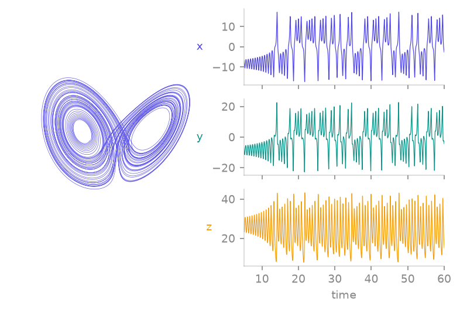

<span class="ts-kicker">Analysis · 01</span>

# Integrate & iterate

<figure markdown>
{ loading=lazy }
<figcaption>A single <code>Lorenz().integrate(...)</code> call returns one <code>Trajectory</code>: the same data drawn as the strange attractor in state space (left) and as the x, y, z time series it samples on the output grid (right).</figcaption>
</figure>

## Solvers and tolerances (ODE)

```python
traj = sys.integrate(
    final_time=100.0,
    dt=0.02,                 # output grid; internal stepper is adaptive
    t0=0.0,                  # warm restarts from non-zero times allowed
    ic=None,                 # falls back to self.ic, then default_ic, then random
    method="rk45",
    rtol=1e-6, atol=1e-9,
    # extra kwargs (e.g. max_step=...) forwarded to the integrator
)
```

| `method` | Engine | Use it for |
| -------- | ------ | ---------- |
| `"rk45"` | Dormand–Prince 5(4) | The default; good general-purpose explicit solver |
| `"dop853"` | Dormand–Prince 8(5,3) | High accuracy at tight tolerances (e.g. Lyapunov reference runs) |
| `"tsit5"` | Tsitouras 5(4) | Explicit alternative to `rk45` |
| `"bdf"` | Variable-order (1–5) BDF | Stiff systems; the auto-stiffness default |
| `"rosenbrock"` / `"trbdf2"` | Linearly-implicit / ESDIRK | Stiff systems, selectable by name |

Two grids are at play: the **internal adaptive steps**, controlled by
`rtol`/`atol`, decide accuracy; the **output grid** `dt` only decides where
the solution is *sampled*. Coarse `dt` loses no accuracy — only resolution
of the returned arrays.

DDEs have the same shape of API with `history=` instead of `t0`, and
looser default tolerances (`1e-3` — see
[delay systems](../systems/delay/index.md)). Maps use
`iterate(steps=1000, ic=None, max_retries=10)`.

## The Trajectory object

Every integration or iteration returns a `Trajectory`: time points `t` of
shape `(T,)` and states `y` of shape `(T, dim)`, plus provenance.

```python
traj.t, traj.y               # the arrays
traj.dim, traj.n_steps       # 3, 10001
t, y = traj                  # tuple-unpacking compatibility

traj["x"]                    # named component → (T,)   (needs class `variables`)
traj[["x", "z"]]             # multiple components → (T, 2)
traj[100:200]                # row slicing → new Trajectory (t and y together)
traj.component(2)            # by index

traj.after(20.0)             # drop the transient: keep t >= 20
traj.minmax()                # per-component (minima, maxima)
traj.standardize()           # zero mean, unit std per component (records the transform)
traj.neighbors(q, k=3)       # k nearest trajectory points to q (cached KD-tree)
```

`traj.meta` carries provenance — the system name, a snapshot of the
parameters, solver, tolerances, and the actual IC used:

```python
traj.meta
# {'system': 'Lorenz', 'params': {...}, 'tsdynamics': '1.0.0',
#  'family': 'ode', 'method': 'rk45', 'dt': 0.01, 't0': 0.0,
#  'rtol': 1e-06, 'atol': 1e-09, 'ic': array([...])}
```

A result you cannot trace is a result you cannot reproduce; the snapshot
makes every saved trajectory self-describing.

## The stepping API

`integrate`/`iterate` produce whole trajectories. For algorithms that need
*control* — advance a little, look at the state, decide — every system
implements the incremental `System` protocol:

```python
lor = ts.Lorenz()
lor.reinit([1.0, 1.0, 1.0])      # explicit start (optional — step() lazily reinits)
u = lor.step(0.01)               # advance dt=0.01, get the new state
lor.state(), lor.time()          # current state / time
lor.set_state(u + 1e-9)          # overwrite the state in place
```

- `step(n_or_dt)` — number of iterations for maps (default 1), time
  increment for flows (default 0.01 for ODEs, 0.1 for DDEs). Returns the
  new state.
- `reinit(u, t=..., params=...)` — restart the internal stepper; parameter
  overrides are applied first.
- `trajectory(...)` — protocol-uniform wrapper over
  `integrate`/`iterate` with a `transient=` drop.

!!! note "`set_state` on a DDE raises — by design"
    A delay system's instantaneous state is a *history function* over
    `[t − max_delay, t]`, not a point, so overwriting it with a vector is
    not meaningful. `DelaySystem.set_state` raises `NotImplementedError`;
    use `reinit(u)` to restart from a constant past instead. This is also
    why `max_lyapunov` (which needs `set_state`) excludes DDEs.

The protocol is what the rest of the toolkit is written against — orbit
diagrams, Poincaré maps, and `max_lyapunov` are all loops over `step()`.

## See also

- [Conventions](../theory/conventions.md) — time semantics, shapes, IC resolution order
- [Reference · Base classes](../reference/base.md) — exact signatures
