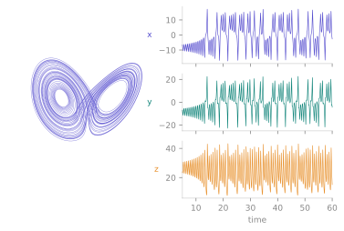

<span class="ts-kicker">Analysis · Integration & methods</span>

# Integration & methods

Every system in the catalogue advances the same way. You call one verb, the
library lowers the symbolic dynamics to an in-process tape, and the Rust engine
marches it. This page is the practical guide to that march: which verb to call,
what the resulting `Trajectory` gives you, how to pick a solver, what automatic
stiffness selection does, and which backend runs the numbers — followed by the
**complete capability table** of every solver in the registry.

<figure markdown>
{ loading=lazy }
<figcaption>One <code>Lorenz().integrate(...)</code> call returns one <code>Trajectory</code>. The same data is the strange attractor in state space (left, indigo) and the stacked <code>x(t)</code>, <code>y(t)</code>, <code>z(t)</code> time series it samples on the output grid (right) — <code>traj.y</code> is <code>(T, dim)</code>, <code>traj["x"]</code> is one column of it.</figcaption>
</figure>

## Two verbs: `integrate` and `iterate`

Continuous families (ODEs, DDEs, SDEs) **integrate**; discrete maps **iterate**.
Both return a single [`Trajectory`](index.md).

```python
import tsdynamics as ts

# flows — integrate over a time span, sampled on an output grid
traj = ts.systems.Lorenz().integrate(final_time=100.0, dt=0.01)

# maps — iterate a fixed number of steps
orbit = ts.systems.Henon().iterate(steps=10_000)
```

For a flow there are **two grids in play**. The *internal* steps — chosen by the
solver to meet `rtol`/`atol` — decide accuracy; the *output* grid `dt` only
decides where the solution is sampled into the returned arrays. A coarse `dt`
loses resolution, never accuracy. (Fixed-step kernels are the exception: there
`dt` *is* the integration step.)

## The `Trajectory` object

Every `integrate` or `iterate` call returns a `Trajectory`: time points `t` of
shape `(T,)`, states `y` of shape `(T, dim)`, and provenance. It is the lingua
franca of the whole toolkit — every quantifier accepts one, and every derived
wrapper produces one.

```python
traj.t, traj.y               # the arrays: (T,) and (T, dim)
traj.dim, traj.n_steps       # 3, 10001
t, y = traj.unpack()         # the two arrays in one go

traj["x"]                    # named component → (T,)   (needs class `variables`)
traj[["x", "z"]]             # multiple components → (T, 2)
traj[100:200]                # row slicing → new Trajectory (t and y together)
traj.component(2)            # by index

traj.after(20.0)             # drop the transient: keep t >= 20
traj.minmax()                # per-component (minima, maxima)
traj.standardize()           # zero mean, unit std per component (records the transform)
traj.neighbors(q, k=3)       # (distances, indices) of the k nearest points to q (cached KD-tree)
```

Slicing keeps `t` and `y` together and preserves the metadata, so a
transient-dropped or windowed trajectory is still a fully self-describing
`Trajectory`. `traj.meta` carries the provenance — the system name, a snapshot of
the parameters, the solver, the tolerances, the backend, and the actual initial
condition used:

```python
traj.meta
# {'system': 'Lorenz', 'params': {...}, 'tsdynamics': '5.2.6', 'engine': 'rust',
#  'family': 'ode', 'method': 'rk45', 'backend': 'jit', 'dt': 0.01, 't0': 0.0,
#  'rtol': 1e-09, 'atol': 1e-12, 'ic': array([...])}
```

A result you cannot trace is a result you cannot reproduce; the snapshot makes
every saved trajectory self-describing.

## The stepping API

`integrate` / `iterate` produce whole trajectories in one call. For algorithms
that need *control* — advance a little, look at the state, decide, advance again
— every system also implements the incremental `System` protocol:

```python
lor = ts.systems.Lorenz()
lor.reinit([1.0, 1.0, 1.0])      # explicit start (optional — step() lazily reinits)
u = lor.step(0.01)               # advance dt=0.01, get the new state
lor.state(), lor.time()          # current state / time
lor.set_state(u + 1e-9)          # overwrite the state in place
```

- **`step(n_or_dt)`** — a number of iterations for maps (default 1), a time
  increment for flows (default `0.01` for ODEs, `0.1` for DDEs). Returns the new
  state.
- **`reinit(u, *, t=..., params=...)`** — restart the internal stepper; parameter
  overrides are applied first.
- **`state()` / `time()` / `set_state(u)`** — read the live state and time, or
  overwrite the state in place.
- **`trajectory(...)`** — a protocol-uniform wrapper over `integrate` / `iterate`
  with a `transient=` drop.

!!! note "`set_state` on a DDE raises — by design"
    A delay system's instantaneous state is a *history function* over
    $[t - \tau_{\max},\, t]$, not a point, so overwriting it with a single vector
    is not meaningful. `DelaySystem.set_state` raises `NotImplementedError`; use
    `reinit(u)` to restart from a constant past instead. This is also why
    `max_lyapunov` (which needs `set_state`) excludes DDEs.

The protocol is what the rest of the toolkit is written against — orbit diagrams,
Poincaré maps and `max_lyapunov` are all loops over `step()`. When a prepackaged
analysis does not fit, you drive it directly; see
[the Analysis toolkit](index.md#beyond-the-prepackaged-routines).

## Choosing a solver

The `method=` keyword selects the integration kernel. The default is `rk45`
(Dormand–Prince 5(4)), a robust general-purpose adaptive explicit solver that
serves most non-stiff systems well.

```python
traj = sys.integrate(final_time=100.0, dt=0.02, method="dop853", rtol=1e-9, atol=1e-12)
```

There are three broad regimes:

- **Fixed-step explicit** (`euler`, `rk4`, `ssprk3`, …) — no error control; the
  step *is* `dt`. Cheap and fully deterministic, the right choice when you want
  an exact, reproducible discretisation (the Poincaré crossing march and the
  three.js viewers integrate on a fixed-step `rk4` for this reason). The
  trade-off is that you own the step: too coarse and the orbit drifts.
- **Adaptive explicit** (`rk45`, `tsit5`, `dop853`, …) — embedded error
  estimators shrink and grow the internal step to hold `rtol`/`atol`. The
  default regime for smooth, non-stiff dynamics. Reach for `dop853` when you
  need high accuracy at tight tolerances (e.g. reference Lyapunov runs).
- **Implicit / stiff** (`bdf`, `rosenbrock`, `trbdf2`, …) — solve a (possibly
  nonlinear) system each step using the Jacobian, so they stay stable on stiff
  problems where an explicit kernel would need a punishingly small step.
  `bdf` (variable-order 1–5) is the recommended stiff default. The engine builds
  the Jacobian-carrying tape automatically for these kernels — `method="bdf"`
  just works, no hand-written Jacobian required.

A system that is *known* to be stiff should declare `_default_method = "bdf"`
on its class, so it picks the right kernel without the caller having to know.
Several catalogue systems already do (e.g. `KuramotoSivashinsky`, `Duffing`).

!!! note "Tolerances tune accuracy, not the output grid"
    `rtol` / `atol` govern the **internal** adaptive steps. Tightening them
    refines the path the solver actually traces; it does not change where the
    result is sampled. To sample more densely, shrink `dt`.

### The default tolerances

| Surface | `rtol` | `atol` | Why |
| --- | --- | --- | --- |
| ODE `integrate` / `run` / `ensemble` / `step` / events / ODE Lyapunov | `1e-9` | `1e-12` | the library default |
| DDE `integrate` | `1e-3` | `1e-3` | the method of steps lands on every sample, so `dt` bounds the step and the tolerance is inert |
| DDE `lyapunov_spectrum` | `1e-7` | `1e-9` | same march, tighter for the variational renormalisation |
| basin cell march | `1e-6` | `1e-9` | thousands of two-node integrations for a *topological* classification |

Every one of these is a named constant in `tsdynamics.utils.tolerances`
(`DEFAULT_RTOL`, `DDE_RTOL`, `BASIN_RTOL`, …) rather than a literal repeated
across the code, so "what is the default?" has exactly one answer per surface and
a deliberate exception is visible rather than accidental.

!!! info "Changed in v6: the ODE default tightened to `1e-9` / `1e-12`"
    This is the other half of the dense-output change. Before v6 the adaptive
    stepper was *forced to land on every output sample*, so a fine `dt` silently
    bought accuracy `rtol` had never asked for — Lorenz to `T=10` at `rtol=1e-6`
    delivered `1.3e-3` at `dt=10` but `4.3e-10` at `dt=0.001`, and `rtol=1e-4`
    through `1e-10` returned *bit-identical* arrays on a fine grid. With native
    continuous extensions, `dt` is honestly an output grid and `rtol` honestly
    sets accuracy — but a user who never touched `rtol` would therefore have
    *lost* the subsidy. The default was tightened to give it back.

    Measured at the defaults (`dt=0.02`, `T=5`, error at the final time versus
    SciPy `DOP853` at `rtol=1e-13`) over fifteen catalogue systems: a **median
    1459×** accuracy improvement for a **median 1.74×** wall-clock cost. Lorenz
    goes `2.2e-4 → 1.9e-7`, Halvorsen `1.5e-3 → 2.9e-7`. Chaotic systems amplify
    integration error exponentially and are this library's core subject, so the
    trade is taken. Pass `rtol=1e-6, atol=1e-9` explicitly for the old one.

    The three surfaces in the table above that kept a looser number are the ones
    dense output never touched, and for each the tighter tolerance was measured
    to change nothing while costing 2–3×: the basin march, for instance, runs
    2.27× (smooth Duffing) to 3.01× (fractal magnetic pendulum) slower at
    `1e-9`/`1e-12` for **0.00 %** of basin labels changing.

## Automatic stiffness selection

If you do not know whether a system is stiff, ask the library to find out:

```python
traj = sys.integrate(final_time=100.0, dt=0.02, method="auto")
traj.meta["method"]    # the kernel that was actually used, e.g. "rk45" or "bdf"
```

`method="auto"` lowers the problem, probes the Jacobian spectrum at the start
state with the one-point `solvers.recommend` heuristic, and selects `bdf` on a
stiff right-hand side or `rk45` otherwise. The resolved kernel is recorded in
`traj.meta["method"]`, so the choice is always visible after the fact. It is
honoured consistently across every entry point — `integrate`, `ensemble`, the
resumable stepping protocol, and the events seam.

Because the probe is taken at a single point, it is **initial-condition
dependent**: it is a convenience, not an oracle. A system you *know* to be
reliably stiff should still declare `_default_method = "bdf"` rather than lean on
`"auto"`. For maps, which have no solver kernel, `"auto"` is a harmless no-op.

## Backends: `jit`, `interp`, `reference`

Orthogonal to *which* solver runs is *what* executes it. The same `method=` runs
on any of three backends, selected with `backend=`:

| `backend` | What it is | When to use it |
| --------- | ---------- | -------------- |
| `"jit"` | The Cranelift JIT — compiles the tape to native code — **the default** | Everyday integration. The compile is memoised per distinct system, so it is paid once and the steady state is ~1.5× faster than the interpreter |
| `"interp"` | The Rust SSA-tape interpreter | When you want to skip the compile entirely; bit-for-bit identical results to `jit` |
| `"reference"` | A dependency-light pure-Python SciPy oracle (ODEs + maps) | Cross-validation and wheel-free environments — the answer key, not the fast path |

```python
traj = sys.integrate(final_time=100.0, dt=0.01, backend="interp")
```

`jit` and `interp` lower the *same* tape, so they agree bit-for-bit; `reference`
is an independent implementation kept as a correctness oracle. Not every family
supports `reference` — DDEs have no pure-Python integrator and reject it loudly
rather than silently degrading.

## Solver capability table

Every solver lives in the solver registry — a `name → SolverSpec` table with
capability flags. The table below is the **complete registry**, generated
directly from `tsdynamics.solvers.all_specs()`. Each `method=` string accepted by
`integrate` is one row here. (The `name` column is the exact `method=` value;
common aliases such as `"RK45"` / `"dopri5"` resolve to `rk45`.)

<!--
  GENERATED TABLE — regenerate after adding/removing a solver with:

      from tsdynamics import solvers
      for name, spec in solvers.all_specs().items():
          c = spec.caps
          print(name, c.kind, c.adaptive, c.needs_jacobian,
                sorted(c.supports), spec.description, spec.origin)

  Columns mirror SolverSpec / SolverCaps exactly — name, kind, adaptive,
  needs_jacobian, supports (family), description, origin. SolverSpec has NO
  order or stability field, so this table must not invent one (a kernel's
  order lives in its prose description, where the literature states it).
  Grouping below is editorial; the registry itself is unordered.
-->

### Explicit · fixed-step

| `method` | Kind | Adaptive | Needs Jacobian | Family | Description | Origin |
| -------- | ---- | -------- | -------------- | ------ | ----------- | ------ |
| `euler` | explicit | — | — | ode | forward (explicit) Euler (order 1, fixed step) | builtin |
| `midpoint` | explicit | — | — | ode | explicit midpoint / modified Euler (order 2, fixed step) | builtin |
| `heun` | explicit | — | — | ode | Heun's method / explicit trapezoid (order 2, fixed step) | builtin |
| `ralston` | explicit | — | — | ode | Ralston's minimum-error-bound RK2 (order 2, fixed step) | builtin |
| `rk4` | explicit | — | — | ode | classic 4th-order Runge–Kutta (fixed step) | builtin |
| `rk4_38` | explicit | — | — | ode | the 3/8-rule 4th-order Runge–Kutta (fixed step) | builtin |
| `ssprk3` | explicit | — | — | ode | 3rd-order strong-stability-preserving RK (Shu–Osher, fixed step) | builtin |
| `ab3` | explicit | — | — | ode | Adams–Bashforth 3-step explicit multistep (order 3) | builtin |
| `ab4` | explicit | — | — | ode | Adams–Bashforth 4-step explicit multistep (order 4) | builtin |
| `abm4` | explicit | — | — | ode | Adams–Bashforth–Moulton predictor–corrector (PECE, order 4) | builtin |

### Explicit · adaptive

| `method` | Kind | Adaptive | Needs Jacobian | Family | Description | Origin |
| -------- | ---- | -------- | -------------- | ------ | ----------- | ------ |
| `heun_euler` | explicit | yes | — | ode | Heun–Euler 2(1) adaptive | builtin |
| `bs3` | explicit | yes | — | ode | Bogacki–Shampine 3(2) adaptive (ode23) | builtin |
| `rk45` | explicit | yes | — | ode | Dormand–Prince 5(4) adaptive (dopri5) | builtin |
| `rkf45` | explicit | yes | — | ode | Runge–Kutta–Fehlberg 4(5) adaptive | builtin |
| `cashkarp` | explicit | yes | — | ode | Cash–Karp 5(4) adaptive | builtin |
| `tsit5` | explicit | yes | — | ode | Tsitouras 5(4) adaptive | builtin |
| `dop853` | explicit | yes | — | ode | Dormand–Prince 8(5,3) adaptive | builtin |

### Implicit / stiff

These solve a system each step using the Jacobian (`needs_jacobian = yes`); the
engine lowers the Jacobian-carrying tape automatically.

| `method` | Kind | Adaptive | Needs Jacobian | Family | Description | Origin |
| -------- | ---- | -------- | -------------- | ------ | ----------- | ------ |
| `backward_euler` | implicit | yes | yes | ode | implicit (backward) Euler (order 1, L-stable) | builtin |
| `implicit_midpoint` | implicit | yes | yes | ode | implicit midpoint rule / 1-stage Gauss (order 2, A-stable) | builtin |
| `trapezoid` | implicit | yes | yes | ode | implicit trapezoidal rule / Crank–Nicolson (order 2, A-stable) | builtin |
| `sdirk2` | implicit | yes | yes | ode | 2-stage L-stable SDIRK (Alexander, order 2) | builtin |
| `rosenbrock` | implicit | yes | yes | ode | linearly-implicit Rosenbrock-W (one linear solve per step) | builtin |
| `trbdf2` | implicit | yes | yes | ode | TR-BDF2 composite ESDIRK (trapezoidal + BDF2) | builtin |
| `bdf` | implicit | yes | yes | ode | variable-order (1–5) fixed-leading-coefficient BDF | builtin |

### Stochastic (SDE)

Fixed-step schemes for diagonal-Itô SDEs. Here `dt` sets both the
discretisation and the noise scale $\sqrt{dt}$.

| `method` | Kind | Adaptive | Needs Jacobian | Family | Description | Origin |
| -------- | ---- | -------- | -------------- | ------ | ----------- | ------ |
| `euler_maruyama` | explicit | — | — | sde | Euler–Maruyama diagonal-Itô (strong order 0.5) | builtin |
| `milstein` | explicit | — | yes | sde | Milstein diagonal-Itô (strong order 1.0; uses ∂g/∂u) | builtin |

!!! note "Why there is no order or stability column"
    A `SolverSpec` carries only the capability flags shown above —
    `kind`, `adaptive`, `needs_jacobian`, and the supported `family`. It has no
    structured *order* or *stability* field, so this table does not fabricate
    one: a kernel's order and stability region are stated in its prose
    description, sourced from the original literature, rather than reduced to a
    column the registry cannot back.

## Self-documenting solvers

The registry is the single source of truth. Any solver — built-in or shipped by
a plugin — appears in `solvers.all_specs()` with its capability flags and
description, which is exactly what this table renders. A new kernel registered
through the solver registry therefore documents itself: it becomes selectable by
`method=` and shows up here on the next docs build, with no separate
documentation step. The `origin` column distinguishes registry-`builtin`
kernels from out-of-tree contributions; today every solver is `builtin`.

## See also

- [Analysis toolkit](index.md) — the `Trajectory` object, the stepping protocol, and the quantifiers
- [Systems](../systems/index.md) — the 171 built-in systems you can integrate
