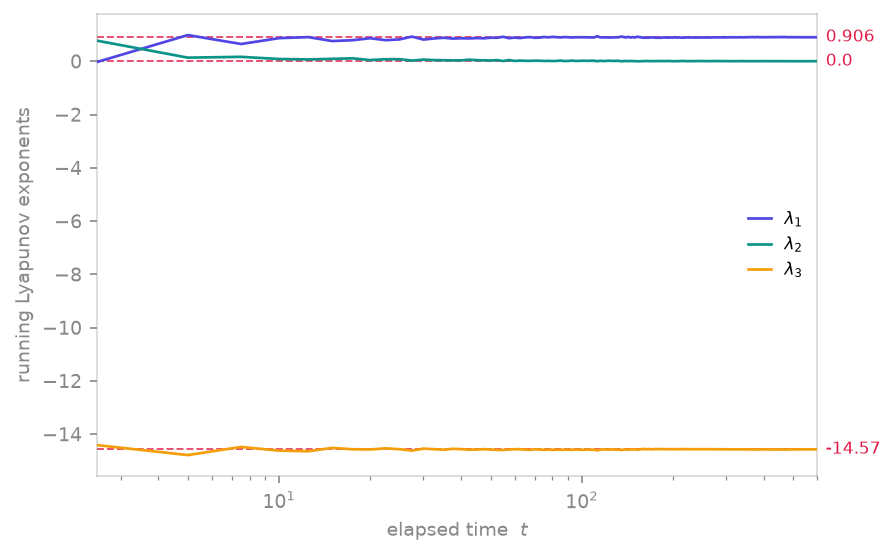

<span class="ts-kicker">Analysis · 02</span>

# Lyapunov spectra

Lyapunov exponents measure the average exponential rate at which nearby
trajectories separate — the defining quantifier of chaos. TSDynamics
computes them three ways, one per family, plus a Jacobian-free maximal
estimate and the Kaplan–Yorke dimension. The uniform entry point
`ts.lyapunov_spectrum(sys, **kwargs)` dispatches to the right family
implementation.

<figure markdown>
{ loading=lazy }
<figcaption>Running Lyapunov spectrum of the Lorenz system: as the tangent frame is stepped along the attractor, the three time-averaged exponents settle onto their known values [0.906, 0, -14.57] (dashed), the positive-zero-negative signature that certifies chaos.</figcaption>
</figure>

## Per family

=== "ODE"

    ```python
    lor = ts.Lorenz()
    lor.lyapunov_spectrum(final_time=200.0, dt=0.1, burn_in=50.0)
    # ≈ [0.906, 0.0, -14.57]
    ```

    Integrates the **variational equations** alongside the flow: the
    right-hand side is differentiated symbolically and the extended
    state + tangent dynamics run on the Rust engine. Local exponents are
    accumulated after `burn_in` and averaged with time weights. `n_exp`
    defaults to `dim`.

=== "Map"

    ```python
    h = ts.Henon()
    h.lyapunov_spectrum(steps=5000)
    # ≈ [0.42, -1.62]
    ```

    A single forward pass: at each iterate the Jacobian is applied to a
    set of deviation vectors, which are **QR re-orthonormalized**; the
    logs of `|diag R|` accumulate the exponents. Divergent random ICs are
    retried automatically.

=== "DDE"

    ```python
    mg = ts.MackeyGlass()
    traj = mg.integrate(final_time=500.0, dt=0.5, history=hist)  # settle first
    mg.lyapunov_spectrum(n_exp=1, dt=0.5, ic=traj.y[-1])         # then measure
    ```

    Starts from a constant past rather than an arbitrary history
    function — hence the **two-call workflow**: integrate to the
    attractor, then hand the end state to `lyapunov_spectrum`, which
    restarts from a constant past at that point. A DDE has infinitely
    many exponents; `n_exp` picks the leading few (default 1). Keep the
    default `1e-3` tolerances.

Every call records its result and settings in
`sys.meta["lyapunov_spectrum"]`, with history
(`sys.meta.history("lyapunov_spectrum")`).

## Known values to test against

| System | Spectrum | Note |
| ------ | -------- | ---- |
| Lorenz (defaults) | `[0.906, 0, -14.57]` | one zero exponent along the flow |
| Hénon (defaults) | `[0.42, -1.62]` | sum ≈ log of area contraction |
| Logistic, `r = 4` | `[ln 2 ≈ 0.693]` | exact analytic result |

Many built-ins declare literature values in their `known_lyapunov`
class attribute; the bulk test suite checks them continuously.

## `max_lyapunov` — no Jacobian required

```python
lam = ts.max_lyapunov(ts.Lorenz(ic=[1.0, 1.0, 1.0]), dt=0.05)   # ≈ 0.91
```

The classic two-trajectory method (Benettin, Galgani & Strelcyn 1976): run
a reference and a copy perturbed by `d0`, let them separate for
`steps_per` protocol steps, log the growth, rescale the perturbation back
to `d0`, repeat `n_rescale` times. Because it only uses `step`/`state`/
`set_state`, it works for any ODE or map — including non-smooth
right-hand sides where no Jacobian exists. Not available for DDEs
(no `set_state`); use `DelaySystem.lyapunov_spectrum` there.

## `lyapunov_from_data` — from a measured series

When you have a recording but no equations, the maximal exponent can be
estimated from neighbour divergence in a delay embedding:

```python
traj = ts.Henon().trajectory(6000, transient=500, ic=[0.1, 0.1])
res = ts.lyapunov_from_data(traj.y[:, 0], m=4, k_max=12, fit=(0, 6))
float(res)            # ≈ 0.42  (Hénon, per iteration)
```

The signal is reconstructed in an `m`-dimensional delay embedding (delay
`tau`); for each point its neighbours are found and the **mean log distance
between their forward images** is tracked as a function of look-ahead `k`.
Two estimators are available via `method=`:

- `"kantz"` (default) averages over all neighbours within a ball of radius
  `eps` — robust to noise (Kantz 1994).
- `"rosenstein"` tracks the single nearest neighbour — cheaper, good for
  short records (Rosenstein, Collins & De Luca 1993).

A Theiler window rejects temporally-correlated neighbours (Theiler 1986).
The result carries the full **stretching curve** `res.times` vs
`res.divergence`; the exponent is the slope of its linear scaling region:

```python
res = ts.lyapunov_from_data(x, dt=0.05, m=5, tau=3, k_max=60)
res.times, res.divergence       # inspect, then set fit=(lo, hi)
```

!!! warning "Inspect the curve"
    The estimate is only as good as the embedding and the chosen scaling
    region. For flows the curve typically *overshoots* before settling into
    the genuine linear region, so the automatic fit can overestimate —
    always look at `times` vs `divergence` and pass an explicit
    `fit=(lo, hi)` for a publishable number.

## Kaplan–Yorke dimension

```python
ts.kaplan_yorke_dimension([0.906, 0.0, -14.57])   # ≈ 2.06
```

The Lyapunov (Kaplan–Yorke) dimension
$D_{KY} = j + (\lambda_1 + \dots + \lambda_j)/|\lambda_{j+1}|$, with $j$
the largest index keeping the cumulative sum non-negative (Kaplan & Yorke
1979) — a fractal-dimension estimate straight from the spectrum. Returns
`0.0` for fully negative spectra and `len(spectrum)` when the spectrum
doesn't close (compute more exponents).

## `TangentSystem` — build your own loop

When the prepackaged routines don't fit (covariant vectors, finite-time
exponents, custom convergence monitoring), `TangentSystem` exposes the
machinery as a steppable system:

```python
from tsdynamics import TangentSystem

tang = TangentSystem(ts.Henon(), k=2)     # k deviation vectors
tang.reinit([0.1, 0.1])
for _ in range(5000):
    tang.step()
tang.exponents()      # running spectrum estimate ≈ [0.42, -1.62]
tang.growths()        # per-step log stretch factors
```

Maps use NumPy QR; ODEs integrate the extended variational system on the
engine. DDEs are excluded — their tangent space is infinite-dimensional.

## See also

- [Theory · Lyapunov exponents](../theory/lyapunov.md) — the math, with references
- [Delay systems](../systems/delay/index.md) — the DDE two-step in context
