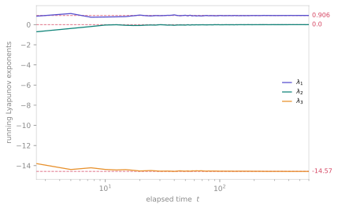

<span class="ts-kicker">Analysis · Lyapunov spectra</span>

# Lyapunov spectra

The Lyapunov exponents are the sharpest number a dynamical system will give
you. Two trajectories that start infinitesimally apart separate, on average, at
an exponential rate; the spectrum $\lambda_1 \ge \lambda_2 \ge \dots$ collects
those rates, one per direction in tangent space. A single positive exponent is
the working definition of chaos — nearby states pull apart, so long-term
prediction is impossible even though the equations are deterministic. The signs
of the whole spectrum read like a fingerprint: how many directions expand, how
many are neutral, how fast phase-space volume contracts onto the attractor.

TSDynamics computes the spectrum three ways — one per family — behind a single
uniform verb, plus a Jacobian-free maximal estimate, a from-a-recording
estimator, and the Kaplan–Yorke dimension that falls straight out of the
numbers.

<figure markdown>
{ loading=lazy }
<figcaption>The Lorenz running spectrum. As the tangent frame is stepped along the attractor the three time-averaged exponents (indigo/teal/amber) settle onto their known values <code>[0.906, 0.0, -14.57]</code> (rose, dashed) on a log-time axis — the positive · zero · strongly-negative signature that certifies a chaotic dissipative flow.</figcaption>
</figure>

## The uniform entry point

`ts.lyapunov_spectrum(system, ...)` dispatches to the right family
implementation and translates one signature to each family's native keywords.
The exponents come back largest first, in a `LyapunovSpectrum` result that is a
drop-in for the bare exponent array — `np.asarray(result)`, indexing and
iteration all defer to it — while also carrying `.meta`, `.summary()` and the
`.kaplan_yorke` dimension.

```python
import numpy as np
import tsdynamics as ts

spec = ts.lyapunov_spectrum(ts.systems.Lorenz(ic=[1.0, 1.0, 1.0]),
                            final_time=300.0, dt=0.05, transient=40.0)
np.asarray(spec)      # ≈ [ 0.903,  0.002, -14.572]
spec.kaplan_yorke     # ≈ 2.06
spec.summary()        # "…  → chaotic: 1 positive exponent"
```

The keywords split cleanly by family: a **flow** (ODE or DDE) uses
`final_time=` as its averaging window and `transient=` as a burn-in *time*; a
**map** uses `n=` iterations and takes no transient (the QR iteration
reorthonormalises from the initial condition). `k=` sets how many exponents to
compute (`dim` by default). Passing a map keyword to a flow — or the reverse —
raises rather than silently doing the wrong thing.

## Per family — what actually runs

Under the one verb, each family has a genuinely different tangent-space
computation. They are exposed as the `System.lyapunov_spectrum` method too, so
you can call them directly with their native keywords.

=== "ODE (flow)"

    ```python
    lor = ts.systems.Lorenz(ic=[1.0, 1.0, 1.0])
    lor.lyapunov_spectrum(final_time=300.0, dt=0.05, burn_in=40.0)
    # ≈ [0.903, 0.002, -14.572]
    ```

    The **extended variational system** — the state plus $k$ deviation
    vectors, whose dynamics are the right-hand side differentiated
    symbolically — is integrated on the Rust engine. After the `burn_in` the
    evolving frame is periodically **QR-reorthonormalised** (Benettin et al.
    1980); the logs of the diagonal $R$ factors, time-weighted, are the
    exponents. One exponent of a flow is always $\approx 0$ — the neutral
    direction *along* the flow — which is why the Lorenz middle exponent lands
    just above zero rather than exactly on it.

=== "Map"

    ```python
    ts.systems.Henon(ic=[0.1, 0.1]).lyapunov_spectrum(steps=6000)
    # ≈ [0.42, -1.63]
    ```

    A single forward pass on the compiled tangent-map kernel: at each iterate
    the analytic Jacobian is applied to the deviation frame, which is
    **QR-reorthonormalised**, and the logs of $|\mathrm{diag}\,R|$ accumulate.
    The whole QR iteration runs in one Rust call, and divergent random initial
    conditions are retried automatically. The exponents are *per iteration*,
    not per unit time.

=== "DDE (delay)"

    ```python
    mg = ts.systems.MackeyGlass()
    hist = lambda s: [1.0 + 0.1 * np.sin(0.2 * s)]
    traj = mg.integrate(final_time=1000.0, dt=0.5, history=hist)   # settle first
    mg.lyapunov_spectrum(n_exp=1, dt=0.5, ic=traj.y[-1],           # then measure
                         burn_in=100.0, final_time=1000.0, rtol=1e-4, atol=1e-4)
    # ≈ [0.0075]   (positive → chaotic at τ = 17)
    ```

    A delay system has an **infinite-dimensional** tangent space (its state is
    a history function), so the estimator builds an *extended DDE* — the base
    state plus $k$ deviation states obeying the symbolic variational dynamics —
    and Benettin-renormalises over the deviation *history segment*. Because it
    restarts from a **constant past**, the workflow is two calls: integrate to
    the attractor, then hand the end state to `lyapunov_spectrum`. A DDE may
    request more exponents than `dim`; keep the loose `1e-3`-ish tolerances.

Every call records its result and settings in
`sys.meta["lyapunov_spectrum"]`, with the full history available via
`sys.meta.history("lyapunov_spectrum")`.

!!! note "Reading the signs"
    The number of positive exponents names the dynamics: **none** → regular
    (a fixed point, cycle or torus), **one** → chaos, **two or more** →
    hyperchaos. `LyapunovSpectrum.summary()` does exactly this classification,
    thresholding "positive" relative to the spectrum's own scale so a flow's
    numerically-near-zero exponent is not mistaken for a real positive one.

## Known values to test against

These are literature numbers you can reproduce with the calls above — the same
ones the bulk test suite checks continuously for every system that declares a
`known_lyapunov` class attribute.

| System | Spectrum | Note |
| ------ | -------- | ---- |
| Lorenz (defaults) | `[0.906, 0, -14.57]` | one zero exponent along the flow |
| Hénon (defaults) | `[0.42, -1.63]` | $\sum\lambda_i \approx \ln|\det J|$ (area contraction) |
| Logistic, `r = 4` | `[ln 2 ≈ 0.693]` | exact analytic result |
| Mackey–Glass, `τ = 17` | leading `> 0` | chaotic; $\ge 1$ positive exponent |

## `max_lyapunov` — no Jacobian required

When you only need the *leading* exponent — or when the right-hand side is
non-smooth and no analytic Jacobian exists — the classic two-trajectory method
needs nothing but the stepping protocol:

```python
ts.max_lyapunov(ts.systems.Lorenz(ic=[1.0, 1.0, 1.0]), dt=0.05)   # ≈ 0.89
ts.max_lyapunov(ts.systems.Henon(), ic=[0.1, 0.1])                # ≈ 0.42
```

Run a reference and a copy perturbed by `d0`, let them separate for `steps_per`
protocol steps, log the growth $\ln(d/d_0)$, rescale the perturbation back to
`d0`, and repeat `n` times (Benettin, Galgani & Strelcyn 1976). Because it only
touches `step` / `state` / `set_state`, it works for any ODE or map — including
systems where no Jacobian is available. The continuous normalisation divides by
the *measured* elapsed `time()` of the reference run, so the exponent is
correct whatever per-step advance the system makes. For a **map**,
`max_lyapunov` returns the leading entry of the compiled QR tangent-map
spectrum — far faster and more robust than per-iterate rescaling (no `d0` /
collapse tuning). It is **not** available for DDEs, which cannot `set_state`;
use `DelaySystem.lyapunov_spectrum` there.

## `lyapunov_from_data` — from a measured series

Given a recording but no equations, the maximal exponent can be estimated from
how fast neighbours diverge inside a delay embedding. The signal is
reconstructed in a `dimension`-dimensional delay embedding (Takens 1981); for
every reference point its neighbours are found and the **mean log distance
between their forward images** is tracked as a function of the look-ahead $k$.
The result carries the full **stretching curve** $S(k)$ — the exponent is the
slope of its linear scaling region.

```python
traj = ts.systems.Henon().trajectory(6000, transient=500, ic=[0.1, 0.1])
res = ts.lyapunov_from_data(traj.y[:, 0], dimension=4, k_max=12, fit=(0, 6))

float(res)          # ≈ 0.42   (Hénon, per iteration)
res.times, res.divergence     # the S(k) curve — inspect, then set fit=(lo, hi)
```

Two estimators are available via `method=`:

- `"kantz"` (default) averages over **all** neighbours within a ball of radius
  `eps` — robust to noise (Kantz 1994).
- `"rosenstein"` tracks the **single** nearest neighbour — cheaper, well-suited
  to short records (Rosenstein, Collins & De Luca 1993).

A Theiler window rejects temporally-correlated neighbours (Theiler 1986),
defaulting to the embedding span. For a **flow** pass the sampling interval
`dt=` so the exponent comes out per unit time; for a **map** leave `dt=1.0`
(per iteration).

!!! warning "Inspect the curve before you trust the number"
    The estimate is only as good as the embedding and the chosen scaling
    region. For flows the divergence curve typically *overshoots* before it
    settles into the genuine linear region, so the automatic fit can
    overestimate. Always look at `res.times` vs `res.divergence` and pass an
    explicit `fit=(lo, hi)` before quoting a publishable value.

## Kaplan–Yorke dimension

The Lyapunov (Kaplan–Yorke) dimension estimates the attractor's fractal
dimension straight from the spectrum — no box-counting required:

```python
ts.kaplan_yorke_dimension([0.906, 0.0, -14.57])   # ≈ 2.06  (Lorenz)
```

$$
D_{KY} = j + \frac{\lambda_1 + \dots + \lambda_j}{|\lambda_{j+1}|},
$$

with $j$ the largest index whose cumulative exponent sum is still non-negative
(Kaplan & Yorke 1979) — the interpolation point where expanding directions have
just been balanced by contracting ones. It returns `0.0` for a fully negative
spectrum (a fixed point) and `len(spectrum)` when the cumulative sum never turns
negative (the spectrum does not close — compute more exponents). A
`LyapunovSpectrum` exposes it directly as `spec.kaplan_yorke`.

## `TangentSystem` — build your own loop

When the prepackaged routines do not fit — covariant vectors, finite-time
exponents, custom convergence monitoring — `TangentSystem` exposes the tangent
machinery as a steppable system, so you own the loop:

```python
from tsdynamics import TangentSystem

tang = TangentSystem(ts.systems.Henon(), k=2)     # k deviation vectors
tang.reinit([0.1, 0.1])
for _ in range(5000):
    tang.step()
tang.exponents()      # running spectrum estimate ≈ [0.43, -1.63]
tang.growths()        # per-step log stretch factors
```

`TangentSystem` is the single Lyapunov engine underneath every routine above:
maps run the compiled QR tangent-map kernel, ODEs integrate the extended
variational system on the engine, and DDEs are excluded (their tangent space is
infinite-dimensional — use `DelaySystem.lyapunov_spectrum`). It is exactly the
object the showcase figure at the top of this page is built from.

## See also

- [Chaos indicators](chaos.md) — GALI, the 0–1 test and expansion entropy: fast "is it chaotic?" verdicts that stand in for the full spectrum
- [Fixed points & periodic orbits](fixed-points.md) — the invariant sets whose local stability the exponents generalise
- [Fractal dimensions](dimensions.md) — measure the attractor's dimension directly, to cross-check $D_{KY}$
- [Delay embeddings](embedding.md) — the reconstruction `lyapunov_from_data` relies on
- [Integration & methods](integration-and-methods.md) — the solver and backend `lyapunov_spectrum` runs on

## References

- G. Benettin, L. Galgani & J.-M. Strelcyn, "Kolmogorov entropy and numerical experiments", *Phys. Rev. A* **14** (1976) 2338.
- G. Benettin, L. Galgani, A. Giorgilli & J.-M. Strelcyn, "Lyapunov characteristic exponents … a method for computing all of them", *Meccanica* **15** (1980) 9 & 21.
- J. L. Kaplan & J. A. Yorke, in *Functional Differential Equations and Approximation of Fixed Points*, LNM **730**, Springer (1979) 204.
- H. Kantz, "A robust method to estimate the maximal Lyapunov exponent of a time series", *Phys. Lett. A* **185** (1994) 77.
- M. T. Rosenstein, J. J. Collins & C. J. De Luca, "A practical method for calculating largest Lyapunov exponents from small data sets", *Physica D* **65** (1993) 117.
