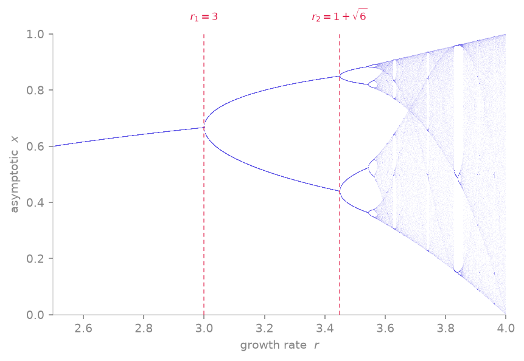

<span class="ts-kicker">Analysis · 03</span>

# Orbit & bifurcation diagrams

`orbit_diagram` sweeps one parameter and records the asymptotic orbit at
each value — the classic picture of period-doubling cascades and chaotic
bands.

<figure markdown>
{ loading=lazy }
<figcaption>The logistic map's asymptotic orbit swept over the growth rate r: a single fixed point period-doubles at r₁=3, again at r₂=1+√6, and cascades into chaos near r≈3.57, interleaved with periodic windows (the wide period-3 band near r≈3.83).</figcaption>
</figure>

## Maps: the logistic diagram

```python
import numpy as np
import tsdynamics as ts

od = ts.orbit_diagram(
    ts.Logistic(), "r", np.linspace(2.5, 4.0, 600),
    n=120,            # points recorded per parameter value
    transient=500,    # steps discarded first, at every value
)

x, y = od.flat()      # scatter-ready arrays
# plt.plot(x, y, ",k", markersize=0.5)
```

The result is an `OrbitDiagram`: iterate it for `(value, points)` pairs,
or call `flat()` for plotting. Counting distinct branches at a value shows
the period directly:

```python
for r, pts in od:
    n_branches = len(np.unique(np.round(pts[:, 0], 6)))
    # r < 3        → 1 branch  (fixed point)
    # 3 < r < 3.449 → 2 branches (period 2)
    # ...period-doubling cascade → chaos near r ≈ 3.57
```

## `carry_state` — following the attractor

By default (`carry_state=True`) each parameter value starts from the
*previous* value's final state. This follows the attractor branch
continuously and produces clean diagrams without re-converging through a
transient basin at every step. Set `carry_state=False` to restart every
value from the same `ic` — useful when probing coexisting attractors,
where following a branch would hide the others.

The swept system is never mutated: each value gets a fresh
`with_params` copy.

## Flows: the composition

`orbit_diagram` requires a discrete-time view — and that is exactly what
the [derived wrappers](../start/concepts.md#derived-systems-composition)
provide. Wrap a flow in a `PoincareMap` and the orbit diagram **is** the
bifurcation diagram of the flow:

```python
from tsdynamics import PoincareMap

od = ts.orbit_diagram(
    PoincareMap(ts.Rossler(), (1, 0.0)),    # section y = 0
    "c", np.linspace(2.0, 6.0, 80),
    n=60, transient=30,
)
x, c_vals = od.flat()    # x-coordinate of section crossings vs. c
```

Each "iteration" is one section crossing; `with_params` re-parametrizes
the *inner* Rössler system and rebuilds the wrapper, so the sweep
composes transparently.

For periodically forced oscillators, sample once per forcing period with a
`StroboscopicMap` instead:

```python
from tsdynamics import StroboscopicMap

duf = ts.Duffing()                                    # forcing frequency omega=1.4
od = ts.orbit_diagram(
    StroboscopicMap(duf, period=2 * np.pi / 1.4),
    "gamma", np.linspace(0.2, 0.65, 150),
    n=40, transient=60,
)
```

## Cost notes

- **Maps** — each value costs just the iterations; sweeps of hundreds of
  values are routine.
- **ODE-backed wrappers** — parameter changes are control parameters of the
  lowered tape, so the per-value cost is just the integration.
- **DDE-backed sweeps** — each parameter value re-lowers the delay equation
  (its structure depends on all parameters). Budget accordingly, or sweep
  coarsely first.

## Quantifying the cascade

Counting branches by hand (above) is exactly what `OrbitDiagram.periods()`
automates — and `bifurcation_points()` turns the changes into estimated
bifurcation parameters:

```python
od = ts.orbit_diagram(
    ts.Logistic(), "r", np.linspace(2.9, 3.6, 400), n=64, transient=2000,
)

od.periods()              # period at each value: 1, 2, 4, …, 0 (aperiodic), -1 (diverged)
od.bifurcation_points()   # → ≈ [3.0, 3.449, …]  the period-doubling onsets
```

`periods()` clusters each value's recorded points with a scale-free gap test
(a new branch where the sorted-value gap exceeds `rtol` times the range), caps
runaway counts at `max_period` (reported as `0` — aperiodic), and marks
diverged sweeps `-1`. For the logistic map the first two onsets land on the
textbook values $r_1 = 3$ and $r_2 = 1 + \sqrt{6} \approx 3.449$. The
resolution of `bifurcation_points()` is the spacing of the swept `values` —
sweep finely near a transition to pin it down.

## See also

- [Poincaré sections](poincare.md) — the section machinery behind `PoincareMap`
- [Return maps](poincare.md#first-return-maps) — the 1-D map hidden in a flow
- [Reference · Analysis](../reference/analysis.md) — `orbit_diagram` / `OrbitDiagram` signatures
