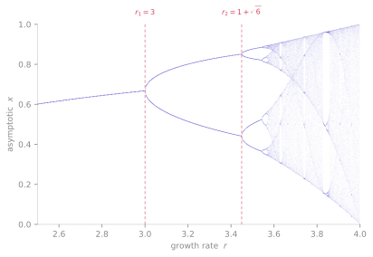

<span class="ts-kicker">Analysis · Orbit & bifurcation diagrams</span>

# Orbit & bifurcation diagrams

Fix a system, vary one parameter, and watch where the long-term motion
settles. That single picture — the asymptotic state stacked against the
control parameter — is the most recognisable image in nonlinear dynamics: a
fixed point that splits in two, splits again, and cascades into a smear of
chaos threaded with periodic windows. `orbit_diagram` builds it for any
discrete-time view, and `return_map` reveals the one-dimensional map hiding
inside a continuous flow.

## The idea

For a map $x_{n+1} = f(x_n; \mu)$ the *orbit diagram* records, at each value of
$\mu$, the set of states the orbit visits once transients have died away. Where
the attractor is a fixed point you see one dot; a period-2 cycle gives two, a
period-4 cycle four, and a chaotic band fills a vertical stripe. Sweeping $\mu$
draws the **bifurcation diagram** — the map of how that attractor is created,
doubled, and destroyed as the parameter moves.

Nothing about the construction is specific to maps. Any object that advances in
discrete steps works, and the [derived wrappers](../start/index.md) turn a flow
into exactly such an object: a `PoincareMap` samples the flow at plane
crossings, a `StroboscopicMap` samples a forced oscillator once per drive
period. An orbit diagram over either **is** the bifurcation diagram of the flow.

## Maps: the logistic cascade

The logistic map $x_{n+1} = r\,x_n(1 - x_n)$ is the canonical example.
`orbit_diagram` takes the system, the parameter name, and the values to sweep:

<div class="ts-ref" markdown>

<div class="ts-item" markdown>
```python
import numpy as np
import tsdynamics as ts

od = ts.orbit_diagram(
    ts.systems.Logistic(),
    "r", np.linspace(2.5, 4.0, 600),
    points_per_value=120,          # states recorded per r
    transient=500,  # steps discarded first, at every r
)

param, state = od.flat()   # scatter-ready arrays
```

`flat()` returns two aligned 1-D arrays — the parameter value repeated once per
recorded point, and the asymptotic state — ready to scatter as
`plt.plot(param, state, ",k")`. The result is an `OrbitDiagram`: iterate it for
`(value, points)` pairs, index its `.values` / `.points`, and it carries the
usual `.meta` / `.summary()` / `.plot` result surface. `transient` is a *step*
count discarded before recording; `n` is how many states you keep, enough to
resolve the widest band you care about.
</div>

<figure class="ts-fig" markdown>
{ loading=lazy }
<figcaption><span class="lbl">FIG 1</span> · the logistic map's asymptotic orbit swept over the growth rate r: one fixed point period-doubles at r₁ = 3, again at r₂ = 1 + √6, and cascades into chaos near r ≈ 3.57, interleaved with periodic windows (the wide period-3 band near r ≈ 3.83).</figcaption>
</figure>

</div>

### How to read it

Left of $r = 3$ the orbit sits on a single branch — a stable fixed point. At
$r_1 = 3$ that fixed point loses stability and the branch forks: the orbit now
alternates between two values (period 2). At $r_2 = 1 + \sqrt{6} \approx 3.449$
each branch forks again (period 4), then 8, 16, … in a geometric cascade that
accumulates at $r_\infty \approx 3.5699$ — the onset of chaos. Beyond it the
diagram is mostly chaotic bands, punctured by **periodic windows**: the wide one
near $r \approx 3.83$ is the period-3 window born at the tangent bifurcation
$r = 1 + \sqrt{8}$, itself period-doubling as $r$ increases.

### Following the attractor: `carry_state`

By default (`carry_state=True`) each parameter value starts from the *previous*
value's final state. This walks the attractor branch continuously and produces
clean diagrams without re-converging through a transient basin at every step —
the standard way to draw the picture above. Set `carry_state=False` to restart
every value from the same `ic`, which is what you want when **coexisting
attractors** are in play (a hysteresis loop, a subcritical branch): following a
single branch would hide the others. The swept system is never mutated — each
value gets a fresh `with_params` copy.

## Quantifying the cascade

Counting distinct branches at each $r$ *is* reading off the period, and
`OrbitDiagram.periods()` automates it. `bifurcation_points()` then turns the
changes into estimated onset parameters:

```python
od = ts.orbit_diagram(
    ts.systems.Logistic(), "r", np.linspace(2.9, 3.6, 400), points_per_value=64, transient=2000,
)

od.periods()             # period at each r: 1, 2, 4, …, 0 (aperiodic), -1 (diverged)
od.bifurcation_points()  # → ≈ [3.00, 3.45, …]  the period-doubling onsets
```

`periods()` clusters each value's recorded points with a **scale-free gap
test** — a new branch begins wherever the sorted-value gap exceeds `rtol` times
the orbit's range — then confirms a candidate period $p$ by checking that the
iterate sequence actually *revisits* its values cyclically ($v_i \approx
v_{i+p}$). That second test is what keeps a chaotic band whose finite sample
happens to fall into $p$ bins from being mislabelled a period-$p$ window. Counts
above `max_period` are reported as `0` (aperiodic); a diverged value is `-1`.

For the logistic map the first two onsets land on the textbook values $r_1 = 3$
and $r_2 = 1 + \sqrt{6} \approx 3.449$. The resolution of
`bifurcation_points()` is the spacing of the swept `values`, so sweep finely
near a transition to pin it down.

!!! tip "Named components"
    When the system declares `variables`, `component=` accepts a name:
    `orbit_diagram(sys, "r", values, component="x")`. `periods()` and
    `bifurcation_points()` take the same `component=` to count branches in a
    chosen coordinate.

## Flows: bifurcation diagrams by composition

`orbit_diagram` requires a discrete view, and a flow does not have one on its
own — so wrap it. A `PoincareMap` presents the flow as the map of its crossings
through a section plane; sweeping a parameter of *that* is a bifurcation diagram
of the flow, one section crossing per "iteration":

```python
from tsdynamics import PoincareMap

od = ts.orbit_diagram(
    PoincareMap(ts.systems.Rossler(), plane=("y", 0.0, "up")),  # section y = 0, upward
    "c", np.linspace(4.0, 6.0, 120),
    points_per_value=60, transient=30,
)
x_cross, c = od.flat()   # x-coordinate of the crossings vs. c
```

`with_params` re-parametrizes the *inner* Rössler system and rebuilds the
wrapper, so the sweep composes transparently. The Rössler period-doubling route
to its funnel attractor appears here just as the logistic cascade does — the
same cascade, one dimension up.

For a **periodically forced** oscillator the natural strobe is once per forcing
period, which is what `StroboscopicMap` does:

```python
from tsdynamics import StroboscopicMap

duf = ts.systems.Duffing()                          # forcing frequency omega = 1.4
od = ts.orbit_diagram(
    StroboscopicMap(duf, period=2 * np.pi / 1.4),
    "gamma", np.linspace(0.30, 0.50, 120),
    points_per_value=40, transient=60, component=0,
)
```

Each sample is the state after exactly one drive period, so a period-1 response
(locked to the forcing) is a single point, a period-2 subharmonic is two, and
chaos fills a band — the forced-oscillator counterpart of the logistic diagram.

!!! warning "Diverging parameter values"
    A single value whose orbit blows up does not abort the sweep: that value
    records an empty point set and emits a `RuntimeWarning`, and the sweep
    continues. If a whole range of a forced system diverges, you are outside its
    bounded-response regime — narrow the range.

## The hidden 1-D map: `return_map`

A bifurcation diagram shows *where* the dynamics live; a **return map** shows
*how* they move. It records successive values of one recurring scalar and plots
each against its successor $(v_n, v_{n+1})$, exposing the effective
one-dimensional map that organises the flow. `return_map` builds it two ways.

The classic construction (Lorenz, 1963) records successive **local maxima** of a
coordinate:

```python
rm = ts.return_map(ts.systems.Lorenz(), "z", method="max",
                   final_time=400.0, transient=40.0)
vn, vn1 = rm.flat()
# plt.plot(vn, vn1, ".")   # the famous single-humped z-maxima cusp map
```

The Lorenz $z$-maxima fall on a tight, single-valued curve — direct evidence
that a 1-D map governs the strange attractor. Recorded values are sharpened by
parabolic interpolation of each peak's three samples, so a coarse detection step
still locates the extremum accurately.

The other construction records an observable at successive **section crossings**
— the section's own return map:

```python
rm = ts.return_map(ts.systems.Rossler(), "y", method="poincare",
                   plane=("x", 0.0, "up"), n=400)
```

Either source can be a live system (integrated for you), an existing
`Trajectory`, or — for the extremum methods — a bare 1-D array. A `ReturnMap`
can also draw its own **cobweb** (`rm.cobweb()`), the staircase that traces the
iteration $v_{n+1} = F(v_n)$ against the diagonal. A filled cloud instead of a
curve is the signature that the dynamics are *not* effectively one-dimensional.

## Cost notes

- **Maps** — a genuine `DiscreteMap` sweeps the *whole* parameter array in a
  single Rust engine call (the map is lowered once, the kernel varies the
  parameter per value), so hundred- and thousand-value sweeps are routine and
  fast.
- **ODE-backed wrappers** — parameter changes are control parameters of the
  lowered tape, so the per-value cost is just the integration; no re-lowering.
- **DDE-backed sweeps** — each parameter value re-lowers the delay equation (its
  structure depends on all parameters). Budget accordingly, or sweep coarsely
  first to find the interesting window.

## See also

- [Poincaré sections](poincare.md) — the section machinery behind `PoincareMap`, and `return_map(method="poincare")`
- [Fixed points & periodic orbits](fixed-points.md) — the invariant sets that are born and lost at the bifurcations above
- [Lyapunov spectra](lyapunov.md) — the exponent that turns positive as the cascade reaches chaos
- [Integration & methods](integration-and-methods.md) — the `integrate` / stepping machinery every sweep drives

## References

- May, R. M. (1976). Simple mathematical models with very complicated dynamics. *Nature* **261**, 459–467.
- Feigenbaum, M. J. (1978). Quantitative universality for a class of nonlinear transformations. *J. Stat. Phys.* **19**, 25–52.
- Lorenz, E. N. (1963). Deterministic nonperiodic flow. *J. Atmos. Sci.* **20**, 130–141.
