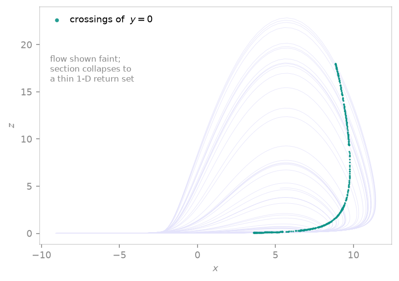

<span class="ts-kicker">Analysis · 04</span>

# Poincaré sections

A Poincaré section reduces a continuous flow to the discrete sequence of
its crossings through a hyperplane — periodic orbits become finite point
sets, chaotic attractors become fractal dust. `poincare_section` accepts
either a live system or an already-computed trajectory.

<figure markdown>
{ loading=lazy }
<figcaption>The Rössler flow (faint indigo, x–z projection) crossed by the section plane y = 0: the teal crossings collapse from the full 2-D attractor onto a thin, near-one-dimensional return set — the hallmark of a Poincaré section.</figcaption>
</figure>

## From a system (accurate)

```python
import tsdynamics as ts

section = ts.poincare_section(ts.Rossler(), plane=(1, 0.0), n=500)
section.t      # crossing times
section.y      # full-dimensional crossing states, shape (500, 3)
```

The system path marches the flow with a detection step `dt`, brackets each
sign change of the plane function, and **refines the crossing** with cubic
Hermite interpolation — endpoint derivatives come from the system's
numeric right-hand side, giving $O(\Delta t^4)$ accuracy in the crossing
point. `dt` only needs to be small enough not to *skip* crossings; the
refinement supplies the precision. (Systems without a numeric RHS, such
as DDEs, fall back to linear interpolation, $O(\Delta t^2)$.)

## From trajectory data (no system needed)

```python
traj = ts.Lorenz().integrate(final_time=500.0, dt=0.01)
section = ts.poincare_section(traj, plane=(2, 25.0))    # plane z = 25
```

The data path finds sign changes between consecutive samples and locates
crossings by **linear interpolation**. It needs nothing but the arrays —
useful for archived or experimental data — but its accuracy is limited by
the trajectory's sampling interval. When you hold the system, prefer the
system path.

## Specifying the plane

| Spec | Meaning |
| ---- | ------- |
| `(i, c)` — int + float | The axis-aligned section $y_i = c$, e.g. `(1, 0.0)` for $y = 0$ |
| `(normal, offset)` — vector + float | The general section $\mathbf{n} \cdot \mathbf{y} = \text{offset}$ |

The `direction` argument filters crossings by orientation: `+1` (default)
keeps crossings where $\mathbf{n} \cdot \mathbf{y}$ increases, `-1` where
it decreases, `0` keeps both. One-sided sections are usually what you
want — two-sided sections superimpose the two halves of the attractor.

## The `PoincareMap` wrapper

`poincare_section(system, ...)` is a convenience over the real machinery,
the [`PoincareMap`](../reference/derived.md) derived system:

```python
from tsdynamics import PoincareMap

pmap = PoincareMap(ts.Rossler(), plane=(1, 0.0), direction=+1, dt=0.01)
u1 = pmap.step()              # advance the flow to the next crossing
sec = pmap.trajectory(500)    # collect 500 crossings
pmap.crossing_count           # bookkeeping
```

Because `PoincareMap` *is* a discrete `System`, it slots into anything
written for maps — most importantly
[orbit diagrams](orbit-diagrams.md#flows-the-composition), where it turns
a parameter sweep of a flow into a bifurcation diagram. A `RuntimeError`
is raised if no crossing occurs within `max_time` (the plane may miss the
attractor, or `direction` is wrong).

## First-return maps

A *return map* takes the idea one step further: it records successive values of
a single recurring observable and plots each against its successor
$(v_n, v_{n+1})$, exposing the one-dimensional map that organises the flow.
`return_map` builds it two ways.

The classic construction (Lorenz, 1963) records successive **local maxima** of
a coordinate:

```python
rm = ts.return_map(ts.Lorenz(), "z", method="max", final_time=400.0, transient=40.0)
x, y = rm.flat()
# plt.plot(x, y, ".")   # the famous single-humped z-maxima cusp map
```

The Lorenz $z$-maxima fall on a tight, single-valued curve — direct evidence
that a 1-D map governs the attractor. Recorded values are sharpened by
parabolic interpolation, so a coarse detection step still locates each peak
accurately.

The other construction records an observable at successive **section
crossings** — the section's own return map:

```python
rm = ts.return_map(ts.Rossler(), "y", method="poincare", plane=(0, 0.0), n=400)
```

Either source can be a live system (integrated for you) or an existing
`Trajectory` (or, for extrema, a bare 1-D array). A filled cloud instead of a
curve is the signature that the dynamics are *not* effectively 1-D.

## See also

- [Orbit & bifurcation diagrams](orbit-diagrams.md) — sweeping a `PoincareMap`
- [Reference · Analysis](../reference/analysis.md) — exact signatures
