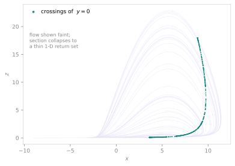

<span class="ts-kicker">Analysis · Poincaré sections</span>

# Poincaré sections

A continuous flow is hard to see: a 3-D attractor is a tangle, a higher-D one is
invisible. Poincaré's device is to stop watching the whole trajectory and record
only the moments it pierces a chosen surface. That reduces the flow by one
dimension and turns it into a **discrete map** — periodic orbits become finite
point sets, a strange attractor becomes fractal dust with visible structure, and
the whole quantifier toolkit written for maps suddenly applies to the flow.

## The idea

Pick a hyperplane $\Sigma$ in state space and watch the trajectory cross it,
always in the same direction. The ordered sequence of crossing points
$\mathbf{u}_0, \mathbf{u}_1, \dots$ is the **surface of section**, and the rule
$\mathbf{u}_n \mapsto \mathbf{u}_{n+1}$ that carries one crossing to the next is
the **Poincaré (first-return) map**. A period-$T$ orbit that crosses $\Sigma$
once per period shows up as a single fixed point of that map; a quasi-periodic
torus as a closed loop; a chaotic attractor as a structured cloud of one lower
dimension than the flow. The section throws away the flow *between* crossings but
keeps everything that matters for the topology of the attractor.

## From a system: root-refined crossings

Hand `poincare_section` a flow and the plane, and it returns the crossings:

<div class="ts-ref" markdown>

<div class="ts-item" markdown>
```python
import tsdynamics as ts

section = ts.poincare_section(
    ts.systems.Rossler(),
    plane=("y", 0.0, "up"),   # section y = 0, crossed upward
    n=500,
)

section.t          # crossing times, shape (500,)
section.y          # full-dimensional crossing states, (500, 3)
section.summary()  # crossings / dim / plane / direction
```

The system path marches the flow with a detection step `dt`, brackets each sign
change of the plane function, and **refines the crossing** with cubic Hermite
interpolation — endpoint derivatives come from the system's numeric right-hand
side, giving $O(\Delta t^4)$ accuracy in the crossing point. `dt` only has to be
small enough not to *skip* a crossing; the refinement supplies the precision.

The return value is a `PoincareSection` — a `Trajectory` subclass carrying
section plot intent (so a renderer draws the in-plane scatter, not a misleading
flow line) plus a `.summary()` / `.to_dict()` / `.plot` result surface.
</div>

<figure class="ts-fig" markdown>
{ loading=lazy }
<figcaption><span class="lbl">FIG 1</span> · the Rössler flow (faint indigo, x–z projection) crossed by the plane y = 0: the teal crossings collapse from the full 2-D-looking attractor onto a thin, near-one-dimensional return set — the hallmark of a Poincaré section.</figcaption>
</figure>

</div>

Under the hood this runs on the **wired Rust event engine**: the whole attractor
is marched and every crossing refined in a *single* engine call, roughly two
orders of magnitude faster than a per-`dt` Python loop. DDEs (no numeric RHS),
stiff defaults, and `backend="reference"` transparently fall back to the Python
loop; the two paths are answer-identical at the same fixed-step discretisation.

## From trajectory data: no system needed

If you only hold arrays — archived output, an experimental record — pass the
`Trajectory` instead:

```python
traj = ts.systems.Lorenz().integrate(final_time=300.0, dt=0.01)
section = ts.poincare_section(traj, plane=("z", 25.0))   # plane z = 25
```

The data path finds sign changes between consecutive samples and locates each
crossing by **linear interpolation**. It needs nothing but the arrays, but its
accuracy is bounded by the trajectory's sampling interval ($O(\Delta t^2)$).
When you still hold the system, prefer the system path — it refines to a far
tighter tolerance than the grid you happened to save.

## Specifying the plane

The `plane=` argument accepts three spellings; the friendly one names a
coordinate and a direction word.

| Spec | Meaning |
| ---- | ------- |
| `("y", 0.0)` — name + offset | Axis-aligned section $y = 0$, with `direction=` deciding orientation |
| `("y", 0.0, "up")` — name + offset + direction | The same, with the crossing direction inline (**overrides** `direction=`) |
| `(1, 0.0)` — index + offset | Axis-aligned section on component 1 (indices work when no `variables` are declared) |
| `([1, 0, 0], 0.0)` — normal + offset | The general section $\mathbf{n}\cdot\mathbf{y} = \text{offset}$ for an arbitrary normal vector |

A component **name** is resolved against the system's `variables`; a wrong name
or a name on a system without `variables` raises `InvalidParameterError` with a
hint. The direction words are `"up"` (increasing through the plane, the
default), `"down"`, and `"both"`:

```python
ts.poincare_section(sys, plane=("y", 0.0, "up"))    # only upward crossings
ts.poincare_section(sys, plane=("y", 0.0), direction="down")
ts.poincare_section(sys, plane=("y", 0.0, "both"))  # both orientations
```

One-sided sections are usually what you want — a two-sided section superimposes
the two halves of the attractor and blurs the return structure.

!!! note "skip_crossings, not transient"
    To discard leading crossings while the flow settles onto the attractor, use
    `skip_crossings=` — a count of *crossings*, deliberately distinct from the
    time- or step-based `transient` of other analyses. The section transient is
    measured in section hits, so the vocabulary keeps them apart.

## The `PoincareMap` wrapper

`poincare_section` is a convenience over the real machinery, the `PoincareMap`
derived system. Because a `PoincareMap` *is* a discrete `System`, it slots into
anything written for maps:

```python
from tsdynamics import PoincareMap

pmap = PoincareMap(ts.systems.Rossler(), plane=("y", 0.0, "up"), dt=0.01)

u1 = pmap.step()             # advance the flow to the next crossing
sec = pmap.trajectory(500)   # collect 500 crossings → PoincareSection
pmap.crossing_count          # bookkeeping
```

The most important consumer is [`orbit_diagram`](orbit-diagrams.md#flows-bifurcation-diagrams-by-composition):
a parameter sweep over a `PoincareMap` is a bifurcation diagram of the flow.
`PoincareMap` also exposes the section to the general events API via
`pmap.as_events()`, so the same crossings can be collected through
`system.run(events=...)`. A `ConvergenceError` is raised if no crossing occurs
within `max_time` — the plane may miss the attractor, or the direction is
reversed.

## First-return maps

A return map takes the reduction one step further: from the crossing sequence it
keeps a *single* scalar observable and plots each value against its successor
$(v_n, v_{n+1})$, exposing the one-dimensional map that governs the flow.
`return_map(method="poincare")` builds it directly from a section:

```python
rm = ts.return_map(ts.systems.Rossler(), "y", method="poincare",
                   plane=("x", 0.0, "up"), n=400)
```

The related extremum construction — successive local maxima of a coordinate, the
Lorenz $z$-maxima cusp — is covered on the
[orbit-diagrams page](orbit-diagrams.md#the-hidden-1-d-map-return_map). A tight,
single-valued curve means a noisy 1-D map governs the dynamics; a filled cloud
means it does not.

## See also

- [Orbit & bifurcation diagrams](orbit-diagrams.md) — sweeping a `PoincareMap` into a flow bifurcation diagram, and the extremum `return_map`
- [Fixed points & periodic orbits](fixed-points.md) — a periodic orbit is a fixed point of the Poincaré map
- [Integration & methods](integration-and-methods.md) — the events engine and fixed-step marching the section rides on

## References

- Poincaré, H. (1899). *Les méthodes nouvelles de la mécanique céleste.* Gauthier-Villars.
- Hénon, M. (1982). On the numerical computation of Poincaré maps. *Physica D* **5**, 412–414.
- Lorenz, E. N. (1963). Deterministic nonperiodic flow. *J. Atmos. Sci.* **20**, 130–141.
