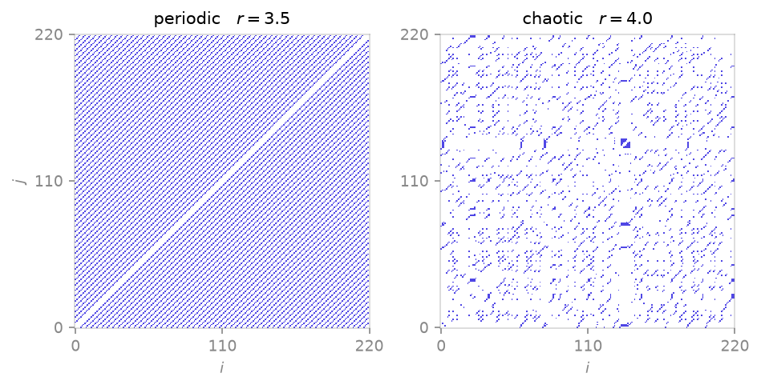

<span class="ts-kicker">Analysis · 07</span>

# Recurrence & RQA

A recurrence plot marks every pair of times $(i, j)$ at which a trajectory
returns close to a state it visited before — the geometric fingerprint of a
dynamical system (Eckmann, Kamphorst & Ruelle 1987). Recurrence
quantification analysis reduces that plot's line structure to scalar measures
of determinism, laminarity and predictability (Marwan, Romano, Thiel & Kurths
2007). TSDynamics builds the matrix sparsely with a `cKDTree` and runs the
quantifiers globally or in a sliding window.

<figure markdown>
{ loading=lazy }
<figcaption>At a fixed recurrence rate the logistic map's recurrence plot tells the regimes apart at a glance: a period-4 cycle (r = 3.5) recurs on clean, evenly spaced parallel diagonals, while deterministic chaos (r = 4.0) shatters them into a short-lined speckle.</figcaption>
</figure>

| Function | Returns | Gives you |
|---|---|---|
| [`recurrence_matrix`](#the-recurrence-matrix) | `RecurrenceMatrix` | the sparse plot $R_{ij}$ |
| [`rqa`](#quantification-rqa) | `RQAResult` | DET / LAM / L_max / ENTR / TT … |
| [`windowed_rqa`](#tracking-regime-change) | `WindowedRQA` | the same, vs. time |

## The recurrence matrix

`recurrence_matrix` returns $R_{ij} = 1$ when $\lVert x_i - x_j\rVert \le
\varepsilon$ and $0$ otherwise. The input may be a [`Trajectory`](integrate.md),
a 1-D series, or a multi-component phase-space array (rows are states).

```python
import tsdynamics as ts

traj = ts.Logistic(params={"r": 4.0}).iterate(steps=500, ic=[0.31])
rm = ts.recurrence_matrix(traj.y[:, 0], threshold=0.05)
rm.matrix          # scipy.sparse boolean R_ij  (shape (500, 500))
rm.epsilon         # the radius actually used → 0.05
```

The radius $\varepsilon$ is set one of two ways:

=== "Fixed radius"

    ```python
    rm = ts.recurrence_matrix(x, threshold=0.05)   # ε = 0.05 in state units
    ```

    A literal distance in the embedding's units — direct, but the resulting
    recurrence rate depends on the attractor's diameter.

=== "Target recurrence rate"

    ```python
    rm = ts.recurrence_matrix(x, recurrence_rate=0.05)  # pick ε for RR ≈ 5 %
    ```

    `recurrence_rate` chooses $\varepsilon$ from the empirical distance
    distribution so that the plot has the requested density — the comparable,
    scale-free choice when sweeping parameters or systems.

`metric` selects the norm (`"euclidean"` default, `"chebyshev"`, or a numeric
$p$ for Minkowski). `theiler_window=w` blanks the central $\pm w$ diagonals so
that temporally-correlated neighbours along the line of identity are not
mistaken for genuine recurrences (Theiler 1986); use `theiler_window=1` as a
sensible minimum for a sampled flow.

## Quantification: `rqa`

`rqa` builds the matrix (same `threshold` / `recurrence_rate` / `metric` /
`theiler_window` arguments) and reduces its **diagonal** and **vertical** line
distributions to the standard measures.

```python
x = ts.Logistic(params={"r": 4.0}).iterate(steps=2000, ic=[0.4]).y[:, 0]
res = ts.rqa(x, recurrence_rate=0.05, theiler_window=1)

res.determinism          # ≈ 0.652   fraction of points on diagonals ≥ 2
res.laminarity           # ≈ 0.175   fraction of points on verticals ≥ 2
res.max_diagonal_length  # 17        longest diagonal (excl. the LOI)
res.divergence           # ≈ 0.0588  = 1 / L_max
res.diagonal_entropy     # ≈ 1.358   Shannon entropy of diagonal lengths
res.trapping_time        # ≈ 2.929   mean vertical length
res.recurrence_rate      # ≈ 0.0496  density of R_ij
```

| Field | Symbol | Meaning |
|---|---|---|
| `recurrence_rate` | RR | density of recurrence points |
| `determinism` | DET | fraction of points forming diagonal lines (predictability) |
| `laminarity` | LAM | fraction forming vertical lines (intermittency / laminar phases) |
| `avg_diagonal_length` | L | mean diagonal length |
| `max_diagonal_length` | L_max | longest diagonal — inversely related to the largest exponent |
| `divergence` | DIV | $1/\mathrm{L}_{\max}$ |
| `diagonal_entropy` | ENTR | Shannon entropy of the diagonal-length histogram |
| `trapping_time` | TT | mean vertical length |
| `max_vertical_length` | V_max | longest vertical |

`min_diagonal` / `min_vertical` set the shortest line counted as a line
(default $2$). The raw histograms survive on `res.diagonal_lengths` /
`res.vertical_lengths` if you want to fit them yourself.

!!! note "DET separates order from chaos"
    A periodic orbit recurs on perfectly parallel diagonals, so $\mathrm{DET}
    = 1$; deterministic chaos breaks them up. Verified here: the logistic
    map at $r = 3.2$ (a period-2 cycle) gives $\mathrm{DET} = 1.0$, while the
    fully chaotic $r = 4$ gives $\mathrm{DET} \approx 0.65$ — squarely in the
    band Trulla, Giuliani, Zbilut & Webber (1996) report for that map.

## Tracking regime change

`windowed_rqa` slides a window of `window` samples (advancing by `step`, default
= `window`) and runs `rqa` in each — so each measure becomes a time series that
steps up or down as the dynamics cross between periodic and chaotic regimes.

```python
x = ts.Logistic(params={"r": 4.0}).iterate(steps=3000, ic=[0.4]).y[:, 0]
wr = ts.windowed_rqa(x, window=400, step=200,
                     recurrence_rate=0.05, theiler_window=1)

wr.centers                              # window mid-points (time axis)
det = [r.determinism for r in wr.results]   # DET(t)
```

`wr.results` is a tuple of `RQAResult`, one per window, aligned to
`wr.centers`. Plot any field against `wr.centers` to localise a transition: a
window sitting in a periodic regime jumps toward $\mathrm{DET} \to 1$, a
chaotic one drops back, so the curve marks where the system switches.

!!! warning "Pick `window` to span the dynamics"
    The window must be long enough to contain several recurrences yet short
    enough to be stationary. Too short and the line statistics are noisy; too
    long and a transition is smeared across windows. Choose it from the
    system's characteristic period, and keep `recurrence_rate` fixed across
    windows so the measures are comparable.

## See also

- [Lyapunov spectra](lyapunov.md) — $1/\mathrm{L}_{\max}$ tracks the largest exponent
- [Surrogates & nonlinearity tests](surrogate.md) — test whether the recurrence structure is genuine
- [Embedding](embedding.md) — reconstruct a phase space before building the plot

## References

- Eckmann, Kamphorst & Ruelle (1987), *Europhys. Lett.* **4**, 973.
- Theiler (1986), *Phys. Rev. A* **34**, 2427.
- Trulla, Giuliani, Zbilut & Webber (1996), *Phys. Lett. A* **223**, 255.
- Marwan, Romano, Thiel & Kurths (2007), *Phys. Rep.* **438**, 237.
