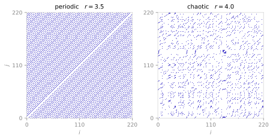

<span class="ts-kicker">Analysis · Recurrence & RQA</span>

# Recurrence & RQA

Almost every structural question you can ask of a trajectory — is it periodic,
chaotic, intermittent, drifting between regimes? — is written into one simple
object: the times at which the orbit comes back close to where it has been.
A **recurrence plot** marks every pair of times $(i, j)$ at which the state
returns near a state it visited before (Eckmann, Kamphorst & Ruelle 1987), and
**recurrence quantification analysis** (RQA) reduces that plot's line structure
to scalar measures of determinism, laminarity, and predictability (Marwan,
Romano, Thiel & Kurths 2007). TSDynamics builds the matrix sparsely with a
`cKDTree`, quantifies it in one vectorised pass, and runs the same measures in a
sliding window to localise transitions in time.

| Function | Returns | Gives you |
|---|---|---|
| [`recurrence_matrix`](#the-recurrence-matrix) | `RecurrenceMatrix` | the sparse plot $R_{ij}$ |
| [`rqa`](#quantification-rqa) | `RQAResult` | DET / LAM / L_max / ENTR / TT / DIV … |
| [`windowed_rqa`](#tracking-regime-change) | `WindowedRQA` | the same measures, versus time |

## The recurrence matrix

`recurrence_matrix` returns the binary matrix

$$
R_{ij} \;=\; \Theta\!\big(\varepsilon - \lVert x_i - x_j\rVert\big),
$$

i.e. $R_{ij} = 1$ when state $x_j$ lies within a distance $\varepsilon$ of
$x_i$, and $0$ otherwise. The input may be a [`Trajectory`](index.md), a raw 1-D
series, or a multi-component phase-space array (rows are states); for a scalar
measurement, [embed it first](embedding.md) so recurrence is judged in a
reconstructed phase space.

<div class="ts-ref" markdown>

<div class="ts-item" markdown>

```python
import tsdynamics as ts

traj = ts.systems.Logistic(params={"r": 4.0}).iterate(steps=500, ic=[0.31])
rm = ts.recurrence_matrix(traj.y[:, 0], threshold=0.05)

rm.epsilon           # 0.05     — the radius actually used
rm.size              # 500      — N states (the matrix is N x N)
rm.recurrence_rate   # ≈ 0.108  — density of recurrent pairs
rm.matrix            # scipy.sparse boolean R_ij, shape (500, 500)
```

The plot tells periodic from chaotic at a glance. A periodic orbit recurs on
long, clean, evenly spaced diagonals; deterministic chaos shatters them into a
short-lined speckle — the visible signature the RQA measures below make
numeric.

</div>
<figure class="ts-fig" markdown>
{ loading=lazy }
<figcaption>At a matched recurrence rate the logistic map's recurrence plot separates the regimes: a period-4 cycle ($r = 3.5$) recurs on clean parallel diagonals, while deterministic chaos ($r = 4.0$) breaks them into a short-lined speckle.</figcaption>
</figure>

</div>

The radius $\varepsilon$ is set one of two mutually-exclusive ways — pass
*exactly one* of `threshold=` or `recurrence_rate=`:

=== "Fixed radius"

    ```python
    rm = ts.recurrence_matrix(x, threshold=0.05)   # ε = 0.05 in state units
    ```

    A literal distance in the embedding's own units — direct, but the resulting
    recurrence rate then depends on the attractor's diameter, so it is *not*
    comparable across systems of different scale.

=== "Target recurrence rate"

    ```python
    rm = ts.recurrence_matrix(x, recurrence_rate=0.05)   # pick ε so RR ≈ 5 %
    ```

    `recurrence_rate` chooses $\varepsilon$ from the empirical distribution of
    pairwise distances so the plot has the requested density. This is the
    scale-free, comparable choice — always prefer it when sweeping parameters or
    comparing systems, so that differences in the *structure* are not confounded
    with differences in the *density*.

`metric` selects the norm — `"euclidean"` (default), `"manhattan"`,
`"chebyshev"` (the maximum norm, the traditional RQA choice), or a numeric $p$
for a general Minkowski distance. `theiler=w` blanks the central $\pm w$
diagonals so that temporally-correlated neighbours along the line of identity
are not mistaken for genuine recurrences (Theiler 1986); the default `theiler=0`
already drops the line of identity itself, and `theiler=1` is a sensible minimum
for a densely sampled flow.

!!! note "The matrix is stored sparse"
    The recurrent pairs are found with a k-d tree range search
    (`cKDTree.query_pairs`), so a long series never materialises the dense
    $N \times N$ array. `rm.recurrence_rate` reads the stored density directly;
    call `rm.toarray()` only when you genuinely need the dense boolean image.

## Quantification: `rqa`

`rqa` reduces a recurrence matrix to the standard scalar measures of its
**diagonal** and **vertical** line structure. Diagonal lines mark stretches
where two trajectory segments evolve in parallel — the signature of
*deterministic* dynamics; vertical lines mark states the system is trapped near
for a while — the signature of *laminar* / intermittent phases. You can pass the
same input as `recurrence_matrix` (a series or trajectory, with the same
`threshold` / `recurrence_rate` / `metric` / `theiler` arguments) or a prebuilt
`RecurrenceMatrix`.

```python
x = ts.systems.Logistic(params={"r": 4.0}).iterate(steps=2000, ic=[0.4]).y[:, 0]
res = ts.rqa(x, recurrence_rate=0.05, theiler=1)

res.recurrence_rate      # ≈ 0.0496   RR — realised matrix density
res.determinism          # ≈ 0.652    DET — fraction of points on diagonals ≥ 2
res.laminarity           # ≈ 0.175    LAM — fraction of points on verticals ≥ 2
res.max_diagonal_length  # 17         L_max — longest diagonal (excl. the LOI)
res.divergence           # ≈ 0.0588   DIV = 1 / L_max
res.diagonal_entropy     # ≈ 1.358    ENTR — Shannon entropy of diagonal lengths
res.trapping_time        # ≈ 2.929    TT — mean vertical length
```

| Field | Symbol | Meaning |
|---|---|---|
| `recurrence_rate` | RR | density of recurrence points |
| `determinism` | DET | fraction of points forming diagonal lines — predictability |
| `laminarity` | LAM | fraction forming vertical lines — intermittency / laminar phases |
| `avg_diagonal_length` | L | mean diagonal length |
| `max_diagonal_length` | L_max | longest diagonal — inversely related to the largest exponent |
| `divergence` | DIV | $1/\mathrm{L}_{\max}$ |
| `diagonal_entropy` | ENTR | Shannon entropy (nats) of the diagonal-length histogram |
| `trapping_time` | TT | mean vertical length |
| `max_vertical_length` | V_max | longest vertical |

`min_diagonal` / `min_vertical` set the shortest run counted as a line (default
$2$) for the ratio and mean measures (DET / LAM / L / TT / ENTR); the maxima
`L_max` / `V_max` are always the longest line in the *unfiltered* histogram
(Marwan et al. 2007), and `DIV = 1 / L_max`. The raw run-length histograms
survive on `res.diagonal_lengths` / `res.vertical_lengths` if you want to fit
them yourself.

!!! note "DET separates order from chaos"
    A periodic orbit recurs on perfectly parallel diagonals, so
    $\mathrm{DET} = 1$; deterministic chaos breaks them up. Verified here: the
    logistic map at $r = 3.2$ (a period-2 cycle) gives $\mathrm{DET} = 1.0$ and
    $\mathrm{LAM} = 0.0$, while the fully chaotic $r = 4$ gives
    $\mathrm{DET} \approx 0.65$ — squarely in the band Trulla, Giuliani, Zbilut
    & Webber (1996) report for that map.

## Tracking regime change

The whole point of RQA is that it is *local*. `windowed_rqa` slides a window of
`window` samples (advancing by `step`, default `= window` for non-overlapping
windows) and runs `rqa` in each — so every measure becomes a time series that
steps up or down as the dynamics cross between regimes. Each scalar RQA field is
exposed as a per-window array aligned to `wr.centers` (the window-centre sample
indices).

```python
import numpy as np

# a series that is periodic for its first half, then switches to chaos
periodic = ts.systems.Logistic(params={"r": 3.5}).trajectory(1500, transient=500, ic=[0.2]).y[:, 0]
chaotic  = ts.systems.Logistic(params={"r": 4.0}).trajectory(1500, transient=500, ic=[0.4]).y[:, 0]
x = np.concatenate([periodic, chaotic])          # the switch is at sample 1500

wr = ts.windowed_rqa(x, window=300, step=150, recurrence_rate=0.05, theiler=1)

wr.centers        # window mid-points (the time axis)
wr.determinism    # DET(t): 1.0 through the periodic half, ≈ 0.65 in the chaotic half
```

`wr.determinism` — or any measure by name, `wr.measure("laminarity")` — reads
$1.0$ across every window inside the periodic segment and drops to
$\approx 0.65$ the moment the window enters the chaotic segment, pinning the
transition to the window straddling sample $1500$. `wr.results` is the tuple of
per-window `RQAResult` objects if you need every field at once.

!!! warning "Choose `window` to span the dynamics"
    The window must be long enough to contain several recurrences yet short
    enough to be locally stationary. Too short and the line statistics are
    noisy; too long and a transition smears across windows. Size it from the
    system's characteristic period, and keep `recurrence_rate` fixed across
    windows so the measures stay comparable (the threshold is re-derived per
    window, so structure — not density — is what changes).

## See also

- [Lyapunov spectra](lyapunov.md) — $\mathrm{DIV} = 1/\mathrm{L}_{\max}$ tracks the largest exponent
- [Chaos indicators](chaos.md) — GALI, the 0–1 test, and expansion entropy: complementary chaos verdicts
- [Delay embedding](embedding.md) — reconstruct a phase space before building the plot

## References

- J.-P. Eckmann, S. O. Kamphorst and D. Ruelle, "Recurrence plots of dynamical systems", *Europhys. Lett.* **4**, 973 (1987).
- J. Theiler, "Spurious dimension from correlation algorithms applied to limited time-series data", *Phys. Rev. A* **34**, 2427 (1986).
- J. P. Zbilut and C. L. Webber, "Embeddings and delays as derived from quantification of recurrence plots", *Phys. Lett. A* **171**, 199 (1992).
- L. L. Trulla, A. Giuliani, J. P. Zbilut and C. L. Webber, "Recurrence quantification analysis of the logistic equation with transients", *Phys. Lett. A* **223**, 255 (1996).
- N. Marwan, M. C. Romano, M. Thiel and J. Kurths, "Recurrence plots for the analysis of complex systems", *Phys. Rep.* **438**, 237 (2007).
