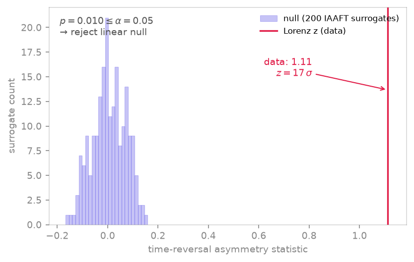

<span class="ts-kicker">Analysis · 11</span>

# Surrogates & nonlinearity tests

The surrogate-data method asks a sharp question: *can the structure in this
series be explained by a linear stochastic process?* You generate an ensemble
of **surrogates** that reproduce the chosen linear properties of the data —
its amplitude distribution and/or power spectrum — but are otherwise random,
compute a discriminating statistic on the data and on each surrogate, and
reject the linear null when the data sits in the tail of the surrogate
distribution (Theiler, Eubank, Longtin, Galdrikian & Farmer 1992).

<figure markdown>
{ loading=lazy }
<figcaption>A surrogate-data test of the Lorenz z-component: the time-reversal asymmetry statistic on the data (rose) sits 17σ outside the null distribution of 200 IAAFT surrogates (indigo), so the linear-stochastic null is rejected at p ≈ 0.01.</figcaption>
</figure>

| Function | Builds / does | Preserves |
|---|---|---|
| [`random_shuffle`](#generators) | permutation of the samples | amplitude distribution only |
| [`fourier_surrogate`](#generators) | randomised Fourier phases | power spectrum (linear autocorrelation) |
| [`aaft_surrogate`](#generators) | amplitude-adjusted FT | distribution **and** spectrum |
| [`iaaft_surrogate`](#generators) | iterative AAFT | distribution + spectrum, refined |
| [`surrogate_test`](#the-test) | ensemble test → `SurrogateTest` | rank-based $p$ and $z$ |

## The test

`surrogate_test` is the one-call entry point: it draws the surrogates, scores
the data against them with a nonlinearity-sensitive `statistic`, and returns a
[`SurrogateTest`](#the-result-record) carrying a rank-based $p$-value, a
$z$-score, and the boolean verdict `rejected` (true when $p \le$ `alpha`).

```python
import numpy as np
import tsdynamics as ts

# logistic r = 4 — a deterministic, strongly nonlinear map
x = ts.Logistic(params={"r": 4.0}).trajectory(2000, transient=500, ic=[0.1]).y[:, 0]

res = ts.surrogate_test(x, statistic="prediction_error", n=39, seed=1)
res.p_value, res.rejected     # ≈ 0.025, True   → linear null rejected
res.z_score                   # ≈ -101  (data far more predictable than surrogates)
```

The surrogate count defaults to `n=39`, which follows Theiler's rule
$N = 2/\alpha - 1$ for a one-sided test at $\alpha = 0.05$ — the smallest
ensemble whose extreme rank gives an exact nominal level. `method=` selects the
generator (`"iaaft"` default), `tail="auto"` picks the rejection side from the
statistic, and `seed=` fixes the surrogate draw for reproducibility.

The complement — a *linear* process should pass:

```python
rng = np.random.default_rng(0)
ar = np.zeros(2000)
for i in range(1, 2000):                       # AR(1), φ = 0.5 — linear Gaussian
    ar[i] = 0.5 * ar[i - 1] + rng.standard_normal()

ts.surrogate_test(ar, statistic="time_reversal", n=39, seed=1).rejected   # False
```

Over many seeds the AR(1) false-positive rate sits at the nominal $\alpha$
(≈ 0.05) — exactly what an honest test should deliver on linear data.

## Generators

Each generator returns an array of shape `(n, N)` — `n` surrogates of the
length-`N` input — and is fully seed-reproducible. They differ in *which*
linear fingerprint they preserve:

```python
ts.iaaft_surrogate(x, n=5, seed=1).shape       # (5, 2000)
ts.fourier_surrogate(x, n=39, seed=1)          # phase-randomised, spectrum kept
ts.random_shuffle(x, n=39, seed=1)             # only the value histogram kept
```

- **`random_shuffle`** destroys all temporal order, keeping just the amplitude
  histogram — the null of an i.i.d. process.
- **`fourier_surrogate`** randomises the Fourier phases, so the power spectrum
  (hence the linear autocorrelation) is preserved exactly while any phase
  coupling is erased.
- **`aaft_surrogate`** / **`iaaft_surrogate`** preserve **both** the amplitude
  distribution and the spectrum; the iterative variant alternately rescales in
  the spectral and amplitude domains to fix the small bias AAFT leaves behind
  (Schreiber & Schmitz 1996), and is the recommended default.

You rarely call these directly — `surrogate_test(..., method=...)` does — but
they are public for building bespoke tests or diagnostics.

## Statistics

The discriminating statistic must be sensitive to nonlinearity yet blind to the
preserved linear structure; both shipped choices are:

```python
ts.time_reversal_asymmetry(x)              # ≈ -0.724 for logistic r=4
ts.nonlinear_prediction_error(x, m=3, tau=1, horizon=1, n_neighbors=4)
```

- **`time_reversal_asymmetry`** — the dimensionless third-moment ratio of the
  lagged increments,
  $\langle (x_{t} - x_{t-\text{lag}})^3 \rangle / \langle (x_{t} - x_{t-\text{lag}})^2 \rangle^{3/2}$,
  which changes sign under time reversal. Nonzero asymmetry is a hallmark of
  nonlinearity; Gaussian linear processes are time-symmetric.
- **`nonlinear_prediction_error`** — the out-of-sample error of a
  locally-constant predictor in a delay embedding. Deterministic data is far
  more predictable than its phase-randomised surrogates, so this is the
  `tail="less"` statistic (`surrogate_test` infers that automatically).

!!! note "Pick the discriminating observable"
    A multivariate series is reduced to one channel (`component=`, default the
    highest-variance one). The right observable matters: for the Lorenz system
    the $x$ and $y$ components are nearly time-symmetric, so a time-reversal test
    rejects only weakly there — the **$z$ component** is the discriminating
    observable and rejects the linear null on 10/10 seeds (an expected value
    from the validation suite).

## The result record

```python
res = ts.surrogate_test(x, n=39, seed=1)
res.data_statistic          # statistic on the data
res.surrogate_statistics    # array of the n surrogate statistics
res.p_value, res.z_score    # rank-based p; (data − mean)/std in σ units
res.rejected                # p_value <= alpha
res.statistic, res.method, res.tail, res.alpha, res.n_surrogates
```

!!! warning "A surrogate test never proves nonlinearity"
    Rejecting the linear null only says the chosen surrogates' linear properties
    cannot account for the statistic — it does not identify *which* nonlinearity,
    nor rule out non-stationarity or a poorly matched null. Match the generator
    to the property you want to control for, and report the statistic and method
    alongside the verdict.

## See also

- [Recurrence & RQA](recurrence.md) — another route to detecting determinism
- [Delay embedding](embedding.md) — the reconstruction the prediction statistic uses
- [Lyapunov spectra](lyapunov.md) — quantify chaos once nonlinearity is established
