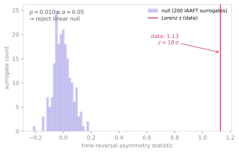

<span class="ts-kicker">Analysis · Surrogates</span>

# Surrogates & nonlinearity tests

Before you fit a Lyapunov exponent or a fractal dimension to a measured series,
there is a prior question worth answering: *can the structure in this series be
explained by a linear stochastic process?* If a linear Gaussian model (possibly
seen through a static nonlinear measurement) already accounts for everything you
observe, the fancy nonlinear quantifiers are measuring noise. The **surrogate-
data method** turns that into a hypothesis test: generate an ensemble of
**surrogates** that reproduce the chosen *linear* properties of the data — its
amplitude distribution and/or its power spectrum — but are otherwise random,
compute a discriminating statistic on the data and on each surrogate, and reject
the linear null when the data sits in the tail of the surrogate distribution
(Theiler, Eubank, Longtin, Galdrikian & Farmer 1992).

| Function | Builds / does | Preserves |
|---|---|---|
| [`random_shuffle`](#generators) | a random permutation of the samples | amplitude distribution only |
| [`fourier_surrogate`](#generators) | randomised Fourier phases | power spectrum (linear autocorrelation) |
| [`aaft_surrogate`](#generators) | amplitude-adjusted FT | distribution **and** spectrum |
| [`iaaft_surrogate`](#generators) | iterative AAFT | distribution + spectrum, refined |
| [`surrogate_test`](#the-test) | the ensemble test → `SurrogateTest` | rank-based $p$ and a $z$-score |

## The test

`surrogate_test` is the one-call entry point: it draws the surrogates, scores
the data against them with a nonlinearity-sensitive `statistic`, and returns a
[`SurrogateTest`](#the-result-record) carrying a rank-based $p$-value, a
$z$-score (the data statistic's distance from the null mean, in surrogate
standard deviations), and the boolean verdict `rejected` (true when
$p \le$ `alpha`).

<div class="ts-ref" markdown>

<div class="ts-item" markdown>

```python
import tsdynamics as ts

# Lorenz z — the discriminating observable for a time-reversal test
z = ts.Lorenz().trajectory(final_time=150.0, dt=0.05, transient=20.0,
                           ic=[1.0, 1.0, 1.0])["z"]

res = ts.surrogate_test(z, statistic="time_reversal",
                        method="iaaft", n=200, seed=0)

res.data_statistic   # ≈ 1.13   asymmetry of the real data
res.p_value          # ≈ 0.01   as extreme as the ensemble allows
res.z_score          # ≈ 18.6   sigmas above the null mean
res.rejected         # True     → linear-stochastic null rejected
```

A dissipative chaotic flow is strongly time-irreversible, whereas every
linear-Gaussian null (and any static nonlinear rescaling of one) is
time-symmetric — so the data statistic lands far outside the surrogate
histogram, and the null is rejected.

</div>
<figure class="ts-fig" markdown>
{ loading=lazy }
<figcaption>A surrogate test of the Lorenz $z$-component: the time-reversal-asymmetry statistic on the data (rose) sits $\approx 18.6\,\sigma$ outside the null distribution of 200 IAAFT surrogates (indigo), so the linear-stochastic null is rejected at $p \approx 0.01$.</figcaption>
</figure>

</div>

The surrogate count defaults to `n=39`, which follows Theiler's rule
$M = 2/\alpha - 1$ for a two-sided test at $\alpha = 0.05$ — the smallest
ensemble whose most-extreme attainable rank gives an *exact* nominal level.
Raising `n` (200 in the figure) sharpens the null histogram and lowers the
smallest reachable $p$. `method=` selects the generator (`"iaaft"` default),
`tail="auto"` picks the rejection side from the statistic, and `seed=` fixes the
surrogate draw so the whole test is reproducible.

The complement is just as important — a genuinely *linear* process should
**pass** the test:

```python
import numpy as np

rng = np.random.default_rng(0)
ar = np.zeros(2000)
for i in range(1, 2000):                       # AR(1), φ = 0.5 — linear Gaussian
    ar[i] = 0.5 * ar[i - 1] + rng.standard_normal()

ts.surrogate_test(ar, statistic="time_reversal", n=39, seed=1).rejected   # False
```

Over many seeds the AR(1) false-positive rate sits at the nominal $\alpha$
(≈ 0.05) — exactly what an honest test must deliver on data that really is
linear. A test that "rejects everything" is not detecting nonlinearity; it is
broken.

## Generators

Each generator returns an array of shape `(n, N)` — `n` surrogates of the
length-`N` input — and is fully seed-reproducible. They differ in *which* linear
fingerprint they preserve, and therefore in *which* null they realise:

```python
x = ts.systems.Logistic(params={"r": 4.0}).trajectory(2000, transient=500, ic=[0.1]).y[:, 0]

ts.iaaft_surrogate(x, n=5, seed=1).shape       # (5, 2000)
ts.fourier_surrogate(x, n=39, seed=1)          # phase-randomised, spectrum kept
ts.random_shuffle(x, n=39, seed=1)             # only the value histogram kept
```

- **`random_shuffle`** — a random permutation of the samples. Keeps the
  amplitude histogram exactly and destroys every temporal correlation: the null
  of an i.i.d. process ("are successive samples even dependent?").
- **`fourier_surrogate`** — randomises the Fourier phases, so the magnitude (and
  hence power) spectrum and the linear autocorrelation are preserved exactly
  while any phase coupling is erased. The null of a stationary linear Gaussian
  process. Its amplitude distribution drifts toward Gaussian — use the AAFT
  family when the distribution must be kept too.
- **`aaft_surrogate`** / **`iaaft_surrogate`** — preserve **both** the amplitude
  distribution and the spectrum, realising the null of a static monotonic
  nonlinearity acting on a linear Gaussian process. The iterative variant
  alternately rescales in the spectral and amplitude domains to remove the small
  spectral bias plain AAFT leaves behind (Schreiber & Schmitz 1996), and is the
  recommended default.

You rarely call these directly — `surrogate_test(..., method=...)` does — but
they are public, and `ts.surrogates(x, method, n, seed=...)` is the by-name
dispatcher (returning a `SurrogateEnsemble` that behaves as the `(n, N)` array)
for building bespoke tests or diagnostics.

## Statistics

The discriminating statistic must be sensitive to nonlinearity yet blind to the
linear structure the surrogates preserve — otherwise it would flag the
surrogates too. Both shipped choices meet that bar:

```python
ts.time_reversal_asymmetry(x)              # ≈ -0.724 for logistic r = 4
ts.nonlinear_prediction_error(x, dimension=3, delay=1, horizon=1, n_neighbors=4)
```

- **`time_reversal_asymmetry`** — the dimensionless third-moment ratio of the
  lagged increments,

  $$
  T_\text{rev} \;=\; \frac{\langle (x_{t} - x_{t-\ell})^3 \rangle}
                          {\langle (x_{t} - x_{t-\ell})^2 \rangle^{3/2}},
  $$

  which changes sign under time reversal and is therefore zero in expectation
  for any time-reversible process — every linear Gaussian process and every
  static monotonic transform of one. Nonzero asymmetry is a hallmark of
  nonlinearity; it is a cheap, robust default (Schreiber & Schmitz 1996; Diks et
  al. 1995).
- **`nonlinear_prediction_error`** — the out-of-sample error of a
  locally-constant predictor in a delay embedding (Sugihara & May 1990; Kantz &
  Schreiber 2004), normalised so an unpredictable series scores $\approx 1$.
  Deterministic data is *more* predictable than its phase-randomised surrogates,
  so this is the one-sided `tail="less"` statistic — `surrogate_test` infers that
  automatically:

  ```python
  x = ts.systems.Logistic(params={"r": 4.0}).trajectory(2000, transient=500, ic=[0.1]).y[:, 0]
  res = ts.surrogate_test(x, statistic="prediction_error", n=39, seed=1)
  res.p_value, res.rejected     # ≈ 0.025, True   → linear null rejected
  res.z_score                   # ≈ -101  (data far more predictable than surrogates)
  ```

!!! note "Pick the discriminating observable"
    A multivariate series is reduced to one channel (`component=`, default the
    highest-variance one). The right observable matters. For the Lorenz system
    the $x$ and $y$ components are nearly time-symmetric, so a time-reversal test
    on them rejects only weakly (0/10 and 2/10 seeds in the validation suite) —
    the **$z$ component** is the discriminating observable and rejects the linear
    null on 10/10 seeds. Choose the observable that the nonlinearity actually
    lives in.

## The result record

```python
res = ts.surrogate_test(z, n=39, seed=1)
res.data_statistic          # statistic on the data
res.surrogate_statistics    # array of the n surrogate statistics (the null)
res.p_value, res.z_score    # rank-based p; (data − mean)/std in σ units
res.rejected                # p_value <= alpha
res.statistic, res.method, res.tail, res.alpha, res.n_surrogates
```

`SurrogateTest` is an [`AnalysisResult`](index.md), so it carries `.meta`,
`.summary()`, `.to_dict()`, and a `.plot` seam that renders the null histogram
with the data value marked and the rejection tail shaded.

!!! warning "A surrogate test never proves nonlinearity"
    Rejecting the linear null only says the chosen surrogates' linear properties
    cannot account for the statistic — it does not identify *which* nonlinearity,
    nor rule out non-stationarity or a poorly matched null. Match the generator
    to the property you want to control for, prefer IAAFT when the distribution
    is non-Gaussian, and always report the statistic and method alongside the
    verdict.

## See also

- [Recurrence & RQA](recurrence.md) — a complementary, geometry-based route to detecting determinism
- [Delay embedding](embedding.md) — the reconstruction the prediction-error statistic uses
- [Chaos indicators](chaos.md) — the 0–1 test is another single-observable determinism check
- [Lyapunov spectra](lyapunov.md) — quantify the chaos once nonlinearity is established

## References

- J. Theiler, S. Eubank, A. Longtin, B. Galdrikian and J. D. Farmer, "Testing for nonlinearity in time series: the method of surrogate data", *Physica D* **58**, 77 (1992).
- T. Schreiber and A. Schmitz, "Improved surrogate data for nonlinearity tests", *Phys. Rev. Lett.* **77**, 635 (1996).
- C. Diks, J. C. van Houwelingen, F. Takens and J. DeGoede, "Reversibility as a criterion for discriminating time series", *Phys. Lett. A* **201**, 221 (1995).
- G. Sugihara and R. M. May, "Nonlinear forecasting as a way of distinguishing chaos from measurement error in time series", *Nature* **344**, 734 (1990).
- H. Kantz and T. Schreiber, *Nonlinear Time Series Analysis*, 2nd ed., Cambridge University Press (2004).
