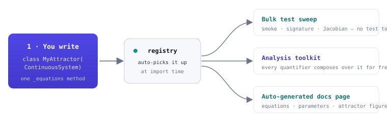

<span class="ts-kicker">Project · Adding a system</span>

# Adding a system

Adding a system to the catalogue is a **one-class** contribution. You write the
math as a symbolic method; the [registry](../references/index.md) picks the class
up at import, the bulk test suite sweeps it, and the docs build generates its
page — all for free.

<figure markdown>
{ loading=lazy }
<figcaption>One class, three things for free. The registry is the pivot: a concrete family subclass auto-registers at class-definition time, and the test sweep, the whole analysis toolkit, and the docs generator all iterate over it.</figcaption>
</figure>

This page is the contributor's recipe. For a gentler, worked introduction to
the family contracts, read [Defining systems](../start/defining-systems.md)
first; this page is the checklist you follow to land a *catalogue* system.

## The three steps

1. **Write the class** in the right module under
   `src/tsdynamics/systems/continuous/` or `.../discrete/`, following the family
   contract below. Add the class name to the module's `__all__`.
2. **Add it to the category `__all__`** —
   `src/tsdynamics/systems/continuous/__init__.py` or `.../discrete/__init__.py`.
   (`systems/__init__.py` flat-re-exports it automatically, so
   `ts.systems.MyAttractor` and the lazy `ts.MyAttractor` both resolve.) A
   registry consistency test fails loudly if you forget this step.
3. **That's it.** The registry sweeps it into the bulk tests, and the docs build
   generates its page — equations, parameter table, `reference`, and a cached
   phase portrait — on the next build.

## The family contracts

Every system subclasses one of the four family bases and holds its dynamics in
one symbolic method. Use **only** symbolic operations — `symengine.sin`, `cos`,
`exp`, `+`, `*`, `**`, `abs`, `sign`, `min`, `max`. **No** NumPy, **no** `math`,
**no** Python control flow over the state; the engine lowers the method to an IR
tape, which cannot capture a `numpy` ufunc or an `if` on a state value.

=== "ODE — `ContinuousSystem`"

    ```python
    from symengine import sin, cos
    import tsdynamics as ts

    class MyAttractor(ts.ContinuousSystem):
        """Short one-liner describing the system."""

        params = {"a": 1.0, "b": 2.0, "c": 3.0}
        dim = 3

        @staticmethod
        def _equations(y, t, *, a, b, c):      # params are KEYWORD-only, matching keys
            x, yv, z = y(0), y(1), y(2)
            return (
                a * (yv - x),
                x * (b - z) - yv,
                x * yv - c * z,
            )
    ```

    `y(i)` reads component `i` of the state; return exactly `dim` expressions.
    `t` is the time symbol (autonomous systems ignore it). The Jacobian is
    generated automatically by symbolic differentiation — you never write one
    (a hand-written `_jacobian` is only cross-checked in tests, never used at
    runtime).

=== "DDE — `DelaySystem`"

    ```python
    import tsdynamics as ts

    class MyDDE(ts.DelaySystem):
        params = {"beta": 2.0, "gamma": 1.0, "n": 9.65, "tau": 2.0}
        dim = 1
        _delay_params = ("tau",)               # default; override for non-"tau" names

        @staticmethod
        def _equations(y, t, beta, gamma, n, tau):   # params POSITIONAL for DDEs
            yd = y(0, t - tau)                        # the delayed accessor
            return [beta * yd / (1 + yd**n) - gamma * y(0)]
    ```

    `y(i, t - tau)` reads the delayed state. A *delay* value is a structural
    quantity and is baked into the engine tape, so sweeping it re-lowers. List
    every delay parameter's name in `_delay_params` if it is not called `tau`.

=== "Map — `DiscreteMap`"

    ```python
    import tsdynamics as ts

    class MyMap(ts.DiscreteMap):
        params = {"a": 1.4, "b": 0.3}
        dim = 2

        @staticmethod
        def _step(X, a, b):                    # ⚠ params arrive POSITIONALLY, in params order
            x, y = X
            return (1 - a * x**2 + y, b * x)

        @staticmethod
        def _jacobian(X, a, b):
            x, y = X
            return ((-2 * a * x, 1.0), (b, 0.0))
    ```

    Maps take the whole state vector `X` and their parameters **positionally**,
    in `params`-dict insertion order — the engine feeds them positionally when it
    lowers `_step`. `__init_subclass__` validates the signature order against
    `params` **at import**, raising `TypeError` on a mismatch. Maps do provide an
    analytic `_jacobian` (used for stability and Lyapunov exponents).

=== "SDE — `StochasticSystem`"

    ```python
    import tsdynamics as ts

    class MyOU(ts.StochasticSystem):
        """Ornstein–Uhlenbeck: dX = θ(μ − X) dt + σ dW."""

        params = {"theta": 1.0, "mu": 0.0, "sigma": 0.3}
        dim = 1

        @staticmethod
        def _drift(y, t, *, theta, mu, sigma):        # like _equations
            return (theta * (mu - y(0)),)

        @staticmethod
        def _diffusion(y, t, *, theta, mu, sigma):    # one coefficient per component
            return (sigma,)
    ```

    A `StochasticSystem` is a **diagonal-Itô** SDE $dX_k = f_k\,dt + g_k\,dW_k$
    with independent Wiener increments. Both `_drift` and `_diffusion` are
    symbolic and keyword-only; `_diffusion` returns one coefficient per
    component. `_drift` is the marker that makes the class a concrete `sde` in
    the registry.

## It really is that easy — a from-scratch run

Because the same contract drives everything, a class you define outside the
package is a full citizen the moment it is imported. Pin an initial condition
(and a `seed` for the SDE) so the numbers are reproducible:

```python
import numpy as np
import tsdynamics as ts

class MyAttractor(ts.ContinuousSystem):
    params = {"a": 0.2, "b": 0.2, "c": 5.7}
    dim = 3
    variables = ("x", "y", "z")

    @staticmethod
    def _equations(y, t, *, a, b, c):
        x, yv, z = y(0), y(1), y(2)
        return (-yv - z, x + a * yv, b + z * (x - c))

traj = MyAttractor(ic=[1.0, 0.0, 0.0]).run(final_time=5.0, dt=0.05)
np.round(traj.y[-1], 3)                    # → [ 0.647, -1.605,  0.037]

exps = ts.analysis.lyapunov_spectrum(MyAttractor(ic=[1.0, 0.0, 0.0]))   # composes for free
```

A user-defined class registers as **non-builtin**
(`registry.get("MyAttractor").is_builtin` is `False`), so it stays out of the
built-in-only sweeps — but the whole [analysis toolkit](../analysis/index.md),
the [derived wrappers](../references/index.md), and plotting all work on it
exactly as on a catalogue system.

## Optional metadata that improves everything downstream

None of these are required, but each unlocks something:

```python
class MyAttractor(ts.ContinuousSystem):
    params = {"a": 0.2, "b": 0.2, "c": 5.7}
    dim = 3
    variables = ("x", "y", "z")                  # named traj["x"] + labelled figures
    reference = "Rössler (1976), Phys. Lett. A 57, 397-398"   # shown in the docs
    doi = "10.1016/0375-9601(76)90101-8"         # bare DOI for the reference
    default_ic = (1.0, 0.0, 0.0)                 # only if random ICs miss the basin
    known_lyapunov = {                           # opt in to the known-value tests
        "spectrum": (0.0714, 0.0, -5.39),
        "atol": (0.06, 0.06, 1.5),
        "kwargs": {"dt": 0.1, "transient": 100.0, "final_time": 500.0},
        "source": "Sprott (2003), Chaos and Time-Series Analysis",
    }
```

| ClassVar | What it does |
| -------- | ------------ |
| `variables` | Named component access (`traj["x"]`) and labelled axes on the auto-figure |
| `reference` | Literature citation, surfaced on the docs page and via `registry.get(...).reference` |
| `doi` | Bare DOI for the primary reference (used by the [bibliography](citation.md#citing-the-systems)) |
| `default_ic` | Fallback IC when a random `U[0,1)^dim` start escapes the basin |
| `known_lyapunov` | Enrolls the system in `test_known_values.py` — literature spectra checked continuously |
| `_structural_params` | For variable-dimension systems (see below) |
| `_default_method` | `"bdf"` for a system known to be stiff, so `integrate` defaults to the implicit kernel |
| `_field_shape` / `field_labels` | For a spatially-extended (PDE) system whose state is a flattened field |

### Variable-dimension systems

Anything whose `_equations` has a loop length or comprehension driven by a
parameter (Lorenz-96, Kuramoto–Sivashinsky, a coupled-oscillator chain) must
declare that parameter as **structural**, so it is baked into the engine tape:

```python
class Lorenz96(ts.ContinuousSystem):
    params = {"f": 8.0, "N": 20}
    _structural_params = frozenset({"N"})
```

Control parameters are read live from the system on every run, so they can
change at runtime with no re-lowering. A structural parameter changes the *shape*
of the tape, so changing it re-lowers (there is no on-disk cache — it just
re-lowers in-process).

## The extra line for DDEs and SDEs

The registry sweep is automatic, with two guard-enforced exceptions:

- **A new DDE** needs a non-equilibrium history in
  `tests/_sampling.py::DDE_HISTORIES` (a constant past sitting at a fixed point
  gives Lyapunov exponents $\approx 0$ and defeats the test). A guard test fails
  until you add one.
- **A new built-in SDE** needs a `{"seed": ..., "ic": ...}` entry in
  `tests/_sampling.py::SDE_SAMPLES`. A `sde`-family guard test enforces
  completeness.

## Common pitfalls

| Situation | What happens |
| --------- | ------------ |
| `_equations` uses `numpy` or `math` | The tape can't lower it — use `symengine.sin` / `cos` / … |
| Variable-dim system without `_structural_params` | Lowering-time `range(N)` fails — declare the dimension parameter structural |
| Map param order ≠ `_step` signature order | **`TypeError` at import** |
| Forgot the category `__all__` | A registry consistency test fails |
| New DDE with a fixed-point constant past | Lyapunov exponents $\approx 0$ — provide a non-equilibrium history |

!!! tip "PR checklist"
    - [ ] Class follows the family contract (symbolic ops only for flows;
          positional param order for maps).
    - [ ] Added to the module `__all__` **and** the category `__init__.py`
          `__all__`.
    - [ ] `variables` and `reference` (and `doi` if known) declared.
    - [ ] `make test` green locally (a new DDE / SDE also has its test-sampling
          entry).
    - [ ] PR title is a conventional commit (`feat: add …`).

## See also

- [Defining systems](../start/defining-systems.md) — the worked, tutorial-paced
  introduction to the family contracts.
- [Contributing](contributing.md) — the quality gates and PR flow this recipe
  lands into.
- [Adding a solver](adding-a-solver.md) — the other extension path: a new
  integration kernel for the engine.
