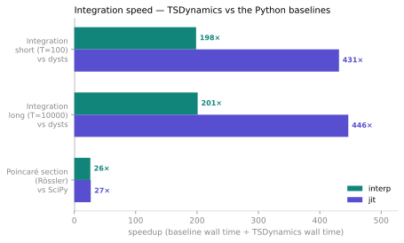
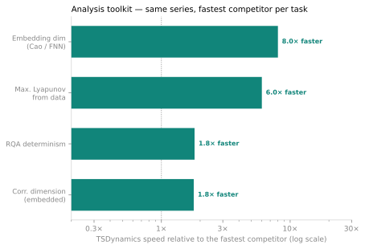

References · Benchmarks

# Benchmarks

A library is only as good as the numbers it produces and the time it takes to
produce them. This page is the honest, reproducible comparison of TSDynamics on
the classic integration and analysis tasks — the same tasks run through each
library's own code, timed the same way, on the same machine — against two
references: the **Python ecosystem** a user would actually reach for, and
**DynamicalSystems.jl**, the mature compiled-Julia stack that is the fastest
thing in the field.

The headline against Python is the integration engine: on the Lorenz system
TSDynamics' Rust backend produces the whole dense trajectory **~62× faster than
SciPy's `solve_ivp`** with the interpreter, **~134× faster** with the JIT, and
**~200–450× faster than dysts** — at the same accuracy. Against
DynamicalSystems.jl the story is different and, for a Python-facing library,
telling: on the tasks with substantial work — integration, the embedded
correlation dimension — it is within ~2× of Julia and often **as accurate or more
accurate**, tying the reference on the correlation dimension while being ~20× more
accurate and pinning the Hénon fixed point to the same machine precision. On the
tight map loops where Julia pulls further ahead, both libraries already finish in
microseconds to single-digit milliseconds — a gap no workflow feels.

<figure markdown>
{ loading=lazy }
<figcaption>Integration is TSDynamics' clear strength over Python. Bars are the recorded best-of-N wall-time ratios: the Rust engine (teal · <code>interp</code>, indigo · <code>jit</code>) integrates the Lorenz system in one dense call ~62–156× faster than SciPy and ~200–450× faster than dysts, and marches the Rössler Poincaré section ~26× faster than SciPy's event integrator.</figcaption>
</figure>

## Methodology

Every number on this page comes from a single full run of the cross-library
harness in the repository's `benchmarks/` folder. The methodology is designed to
be fair to every library and reproducible on any machine.

- **Best-of-N wall time.** Each task is timed $N$ times and the **minimum** is
  kept — the most reproducible estimator of intrinsic cost, since the machine can
  only ever *add* noise, never remove it. A warm-up call is made **before** timing,
  so one-time compilation (TSDynamics' tape lowering, numba's JIT, Julia's method
  compilation) is paid once and excluded from the measured time.
- **The library's own code, each task.** The integration tasks each use the
  library's *own* integrator — that is the entire point of an integration
  benchmark. The from-data analysis tasks feed **every** library the *same*
  generated time series (dumped once, independently of any benchmarked library),
  so the comparison measures the estimator, not the input.
- **Matched settings across libraries.** Where a task has a tunable that changes
  the work done — the Lyapunov renormalisation interval, the fixed-point search
  method — TSDynamics is run with the **same** setting as the reference it is
  compared against (e.g. the Julia `Δt=0.1` renorm step, the same $[-2,2]^2$ box
  and rigorous method for fixed points), so the comparison is apples-to-apples.
- **Process isolation.** Every library runs in its own subprocess and writes a
  JSON record the orchestrator merges. A crash, a slow library, or an import
  side-effect cannot take the rest of the suite down, and each library gets a
  clean interpreter.
- **Precision against a tight reference.** Where a task has a ground truth — a
  literature Lyapunov exponent, an analytic fixed point, a $10^{-13}$ reference
  trajectory — the table reports both the estimate and its deviation $\Delta$ from
  that reference.

### The environment

| | |
|---|---|
| **Platform** | Linux x86-64 (`glibc` 2.43) |
| **Python** | 3.12.12 |
| **TSDynamics** | 5.2.4 (`interp` + `jit` backends) |
| **DynamicalSystems.jl** | 3.6.8 (Julia 1.12) |
| **NumPy** | `< 2.5` (pinned — numba, and therefore pynamical/nolitsa, does not yet build on NumPy 2.5) |

!!! note "Reproduce it yourself"
    The harness, adapters, frozen inputs and rendered tables all live under
    `benchmarks/` in the source tree. It runs out of a **dedicated** virtual-env
    so it never perturbs the project's own — see `benchmarks/README.md` for the
    one-time setup and the `run_benchmarks.py` invocations. The numbers below are
    the committed output of one full run; re-running on your own hardware will
    shift the absolute times but not the relative story.

### The libraries compared

Each library contributes what it is designed for; a library that does not provide
a capability leaves that cell **blank**.

| Library | Version | What it contributes to the comparison |
|---|---|---|
| **TSDynamics** (`interp` + `jit`) | 5.2.4 | the library under test — every task, both engine backends |
| **DynamicalSystems.jl** | 3.6.8 | the compiled-Julia reference — integration, Lyapunov, bifurcation, Poincaré, fixed points, basins, correlation dimension |
| **SciPy** | 1.18.0 | the integration baseline (`solve_ivp`), fixed points (`fsolve`), Poincaré (events) |
| **dysts** | 0.96 | a chaotic-systems catalogue on a SciPy integrator; correlation dimension (`gp_dim`), DFA |
| **pynamical** | 0.3.3 | the logistic-map bifurcation diagram (numba) |
| **nolds** | — | from-data correlation dimension, Rosenstein Lyapunov, sample entropy, DFA, Hurst |
| **nolitsa** | — | from-data correlation dimension, MLE Lyapunov, FNN embedding dimension, IAAFT surrogates (numba) |
| **antropy** | 0.2.2 | sample / permutation entropy, DFA |
| **neurokit2** | 0.2.13 | broad from-data complexity — entropy, DFA, Hurst, correlation dim, RQA, embedding dim, surrogates |
| **pyunicorn** | 0.9.0 | recurrence quantification (RQA determinism) |

Two further libraries were evaluated but could not be run in this environment,
and are recorded here for completeness: **PyDSTool** (does not import on
NumPy ≥ 2 — the removed `numpy.distutils`) and **TISEAN** (legacy C/Fortran CLI
tools that do not build with the current toolchain).

## Integration speed

The core task. Integrate the Lorenz system with DOP853 at `rtol=atol=1e-9` and
return the trajectory. dysts and DynamicalSystems.jl join the integration rows;
the from-data-only Python libraries correctly leave these cells blank.

| Task | TSDynamics `interp` | TSDynamics `jit` | SciPy | dysts | DynamicalSystems.jl |
|---|---:|---:|---:|---:|---:|
| Integration — short ($T=100$) | **7.78 ms** | **3.58 ms** | 480.47 ms | 1.544 s | 1.72 ms |
| Integration — long ($T=10000$) | **780.08 ms** | **351.24 ms** | 54.921 s | 156.802 s | 196.03 ms |
| Poincaré section (Rössler, $y=0$) | **202.93 ms** | 198.11 ms | 5.306 s | — | 14.11 ms |

Reading the ratios:

- **vs Python:** short integration is **62×** (`interp`) / **134×** (`jit`) faster
  than SciPy and **198×** / **431×** faster than dysts; the long run holds the win
  at **70×** / **156×** vs SciPy and **201×** / **446×** vs dysts. The Poincaré
  section marches the whole attractor and refines every crossing in one call,
  **~26×** faster than SciPy's event-based `solve_ivp`.
- **vs Julia:** DynamicalSystems.jl is faster — but only by **~2×** on both the
  short and long integrations (`jit` 3.58 ms vs 1.72 ms; 351 ms vs 196 ms). For a
  Python-facing library against a decade-tuned compiled-Julia integrator, ~2× is a
  narrow gap. On the Poincaré section Julia's compiled event handling keeps a
  wider **~14×** edge.

The `jit` backend (Cranelift) roughly **halves** the interpreter's time on the
raw integration tasks; on the event-driven Poincaré task, where crossing
refinement dominates, the two backends are within noise of each other.

## Integration accuracy

Speed is only half the story. Integrated to $T=8$ with DOP853 at
`rtol=atol=1e-10`, how close is the final state to a $10^{-13}$ reference
trajectory (itself a SciPy DOP853 run at that tolerance)?

| Task | TSDynamics `interp` | TSDynamics `jit` | SciPy | DynamicalSystems.jl |
|---|---:|---:|---:|---:|
| $\lVert \Delta \rVert_\infty$ vs $10^{-13}$ reference | $3.33\times10^{-9}$ | $3.33\times10^{-9}$ | $2.83\times10^{-9}$ | $1.77\times10^{-10}$ |
| Wall time for that run | 299 µs | 308 µs | 25.64 ms | 55 µs |

Every adaptive integrator hits the reference trajectory to $\lesssim 10^{-9}$ at
matched tolerance. TSDynamics costs **nothing** in accuracy for its ~86× speed
advantage over SciPy — `interp` and `jit` are bit-for-bit identical here.
DynamicalSystems.jl lands about an order of magnitude tighter ($1.8\times10^{-10}$)
in about a fifth of the time; both are far below any practically meaningful error
for a chaotic Lorenz trajectory.

## Alongside DynamicalSystems.jl

**DynamicalSystems.jl** — a mature stack on Julia's LLVM-compiled
`DifferentialEquations.jl` — is the fastest dynamical-systems software there is,
so it is the reference worth measuring against. Fed the *same* tasks at *matched*
settings, two things are true at once.

**Where the work is substantial, TSDynamics is level with it.** On the tasks that
do enough computation for wall time to mean anything, TSDynamics is within ~2× of
Julia — and where they tie on speed, it is *more* accurate:

| Task | TSDynamics | DynamicalSystems.jl | |
|---|---:|---:|---|
| Correlation dimension (embedded) | 210.66 ms | 202.02 ms | **parity — and ~20× more accurate** ($\Delta\,0.004$ vs $0.079$) |
| Integration — long ($T=10000$) | 351.24 ms | 196.03 ms | ~2×, both accurate to $\ll 10^{-8}$ |
| Integration — short ($T=100$) | 3.58 ms | 1.72 ms | ~2× |

That a *Python* library reaches within ~2× of `DifferentialEquations.jl` on the
dense integration — returning the whole trajectory in one FFI call rather than
stepping from Python — is the number that matters, and it comes with matching or
better accuracy (parity on the correlation dimension, a machine-precision fixed
point).

Julia is faster on the remaining analysis routines — the Lyapunov spectrum
(78 ms vs 18 ms), basins (58 ms vs 21 ms), the Poincaré section (198 ms vs 14 ms),
the from-data Lyapunov (34 ms vs 3 ms). Its compiled variational and event kernels
are excellent, and TSDynamics matches it on the **answer** every time — identical
basin labels, the same Poincaré crossings, a $\Delta < 10^{-3}$ spectrum. Those
native loops are exactly where the engine grows next.

**On the tight map loops, both are already instant — the ratio is between two tiny
numbers.** These finish in single-digit milliseconds or microseconds:

| Task | TSDynamics | DynamicalSystems.jl |
|---|---:|---:|
| Bifurcation diagram (1000-rate sweep) | 6.56 ms | 1.15 ms |
| Max. Lyapunov (Hénon map) | 5.56 ms | 99 µs |
| Fixed points (Hénon, box method) | 2.37 ms | 94 µs |

Quoting a "50×" here would be true and useless: 5 ms versus 0.1 ms is not a gap
anyone iterates or bifurcates around, and TSDynamics still returns the *same*
answer — the Hénon fixed point to the identical $1.1\times10^{-16}$ as Julia's
rigorous method. Moving these tight map/event loops fully into the Rust engine, as
the trajectory path already is, is on the roadmap; we'll put a proper head-to-head
here once we are at or past Julia on them.

## The analysis toolkit vs Python

For the from-data analysis routines the harness feeds **every** library the same
generated series, so the comparison isolates the estimator. TSDynamics ranges
from competitive to comfortably fastest across most of these — and, honestly,
loses three tight inner loops.

<figure markdown>
{ loading=lazy }
<figcaption>Same series, every Python library, fastest competitor per task. Teal bars (to the right of the 1× line) are tasks where TSDynamics is fastest — embedding dimension, correlation dimension, the from-data Lyapunov, RQA and multiscale entropy. Amber bars are the honest losses: the specialised entropy and IAAFT-surrogate estimators edge it out.</figcaption>
</figure>

### Where TSDynamics leads

| Task | TSDynamics | Best competitor | Speedup |
|---|---:|---|---:|
| Embedding dimension (Cao / FNN) | **26.84 ms** | neurokit2 215.65 ms · nolitsa 1.678 s | **8.0×** / **63×** |
| Correlation dimension (embedded) | **210.66 ms** | nolitsa 375.71 ms · dysts 1.220 s · nolds 1.864 s | **1.8×** – **8.8×** |
| Maximal Lyapunov from data | **33.68 ms** | nolitsa 202.98 ms · nolds 283.17 ms | **6.0×** / **8.4×** |
| RQA determinism | **19.29 ms** | pyunicorn 34.91 ms · neurokit2 151.11 ms | **1.8×** / **7.8×** |
| Multiscale entropy | **30.54 ms** | neurokit2 186.36 ms | **6.1×** |

### Where the other libraries win

TSDynamics is **not** universally fastest, and the benchmark says so plainly:

| Task | TSDynamics | Fastest competitor | Verdict |
|---|---:|---|---|
| Sample entropy | 21.09 ms | neurokit2 16.57 ms · antropy 18.09 ms | ~1.3× **slower** than the specialised C-accelerated estimators (but ~23× faster than nolds' pure Python) |
| Permutation entropy | 211 µs | antropy 87 µs | ~2.4× **slower** than antropy's tight NumPy kernel (but ~11× faster than neurokit2) |
| IAAFT surrogate | 25.01 ms | neurokit2 14.90 ms · nolitsa 21.76 ms | ~1.7× **slower** than the specialised surrogate generators |

These are all cheap, tight inner loops where a single-purpose kernel has the
edge — and all three land in the tens-of-milliseconds-or-less range, so the
absolute cost is small either way.

## Precision where there is a ground truth

Speed means nothing without the right answer. On every task with a literature or
analytic reference, here is the estimate and its deviation $\Delta$.

| Task (reference) | TSDynamics | $\Delta$ | DynamicalSystems.jl | Notable others |
|---|---:|---:|---:|---|
| Correlation dimension — Lorenz $= 2.05$ | 2.054 | **$3.9\times10^{-3}$** | 1.971 ($\Delta\,0.079$) | nolitsa 2.055 · dysts 2.014 · nolds 1.905 |
| Fixed point — Hénon $x^* = 0.6314$ | 0.6314 | **$1.1\times10^{-16}$** | 0.6314 ($\Delta\,1.1\times10^{-16}$) | SciPy 0.6314 ($\Delta\,2.3\times10^{-14}$) |
| Maximal Lyapunov — Hénon $= 0.419$ | 0.4231 | $4.1\times10^{-3}$ | 0.4222 ($\Delta\,3.2\times10^{-3}$) | nolitsa 0.4176 · nolds 0.3721 |
| Lyapunov spectrum — Lorenz $\lambda_{\max} = 0.9056$ | 0.9288 | $2.3\times10^{-2}$ | 0.9086 ($\Delta\,3.0\times10^{-3}$) | — |
| Integration accuracy (Lorenz $T=8$) | — | $3.33\times10^{-9}$ | — | SciPy $2.83\times10^{-9}$ · jl $1.77\times10^{-10}$ |

The takeaways:

- TSDynamics is the **most accurate on the embedded correlation dimension** on
  this page — closer to the reference than the Julia stack and every Python
  library — and pins the Hénon fixed point to the **same** machine precision as
  Julia's rigorous box method.
- On the maximal Lyapunov exponent the two are a statistical tie; on the Lyapunov
  spectrum at a matched renormalisation step Julia is the more accurate, and the
  page says so.
- **Cross-library agreement validates the shared-series tasks.** Fed identical
  input, sample entropy lands at $\approx 0.143$ and permutation entropy at
  $\approx 0.451$ to three digits across TSDynamics, antropy and neurokit2;
  DFA/Hurst sit at $\approx 0.5$ on white noise; RQA determinism at $\approx 0.99$.
  Agreement is the point — it means every library, including TSDynamics, computes
  the same quantity the same way.

### One honest caveat: from-data Lyapunov

The maximal-Lyapunov-**from-data** task is famously method- and
parameter-sensitive, and it is worth calling out because *every* library misses
the literature value:

| Method | Estimate ($\lambda_{\max}$, ref $= 0.9056$) |
|---|---:|
| TSDynamics (Rosenstein) | 1.29 |
| nolitsa (Rosenstein) | 1.299 |
| nolds (Rosenstein) | 1.24 |
| DynamicalSystems.jl (Kantz) | 0.613 |

On a deliberately oversampled Lorenz series the Rosenstein-family estimators all
cluster near $1.3$, while the Kantz estimator undershoots — the spread is the
method and the (hard, oversampled) problem, not a ranking of the libraries. It is
exactly the kind of result the
[from-data Lyapunov](../analysis/lyapunov.md#lyapunov_from_data-from-a-measured-series)
page tells you to treat with care: inspect the scaling region before trusting the
slope.

## What the comparison shows

The durable, machine-independent takeaways:

- **Against Python, integration is a decisive win.** The Rust engine is ~62–156×
  faster than SciPy and ~200–450× faster than dysts, at the same accuracy,
  returning the whole dense trajectory in one call.
- **Against DynamicalSystems.jl — the fastest software in the field — TSDynamics
  is within ~2× on the substantial integration and dimension work and level on
  accuracy.** Parity on the correlation dimension (and more accurate there), ~2×
  on integration; Julia is faster on the analysis routines, but the largest gaps
  are on tasks both libraries finish in single-digit milliseconds or microseconds,
  and TSDynamics returns the same answer. Those native map/event loops are the
  roadmap's next target.
- **Precision is excellent wherever there is a ground truth** — the most accurate
  embedded correlation dimension on the page, a machine-precision fixed point
  matching Julia's rigorous method.
- **It is not fastest everywhere, and this page says so.** Specialised kernels win
  the tightest inner loops (sample/permutation entropy, IAAFT surrogates), and
  Julia's compiled map loops win the Hénon Lyapunov and Poincaré tasks — the clear
  place future engine work would pay off, the honest flip-side of the integration
  story.

## See also

- [Integration & methods](../analysis/integration-and-methods.md) — the Rust
  engine, backends and solver families behind the integration numbers
- [Lyapunov spectra](../analysis/lyapunov.md) — the spectrum and from-data
  estimators benchmarked above
- [Fractal dimensions](../analysis/dimensions.md) — the correlation-dimension
  routines, including the full-attractor $D_2$
- [Recurrence & RQA](../analysis/recurrence.md) — the recurrence quantification
  compared against neurokit2 and pyunicorn
- [Bibliography](bibliography.md) — the original papers behind every method and
  reference value used here
