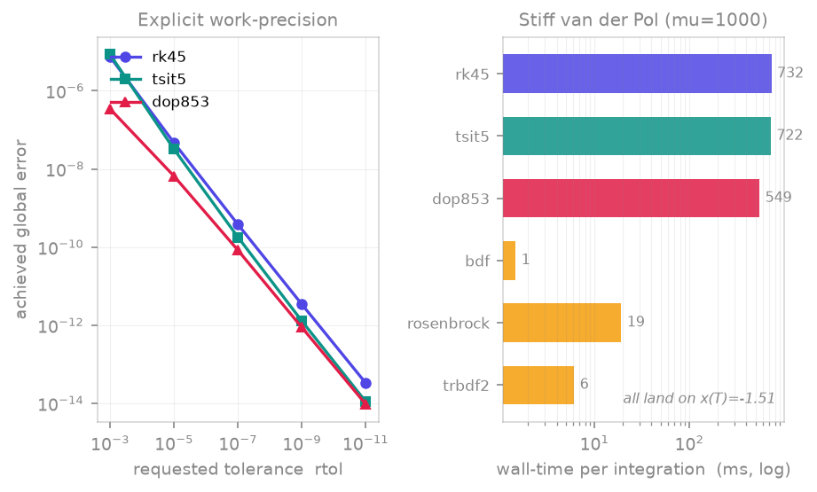

<span class="ts-kicker">Theory</span>

# Solvers & methods

Most of the time you never touch this layer. You call `integrate()` and the
default solver does the right thing:

```python
import tsdynamics as ts

traj = ts.systems.Lorenz().integrate(final_time=100.0, dt=0.01)
```

When you *do* want to choose — a stiff chemical model, a high-accuracy reference
run, a fixed-step orbit — you pass a `method=` string:

```python
traj = ts.systems.Lorenz().integrate(final_time=100.0, dt=0.01, method="dop853")
```

This page is the catalogue of those names and a guide to picking one. Every
method below is a thin Python *spec* (`SolverSpec`) mirroring a kernel in the
Rust engine; the string you pass is normalised, alias-mapped and validated
against a registry before the engine runs it. For the programmatic registry API
(resolving names, capability flags, registering your own) see
[Reference → Solvers](../reference/solvers.md).

!!! note "`dt` is the output grid, not the step size"
    For every adaptive method, `dt` only sets how densely the returned
    [`Trajectory`](../analysis/integrate.md) is sampled — the internal stepper
    chooses its own steps from `rtol`/`atol`. A coarse `dt` does **not** cost
    accuracy. The two exceptions are `rk4` (a genuinely fixed-step method, where
    `dt` *is* the step) and the stochastic schemes (where `dt` *is* the noise
    increment $\sqrt{\mathrm{d}t}$).

## The catalogue

| `method=` | Family | Kind | Order | Adaptive | Needs Jacobian | Use when |
|---|---|---|---|:--:|:--:|---|
| `euler`          | ode, dde | explicit RK (fixed) | 1 | — | — | the simplest baseline; teaching |
| `midpoint`       | ode, dde | explicit RK (fixed) | 2 | — | — | a cheap fixed-step march |
| `heun`           | ode, dde | explicit RK (fixed) | 2 | — | — | explicit trapezoid / improved Euler |
| `ralston`        | ode, dde | explicit RK (fixed) | 2 | — | — | min-error-bound order-2 fixed step |
| `ssprk3`         | ode, dde | explicit SSP RK (fixed) | 3 | — | — | TVD/SSP march for hyperbolic MOL discretisations |
| `rk4`            | ode, dde | explicit RK (fixed) | 4 | — | — | a fixed-step march; teaching; debugging step effects |
| `rk4_38`         | ode, dde | explicit RK (fixed) | 4 | — | — | the 3/8-rule RK4 (smaller error constant) |
| `ab3` / `ab4`    | ode, dde | explicit Adams–Bashforth (multistep) | 3 / 4 | — | — | non-stiff with an **expensive RHS** (1 eval/step); MOL/spectral systems |
| `abm4`           | ode, dde | Adams–Bashforth–Moulton (PECE) | 4 | — | — | non-stiff, more accuracy/stability than `ab4` (2 evals/step) |
| `heun_euler`     | ode, dde | explicit RK (embedded) | 2(1)   | ✓ | — | the cheapest adaptive kernel; coarse tolerances |
| `bs3`            | ode, dde | explicit RK (embedded) | 3(2)   | ✓ | — | crude–moderate tolerances (the `ode23` pair) |
| `rk45`           | ode, dde | explicit RK (embedded) | 5(4)   | ✓ | — | **the default** — non-stiff smooth problems |
| `rkf45`          | ode, dde | explicit RK (embedded) | 5(4)   | ✓ | — | the classic Runge–Kutta–Fehlberg pair |
| `cashkarp`       | ode, dde | explicit RK (embedded) | 5(4)   | ✓ | — | non-stiff; rapidly-varying RHS |
| `tsit5`          | ode, dde | explicit RK (embedded) | 5(4)   | ✓ | — | non-stiff, often fewer evaluations than `rk45` |
| `dop853`         | ode, dde | explicit RK (embedded) | 8(5,3) | ✓ | — | high accuracy / tight tolerances; reference runs |
| `bdf`            | ode      | implicit (multistep) | 1–5 var. | ✓ | ✓ | **the stiff default** — smooth stiff RHS |
| `backward_euler` | ode      | implicit (backward Euler) | 1 | ✓ | ✓ | the canonical L-stable stiff baseline |
| `implicit_midpoint` | ode   | implicit (1-stage Gauss) | 2 | ✓ | ✓ | A-stable order-2 (base step symplectic; see note below) |
| `trapezoid`      | ode      | implicit (Crank–Nicolson) | 2 | ✓ | ✓ | mildly-stiff oscillatory problems (A-stable) |
| `sdirk2`         | ode      | implicit (SDIRK) | 2 | ✓ | ✓ | stiff, L-stable 2-stage SDIRK |
| `rosenbrock`     | ode      | implicit (Rosenbrock-W) | fixed | ✓ | ✓ | stiff, one linear solve per step |
| `trbdf2`         | ode      | implicit (ESDIRK) | 2 | ✓ | ✓ | stiff, L-stable composite step |
| `euler_maruyama` | sde      | explicit | 0.5 (strong) | — | — | **the SDE default** — diagonal-Itô noise |
| `milstein`       | sde      | explicit | 1.0 (strong) | — | ✓ (∂g/∂u) | SDE, higher strong order |

All names are case- and punctuation-insensitive and carry common aliases (e.g.
`dopri5`/`RK45` → `rk45`, `ode23` → `bs3`, `cash_karp` → `cashkarp`,
`crank_nicolson` → `trapezoid`, `implicit_euler` → `backward_euler`,
`adams_bashforth`/`ab` → `ab4`). The list is open: new kernels register
themselves (see [Programmatic registry](#programmatic-registry)).

<figure markdown>
{ loading=lazy }
<figcaption>Left: on a scalar problem with a known solution the explicit kernels track the requested tolerance, with the order-8 <code>dop853</code> reaching the lowest error at every setting. Right: on stiff van der Pol (μ=1000) all six kernels land on the same final state, but the explicit methods are stability-bound and pay hundreds of times the wall-time of the implicit ones — the practical case for <code>bdf</code>.</figcaption>
</figure>

## Explicit Runge–Kutta

These are the workhorses for **smooth, non-stiff** problems, and the same
kernels drive the [DDE](../systems/delay/index.md) families through the method of
steps. The family spans fixed-step methods from order 1 (`euler`) through the
order-4 `rk4`/`rk4_38`, the SSP order-3 `ssprk3`, the embedded adaptive pairs
(`heun_euler`, `bs3`, `rk45`, `rkf45`, `cashkarp`, `tsit5`, `dop853`), and the
explicit Adams–Bashforth multistep methods (`ab3`, `ab4`, `abm4`). Pick a
fixed-step method when you want a deterministic step count, a low-order one for
teaching, and an adaptive pair for production non-stiff integration.

`rk4` is the classic four-stage, fourth-order Runge–Kutta with a **fixed** step
(Kutta 1901): no embedded error estimate, no adaption. Pass it when you want a
deterministic step count or to study how step size affects a result — for
production integration prefer an adaptive method. The low-order fixed kernels
`euler` (Euler 1768), `midpoint`/`heun`/`ralston` (order 2) and the SSP `ssprk3`
(Shu & Osher 1988, the standard time integrator for hyperbolic PDE
discretisations) round out the fixed-step set.

The **Adams–Bashforth** multistep kernels (`ab3`/`ab4`) and the
Adams–Bashforth–Moulton predictor–corrector (`abm4`) reuse right-hand-side values
from previous steps, so they advance with only one (`ab*`) or two (`abm4`) new
RHS evaluations per step regardless of order — efficient when `f` is expensive,
as in the large ODE systems from method-of-lines/spectral discretisations of PDEs
(Adams 1883; Hairer, Nørsett & Wanner 1993, §III.1). They are fixed-step and
self-start with `rk4`. (For genuinely *stiff* semilinear PDEs such as
Kuramoto–Sivashinsky, an explicit Adams method is stability-bound; the efficient
route is an implicit/IMEX or exponential-integrator split of the linear and
nonlinear operators — a future seam, since the present engine takes a single
combined `f(u, t)`.)

```python
# Fixed-step march: dt IS the integrator step here.
traj = ts.systems.Lorenz().integrate(final_time=20.0, dt=0.005, method="rk4")
```

`rk45` is the embedded Dormand–Prince 5(4) pair (Dormand & Prince 1980) and the
**default for ODEs and DDEs**. The fifth-order solution advances the state and
the embedded fourth-order solution estimates the local error, which drives the
adaptive step controller. Spellings `dopri5` and `RK45` resolve to it.

```python
# All four lines integrate with the same kernel.
ts.systems.Rossler().integrate(final_time=200.0, dt=0.05)                 # default
ts.systems.Rossler().integrate(final_time=200.0, dt=0.05, method="rk45")
ts.systems.Rossler().integrate(final_time=200.0, dt=0.05, method="dopri5")
ts.systems.Rossler().integrate(final_time=200.0, dt=0.05, method="RK45")
```

`tsit5` is Tsitouras' 5(4) pair (Tsitouras 2011), an explicit RK with
coefficients optimised to minimise the leading truncation-error term. It is
another excellent general-purpose non-stiff choice and frequently spends fewer
right-hand-side evaluations than `rk45` at the same tolerance.

`dop853` is the eighth-order Dormand–Prince method with embedded fifth- and
third-order estimators for stepsize control (Hairer, Nørsett & Wanner 1993).
Reach for it when you need **tight tolerances** or a high-accuracy reference
trajectory — at small `rtol` it reaches a far lower error than the 5(4) pairs
for comparable work (the left panel above).

```python
# High-accuracy reference run.
traj = ts.systems.Lorenz().integrate(
    final_time=100.0, dt=0.01, method="dop853", rtol=1e-12, atol=1e-12
)
```

## Implicit / stiff

A problem is **stiff** when its Jacobian has eigenvalues spanning many orders of
magnitude: a fast-decaying mode forces an *explicit* method to take tiny steps
for *stability* long after the solution itself has gone smooth. The fix is an
implicit method, whose stability region covers the entire left half-plane (it is
A- or L-stable), so the step size is bounded by accuracy alone. The right panel
of the figure makes the cost concrete: on stiff van der Pol every kernel reaches
the *same* final state, but the explicit methods run hundreds of times slower.

Every implicit kernel is adaptive and requires the **analytic Jacobian**
$\partial f/\partial u$. You never build it: the engine differentiates your
`_equations` symbolically and lowers a Jacobian-carrying tape automatically
whenever the resolved method needs one, so `method="bdf"` simply works.

`bdf` is the variable-order (1–5), fixed-leading-coefficient backward
differentiation formula (Curtiss & Hirschfelder 1952; Shampine & Gordon 1975) —
a multistep method with its own order and step controllers. It is the **default
stiff method for ODEs**: through a smooth stiff phase it takes far larger steps
than the fixed-order one-step kernels, which is why it is the right starting
point for stiff problems.

`rosenbrock` is a linearly-implicit Rosenbrock-W method (Rosenbrock 1963): one
linear solve per step, no Newton iteration, with step-doubling + Richardson
extrapolation for error control. `trbdf2` is the TR-BDF2 composite single-step
ESDIRK (Bank et al. 1985) — a trapezoidal sub-step followed by a BDF2 sub-step,
L-stable, also step-doubling controlled. Both stay selectable by name when you
want a one-step kernel instead of the multistep `bdf`.

The one-step stiff family is rounded out by `backward_euler` (implicit Euler,
order 1, L-stable — the canonical stiff baseline), `sdirk2` (a 2-stage L-stable
singly-diagonally-implicit Runge–Kutta, Alexander 1977), and two A-stable
methods: `trapezoid` (the Crank–Nicolson rule, Crank & Nicolson 1947) and
`implicit_midpoint` (the one-stage Gauss collocation method, A-stable order 2;
its *base* step is symplectic, but the adaptive integrator delivered here drives
it through Richardson step-doubling, which is not symplectic, so it does not carry
the long-time energy-conservation guarantee of a fixed-step symplectic method;
Hairer, Lubich & Wanner 2006). All four solve their implicit stage(s) by a modified-Newton
iteration reusing the analytic Jacobian, and share the step-doubling error
controller. The A-stable (non-L-stable) `trapezoid`/`implicit_midpoint` can ring
on the very stiffest transients — prefer an L-stable kernel (`bdf`,
`backward_euler`, `sdirk2`, `rosenbrock`, `trbdf2`) there.

A higher-order stiff Radau IIA collocation kernel and the Verner/Feagin
high-order explicit pairs are natural follow-ups; they slot in behind the same
`Solver` seam.

Mark a system stiff once and forget it — declare the default method on the class:

```python
class MyStiffSystem(ts.ContinuousSystem):
    _default_method = "bdf"          # every integrate() now uses bdf
    ...
```

The built-in stiff catalogue systems (for example `Oregonator`, the Field–Noyes
Belousov–Zhabotinsky model) already do this.

!!! warning "`LSODA`, `Radau`, `vode` are not method names"
    The legacy SciPy/v2 stiff names have no engine kernel and are **rejected**
    on resolution, with a hint pointing at the engine's stiff family:

    ```python
    ts.systems.Oregonator().integrate(method="LSODA")
    # ValueError: unknown solver method 'LSODA'; ...
    #   ('LSODA' is a SciPy/v2 stiff method with no engine kernel;
    #    use 'bdf' or 'trbdf2' for stiff problems.)
    ```

    Use `bdf` (or `rosenbrock` / `trbdf2`) instead.

!!! note "Stiff DDEs"
    The method-of-steps reuses only the **explicit** ODE kernels, so a DDE's
    `method=` is explicit-only (`available_for("dde")` →
    `['dop853', 'rk4', 'rk45', 'tsit5']`). The implicit kernels are ODE-only for
    now; `method="rosenbrock"` on a DDE raises.

## Stochastic

The [stochastic family](../reference/base.md) integrates diagonal-Itô SDEs
$\mathrm{d}X_k = f_k\,\mathrm{d}t + g_k\,\mathrm{d}W_k$ with a **fixed step**.
Here `dt` is load-bearing in two ways at once: it is both the output sampling
interval *and* the discretisation step — the Wiener increment over a step has
scale $\sqrt{\mathrm{d}t}$ — so a smaller `dt` is the only way to a more
accurate sample path.

`euler_maruyama` is the Euler–Maruyama scheme (strong order 0.5), the **SDE
default**. `milstein` is the Milstein scheme (strong order 1.0), which adds the
diffusion-derivative correction $\partial g/\partial u$ (built automatically,
like the implicit Jacobian) for a higher strong order on the same step.

Pass a `seed` to make the noise realisation reproducible — it is recorded in the
returned trajectory's `meta`:

```python
class GBM(ts.StochasticSystem):
    params = {"mu": 0.1, "sigma": 0.3}
    dim = 1

    @staticmethod
    def _drift(y, t, *, mu, sigma):
        return [mu * y(0)]

    @staticmethod
    def _diffusion(y, t, *, mu, sigma):
        return [sigma * y(0)]

a = GBM().integrate(final_time=1.0, dt=0.01, ic=[1.0], method="euler_maruyama", seed=0)
b = GBM().integrate(final_time=1.0, dt=0.01, ic=[1.0], method="euler_maruyama", seed=0)
assert (a.y == b.y).all()          # same seed → identical path
c = GBM().integrate(final_time=1.0, dt=0.01, ic=[1.0], method="milstein", seed=0)
```

An `ensemble(...)` run seeds trajectory $i$ from a per-index derivation of the
base seed, so a batch is reproducible and the parallel result equals the serial
one.

## Choosing a method

For the common cases the defaults are already right:

| Family | Default | Default stiff |
|---|---|---|
| ODE | `rk45` | `bdf` |
| DDE | `rk45` | `rosenbrock` *(policy; not yet a resolvable DDE kernel — see above)* |
| SDE | `euler_maruyama` | — |

**Names normalise.** A `method=` string is lower-cased, its whitespace and
hyphens collapsed, then run through an alias table before the registry lookup —
so `"RK45"`, `"dopri5"`, `"dp45"` all reach `rk45`; `"dop8"` → `dop853`;
`"ros"` → `rosenbrock`; `"em"` → `euler_maruyama`. An unrecognised name raises
with the list of valid methods for the family.

**Auto-stiffness.** When you are unsure, ask the registry. `is_stiff` probes the
Jacobian spectrum at one point and reports whether the stiffness ratio (fastest
over slowest decay rate) crosses a threshold; `recommend` combines that verdict
with the policy table and hands back a ready-to-use resolution:

```python
from tsdynamics import solvers

solvers.is_stiff(ts.systems.Oregonator(), ic=[1.0, 1.0, 1.0])   # True
solvers.is_stiff(ts.systems.Lorenz(),     ic=[1.0, 1.0, 1.0])   # False

rec = solvers.recommend(ts.systems.Oregonator(), ic=[1.0, 1.0, 1.0])
rec.name          # 'bdf'
rec.build_kwargs  # {'with_jacobian': True}
```

Both are **one-point heuristics** evaluated at the IC, meant to *seed* a choice
rather than guarantee one — pass an explicit `ic=` for a reproducible verdict
(a system with a random initial condition will probe a different point each
call). The authoritative signal is the engine's *runtime* stiffness detector,
which watches the rejected-step ratio once integration is underway.

## Programmatic registry

The solver layer is a pluggable registry: each method is a `SolverSpec` with a
`SolverCaps` (explicit/implicit, adaptive, needs-Jacobian, supported families),
`method=` strings resolve against it, and third-party solvers register through
the same entry point. If you are building on the selection machinery — listing
methods, inspecting capabilities, resolving names yourself, or registering a new
kernel — see the [Reference → Solvers](../reference/solvers.md) API page for
`SolverSpec`, `SolverCaps`, `resolve`, `available_for`, `recommend`, `is_stiff`,
`build_kwargs` and `register`.
