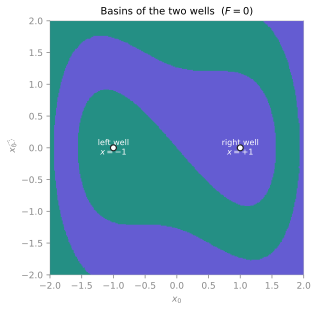
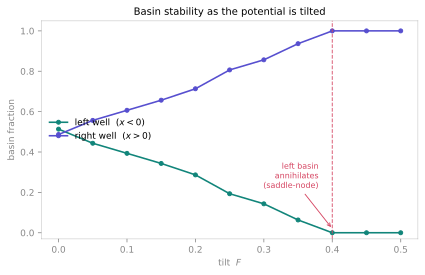

<span class="ts-kicker">Tutorial · Basins & multistability</span>

# Basins & multistability

Some systems have more than one place to end up. A damped pendulum can stop
hanging down or spun over the top; a climate can sit warm or frozen; a gene
switch can latch on or off. When several stable states coexist, *which* one you
reach is set entirely by where you start — and the map from initial conditions
to final states is the **basin of attraction** picture. This tutorial builds
that picture end to end, then asks the sharper question: what happens to it when
you push a parameter until a state disappears?

We use the damped **two-well Duffing oscillator**, the textbook bistable flow,
and take it all the way from three lines of math to a quantified, tipping-aware
global-stability portrait. Every number below is reproducible — the initial
conditions and seeds are pinned, and the printed values are what the shown code
actually returns.

## 1. Write the equations

A system is a class: the parameters, the dimension, and the right-hand side as
a first-order system. The two-well Duffing is a unit mass in the double-well
potential $V(x) = -\tfrac12 x^2 + \tfrac14 x^4$ with linear damping $\delta$,

$$\ddot{x} = x - x^3 - \delta\,\dot{x} + F,$$

written first order as $\dot x = y,\ \dot y = x - x^3 - \delta y + F$. We carry
a tilt $F$ (zero for now) so the *same* class serves the continuation study in
§6. The two wells sit at $x = \pm 1$; with damping every trajectory eventually
rolls into one of them, and *which* one is the basin question.

```python
import numpy as np
import tsdynamics as ts
from tsdynamics import data

class TiltedDuffing(ts.ContinuousSystem):
    """Damped two-well Duffing oscillator: x'' = x - x**3 - delta*x' + F."""

    params = {"delta": 0.3, "F": 0.0}
    dim = 2
    variables = ("x", "y")

    @staticmethod
    def _equations(Y, t, *, delta, F):
        x, y = Y(0), Y(1)
        return (y, x - x**3 - delta * y + F)

sys = TiltedDuffing()
```

!!! note "Symbolic right-hand side"
    `_equations` is read symbolically (SymEngine), so use plain arithmetic and
    `symengine` functions — never NumPy or `math` inside it. `Y(0)`, `Y(1)` are
    the state components. That is the entire contract; compilation, caching,
    output grids and provenance are handled for you. See
    [the mental model](../start/concepts.md).

## 2. Integrate — see the bistability

Two nearby initial conditions can fall into *different* wells. Integrate from
each and read off the end state:

```python
sys.run(final_time=60.0, dt=0.05, ic=[ 1.5, 0.5]).y[-1]   # ≈ [ 1.000,  0.000]
sys.run(final_time=60.0, dt=0.05, ic=[-1.5, 0.5]).y[-1]   # ≈ [-1.000, -0.000]
```

Both settle onto a fixed point — the bottom of a well at $x = \pm 1,\ y = 0$.
That two stable states coexist is exactly what makes the basin question
meaningful. (The tiny non-zero velocities, $\sim 10^{-4}$, are the residual of
the damped oscillation still ringing down at $t = 60$.)

## 3. Find the attractors

[`ts.analysis.attractors`](../analysis/basins.md) drives the flow from a grid of
random seeds over a `data.Box` of state space and follows
each until it *recurrently* revisits the same cells — the signature of having
reached an attractor (Datseris & Wagemakers, 2022). It samples over a
`data.Box` of state space and needs no prior knowledge of where the attractors
are:

```python
region = data.Box(np.array([-2.0, -2.0]), np.array([2.0, 2.0]))

att = ts.analysis.attractors(sys, region, resolution=40, n_seeds=200,
                         dt=0.5, max_steps=2000, seed=0)

att                          # AttractorSet(2 attractors, 0/200 diverged)
att.centers                  # ≈ [[-1.000, -0.000], [1.000, 0.000]]
```

Two attractors, located at the well bottoms, and nothing escaped the box.
Indexing the set gives you the **numbers**: `att[0]` is the first centre as a
plain `(dim,)` array. The records live alongside, at the same index —
`att.details[0]` is the [`Attractor`](../analysis/basins.md), carrying its
`.center` (its located point set's centroid), an integer id, and the recurrent
cells that identified it.

!!! tip "Reading the knobs"
    `resolution` sets the recurrence-cell count per axis: too coarse and two
    attractors merge into one cell set; too fine and a chaotic trajectory never
    *recurs*. For these two point attractors a coarse `40` is plenty. `n_seeds`
    is how many random initial conditions to classify, `dt` the integration step
    between cell checks, and `seed` makes the sampler reproducible. A diverging
    seed is counted (the `0/200 diverged` above) rather than aborting the scan.

## 4. Paint the basins

[`ts.analysis.basins`](../analysis/basins.md) labels a lattice of initial
conditions by *which* attractor each one reaches — the basin map itself:

```python
grid = data.Grid(np.array([-2.0, -2.0]), np.array([2.0, 2.0]), (300, 300))
basins = ts.analysis.basins(sys, grid, dt=0.5, max_steps=2000)

basins.n_attractors     # 2
basins.labels.shape     # (300, 300) — integer attractor id per initial condition
basins.fractions        # {1: 0.5001, 2: 0.4999}
```

`labels` is a plain integer array (id `1` and `2` here; `-1` marks a diverged
cell), laid out on the grid you passed — ready to image directly:

```python
# import matplotlib.pyplot as plt
# plt.imshow(basins.labels.T, origin="lower", extent=[-2, 2, -2, 2], cmap="coolwarm")
# plt.xlabel("$x_0$"); plt.ylabel(r"$\dot{x}_0$")
```

or, without touching matplotlib, through the result's own front door —
`ts.plot(basins)` returns a `basins_image` [`Plot`](../visualization/index.md)
that renders itself with `.plot()` / `.save("basins.png")`.

<figure class="ts-fig" markdown>
{ loading=lazy }
<figcaption><span class="lbl">FIG 1</span> · basins of the two-well Duffing ($F = 0$, $\delta = 0.3$). Each initial condition $(x_0, \dot x_0)$ is coloured by the well it rolls into — teal for the left well ($x=-1$), indigo for the right ($x=+1$), with the well bottoms marked. The damping makes the boundary a smooth, interleaved pair of tongues, not a fractal tangle: which well you reach depends on both position <em>and</em> initial velocity, so the basins swirl.</figcaption>
</figure>

For a **higher-dimensional** flow you image a 2-D *slice* by passing a separate
full-dimension `recurrence` box and pinning the free axes of `region` with
`counts == 1` — the recipe the magnetic-pendulum example on the
[basins reference](../analysis/basins.md) uses.

## 5. Quantify the boundary

How predictable is the outcome near the boundary? Three label-image diagnostics
read the painted grid directly — no further integration:

```python
ts.analysis.basin_fractions(sys, region, n=400, dt=0.5, max_steps=2000, seed=0)
# BasinFractions({1:0.53, 2:0.47}, diverged=0, n=400)      — basin stability

ts.analysis.basin_entropy(basins)
# BasinEntropy(Sb=0.04184, Sbb=0.4859, fractal_boundary=False)

ts.analysis.uncertainty_exponent(basins)
# UncertaintyExponent(alpha=0.9968, D0=1.003, R2=1.0)
```

Read them in turn:

- **`basin_fractions`** is Monte-Carlo basin *stability* (Menck et al., 2013):
  draw `n` random initial conditions and report each attractor's share. The two
  wells are near-symmetric, so the fractions sit close to $\tfrac12, \tfrac12$
  (this independent Monte-Carlo estimate, $0.53 / 0.47$, differs from the
  full-grid `basins.fractions` above only by sampling noise). Its standard error
  is $\sqrt{p(1-p)/n}$ — dimension-free.
- **`basin_entropy`** (Daza et al., 2016) measures how mixed the labels are.
  `fractal_boundary=False` because the *boundary* entropy $S_{bb} = 0.49$ stays
  below the $\ln 2 \approx 0.69$ threshold: at this damping the boundary is a
  smooth curve.
- **`uncertainty_exponent`** (Grebogi et al., 1983) quantifies final-state
  sensitivity: perturbing an initial condition by $\varepsilon$ flips its
  outcome with probability $\sim \varepsilon^{\alpha}$. Here $\alpha \approx
  0.997$ is essentially $1$, giving a boundary dimension $D_0 = D - \alpha
  \approx 1.00$ — a genuine line (this fine $300 \times 300$ grid resolves the
  smooth boundary cleanly; a coarser grid reads a slightly higher $D_0$).

A fourth, [`resilience`](../analysis/basins.md), asks how *far* (in state space)
a given attractor is from its basin boundary — the smallest perturbation that
can knock the system out of it (Halekotte & Feudel, 2020):

```python
ts.analysis.resilience(basins, 1)     # ScalarResult(value=0.575251)
```

!!! tip "When the boundary turns fractal"
    Smoothness is not guaranteed. Drive competing attractors hard enough — the
    canonical case is a magnetic pendulum over three magnets, or Newton's method
    on $z^3 = 1$ — and the boundary becomes fractal and even **Wada** (every
    boundary point touches *all* basins at once). Then `basin_entropy` reports
    `fractal_boundary=True` ($S_{bb} > \ln 2$) and
    [`wada_property`](../analysis/basins.md) detects the Wada structure. For our
    two smooth basins `ts.analysis.wada_property(basins)` returns
    `WadaResult(is_wada=False, n_basins=2, W=0)`, as it should. The
    [Attractors & basins](../analysis/basins.md) page walks the fractal case.

## 6. Tilt the potential — a tipping point

The basin picture is not fixed: change a parameter and it deforms, and a whole
attractor — with its basin — can *vanish*. Our tilt $F$ does exactly this. The
cubic drift $x - x^3 + F$ has three real roots (two wells plus the barrier) only
while $|F| < 2 / 3\sqrt{3} \approx 0.385$; past that, a **saddle-node**
bifurcation destroys the shallower well.

[`continuation`](../analysis/basins.md) re-finds and *matches* the attractors at
each value of a swept parameter, tracking their basin fractions so a persisting
attractor keeps its id and a vanishing one drops to `NaN` (Datseris, Rossi &
Wagemakers, 2023):

```python
cont = ts.analysis.continuation(sys, "F", np.linspace(0.0, 0.5, 11), region,
                       n=300, resolution=40, dt=0.5, max_steps=2000, seed=0)

cont.values            # array([0.  , 0.05, 0.1 , ..., 0.5 ])
cont.fractions[1]      # left well:  [0.51, 0.44, 0.39, ..., 0.06, nan, nan, nan]
cont.fractions[2]      # right well: [0.49, 0.56, 0.61, ..., 0.94, 1.0, 1.0, 1.0]
```

As the tilt grows the left well's basin steadily loses ground and then, between
$F = 0.35$ and $F = 0.40$, **annihilates** — its fraction falls to zero and its
id turns `NaN`. [`tipping_points`](../analysis/basins.md) reads that event off
the continuation:

```python
ts.analysis.tipping_points(cont)
# CollectionResult(1 items)
#   {'value': 0.4, 'attractor': 1, 'kind': 'disappear',
#    'before': 0.06333..., 'after': 0.0}
```

One `disappear` event at $F = 0.4$: the left well and its basin are gone, and
every initial condition now flows to the single surviving right well.

<figure class="ts-fig" markdown>
{ loading=lazy }
<figcaption><span class="lbl">FIG 2</span> · basin stability under the tilt $F$. The teal (left-well) basin fraction shrinks monotonically and vanishes at the dashed line ($F \approx 0.4$), where the saddle-node bifurcation annihilates the well; the indigo (right-well) basin captures the whole state space beyond it. This is the global-stability signature of a tipping point — not a state slowly drifting, but a basin disappearing out from under it.</figcaption>
</figure>

## What you built

From three lines of math you produced the complete multistability portrait —
attractors, basins, basin stability, a quantified boundary, and a continuation
that *catches the tipping point where a state disappears* — every result
carrying its provenance in `.meta`. That is the path the whole toolkit is
designed around: define the system once, then compose
[analysis](../analysis/index.md) on top.

!!! warning "Basins are for finite-dimensional states only"
    `attractors` / `basins` / `continuation` drive a **map or
    flow** whose state is a point. A delay system (infinite-dimensional history)
    or a stochastic system (no single deterministic limit) is rejected —
    `ts.analysis.attractors(ts.systems.OrnsteinUhlenbeck(), region)` raises a
    `TypeError`. For the stochastic analogue — noise hopping *between* the wells
    of exactly this potential — see the
    [noise-driven tutorial](noise-driven.md).

## See also

- [Attractors & basins](../analysis/basins.md) — the full basin / continuation / Wada API
- [Fixed & periodic points](../analysis/fixed-points.md) — the equilibria these attractors are
- [Noise-driven dynamics](noise-driven.md) — the same double well, now with noise-induced switching
- [The mental model](../start/concepts.md) — the definition contract in depth
