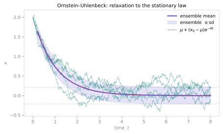
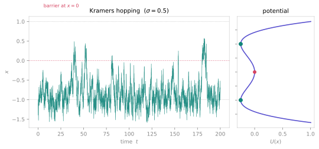

<span class="ts-kicker">Tutorial · Noise-driven dynamics</span>

# Noise-driven dynamics

Add noise to a dynamical system and the questions change. A single trajectory is
no longer *the* answer — it is one draw from a distribution, and the useful
objects become statistical: the ensemble mean, the stationary variance, the rate
at which noise kicks the state over a barrier. TSDynamics models these as
**diagonal-Itô SDEs**,

$$dX_k = f_k(X, t)\,dt + g_k(X, t)\,dW_k,$$

a deterministic drift $f$ (the skeleton, exactly like an ODE's `_equations`)
plus an independent Wiener increment $dW_k$ scaled by a diffusion coefficient
$g_k$. This tutorial walks the three things you actually do with one: **integrate
a path**, **gather ensemble statistics**, and **study noise-induced transitions**
— checking each against the analytic law and the deterministic limit.

Every number below is reproducible: paths and ensembles are seeded, and each
printed value is what the shown code returns.

## 1. A single path

The catalogue ships three canonical processes in the `sde` family. Start with the
**Ornstein–Uhlenbeck** process — additive-noise mean reversion, the continuous
AR(1),

$$dX = \theta\,(\mu - X)\,dt + \sigma\,dW,$$

a linear restoring drift pulling the state to the mean $\mu$ at rate $\theta$
against constant Gaussian noise. Integrate one realisation. The `seed` fixes the
noise so the path is reproducible, and `dt` sets *both* the output grid **and**
the noise scale $\sqrt{dt}$:

```python
import numpy as np
import tsdynamics as ts

ou = ts.systems.OrnsteinUhlenbeck(params={"theta": 1.0, "mu": 0.0, "sigma": 0.3})

path = ou.run(final_time=30.0, dt=0.01, ic=[2.0], seed=0)

path.y.shape            # (3001, 1)
path.y[0, 0]            # 2.0   — the initial condition
round(path.y[-1, 0], 4) # 0.2887 — where this particular realisation ended
path.meta["method"]     # 'euler_maruyama'  (the default scheme)
path.meta["seed"]       # 0  — recorded for reproducibility
```

The path starts at $x_0 = 2$, is pulled toward $\mu = 0$, and then rattles around
it. The OU process has a known **stationary distribution** — normal with mean
$\mu$ and variance $\sigma^2 / 2\theta$ — so once the transient has died the path
statistics should match it. Read them off the tail of this single long run:

```python
0.3**2 / (2 * 1.0)              # 0.045   — analytic stationary variance
tail = path.y[path.t > 10.0, 0]
round(tail.mean(), 4)          # -0.0297  ≈ μ = 0
round(tail.var(), 4)           # 0.0365   ≈ 0.045 (one path — noisy estimate)
```

One path gives a noisy variance estimate ($0.037$ vs the true $0.045$). To pin
the statistics down we need many paths.

!!! note "Euler–Maruyama vs Milstein"
    `method="euler_maruyama"` (order 0.5, the default) is the workhorse;
    `method="milstein"` (order 1.0) adds a correction proportional to
    $g\,\partial g/\partial x$. For **additive** noise ($g$ constant, as in OU
    and the double well) that correction is identically zero, so the two schemes
    produce **bit-identical** paths — a useful sanity check. Milstein only differs
    for **multiplicative** noise (§4's geometric Brownian motion).

## 2. Ensemble statistics

The right object for a stochastic system is the *ensemble*. `ou.ensemble(...)`
integrates a batch of initial conditions and returns each one's final state,
fanning the batch out across the compiled engine's thread pool:

```python
ics = np.full((2000, 1), 2.0)          # 2000 copies of the same start
finals = ou.ensemble(ics, final_time=30.0, dt=0.01, seed=0)

finals.shape                            # (2000, 1)
round(finals.mean(), 4)                 # -0.0007  ≈ μ = 0
round(finals.var(), 4)                  # 0.0451   ≈ 0.045  — the analytic variance
int(np.isnan(finals).any(axis=1).sum()) # 0  — no diverged trajectories
```

With 2000 paths the ensemble variance at $T = 30$ nails the stationary value
$0.045$. The **transient** matches theory too: the ensemble mean decays as
$\mu + (x_0 - \mu)\,e^{-\theta t}$. Sweep the horizon and compare:

```python
for T in (0.5, 1.0, 2.0):
    f = ou.ensemble(ics, final_time=T, dt=0.01, seed=0)
    print(f"T={T}: mean={f.mean():.4f}  analytic={2.0*np.exp(-T):.4f}")
# T=0.5: mean=1.2071  analytic=1.2131
# T=1.0: mean=0.7299  analytic=0.7358
# T=2.0: mean=0.2689  analytic=0.2707
```

Three decimals of agreement, from the raw ensemble against the closed-form
transient.

<figure class="ts-fig" markdown>
{ loading=lazy }
<figcaption><span class="lbl">FIG 1</span> · Ornstein–Uhlenbeck relaxation. Five seeded sample paths (faint teal) start at $x_0 = 2$ and are pulled toward $\mu = 0$. The ensemble mean (indigo, over 3000 paths) tracks the analytic transient $\mu + (x_0-\mu)e^{-\theta t}$ (dashed rose) exactly, while the $\pm\,$sd band (indigo shading) widens to the stationary spread $\sigma/\sqrt{2\theta}$ (dotted). The single path is one draw; the ensemble is the law.</figcaption>
</figure>

!!! warning "Ensemble seeding is by index — by design"
    `ensemble(ics, seed=s)` seeds trajectory $i$ from `seed_for(s, i)`, a mix
    depending only on the index, so the batch is reproducible and matches the
    engine's parallel-equals-serial contract. This means `ensemble([ic], seed=s)`
    generally draws a **different** sample path from `integrate(seed=s)` for the
    same `s` — they are different streams. (The one coincidence: `seed_for(0, 0)`
    happens to be `0`, so at `seed=0` index `0` alone they align.) Do not expect
    `ensemble` and `integrate` to reproduce each other path-for-path; do expect
    each, on its own, to reproduce exactly under a fixed seed.

## 3. Noise-induced switching (Kramers escape)

Now the headline stochastic phenomenon. The **double-well** process is overdamped
gradient flow in the bistable potential $U(x) = -\tfrac{a}{2}x^2 +
\tfrac{b}{4}x^4$,

$$dX = (a\,X - b\,X^3)\,dt + \sigma\,dW,$$

with stable wells at $x = \pm\sqrt{a/b} = \pm 1$ separated by a barrier at the
origin. Without noise the state relaxes into whichever well it starts in and
stays there forever. **With** noise it occasionally hops the barrier — the
long-time dynamics is a random telegraph between the two wells. Integrate a long
path starting in the left well:

```python
dw = ts.systems.DoubleWell(params={"a": 1.0, "b": 1.0, "sigma": 0.5})
path = dw.run(final_time=200.0, dt=0.01, ic=[-1.0], seed=1)
x = path.y[:, 0]

# barrier hops = sign changes of x (the state crossing x = 0)
int(np.sum(np.diff(np.sign(x)) != 0))   # 70   — this realisation hops 70 times
round((x < 0).mean(), 3)                # 0.962 — but spends 96% of its time left
```

The path hops 70 times yet lives mostly in the left well: it starts there, and at
$\sigma = 0.5$ each escape is rare enough that it mostly falls back. The escape
rate is governed by **Kramers' law** — the mean residence time is exponential in
the barrier-height-to-noise ratio, $\sim \exp(2\,\Delta U / \sigma^2)$ — so a
modest increase in $\sigma$ multiplies the hopping. Turn the noise up and count
again:

```python
x8 = ts.systems.DoubleWell(params={"a": 1.0, "b": 1.0, "sigma": 0.8}) \
        .run(final_time=200.0, dt=0.01, ic=[-1.0], seed=1).y[:, 0]
int(np.sum(np.diff(np.sign(x8)) != 0))  # 324  — 4.6× the hops of σ = 0.5
```

<figure class="ts-fig" markdown>
{ loading=lazy }
<figcaption><span class="lbl">FIG 2</span> · noise-induced switching in the double well ($\sigma = 0.5$). <strong>Left:</strong> a single 200-time-unit path (teal) rattling in the wells at $x = \pm 1$ and occasionally hopping the barrier at $x = 0$ (dashed rose). <strong>Right:</strong> the potential $U(x)$, with the two stable minima (teal) and the unstable barrier (rose) the noise must climb. Raising $\sigma$ lowers the effective barrier-to-noise ratio and the hopping proliferates (Kramers).</figcaption>
</figure>

The ensemble view makes the metastability quantitative: start 4000 paths in the
left well and, after long enough, they redistribute toward the symmetric $\tfrac12
/ \tfrac12$ occupation of the two wells:

```python
ics = np.full((4000, 1), -1.0)
finals = dw.ensemble(ics, final_time=50.0, dt=0.01, seed=0)
finals = finals[~np.isnan(finals).any(axis=1)]
round((finals[:, 0] > 0).mean(), 3)     # 0.472 — nearly half have escaped to the right well
```

## 4. Multiplicative noise: geometric Brownian motion

Not all noise is additive. **Geometric Brownian motion** — the Black–Scholes
asset-price model — scales *both* drift and diffusion with the state,

$$dX = \mu\,X\,dt + \sigma\,X\,dW,$$

so its log is a Brownian motion with drift, the path stays strictly positive, and
the ensemble is **log-normal**. Its mean grows as $X_0\,e^{\mu t}$ while its
*median* grows more slowly, as $X_0\,e^{(\mu - \sigma^2/2)t}$ — the gap is the
signature of multiplicative noise. Check both against the ensemble:

```python
gbm = ts.systems.GeometricBrownianMotion(params={"mu": 0.1, "sigma": 0.3})
finals = gbm.ensemble(np.full((5000, 1), 1.0), final_time=5.0, dt=0.005, seed=0)
finals = finals[~np.isnan(finals).any(axis=1)]

round(finals.mean(), 4)                 # 1.6585  vs  exp(μT)          = 1.6487
round(float(np.median(finals)), 4)      # 1.3356  vs  exp((μ-σ²/2)T)   = 1.3165
bool((finals > 0).all())                # True   — every path stayed positive
```

Because $g = \sigma X$ is state-dependent, this is where **Milstein** actually
differs from Euler–Maruyama — for a serious moment estimate at coarse `dt`, prefer
`method="milstein"`.

## 5. The deterministic skeleton

Every SDE contains an ODE: set $\sigma = 0$ (or read the drift alone) and you have
the **deterministic skeleton** that the noise perturbs. It is always worth looking
at — it tells you where the attractors of the noisy system are hiding. For the
double well the skeleton is a bistable gradient flow: without noise the state
simply rolls into the nearest well and stops.

```python
det = ts.systems.DoubleWell(params={"a": 1.0, "b": 1.0, "sigma": 0.0})

round(det.run(final_time=50.0, dt=0.01, ic=[-1.5], seed=0).y[-1, 0], 4)  # -1.0
round(det.run(final_time=50.0, dt=0.01, ic=[ 0.2], seed=0).y[-1, 0], 4)  #  1.0
```

From $x_0 = -1.5$ it settles into the left well ($-1$); from $x_0 = 0.2$, just
right of the barrier, into the right well ($+1$). Those two fixed points are
exactly the states the noise telegraphs *between* in §3 — the skeleton's basins
(which you can map with [`basins_of_attraction`](basins-multistability.md) on the
$\sigma = 0$ system) are the wells; the noise supplies the barrier-hopping the
skeleton can never do on its own.

!!! tip "Skeleton first, then noise"
    A good workflow for any SDE: study the deterministic skeleton with the full
    ODE toolkit — [fixed points](../analysis/fixed-points.md),
    [Lyapunov exponents](../analysis/lyapunov.md),
    [basins](basins-multistability.md) — to map the landscape, *then* add noise
    and ask how it moves the state around that landscape. The stochastic
    phenomena (escape, resonance, noise-induced transitions) are all statements
    about noise versus that fixed geometry.

## What you built

You integrated a single stochastic path, gathered an ensemble whose statistics
matched the analytic OU laws to three decimals, watched noise drive Kramers
escape across a double-well barrier (and proliferate as $\sigma$ grew), confirmed
the log-normal mean/median gap of multiplicative noise, and grounded all of it in
the deterministic skeleton underneath. Each result carries its scheme, seed and
`dt` in `.meta`, so any path or ensemble replays exactly.

## See also

- [Integration & methods](../analysis/integration-and-methods.md) — schemes, `dt`, and the engine backends
- [Basins & multistability](basins-multistability.md) — mapping the skeleton's wells as basins of attraction
- [Systems catalogue](../systems/index.md) — the `OrnsteinUhlenbeck`, `GeometricBrownianMotion` and `DoubleWell` pages
- [Fixed & periodic points](../analysis/fixed-points.md) — locating the skeleton's equilibria
