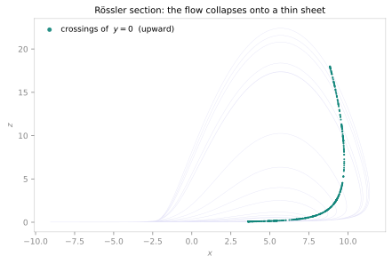
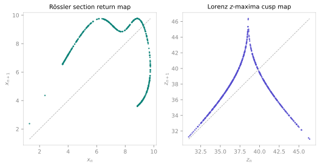

<span class="ts-kicker">Tutorial · Poincaré sections & return maps</span>

# Poincaré sections & return maps

A three-dimensional strange attractor looks like an impenetrable tangle of
wire. Yet buried inside many of them is a **one-dimensional map** — a single
humped curve $v_{n+1} = F(v_n)$ that governs the whole thing. This tutorial is
the two-step descent that finds it: first Poincaré's trick of watching only
where the flow pierces a surface (dropping one dimension and turning the flow
into a discrete map), then the return map that reads the surviving dynamics off
a recurring scalar. We do it on the Rössler flow, then reproduce Lorenz's 1963
result — the $z$-maxima cusp — the observation that started the whole subject.

Everything below is reproducible: initial conditions and seeds are pinned, and
each printed value is what the shown code returns.

## 1. A surface of section

Pick a hyperplane $\Sigma$ in state space and record the ordered points where
the trajectory crosses it, always in the same direction. That sequence is the
**surface of section**; the rule carrying one crossing to the next is the
**Poincaré (first-return) map**. A periodic orbit becomes a finite set of
points, a torus a closed loop, a strange attractor a structured cloud one
dimension lower than the flow.

[`poincare_section`](../analysis/poincare.md) does this for a live system. We
first settle onto the attractor (so the transient does not pollute the section),
then section the Rössler flow on the plane $y = 0$, keeping only upward
crossings:

```python
import numpy as np
import tsdynamics as ts

ros = ts.systems.Rossler()          # a=0.2, b=0.2, c=5.7 — the classic chaotic band

section = ts.poincare_section(
    ros,
    plane=("y", 0.0, "up"),         # section y = 0, crossed with ẏ > 0
    crossings=500,
    dt=0.02,
    seed=0,
)

section.summary()
# PoincareSection  (Rossler)
#   crossings = 500
#   dim = 3
#   plane = (1, 0.0)
#   direction = up (+)

section.y[:3, [0, 2]]               # (x, z) at the first three crossings
# array([[1.2932, 0.0449],
#        [2.3779, 0.0578],
#        [4.3606, 0.1081]])
```

The `plane=("y", 0.0, "up")` spelling names the axis by its `variables` entry
and gives the direction as a word; `("y", 0.0)` alone, an index `(1, 0.0)`, or a
general `(normal, offset)` all work too (see the
[Poincaré reference](../analysis/poincare.md)). The return value is a
`PoincareSection` — a `Trajectory` subclass carrying the full-dimensional
crossing states plus a `.summary()` / `.to_dict()` / `.plot` surface.

Under the hood this marches the whole attractor and refines every crossing with
cubic Hermite interpolation in a **single Rust engine call** — roughly two orders
of magnitude faster than a per-`dt` Python loop.

<figure class="ts-fig" markdown>
{ loading=lazy }
<figcaption><span class="lbl">FIG 1</span> · the Rössler flow (faint indigo, $x$–$z$ projection) crossed by the plane $y = 0$. The teal crossings collapse from the full band onto a thin, near-one-dimensional sheet — the geometric statement that the attractor is <em>almost</em> two-dimensional, and its section <em>almost</em> a curve. That near-1-D-ness is what makes the return map in §3 single-valued.</figcaption>
</figure>

## 2. The section as a discrete map

The same section is also a **derived system** you can hand to any map analysis.
[`.poincare()`](../analysis/poincare.md) wraps the flow and presents crossing
$n \mapsto$ crossing $n+1$ as a `DiscreteMap`-shaped object:

```python
pmap = ros.poincare("y", 0.0, direction="up")
# ...the verb builds exactly ts.derived.PoincareMap(ros, ("y", 0.0, "up")),
# and both spellings take the same plane vocabulary.

sec = pmap.trajectory(500, transient=50, ic=[1.0, 1.0, 1.0])
len(sec.y)              # 500 crossings (after discarding the first 50)
```

Here `transient` counts **crossings** to discard, not time — the glossary
distinction that keeps section transients separate from integration transients.
Because a `PoincareMap` *is* a map, you can drive the whole discrete toolkit
through it. An [`orbit_diagram`](../analysis/orbit-diagrams.md) over a control
parameter of the wrapped flow, for instance, is a genuine **bifurcation diagram
of the flow** — the period-doubling cascade you would otherwise have to read off
by eye:

```python
od = ts.orbit_diagram(pmap, "c", np.linspace(3.0, 6.0, 200),
                      component=0, transient=100, points_per_value=80, ic=[1.0, 1.0, 1.0])
od.bifurcation_points()[:3]     # where the cascade branches
```

## 3. The first-return map

Sectioning gives full crossing *states*; the **return map** goes one step
further and plots a single observable at successive crossings against itself —
$v_{n+1}$ vs $v_n$ — the literal 1-D map. [`return_map`](../analysis/orbit-diagrams.md)
with `method="poincare"` does this on the same section:

```python
rm = ts.return_map(ros, "x", method="poincare",
                   plane=("y", 0.0), direction=+1,
                   n=500, dt=0.02, seed=0)

len(rm)                 # 499  — one pair per consecutive crossing
rm.current[:3]          # array([1.2932, 2.3779, 4.3606])   (x_n)
rm.successor[:3]        # array([2.3779, 4.3606, 7.8082])   (x_{n+1})
```

`rm.current` / `rm.successor` are the scatter arrays $(x_n, x_{n+1})$; iterate
`rm` for the pairs, or call `rm.flat()`. The result renders itself —
`rm.to_plot_spec()` builds a `return_map` scatter with the fixed-point diagonal
$v_{n+1} = v_n$ drawn in, and `rm.cobweb()` gives the cobweb-plot variant.

Plotted (Fig 2, left) the Rössler return map is a single-valued curve with one
smooth hump — the flow's chaos is organised by an effectively one-dimensional,
noninvertible map, exactly as the thin section in Fig 1 promised.

## 4. The Lorenz z-maxima cusp

Lorenz's original 1963 construction did not even need a section: he recorded the
**successive local maxima of $z$** and plotted each against the next. Do the same
with `method="max"` (the default), on the Lorenz attractor, again settling first:

```python
lor = ts.systems.Lorenz()
ic = lor.integrate(final_time=40.0, dt=0.01, ic=[1.0, 1.0, 1.0]).y[-1]
# ic ≈ [4.369, 1.717, 26.335]  — a point on the attractor

zc = ts.return_map(lor, "z", method="max", n=2000,
                   final_time=400.0, dt=0.01, ic=ic)

len(zc)                 # 532  — that many z-maxima in 400 time units
zc.values.min(), zc.values.max()   # (30.976, 46.366)  — the range of maxima
zc.current[:3]          # array([36.488, 38.309, 43.115])   (z_n^max)
zc.successor[:3]        # array([38.309, 43.115, 34.766])   (z_{n+1}^max)
```

Plotted (Fig 2, right), the 532 pairs fall on a sharp tent — the famous
**cusp map**. This is Lorenz's punchline: the strange attractor, for all its
apparent complexity, hides a one-dimensional map with a single unstable fixed
point (where the curve crosses the diagonal) whose slope exceeds one in
magnitude everywhere — the analytic fingerprint of chaos. `return_map` sharpens
each maximum by parabolic interpolation, so a coarse `dt` still lands the peaks
accurately.

<figure class="ts-fig" markdown>
{ loading=lazy }
<figcaption><span class="lbl">FIG 2</span> · first-return maps of two flows, each with the diagonal $v_{n+1}=v_n$ dashed. <strong>Left:</strong> the Rössler section's $x$-return map (teal) — a single-valued unimodal curve. <strong>Right:</strong> the Lorenz $z$-maxima cusp (indigo) — the sharp tent Lorenz drew in 1963. Where each curve crosses the diagonal is an unstable fixed point of the reduced 1-D dynamics; the steep slope there is the mechanism of the chaos.</figcaption>
</figure>

## Reading the result

- **A tight, single-valued curve** (both panels of Fig 2) means the asymptotic
  motion is effectively governed by a 1-D map — you can study the flow's chaos
  with the entire theory of one-dimensional maps (fixed points, their slopes,
  the [orbit diagram](../analysis/orbit-diagrams.md), symbolic dynamics).
- **A filled, multi-valued cloud** means it is not 1-D — the section is genuinely
  two- or higher-dimensional, and the return map is only a projection. That is
  itself diagnostic: it says the attractor's dimension exceeds two by more than a
  little.
- **Extrema vs Poincaré.** `method="max"`/`"min"` need no plane — they read peaks
  of one coordinate (Lorenz's construction). `method="poincare"` reads the
  observable at section crossings and needs a `plane`. Use extrema when a
  coordinate has clean, well-separated maxima; use a section when it does not, or
  when you want the crossings for other analyses too.

## Pitfalls

| Situation | What to do |
|---|---|
| First crossings look transient | Settle first (integrate, take `y[-1]` as `ic`) or pass `skip_crossings=` / `transient=` (crossings, not time). |
| Return map is a fuzzy band, not a curve | The attractor is not near-1-D on this observable — try a different component, or accept it as evidence of higher dimension. |
| `dt` too coarse, peaks missed | In `method="poincare"` `dt` only has to not *skip* a crossing; in extremum mode the peak is parabolically sharpened, so a coarse grid is usually fine — but a `dt` larger than the oscillation will still lose maxima. |
| Section on a stiff / DDE flow | The engine fast path needs a numeric RHS and an explicit method; stiff defaults, DDEs and `backend="reference"` fall back to the (correct, slower) Python loop automatically. |

## See also

- [Poincaré sections](../analysis/poincare.md) — the full section / `PoincareMap` API, plane spellings, and the event engine behind it
- [Orbit & bifurcation diagrams](../analysis/orbit-diagrams.md) — `return_map`, `OrbitDiagram`, and cascades over a `PoincareMap`
- [Lyapunov spectra](../analysis/lyapunov.md) — the quantitative counterpart to the steep cusp slope
- [Fixed & periodic points](../analysis/fixed-points.md) — locating the return map's fixed points and periodic orbits
