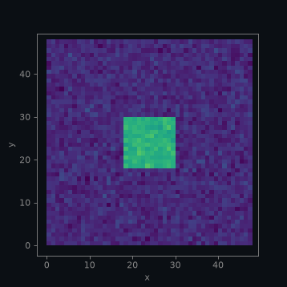
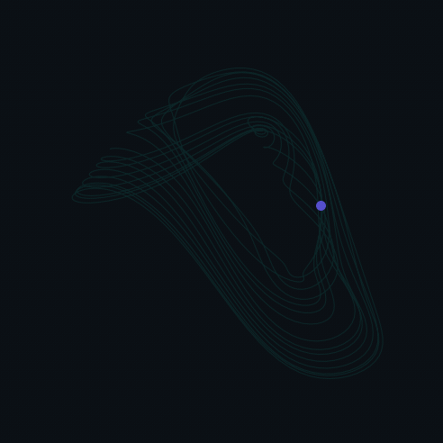
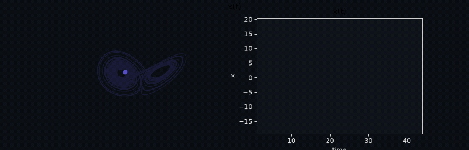

<span class="ts-kicker">Visualization · Animation</span>

# Animation

A trajectory *moves*. A static phase portrait is the whole orbit collapsed onto
one page — every loop of the Lorenz butterfly drawn at once — which is exactly
what you want for a figure but exactly wrong for building intuition, giving a
talk, or watching a transient settle onto an attractor. TSDynamics turns any
plot into a movie by attaching one small directive, and the semantic plot is
otherwise untouched: the same [`PlotSpec`](../reference/top-level.md) that
renders a still renders the animation, and a backend that cannot animate simply
draws the final frame.

Animation is an **orthogonal modifier**. It is not a new
[`PlotKind`](../reference/top-level.md) — a 3-D phase portrait stays a
`PHASE_PORTRAIT_3D`, a time series stays a `TIME_SERIES` — it is an
[`Animation`](../reference/top-level.md) object hung on `spec.animation` that
says *how the existing data plays over time*. Because the directive is plain,
serializable data it round-trips through `to_dict`/`from_dict` and ships to a web
frontend untouched, and because it rides on the spec rather than a renderer, the
same `.trail(...)` reads identically whether you export an mp4, an interactive
HTML page, or a three.js viewer.

<figure class="ts-fig" markdown>
{ loading=lazy }
<figcaption><span class="lbl">FIG 1</span> · a <strong>reveal comet</strong> of the Lorenz attractor: <code>to_plot_spec(animate=True)</code> keeps the full static curve and each frame shows a moving head (amber) with a fading tail reaching back 6 time units (indigo), axes hidden and drawn on the brand dark stage — the same "attractor floating in a dark room" look as the live <a href="backends.md#live-demo">WebGL viewer</a>. Built by the exact snippet in <a href="#a-first-animation">the first example below</a> and saved as a small looping GIF.</figcaption>
</figure>

---

## A first animation

The whole API hangs off one front-door argument. Every plot builder —
`Trajectory.to_plot_spec`, `system.to_plot_spec`, `ts.viz.plot` — takes
`animate=`, and `animate=True` stamps the default animation onto the spec:

```python
import tsdynamics as ts

lor = ts.systems.Lorenz()
traj = lor.run(final_time=45.0, dt=0.01, ic=[1.0, 1.0, 1.0]).after(3.0)

spec = traj.to_plot_spec(components=["x", "y", "z"], animate=True)
spec.is_animated      # True — an Animation is attached
spec.kind             # PlotKind.PHASE_PORTRAIT_3D — the semantic kind is unchanged
```

The `animate=True` above is the figure at the top of the page, minus its styling.
The committed version chains the fluent tweaks, hides the axes, and saves the GIF
on the brand dark stage — every number below is the value the code actually
produces:

```python
AMBER, INDIGO, STAGE = "#E8912D", "#574FCF", "#0B0F14"

spec = (
    traj.to_plot_spec(components=["x", "y", "z"], animate=True)
    .animate(n_frames=100, fps=25)          # 100 frames at 25 fps -> a 4 s loop
    .trail(("time", 6.0), fade=True)        # tail reaches back 6 time units, fading
    .head(size=9.0, color=AMBER)            # amber "current state" marker
    .style(lw=0.8, axes=False)              # thin line, no axes
    .recolor(INDIGO)
    .camera(elev=22, azim=-60)              # a good butterfly angle
    .background(STAGE)                       # the dark stage (see the note below)
    .size(6.4, 6.0)
)
spec.save("lorenz-reveal.gif", dpi=85)      # .gif -> matplotlib FuncAnimation
```

Every method here **mutates the spec and returns it**, so the chain is one
expression. They are the same fluent tweaks the
[styling page](styling.md) documents (`.style`, `.recolor`, `.size`,
`.background`) plus the animation-specific ones (`.animate`, `.trail`, `.head`,
`.camera`) covered here.

!!! tip "Animate on a solid background, not a transparent one"
    A GIF has no real alpha channel — a *transparent* figure is flattened to a
    single fill colour by the encoder, which many viewers render as a jarring
    green. Give an animation an explicit **solid** background so it lands on a
    clean stage: `.background("#0B0F14")` (the brand dark) here, or any colour /
    a `.theme(...)`. The committed hero loops all use the dark stage, matching the
    WebGL viewers. A still `.png`/`.svg` save is unaffected (it keeps real
    transparency).

---

## A gallery

The same one-directive API drives every kind of motion. Each loop below is built
by the exact snippet beside it — an IC- or seed-pinned trajectory, a fluent
`.animate`/`.trail`/`.head`/`.camera` chain, and a `.background("#0B0F14")` stage
— and lives in `docs/_tooling/make_viz_figures.py`.

### A spinning attractor that accretes

`camera(spin=…)` sweeps the azimuth over the loop while a **persistent** trail
(`.trail(None)`) draws the whole orbit in and keeps it — the elegant "watch it
accrete while it turns" hero shot. Camera spin is a matplotlib-only knob.

<figure class="ts-fig" markdown>
{ loading=lazy }
<figcaption><span class="lbl">FIG 2</span> · the <strong>Aizawa</strong> attractor with <code>.trail(None)</code> (persistent — nothing erases) and <code>.camera(spin=1.0)</code>: one full revolution over the loop as the teal orbit draws itself in, an indigo head leading.</figcaption>
</figure>

```python
import tsdynamics as ts

TEAL, INDIGO = "#2CC5AE", "#574FCF"
aiz = ts.systems.Aizawa()
traj = aiz.run(final_time=95.0, dt=0.01, ic=[0.1, 0.0, 0.0]).after(15.0)

spec = (
    traj.to_plot_spec(components=[0, 1, 2], animate=True)   # Aizawa has no named vars
    .animate(n_frames=100, fps=25)
    .trail(None)                          # persistent — the orbit accretes and stays
    .head(size=9.0, color=INDIGO)
    .camera(elev=18, azim=-70, spin=1.0)  # one full revolution over the loop
    .style(lw=0.7, axes=False)
    .recolor(TEAL)
    .background("#0B0F14")
    .size(6.0, 6.0)
)
spec.save("aizawa-spin.gif", dpi=74)
```

### A pattern-formation field movie

The `"frames"` model (below) plays a spatially-extended system's field over time.
Gray–Scott's activator grows and divides into a Turing pattern — genuinely
striking, and honest: each frame is a real spatial snapshot, not a comet.

<figure class="ts-fig" markdown>
{ loading=lazy }
<figcaption><span class="lbl">FIG 3</span> · a <strong>Gray–Scott</strong> reaction–diffusion field played frame by frame with <code>kind="field", animate=True</code> — the activator self-replicates into a Turing pattern (viridis). This is the <code>frames</code> model, covered <a href="#the-spatial-field-movie">below</a>.</figcaption>
</figure>

```python
import tsdynamics as ts

# GrayScott has a deterministic seeded IC, so the pattern is reproducible.
gs = ts.systems.GrayScott()
gtr = gs.run(final_time=4000.0, dt=85.0)     # a 48x48 reaction-diffusion field

spec = (
    gtr.to_plot_spec(kind="field", animate=True)   # SPATIAL_FIELD, mode="frames"
    .animate(fps=14)
    .style(cmap="viridis")
    .background("#0B0F14")
    .size(4.6, 4.6)
)
spec.save("gray-scott-field.gif", dpi=78)
```

### A delay-embedding reveal

A scalar delay system's true state lives in an infinite-dimensional history
space; the [delay embedding](plotting.md#delay-embedding) `x(t)` vs `x(t − τ)`
reconstructs its attractor, and a comet sweeps it in.

<figure class="ts-fig" markdown>
{ loading=lazy }
<figcaption><span class="lbl">FIG 4</span> · the <strong>Mackey–Glass</strong> delay embedding <code>x(t)</code> vs <code>x(t − 17)</code>, revealed as a teal comet with an indigo head — the folded chaotic band of a DDE reconstructed from one scalar signal.</figcaption>
</figure>

```python
import numpy as np
import tsdynamics as ts

mg = ts.systems.MackeyGlass()
traj = mg.run(
    final_time=900.0, dt=0.5,
    history=lambda s: [1.0 + 0.1 * np.sin(0.2 * s)],
).after(150.0)

spec = (
    traj.to_plot_spec(kind="delay", components="x", delay_time=17.0, animate=True)
    .animate(n_frames=100, fps=25)
    .trail(("time", 120.0), fade=True)
    .head(size=8.0, color="#574FCF")
    .style(lw=0.6, axes=False)
    .recolor("#2CC5AE")
    .background("#0B0F14")
    .size(5.6, 5.6)
)
spec.save("mackey-glass-delay.gif", dpi=88)
```

### A two-panel lockstep composite

A [composite](composition.md) plays every panel on **one master clock**. Here the
state head on the 3-D butterfly and the sweep on its own `x(t)` trace advance
together — the same instant shown two ways. Passing a fully-built `Animation` at
compose time propagates the whole timeline (frame count *and* trail) into each
panel, with the per-kind head default (a head on the portrait, none on the time
series).

<figure class="ts-fig" markdown>
{ loading=lazy }
<figcaption><span class="lbl">FIG 5</span> · a <strong>lockstep composite</strong> via <code>ts.viz.plot(portrait, trace, layout="row", animate=Animation(...))</code>: the 3-D Lorenz reveal (indigo) and its <code>x(t)</code> trace (teal) play on one master clock — the head on the butterfly and the sweep on the trace are the same instant.</figcaption>
</figure>

```python
import tsdynamics as ts
from tsdynamics.viz import get_theme, plot
from tsdynamics.viz.producers import time_series
from tsdynamics.viz.spec import Animation

lor = ts.systems.Lorenz()
traj = lor.run(final_time=42.0, dt=0.01, ic=[1.0, 1.0, 1.0]).after(3.0)

portrait = (
    traj.to_plot_spec(components=["x", "y", "z"])
    .style(lw=0.7, axes=False).recolor("#574FCF").camera(elev=22, azim=-60)
)
portrait.relabel(title="")
trace = time_series(traj, components=["x"]).style(lw=1.0).recolor("#2CC5AE")
trace.relabel(title="x(t)", x="time", y="x")
# keep the visible time-series axes legible on the dark stage
trace.theme(get_theme("dark"))

# A fully-built master Animation so both panels inherit frame count AND trail.
master = Animation(n_frames=100, fps=25, trail_kind="time", trail_length=6.0, trail_fade=True)
comp = plot(portrait, trace, layout="row", animate=master).size(8.0, 4.1)
comp.save("lorenz-composite.gif", dpi=80)
```

---

## `animate=` — three ways to attach

`animate=` accepts three forms, in increasing order of control:

| Form | Meaning |
| --- | --- |
| `animate=True` | Attach the **per-kind defaults** (see below). |
| `animate={...}` | A dict overriding individual [`Animation`](../reference/top-level.md) fields on top of the defaults. |
| `animate=Animation(...)` | A fully built `Animation`, used verbatim. |

```python
from tsdynamics.viz.spec import Animation

# defaults
a = traj.to_plot_spec(components=["x", "y", "z"], animate=True)

# a dict tweaks specific fields (the rest stay at their per-kind defaults)
b = traj.to_plot_spec(components=["x", "y", "z"], animate={"fps": 24, "n_frames": 60})
b.animation.fps          # 24
b.animation.n_frames     # 60

# an Animation is copied in verbatim
c = traj.to_plot_spec(components=["x", "z"], animate=Animation(fps=15, spin=1.0))
c.animation.spin         # 1.0
```

The `Animation` passed in is **copied**, never stored by reference, so a later
`.trail(...)`/`.head(...)` on the spec does not reach back and mutate your
object.

Either build the animation at the front door with `animate=`, or attach it
afterwards with the fluent `.animate()` — calling `.animate()` on a *static*
spec makes it animated with the same defaults. The two are equivalent:

```python
# these produce the same spec
traj.to_plot_spec(components=["x", "y", "z"], animate=True)
traj.to_plot_spec(components=["x", "y", "z"]).animate()
```

### Per-kind defaults

`animate=True` picks sensible defaults *by plot kind* so the common case needs no
tuning:

- A **windowed comet** — a moving head plus a short trailing tail over the full
  faint curve. The tail defaults to `("steps", …)` ≈ 1/10 of the series length,
  capped at 200 samples, which keeps the comet crisp and (for the interactive
  backends) the export small.
- The **head marker is on for everything except a plain time series** — a moving
  dot makes sense on a phase portrait or a spacetime sweep line, but a time
  series reads better as a bare growing curve.
- A **[spatial-field](#the-spatial-field-movie) spec always animates in the
  `frames` model** (the field movie) regardless of the other defaults.

```python
d = traj.to_plot_spec(components=["x", "y", "z"], animate=True)
d.animation.trail_kind      # 'steps'
d.animation.trail_length    # 200.0   (min(n_steps // 10, 200); n_steps = 4201)
d.animation.head            # True    (a 3-D portrait)

e = traj.to_plot_spec(components="x", animate=True)   # a TIME_SERIES
e.animation.head            # False   (a bare growing curve)
```

A persistent "orbit draws itself in" — the classic reveal where nothing ever
erases — is one tweak away: `.trail(None)`, covered next.

---

## The reveal model — comets, trails, heads

The default frame model is `"reveal"`. The layer keeps its **full static data**
and each frame shows a *slice* of it: the head sits at the current sample, and a
tail reaches back behind it. `O(data)` memory — nothing is recomputed per frame.
It covers every trajectory-shaped plot: phase portraits, delay embeddings, time
series, and spacetime images (where the "head" is a sweep line).

Three fluent methods shape the comet.

### `.animate(...)` — the timeline

```python
spec.animate(
    fps=30,              # playback frames per second
    n_frames=120,        # explicit frame count (wins over duration)
    duration=None,       # OR total seconds — with fps this fixes the frame count
    loop=True,           # repeat forever
    pingpong=False,      # play forward then reverse each loop
    mode="reveal",       # "reveal" (comet) or "frames" (field movie)
)
```

The frame count resolves as: `n_frames` if given, else `round(duration * fps)`,
else a capped default — always clamped to at most the number of samples (you
cannot reveal more distinct points than exist):

```python
s = traj.to_plot_spec(components="x", animate=True).animate(duration=4.0, fps=30)
s.animation.frame_count(len(traj.t))   # 120  (= 4.0 * 30)
```

`pingpong=True` mirrors the frame sequence — forward, then back — for a
seamless there-and-back loop:

```python
a = Animation(n_frames=5, pingpong=True)
a.head_indices(100)     # [0, 25, 50, 74, 99, 74, 50, 25]  (forward then reverse)
```

### `.trail(length, *, fade)` — the tail behind the head

The tail length is given in physical **time** units or sample **steps**, or
`None` for a *persistent* trail that never erases:

```python
spec.trail(("time", 6.0))     # tail reaches back 6.0 time units
spec.trail(("steps", 300))    # tail is the last 300 samples
spec.trail(None)              # persistent — the curve draws itself in and stays
spec.trail(("time", 6.0), fade=True)   # + fade the tail opacity from head to tail
```

A `"time"` length is converted to a sample count using the trajectory's `dt`
(recorded on `meta["dt"]`, so it resolves at render time). A persistent trail
resolves to `None` samples — the whole revealed curve is kept:

```python
persistent = traj.to_plot_spec(components=["x", "y", "z"], animate=True).trail(None)
persistent.animation.tail_samples(0.01)   # None  (keep everything revealed so far)

windowed = traj.to_plot_spec(components=["x", "y", "z"], animate=True).trail(("time", 6.0))
windowed.animation.tail_samples(0.01)     # 600   (6.0 / 0.01)
```

### `.head(...)` — the moving "current state" marker

```python
spec.head(show=True, size=7.0, color="#E8912D", symbol="o")
```

`color=None` (the default) inherits the layer colour; pass an explicit colour —
as the top figure does with amber against an indigo trail — to make the head pop.
`show=False` drops the marker for a pure trailing curve.

!!! note "The tail window is a speed *and* size lever"
    A short tail (`("steps", 200)`) keeps the comet crisp and, for the plotly and
    three.js exports, keeps the streamed data tiny — the interactive page only
    ever holds a sliding window. A persistent trail (`.trail(None)`) is the most
    dramatic ("watch the whole attractor accrete") but the heaviest. Reach for a
    windowed comet for a talk loop and a persistent trail for a single hero shot.

---

## 3-D camera — angle and spin

For a 3-D spec, `.camera(...)` sets a fixed viewing angle and/or an animated
spin:

```python
spec.camera(elev=22, azim=-60)   # a fixed angle (static — recorded in meta["camera"])
spec.camera(spin=2.0)            # revolve the camera 2 full turns over the animation
```

`elev`/`azim` are a static tweak (they apply to a still too); `spin` is the
animated one — it makes the azimuth sweep `spin` full turns over the whole
playback, and setting it *turns animation on*:

```python
orbit = traj.to_plot_spec(components=["x", "y", "z"]).camera(elev=22, azim=-60, spin=2.0)
orbit.is_animated          # True — spin implied an animation
orbit.animation.spin       # 2.0
orbit.meta["camera"]       # {'elev': 22.0, 'azim': -60.0}
```

Camera spin is a matplotlib feature. In the interactive backends you *orbit the
camera yourself* while the comet plays (see [export targets](#export-targets)),
so a scripted spin is unnecessary there.

---

## A live time readout — `.clock(...)`

`.clock()` draws a time label that updates each frame — useful when the physical
time, not just the frame index, carries meaning (a forced oscillator, a slow
transient):

```python
spec.clock(fmt="t = {t:.1f}s")    # {t} is the current time
spec.animation.clock              # True
spec.animation.clock_format       # 't = {t:.1f}s'
```

The `{t}` field is the current physical time, read from the trajectory grid. The
clock is a matplotlib-only overlay (like camera spin).

---

## Hiding the axes — `.style(axes=False)`

Not animation-specific, but the reason most attractor movies read well:
`.style(axes=False)` hides the ticks, labels, gridlines, and (in 3-D) the grey
background panes, for a clean "object floating in space" look. Every renderer
honors it — matplotlib turns the axes off, plotly sets the scene axes invisible,
three.js drops its grid. The top figure uses it; so should most hero loops.

```python
spec = (
    traj.to_plot_spec(components=["x", "y", "z"], animate=True)
    .style(lw=0.6, axes=False)      # thin line, no axes
    .recolor("#574FCF")
)
```

---

## The spatial-field movie

A [spatially-extended system](../systems/ode/spatial-fields/index.md) — a method-of-lines PDE whose state
vector is a flattened field — animates *differently*. There is no comet: each
frame is the field's **spatial state at that instant**, so consecutive frames
carry genuinely different data. This is the `"frames"` frame model, and it is
reached through the `kind="field"` recipe:

```python
gs = ts.systems.GrayScott()
gtr = gs.run(final_time=1500.0, dt=5.0)      # a 48x48 reaction-diffusion field

movie = gtr.to_plot_spec(kind="field", animate=True)
movie.kind                 # PlotKind.SPATIAL_FIELD
movie.animation.mode       # 'frames'  (forced — the field IS the motion)
movie.animation.head       # False     (no comet, no head marker)
movie.layers[0].data["frames"].shape   # (T, 48, 48) — every per-time snapshot stacked
```

[FIG 3](#a-pattern-formation-field-movie) above is exactly this — the Gray–Scott
activator field played frame by frame. The per-frame plot follows the field's
**spatial dimensionality**, dispatched from the system's `_field_shape` metadata
(recorded on `meta["field_shape"]` at integration time):

- A **2-D field** `u(x, y)` — Gray–Scott, Swift–Hohenberg — plays as an `imshow`
  **heatmap** movie.
- A **1-D field** `u(x)` — Kuramoto–Sivashinsky — plays as a travelling-wave
  **line** (the moving spatial profile).

```python
import numpy as np

ks = ts.systems.KuramotoSivashinsky()
ic = 0.1 * np.cos(np.linspace(0.0, 2.0 * np.pi, ks.dim, endpoint=False))
ktr = ks.run(final_time=150.0, dt=0.5, ic=ic).after(20.0)

wave = ktr.to_plot_spec(kind="field", animate=True)
wave.kind                             # PlotKind.SPATIAL_FIELD
wave.layers[0].data["frames"].shape   # (T, 32) — a 1-D profile stacked over time
wave.save("ks-wave.gif")
```

The static save of a field movie is the **final** field — a `.png` of a
`kind="field"` spec is the last snapshot — so a still and a movie share one spec.
A multi-block field state (Gray–Scott packs an activator `v` and inhibitor `u`)
declares `field_labels`; `components="u"` / `"v"` picks the block, defaulting to
the last (the activator). See the [Visualization overview](index.md) for the
static two-panel spatial-field showcase (a Gray–Scott heatmap beside a
Kuramoto–Sivashinsky space–time diagram).

!!! note "The field movie is matplotlib-only"
    The `frames` model plays through the matplotlib renderer (mp4 / gif). Plotly
    *declines* an animated `SPATIAL_FIELD` and draws the static final field
    instead; three.js draws a 1-D profile and declines a 2-D field. For a shared,
    interactive field explorer, export the static heatmap and animate offline.

---

## Export targets

`spec.save(path)` picks the backend from the file extension. The routing differs
for an animated spec:

| Extension | Backend | What you get |
| --- | --- | --- |
| `.mp4` / `.gif` | matplotlib | A rendered video / looping GIF (`FuncAnimation`, written via ffmpeg / pillow). |
| `.html` | plotly | A **self-contained, real-time** interactive page — the comet streams and you can orbit the 3-D camera while it plays. |
| three.js (`.json`) | three.js exporter | A geometry payload plus a `metadata.animation` block a WebGL loader plays as a reveal comet. |
| `.png` / `.svg` / `.pdf` | matplotlib | The **final frame** (the fully-revealed curve / final field) — an animated spec still makes a clean still. |

```python
spec.save("orbit.gif")     # looping GIF (matplotlib)
spec.save("orbit.mp4")     # video (matplotlib, needs ffmpeg)
spec.save("orbit.html")    # interactive real-time comet (plotly)
spec.save("orbit.png")     # the final, fully-revealed frame (matplotlib)
```

`fps`, `dpi`, and `size` can be overridden on the `save` call for that write
only:

```python
spec.save("orbit.mp4", fps=60, dpi=150, size=(1280, 720))
```

### matplotlib — mp4 / gif

The reference animator builds a [`FuncAnimation`](https://matplotlib.org/) and
writes it with the writer inferred from the extension (`ffmpeg` for `.mp4`,
`pillow` for `.gif`). This is the path that honors **camera spin, the clock, and
the spatial-field movie** — the features the interactive backends do not carry.
The GIF at the top of this page is exactly this path at `dpi=80`.

### plotly — real-time interactive HTML

`spec.save("x.html")` on an animated spec writes a self-contained page whose
comet is streamed in real time by mutating the trace buffers in place. The full
attractor is drawn once (static, and for 3-D fully rotatable), and a
`requestAnimationFrame` loop advances a windowed comet plus a single-point head
over it. A minimal play/pause + restart overlay with a percent readout makes it
obviously alive.

The honest fact about 3-D here: plotly's WebGL 3-D traces cannot be *streamed
while you orbit* — every per-frame 3-D update forces a full scene replot that
would eat the drag gesture. So the loop **pauses the comet stream for the
duration of a drag** and resumes on release from where it paused, leaving the
scene free to orbit as smoothly as a static plot. You get both — a playing comet
*and* a rotatable camera — just not simultaneously mid-drag. 2-D plots have no
orbit gesture and stream continuously.

### three.js — a `metadata.animation` block

The three.js exporter adds an `animation` block to `metadata` when the spec is
animated; the geometry buffers are byte-identical to the static export. The
reference WebGL loader plays it as a reveal comet — a faint full-curve backdrop,
a bright windowed trail advanced by `setDrawRange`, and a moving head point — on
its own animation clock, and because the draw-range update is independent of the
orbit controls, the camera is held still by default yet **orbitable while it
plays**:

```python
from tsdynamics.viz.render import render_spec

spec = traj.to_plot_spec(components=["x", "y", "z"], animate=True).animate(fps=30).trail(("time", 4.0))
payload = render_spec(spec, "threejs")
"animation" in payload.payload["metadata"]      # True
sorted(payload.payload["metadata"]["animation"])
# ['duration', 'fps', 'head', 'head_color', 'head_size', 'loop',
#  'n_frames', 'n_samples', 'pingpong', 'trail_length_samples']
```

The reveal sweeps a **line** index buffer, so the block is emitted only for
`LINE` / `LINE3D` specs. An animated points-only or surface-only spec has no
comet to sweep, so the exporter drops to a **static payload and warns**
(`VisualizationDegraded`) rather than silently pretending to animate:

```python
import warnings
from tsdynamics.viz.producers import spacetime

img = spacetime(traj).animate(fps=10)     # a SPACETIME (IMAGE) — no line to sweep
with warnings.catch_warnings(record=True) as w:
    warnings.simplefilter("always")
    payload = render_spec(img, "threejs")
"animation" in payload.payload["metadata"]   # False — a static export
# w carries one VisualizationDegraded warning
```

---

## Serialization

Because the `Animation` is plain data, an animated spec round-trips losslessly.
The directive survives `to_dict`/`from_dict`, so a computed animation can be
cached, shipped to a web frontend, or replotted without recomputation — and it
adds **no** new `PlotKind` (the frozen plot-kind vocabulary is untouched):

```python
from tsdynamics.viz.spec import PlotSpec

spec = (
    traj.to_plot_spec(components=["x", "y", "z"], animate=True)
    .animate(fps=25, n_frames=50)
    .trail(("steps", 300))
)
d = spec.to_dict()
d["animation"]["fps"]        # 25.0

rt = PlotSpec.from_dict(d)
rt.is_animated               # True
rt.animation.trail_kind      # 'steps'
```

---

## Reference — the `Animation` fields

Every fluent tweak above sets one or more fields on the
[`Animation`](../reference/top-level.md) directive. The full set, with defaults:

| Field | Default | Set by | Meaning |
| --- | --- | --- | --- |
| `fps` | `30.0` | `.animate(fps=)` | Playback frames per second. |
| `duration` | `None` | `.animate(duration=)` | Total seconds; with `fps` fixes the frame count. |
| `n_frames` | `None` | `.animate(n_frames=)` | Explicit frame count (wins over `duration`/`fps`). |
| `loop` | `True` | `.animate(loop=)` | Repeat forever. |
| `pingpong` | `False` | `.animate(pingpong=)` | Play forward then reverse each loop. |
| `mode` | `"reveal"` | `.animate(mode=)` | Frame model — `"reveal"` (comet) or `"frames"` (field movie). |
| `trail_kind` | `None` | `.trail(length=)` | Tail units — `"time"`, `"steps"`, or `None` (persistent). |
| `trail_length` | `None` | `.trail(length=)` | Tail length in the chosen units. |
| `trail_fade` | `False` | `.trail(fade=)` | Fade the tail opacity from head to tail. |
| `head` | `True` | `.head(show=)` | Draw the moving "current state" marker. |
| `head_size` | `6.0` | `.head(size=)` | Head marker size. |
| `head_color` | `None` | `.head(color=)` | Head colour (`None` inherits the layer colour). |
| `head_symbol` | `"o"` | `.head(symbol=)` | Head marker symbol. |
| `spin` | `0.0` | `.camera(spin=)` | Camera revolutions over the animation (3-D, matplotlib). |
| `clock` | `False` | `.clock(show=)` | Draw a live time readout (matplotlib). |
| `clock_format` | `"t = {t:.2f}"` | `.clock(fmt=)` | Clock label format (`{t}` = current time). |

---

## Pitfalls

- **`animate=True` on a spatial-field spec is a field movie, not a comet.** The
  `"frames"` model is forced for a `SPATIAL_FIELD` — you cannot put a comet on a
  PDE field, and asking for one is silently coerced to the field movie.
- **Camera spin and the clock are matplotlib-only.** Export those to `.mp4` /
  `.gif`. In plotly you orbit the camera by hand; a scripted `spin` is ignored.
- **`.mp4` needs ffmpeg on the `PATH`; `.gif` uses pillow** (a hard dependency,
  always available). Reach for `.gif` when ffmpeg is not installed.
- **A three.js animation only plays for a line.** A points- or surface-only
  animated spec exports as a static payload with a `VisualizationDegraded`
  warning — it does not silently drop the frames.
- **Always pin an explicit `ic=`** (or a `seed=` for a stochastic system) when a
  movie's shape must be reproducible — many catalogue systems draw a random IC
  each run, so an un-pinned attractor movie is a different orbit every time.

---

## See also

- [Plot kinds & the front door](index.md) — the `to_plot_spec` auto-dispatch and
  the semantic kinds an animation rides on
- [Styling & themes](styling.md) — the fluent `.style`/`.recolor`/`.theme`
  tweaks that compose with the animation ones, and `.style(axes=False)`
- [Composition](composition.md) — `ts.viz.plot(...)`: a composite plays its panels in
  lockstep on one master clock
- [three.js export](backends.md#threejs-export) — the interactive WebGL viewer the
  `metadata.animation` block drives
- [Spatially-extended systems](../systems/ode/spatial-fields/index.md) — the PDE
  catalogue the field movie visualises
