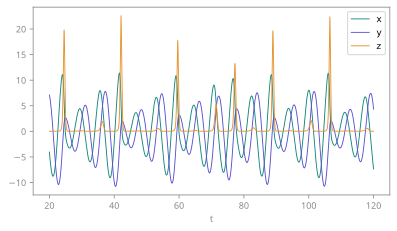
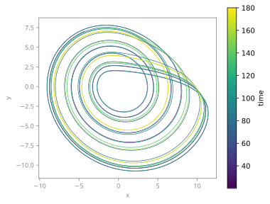
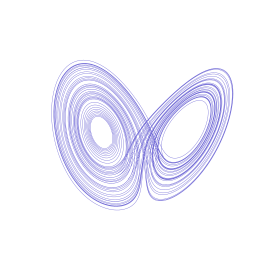
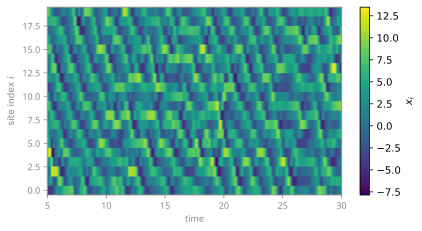
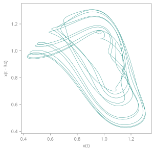
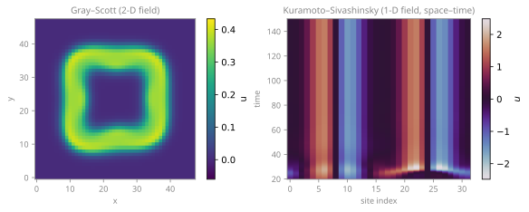
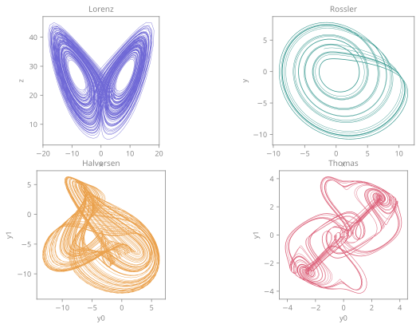
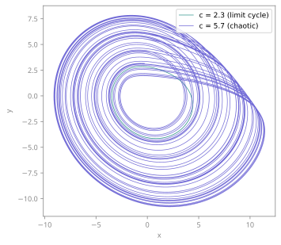
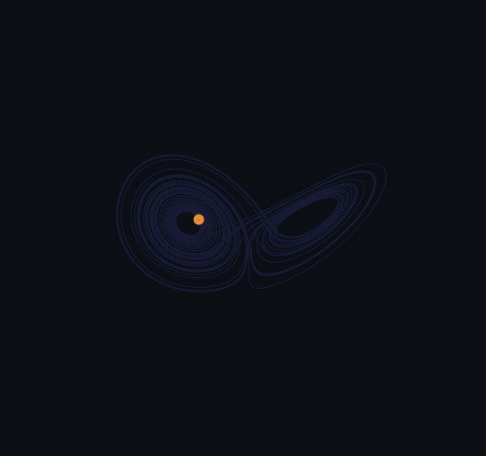

<span class="ts-kicker">Visualization · Transforms & primitives</span>

# Transforms & primitives

[`ts.plot`](index.md) is the verb. This page is its vocabulary: **what** it can
draw (a *transform*), **how** each one can be drawn (a *primitive*), and how to
add either.

```python
import tsdynamics as ts

traj = ts.systems.Lorenz(ic=[1.0, 1.0, 1.0]).run(final_time=100.0, dt=0.01)

ts.plot(traj)                       # the default view
ts.plot(traj, "psd")                # ...a named transform
ts.plot(traj, "phase_portrait", primitive="points3d")   # ...drawn differently
```

Three nouns, and nothing else in the library learns a new name when one is added:

- a **transform** turns a *subject* — a trajectory, a system, an analysis result,
  a bare array — into **geometry**: typed channels (`x`/`y`/`z`/`c`/…) in a named
  coordinate frame;
- a **primitive** is *how* that geometry is drawn — `line`, `points`, `image`,
  `contour`, `surface3d`, `quiver`, `band`, …;
- a **`Plot`** is what you get back.

A transform owns **no new math**. It adapts an estimator from
[`ts.analysis`](../analysis/index.md), which is where the numerics, the citation
and the tests live.

!!! tip "Plot straight from a system"

    `ts.plot(system, ...)` / `system.plot(...)` accept **run** keywords too
    (`final_time`, `dt`, `ic`, `solver`, …) — the system is run first, then
    drawn, and the two kinds of keyword are separated for you:

    ```python
    ts.plot(ts.systems.Rossler(ic=[1.0, 1.0, 1.0]),
            final_time=200, dt=0.05, components=["x", "y"])
    ```

## The default view: the kind follows the components

With no transform named, `ts.plot` picks the semantic kind from **how many
components you are drawing** — the natural view for that dimensionality:

| Components drawn | Auto kind | What you get |
| --- | --- | --- |
| 1 | `TIME_SERIES` | the channel against time |
| 2 | `PHASE_PORTRAIT_2D` | a 2-D orbit on equal axes |
| 3 | `PHASE_PORTRAIT_3D` | a 3-D attractor |
| 4 or more | `SPACETIME` | a component-vs-time field image |

```python
traj = ts.systems.Lorenz(ic=[1.0, 1.0, 1.0]).run(final_time=100, dt=0.01)

ts.plot(traj).kind                          # → 'phase_portrait_3d'  (all 3)
ts.plot(traj, components="x").kind             # → 'time_series'        (1)
ts.plot(traj, components=["x", "z"]).kind      # → 'phase_portrait_2d'  (2)
```

The 4+-case is deliberate: a high-dimensional flow (a Lorenz-96 lattice) reads
as a *spacetime field*, never as a misleading 3-D portrait of its first three
coordinates. A discrete-map orbit is drawn with a `SCATTER` mark (a point
sequence), not a joined line, because successive iterates are not continuous.

You override the auto-dispatch by **naming a transform positionally** —
`ts.plot(traj, "time_series")` — and you pick *which* channels with
`components=`. (On the method doors, `traj.plot(...)` and `system.plot(...)`,
`kind=` names any member of the closed `PlotKind` vocabulary directly.) The next
sections walk every default view; then come the named transforms, the
primitives, and how to add your own.

---

## Time series

One or more components against time. You get this automatically whenever a
single component is selected; naming `"time_series"` overlays *every* selected
component as its own line (a legend appears automatically for two or more).

```python
ros = ts.systems.Rossler(ic=[1.0, 1.0, 1.0]).run(final_time=200.0, dt=0.05)

# all three components, x(t) / y(t) / z(t), overlaid with a legend
ts.plot(ros, "time_series").save("rossler-ts.pdf")

# just one channel
ts.plot(ros, components="x").save("rossler-x.pdf")
```

<figure markdown>
{ loading=lazy }
<figcaption>The Rössler system's three components overlaid via <code>kind="time_series"</code>. The smooth <code>x</code>/<code>y</code> oscillation and the sharp periodic <code>z</code>-spikes (the reinjection kicks) are the signature of the Rössler folding — one legend, one set of axes.</figcaption>
</figure>

**Reading it.** Time runs along `x`; each layer is one state component. The
`z`-spikes are Rössler's fast reinjection events — the slow spiral in the
`(x, y)` plane is punctuated by a jump up in `z` that folds the orbit back.

Colour the line by a scalar with `color_by=` (see [below](#colour-by-a-scalar));
force a single-channel view of a 3-D trajectory with `components=`.

---

## 2-D phase portrait

Two components plotted against each other — the classic orbit view, on **equal
axes** so the geometry is undistorted. Auto-selected when you draw two
components.

```python
ros = ts.systems.Rossler(ic=[1.0, 1.0, 1.0]).run(final_time=200.0, dt=0.05)

ts.plot(ros, components=["x", "y"], color_by="time").save("rossler-xy.pdf")
```

<figure markdown>
{ loading=lazy }
<figcaption>The Rössler orbit projected onto the <code>(x, y)</code> plane, coloured by elapsed time (<code>color_by="time"</code>) along a viridis colorbar — the spiral winds outward, then folds. Colour-by-time turns a static orbit into a legible history: you can see which way it is going.</figcaption>
</figure>

**Reading it.** The orbit spirals outward in the plane and is periodically
folded back inward — the colour ramp (dark → bright with elapsed time) shows the
direction of travel, which a bare line cannot. Equal axes keep the spiral round
rather than squashed.

---

## 3-D phase portrait

Three components in space — the attractor itself. Auto-selected for a 3-D
trajectory. Hide the axes for a clean "object floating in space" look and frame
it with the camera.

```python
lor = ts.systems.Lorenz(ic=[1.0, 1.0, 1.0]).run(final_time=100.0, dt=0.01)

(
    ts.plot(lor)               # all three → phase_portrait_3d
       .style(axes=False)            # no ticks / labels / grey panes
       .camera(elev=22, azim=-60)    # frame the butterfly
       .save("lorenz-3d.pdf")
)
```

<figure markdown>
{ loading=lazy }
<figcaption>The Lorenz attractor drawn as a 3-D <code>LINE3D</code> portrait. <code>.style(axes=False)</code> strips the ticks, labels, and 3-D background panes; <code>.camera(elev=22, azim=-60)</code> frames the two wings. This is the "attractor floating in space" look the catalogue pages use.</figcaption>
</figure>

**Reading it.** The two lobes are the Lorenz butterfly — the orbit loops around
one wing, then crosses to the other, never settling. `.style(axes=False)` is the
right choice when the *shape* is the message and axis numbers add nothing.

!!! note "Interactive 3-D"

    A 3-D portrait becomes a **rotatable** page with the plotly or three.js
    backend — `p.save("lorenz.html")`. See [three.js export](backends.md#threejs-export)
    for the WebGL viewer that ships on the catalogue's 3-D system pages.

---

## Spacetime image

A high-dimensional flow — a spatially-extended lattice like Lorenz-96 — imaged
as a **field**: one axis is time, the other is component index, and the state is
the colour. Auto-selected when you draw four or more components.

```python
import numpy as np

ic = np.full(20, 8.0)
ic[0] += 0.01                        # a small bump breaks the symmetry
l96 = ts.systems.Lorenz96().run(final_time=30.0, dt=0.05, ic=ic)

ts.plot(l96).save("lorenz96-spacetime.pdf")   # 20 components → SPACETIME
```

<figure markdown>
{ loading=lazy }
<figcaption>The 20-site Lorenz-96 lattice as a <code>SPACETIME</code> image — time horizontal, site index vertical, state in viridis. The diagonal stripes are travelling waves circulating around the ring of sites; the small initial bump has spread into full spatiotemporal chaos.</figcaption>
</figure>

**Reading it.** Each column is the whole lattice state at one instant; scanning
left to right plays time forward. The diagonal bands are travelling waves
propagating around the periodic ring of sites — the field grows a colorbar and
an inferred colour range automatically. `transpose=True` swaps the two axes if
you prefer time on the vertical.

---

## Delay embedding

Reconstruct the attractor of a *single scalar observable* by plotting it against
a delayed copy of itself — `x(t)` vs `x(t − τ)`. This is the natural 2-D view of
a delay system, where the true state lives in an infinite-dimensional history
space you cannot plot directly.

```python
import numpy as np

mg = ts.systems.MackeyGlass()
traj = mg.run(final_time=500.0, dt=0.5,
                    history=lambda s: [1.0 + 0.1 * np.sin(0.2 * s)])

ts.plot(traj, "delay_embedding", delay_time=17.0).save("mackey-glass-delay.pdf")
```

<figure markdown>
{ loading=lazy }
<figcaption>The Mackey–Glass delay system embedded via <code>kind="delay"</code>, <code>delay_time=17.0</code>. At <code>dt=0.5</code> the delay of 17 time units is a 34-sample lag (the axis reads <code>x(t - 34)</code>), and the folded band is the attractor of the scalar <code>x(t)</code> reconstructed by Takens' theorem.</figcaption>
</figure>

**`delay_time` is in time units** (`delay` is the same lag in samples). It is
converted to a sample lag through the
trajectory's `dt` (here 17.0 / 0.5 = 34 samples), so the same `delay_time` reads the
same physical delay regardless of your output spacing. `kind="delay"` embeds one
component — with no `components=` it uses the first; select exactly one channel
otherwise. See the [embedding analysis](../analysis/embedding.md) for choosing an
optimal delay from data.

---

## Spatial field

The field of a spatially-extended system (a method-of-lines PDE) drawn on its
**spatial grid** — a 1-D profile as a line, a 2-D field as a heatmap. Name
`"spatial_field"`; the spatial layout comes from the system's `_field_shape`, so
you never pass a `shape` by hand.

```python
# a 2-D reaction–diffusion field → heatmap of the activator
gs = ts.systems.GrayScott().run(final_time=2000.0, dt=5.0)
ts.plot(gs, "spatial_field").save("gray-scott.pdf")          # last field, imshow
ts.plot(gs, "spatial_field", components="v").save("gs-v.pdf")  # pick a field block
```

A multi-block field (Gray–Scott packs an activator `u` and inhibitor `v`)
declares `field_labels`; `components=` picks the block, defaulting to the last
(the activator). A system with **no** `_field_shape` (or a 1-D one) plots as a
1-D profile — honest, never guessing a 2-D grid.

<figure markdown>
{ loading=lazy }
<figcaption>Left: the Gray–Scott activator field via <code>kind="field"</code> — a viridis heatmap of the reaction–diffusion pattern. Right: the Kuramoto–Sivashinsky 1-D field (<code>N=128</code>, <code>L=60</code>) as a space-time diagram (<code>kind="spacetime"</code>, viridis) — time horizontal, site index vertical, the chaotic cellular flame front.</figcaption>
</figure>

**A field over time is a movie.** `ts.plot(traj, "spatial_field", animate=True)`
plays the field frame by frame — a travelling wave for a 1-D field, an evolving
heatmap for a 2-D one. See [animation](#animation) below.

---

## Selecting components

`components=` chooses *what* to draw — a name, an index, or a sequence — and the
auto-dispatch then keys off how many you selected:

```python
traj = ts.systems.Lorenz(ic=[1.0, 1.0, 1.0]).run(final_time=100, dt=0.01)

ts.plot(traj, components="x")             # one channel  → time series
ts.plot(traj, components=["x", "z"])       # two channels → 2-D portrait
ts.plot(traj, components=[0, 2])           # …by index, same thing
```

Names resolve against the system's declared `variables` (Lorenz's are
`('x', 'y', 'z')`). A system with no declared names uses generated `y0`, `y1`, …
labels. An unknown name or an out-of-range index raises `InvalidParameterError`
rather than plotting the wrong thing.

## Data you measured somewhere else

You do not need a system, and you do not need to build anything, to use the
plotting layer. `ts.plot` takes bare arrays and lists:

```python
import numpy as np

signal = np.sin(np.linspace(0.0, 40.0, 2000))
points = np.column_stack([signal, np.roll(signal, 7)])

ts.plot(signal)                          # (N,)   → time series, index time
ts.plot(points)                          # (N, 2) → 2-D phase portrait
ts.plot(points, "phase_portrait", primitive="density")
ts.plot(signal, dt=0.02)                 # ...with a real sampling interval
```

An array is turned into a `Trajectory` on the way in — index time (`t = 0, 1,
2, …`) unless you pass `dt=`. Build one yourself when you want to keep it, name
its components, or hand it to an analysis:

```python
t = np.linspace(0.0, 40.0, 2000)
traj = ts.Trajectory(t, points)          # no system required
ts.analysis.recurrence_matrix(traj, recurrence_rate=0.05).plot()
```

!!! warning "A delay in *time units* needs a real `dt`"
    `delay=` is a lag in **samples** and always works; `delay_time=` is in
    **time units**, and an index-time trajectory has no clock to convert it. So
    `ts.plot(signal, "delay_embedding", delay_time=0.5)` raises and names both fixes
    — pass `dt=`, or give the lag in samples — rather than silently treating
    `0.5` as half a sample.

## Colour by a scalar

On a time series or a phase portrait, `color_by=` maps a per-point scalar onto
the line — turning a static orbit into a legible history (which way is it going?
where is it fast?). It accepts a **named field**, a **per-point array**, or a
**callable** `f(trajectory) -> array`:

```python
traj = ts.systems.Lorenz(ic=[1.0, 1.0, 1.0]).run(final_time=100, dt=0.01)

ts.plot(traj, components=["x", "z"], color_by="time")     # elapsed time
ts.plot(traj, components=["x", "z"], color_by="speed")    # |velocity|
ts.plot(traj, components=["x", "z"], color_by=lambda tr: tr["y"])  # any channel
```

The named fields are computed from the drawn points:

| `color_by` | Meaning |
| --- | --- |
| `"time"` | elapsed time along the orbit |
| `"index"` | sample index (0, 1, 2, …) |
| `"speed"` | instantaneous speed \|dx/dt\| |
| `"acceleration"` (`"accel"`) | \|d²x/dt²\| |
| `"arclength"` | cumulative distance travelled |
| `"sagitta"` | per-point bow (the sampling-error field) |
| `"curvature"` | local path curvature |

A `color_by` spec grows a viridis colorbar automatically. Passing `color_by` to
a kind that does not accept it (a spacetime image, say) raises — each per-kind
option is valid for one kind only.

## Per-kind options

Options that make sense for one kind only ride on `**kind_kw` rather than
cluttering the signature. Passing one to the wrong kind raises
`InvalidParameterError`:

| Kind | Option | Meaning |
| --- | --- | --- |
| `delay` | `delay` **or** `delay_time` *(exactly one)* | lag in **samples**, or in **time units** (→ samples via `dt`) |
| `time_series`, `phase_portrait_2d`/`_3d` | `color_by` | colour the line by a scalar (above) |
| `spacetime` | `transpose` | swap the time / component axes |

## Result plots pick their own plane

An analysis result is a subject like any other, and the ones that draw
*state-space* markers take the same `components=` spelling as a trajectory — the projection is a
choice, not a formality:

```python
fps = ts.analysis.fixed_points(ts.systems.Lorenz())

ts.plot(fps)                          # the (x, y) plane
ts.plot(fps, components=("x", "z"))     # …or (x, z), where C± separate
ts.plot(fps, components=(0, 2))         # indices work too
```

Lorenz's two nontrivial equilibria are at `(±√(β(ρ−1)), ±√(β(ρ−1)), ρ−1)`: on
`(x, y)` they lie on the diagonal, on `(x, z)` they sit side by side at `z = 27`,
one in the centre of each wing of the attractor. Same three points, different
picture.

Each marker is annotated with the **leading eigenvalue** that decides its
classification — the largest real part for a flow, the largest modulus for a map.
That is on by default for a handful of points and off above eight of them (labels
that hide the markers they describe are worse than no labels); `annotate=True` /
`annotate=False` overrides.

Overlaying on a portrait is just handing both to the same call. Pass the plane
once and both agree:

```python
ts.plot(traj, fps, components=("x", "z"))
```

If the two planes disagree the overlay **raises** rather than drawing markers in
the wrong place — the frame check compares what each panel's axes *mean*, so an
`(x, z)` portrait will not silently accept `(x, y)` equilibria. Use a panelled
layout, or pass the same `components=` to both.

## Rendering and saving

A built `Plot` renders itself. `.save(path)` picks the backend from the file
extension:

```python
# skip-doctest — .save() writes files; needs the optional tsdynamics[viz] backends
p = ts.plot(traj)

p.save("fig.pdf")      # vector, for a manuscript  → matplotlib
p.save("fig.png")      # raster                    → matplotlib
p.save("fig.svg")      # scalable vector           → matplotlib
p.save("fig.html")     # interactive, rotatable    → plotly
p.save("fig.json")     # raw data payload          → json exporter

p.show()                        # render inline (a notebook shows it)
p.render(backend="plotly")      # force a backend
```

Every door also accepts **inline tweaks** — `title=`, `xlabel=`, `yscale=`,
`xlim=`, `clim=`, `colorbar=`, `legend=`, `theme=` (seventeen in all) — applied
before rendering, so a quick one-off needs no chain:

```python
traj.plot(components=["x", "z"], title="Lorenz (x, z)", yscale="linear")
```

The **style** vocabulary rides along at the same door — `color=`, `linewidth=`
(or `lw=`), `alpha=`, `cmap=` — with the same spellings and the same meanings at
all three of `ts.plot(subject, ...)`, `traj.plot(...)` and `system.plot(...)`:

```python
traj.plot(color="crimson", linewidth=0.6, title="Lorenz", theme="dark")
ts.plot(ts.systems.Lorenz(), final_time=20.0, color="crimson", title="Lorenz")
```

When the subject is a *system*, everything that is not plot-shaping, style or a
tweak goes to the run (`final_time=`, `dt=`, `ic=`, `solver=`, …) — and because
style is peeled **first**, a typo there is still reported as a run keyword, never
as "`color` is not a valid `run()` keyword".

## Composing panels

A single call with one subject builds **one panel**. To arrange several things
into one figure — overlaid on shared axes, or tiled — hand `ts.plot` more of
them, with a `layout=`. It returns a `Plot` that itself renders:

```python
a = ts.systems.Lorenz(ic=[1.0, 1.0, 1.0]).run(final_time=100, dt=0.01)
b = ts.systems.Rossler(ic=[1.0, 1.0, 1.0]).run(final_time=200, dt=0.05)

ts.plot(a, b, layout="grid").save("two-attractors.pdf")
```

<figure markdown>
{ loading=lazy }
<figcaption>Four attractors tiled into a <code>COMPOSITE</code> grid via <code>ts.plot(lorenz, rossler, halvorsen, thomas, layout="grid")</code> — each its own panel and brand colour. <code>layout=</code> is <code>"overlay"</code> (shared axes), <code>"stack"</code>, <code>"row"</code>, or <code>"grid"</code>.</figcaption>
</figure>

Overlay merges compatible single-panel specs onto **one** set of axes, with the
legend auto-disambiguated by source:

```python
r1 = ts.systems.Rossler(params={"c": 2.3}, ic=[1.0, 1.0, 1.0]).run(400, 0.05).after(100)
r2 = ts.systems.Rossler(params={"c": 5.7}, ic=[1.0, 1.0, 1.0]).run(400, 0.05).after(100)

ts.plot(r1, r2, components=["x", "y"], layout="overlay").save("rossler-overlay.pdf")
```

<figure markdown>
{ loading=lazy }
<figcaption>Two Rössler orbits merged onto one <code>(x, y)</code> plane via <code>layout="overlay"</code>: the small teal limit cycle (<code>c=2.3</code>) sits inside the wide indigo chaotic band (<code>c=5.7</code>), the legend disambiguated by source. Because <code>plot</code> takes and returns a <code>Plot</code>, a composed figure feeds straight back into another <code>plot</code> call.</figcaption>
</figure>

## Animation

Any spec of any kind becomes a movie by carrying an `Animation` — an *orthogonal
modifier*, so the semantic kind is unchanged and a backend that cannot animate
draws the final frame. Turn it on with `animate=True` (or a dict / `Animation`),
then tune with the chainable `.animate` / `.trail` / `.head` / `.camera` /
`.clock` methods:

```python
lor = ts.systems.Lorenz(ic=[1.0, 1.0, 1.0]).run(final_time=60.0, dt=0.01)

(
    ts.plot(lor, animate=True)
       .animate(n_frames=100, fps=25)
       .trail(("time", 6.0), fade=True)   # a 6-time-unit comet tail, fading
       .head(color="#E8912D")             # an amber "current state" marker
       .style(axes=False)
       .background("#0B0F14")             # a solid dark stage (a GIF has no alpha)
       .save("lorenz-reveal.gif")
)
```

<figure markdown>
{ loading=lazy }
<figcaption>A looping reveal-comet of the Lorenz attractor: <code>animate=True</code> + <code>.trail(("time", 6.0), fade=True)</code> gives a fading 6-time-unit tail behind an amber <code>.head</code>, axes hidden and drawn on the brand dark stage. matplotlib writes <code>.mp4</code>/<code>.gif</code>; plotly exports a real-time rotatable-while-playing <code>.html</code>. See <a href="animation.md">Animation</a> for the field movie, the spinning attractor, and more.</figcaption>
</figure>

!!! tip "Animate on a solid background"
    A GIF has no alpha channel — a transparent animation is flattened to one fill
    colour (often a jarring green). Give a movie a **solid** background:
    `.background("#0B0F14")` here. A still `.png`/`.svg` keeps real transparency.

There are two frame models. **`reveal`** (the default) keeps the full static
data and shows a comet — a head at the current sample, a tail reaching back
`trail_length` (`None` = a persistent "draws itself in" trail). **`frames`** is
the spatial-field movie — each frame is a fresh spatial snapshot (used
automatically by `kind="field", animate=True`). Export goes to matplotlib for
`.mp4`/`.gif` and to plotly for an interactive real-time `.html`.

---

## Named transforms: everything else this library can draw

Name a transform positionally and you get that picture instead of the default
view. There are **38** of them, and the registry is the index:

```python
ts.viz.transforms.names()              # every registered transform
ts.viz.transforms.find(subject=traj)   # ...the ones that accept THIS
ts.viz.transforms.find(source="model") # ...the ones that need the equations
ts.viz.compatibility()                 # the whole matrix, grouped, with defaults
```

`compatibility()` prints the full table: each transform, the primitives it
declares, the default marked `*`, and a one-line summary. Its two groups are the
only two source categories there are, and the distinction is not cosmetic:

| Source | Means | Accepts |
| ------ | ----- | ------- |
| `data` | computable from a series or a point set | a `Trajectory`, a bare array — **and** a system, which it runs for you |
| `model` | must evaluate the right-hand side at points that are *not* in your data (a lattice of initial conditions, a Jacobian at an equilibrium) | a system only |

Hand a `model` transform a bare array and it raises, naming what it needs and how
to give it:

```pycon
>>> ts.plot(traj, "ftle")
InvalidParameterError: 'ftle' needs a dynamical system: it evaluates the
right-hand side at points that are not in your data. Pass the system
    ts.plot(lorenz, 'ftle')
```

That filter is also what makes a mixed call work. `ts.plot(vdp, a, b,
"flow_speed", "nullclines")` is unambiguous because `flow_speed` and `nullclines`
admit only the system, so the two trajectories fall through to their default
view.

## Primitives: the same geometry, drawn differently

Every transform **declares** which primitives can draw it — that row is written
at the definition site, and an undeclared pair raises rather than guessing:

```python
ts.plot(traj, "phase_portrait", primitive="points3d")   # same orbit, as a cloud
ts.plot(traj, "phase_portrait.points3d")                # the dotted shorthand
```

```pycon
>>> ts.plot(traj, "psd", primitive="image")
InvalidParameterError: primitive 'image' is not valid for transform 'psd';
declared primitives: line (default), points.
```

The sixteen primitives are `band`, `bars`, `boundary`, `contour`, `density`,
`errorbars`, `histogram`, `image`, `line`, `line3d`, `markers`, `points`,
`points3d`, `quiver`, `steps`, `surface3d`. "Primitive" does not mean "simple" —
a basin image and a 3-D surface are primitives. Every one of them lowers to the
frozen mark vocabulary the renderers already understand, which is why the matrix
can grow without touching a renderer.

Three rows in `compatibility()` carry a `†`: their geometry's *shape* depends on
the subject (a 2-D versus a 3-D portrait; a 1-D profile versus a 2-D field), so
the printed row is a union. The legal row for **your** subject is one call away:

```python
ts.viz.geometry(traj, "phase_portrait").primitives
```

## The arrays, and nothing else

`ts.viz.geometry(subject, name, **options)` runs a transform and stops. You get
the typed channels — not a figure — so you can take the numbers and leave:

```python
g = ts.viz.geometry(ts.systems.VanDerPol(), "ftle", grid=41)
g.frame            # the coordinate space and its axis names
g["x"].shape       # plain ndarrays, ready for your own pipeline
```

…and hand them back whenever you want a picture again:

```python
ts.viz.draw(g, "contour")
```

## Drawing your own arrays — no transform at all

`ts.viz.draw` takes a plain **mapping of channels** and the name of a primitive.
No registration, no library type, no dummy subject:

```python
r = np.logspace(-1.0, 1.0, 40)
c = r ** 2.06

ts.viz.draw({"x": r, "y": c}, "line", labels=("log r", "log C(r)"))
```

A **list** of mappings is several parts in one drawing, and four keys are
reserved — `label`, `style`, `primitive`, `mark` — with everything else read as a
channel:

```python
fit = 1.2 * r ** 2.0

ts.viz.draw([{"x": r, "y": c, "label": "data"},
             {"x": r, "y": fit, "label": "fit",
              "style": {"linestyle": "dashed"}}],
            "line", labels=("log r", "log C(r)"), title="correlation sum")
```

Hand-built geometry lives in the `free` frame — you opted out of the coordinate
system, so there is no claim to violate and it **overlays with anything**:

```python
ts.plot(ts.plot(traj, "psd"), ts.viz.draw({"x": r, "y": c}, "line"))
```

## Writing a transform

Four declarations and a function that returns a mapping. That is the whole
recipe, and nothing else in the library is edited:

```python
# skip-doctest — registering here would add a row to every listing for the rest
# of the session; copy it into your own module
import numpy as np
import tsdynamics as ts

@ts.viz.transforms.register(source="data", frame="time", kind="diagnostic_curve",
                            primitives=("line", "points", "steps"))
def speed(traj):
    """Instantaneous speed |dx/dt| along the orbit."""
    dt = np.diff(traj.t)
    return {"x": traj.t[1:], "y": np.linalg.norm(np.diff(traj.y, axis=0), axis=1) / dt}
```

With no other edit anywhere you now have `ts.plot(traj, "speed")`,
`primitive="steps"`, a row in `ts.viz.compatibility()`, an entry in
`ts.viz.transforms.names()`, reachability from `ts.viz.transforms.find(...)`,
a generated gallery figure, and every declared cell exercised by the
compatibility gate.

Everything else is **derived, never declared**: the name from the function, the
summary from the docstring, the axis count from the frame's arity, the default
primitive from the first one listed, the accepted subjects from `source`. The
optional keywords are `name=`, `default_primitive=`, `aliases=`, `labels=`,
`role=`, `analysis=` (the estimator this adapts) and `example=` (a small subject
for the gallery).

Two rules keep the layer honest, and both are checked at registration:

- **`source=` is enforced by the registry**, so a `model` transform handed an
  array gets the message above rather than an `AttributeError` from inside your
  function.
- **`kind=` is required** for a single-frame transform. It was once optional in
  name and mandatory in fact — registration succeeded and *plotting* failed —
  and deferring an author's mistake to a user's machine is the defect.

!!! note "A transform owns no math"
    If your picture needs a new estimator, write the estimator first: it belongs
    in [`ts.analysis`](../analysis/index.md), with its own citation and its own
    tests, and the transform then adapts it. That rule is what keeps a plotting
    layer from quietly becoming a second numerics library.

## Writing a primitive

Same shape, one decorator, and it returns mappings exactly as a transform does —
one return convention across both extension doors:

```python
# skip-doctest — as above, registering here would leak into the session
@ts.viz.primitives.register("stem", requires=("x", "y"), marks=("line", "points"))
def stem(part, **options):
    """A vertical drop to the baseline plus a marker at each point."""
    x, y = part["x"], part["y"]
    base = options.get("baseline", 0.0)
    xs = np.repeat(x, 3)
    ys = np.empty(3 * len(y))
    ys[0::3] = base
    ys[1::3] = y
    ys[2::3] = np.nan
    return [{"mark": "line", "x": xs, "y": ys},
            {"mark": "points", "x": x, "y": y}]
```

`requires=` names the channels it needs, `marks=` the frozen marks it lowers to.
**Adding a primitive never needs a new plot kind** — that is the invariant that
keeps the matrix growable. Afterwards `ts.viz.draw(data, "stem")` works, and any
transform may declare `"stem"` among its primitives.

Out-of-tree, both doors are also entry points: `tsdynamics.plot_transforms` and
`tsdynamics.plot_primitives`.

## Pitfalls

- **Random initial conditions.** Many catalogue systems have no declared IC, so
  the first `run()` draws a random start. **Always pass an explicit `ic=`** (as
  every example here does) when you want a figure to reproduce.
- **`kind="delay"` needs `delay` or `delay_time`.** Exactly one is required:
  `delay` is a lag in *samples* (what `optimal_delay` returns), `delay_time` is in
  *time units* — the
  trajectory must carry a `dt` (it does, from `integrate`) so the lag can be
  resolved.
- **Overlaying incompatible kinds.** You cannot overlay an image and a portrait,
  or a 2-D and a 3-D plot, on one set of axes — use `layout="stack"` / `"grid"`
  to give each its own panel.
- **Forcing too few components.** `kind="phase_portrait_3d"` on a 2-D selection
  raises — pick enough channels, or use `"time_series"`.

## See also

- [Styling & themes](styling.md) — restyle any spec: colours, widths, themes.
- [Figure conventions](conventions.md) — the rules for paper-ready output.
- [three.js export](backends.md#threejs-export) — interactive WebGL attractor viewers.
- [Analysis](../analysis/index.md) — every analysis result carries a `.plot`.
