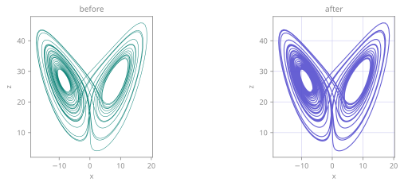
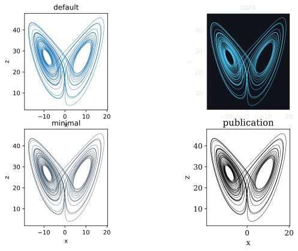

<span class="ts-kicker">Visualization · Styling & themes</span>

# Styling & themes

Every plot TSDynamics produces is a backend-agnostic
[`Plot`](index.md): a *semantic* description of a figure — what to draw and
what it means — rendered on demand by matplotlib, plotly, or the
[three.js / JSON exporters](backends.md). Nothing about a spec is tied to a
drawing library, which is exactly what lets one figure render identically
everywhere.

The **styling layer** controls how that figure *looks* — line colours and widths,
markers, opacity, gridlines, fonts, backgrounds — through one **canonical,
validated, introspectable** vocabulary that every visual backend honors
consistently. This page is the full reference: the style keys, the theme system,
every fluent tweak, and the honest per-backend honoring contract.

There are two levers, and they compose:

- **Per-layer style** — the look of one drawable (a line, a scatter, an image):
  `color`, `linewidth`, `marker`, `alpha`, … Set with [`.style(...)`](#style) /
  [`.recolor(...)`](#recolor).
- **The figure-level [`Theme`](#themes)** — palette, font, background, grid, and
  line / marker defaults shared across the whole figure. Set with
  [`.theme(...)`](#theme) and its conveniences
  [`.palette`/`.grid`/`.font`/`.background`/`.size`](#palette-grid-font-background-size),
  or globally with [`themes.use`](#the-global-default).

A theme is applied **first** — it auto-colours every layer that carries no
explicit colour — and per-layer style then overrides it. All of these are
**fluent tweaks**: they mutate the spec and return it, so they chain in any order
and render the same on every backend.

```python
import tsdynamics as ts

p = (
    ts.plot(ts.systems.Lorenz(ic=[1.0, 1.0, 1.0]), components=["x", "z"])
    .theme("dark")                    # figure-level look
    .gridlines()                      # gridlines on
    .recolor("crimson")               # this layer's colour
    .style(lw=2, linestyle="dashed")  # this layer's line
)
p.save("lorenz-dark.png")             # matplotlib (by extension)
```

<figure markdown>
{ loading=lazy }
<figcaption>The same Lorenz <code>(x, z)</code> portrait, twice. <b>Left:</b> a bare <code>ts.plot(traj)</code> — default palette, no grid, backend background. <b>Right:</b> the identical trajectory after one chained recipe — <code>.recolor("#11857A")</code>, <code>.style(lw=2.2, alpha=0.85)</code>, <code>.gridlines(color="#9aa7b0", alpha=0.4)</code>, <code>.background("#faf7f2")</code>. The <em>data</em> is byte-for-byte identical; only the presentation layer changed, and the same recipe would render the same on plotly.</figcaption>
</figure>

Everything below is runnable as shown. Where a snippet prints a value it pins an
explicit initial condition (`ic=`), because most catalogue systems have
`default_ic=None` and draw a fresh random start each run — a reproducible figure
needs a reproducible orbit.

---

## The style vocabulary

`STYLE_KEYS` is the **closed, reviewed** per-layer vocabulary. Each entry is a
`StyleKey` carrying its canonical name, the accepted aliases, the backends that
genuinely honor it, a value validator, and a one-line doc — so there is no
guesswork about what a key accepts or where it lands.

| Canonical | Aliases | Honored by | Meaning |
| --- | --- | --- | --- |
| `color` | `c` | mpl, plotly, three.js | line / marker / fill colour (CSS name, hex, or rgb tuple) |
| `linewidth` | `lw` | mpl, plotly, three.js | line width, pt (≥ 0) |
| `linestyle` | `ls` | mpl, plotly | one of `solid`, `dashed`, `dotted`, `dashdot` |
| `marker` | — | mpl, plotly | one of `circle`, `square`, `triangle`, `diamond`, `cross`, `x`, `star`, `none` |
| `markersize` | `ms`, `s` | mpl, plotly, three.js | marker size, pt (≥ 0) |
| `alpha` | `opacity` | mpl, plotly, three.js | opacity in `[0, 1]` |
| `cmap` | `colormap`, `colorscale` | mpl, plotly | colormap name for the colour / image channel |
| `fill` | — | mpl, plotly | fill the area under / between (bool) — `AREA` marks only |
| `fillalpha` | — | mpl, plotly | fill opacity in `[0, 1]` — `AREA` marks only |
| `zorder` | — | mpl, plotly, three.js | integer draw order (three.js maps it to `renderOrder`) |

The table is not lore — it is generated from the live `STYLE_KEYS` table, and you
can read the same facts off it directly:

```pycon
>>> import tsdynamics as ts
>>> sorted(ts.viz.STYLE_KEYS)
['alpha', 'cmap', 'color', 'fill', 'fillalpha', 'linestyle', 'linewidth', 'marker', 'markersize', 'zorder']
>>> key = ts.viz.STYLE_KEYS["linewidth"]
>>> key.aliases, key.doc
(('lw',), 'line width (pt)')
>>> sorted(ts.viz.STYLE_KEYS["linestyle"].honored_by)
['matplotlib', 'plotly']
```

### Aliases

Every key accepts the friendly short spellings shown above, and a handful of
*values* are canonicalised too — the matplotlib short line styles
(`-`, `--`, `:`, `-.`) and single-character markers (`o`, `s`, `^`, `D`, `+`,
`x`, `*`). Everything is rewritten to canonical form before storage, so the spec
only ever holds canonical keys and the renderers never have to guess:

```pycon
>>> from tsdynamics.viz import normalize_style
>>> normalize_style({"lw": 2, "c": "red", "s": 8, "ls": "--"})
{'linewidth': 2.0, 'color': 'red', 'markersize': 8.0, 'linestyle': 'dashed'}
```

(`marker` carries no *key-name* aliases — `STYLE_KEYS["marker"].aliases == ()` —
because its alternate spellings are the *value* aliases `o s ^ D + x *`,
canonicalised by the validator rather than the key-name index.)

### Validation

Values are coerced and range-checked by each key's validator. A bad value raises
`ValueError` at the call site rather than silently producing a broken plot:

```pycon
>>> normalize_style({"alpha": 1.5})
Traceback (most recent call last):
    ...
ValueError: invalid value for style key 'alpha': expected a value in [0, 1], got 1.5
```

The rules:

- Sizes (`linewidth`, `markersize`) must be **non-negative**.
- Opacities (`alpha`, `fillalpha`) must lie in **`[0, 1]`**.
- `zorder` must be a genuine **`int`** — a float `2.0` raises (no silent floor); a
  NumPy integer is accepted.
- A `bool` is **rejected** where a magnitude is expected — `alpha=True` is almost
  always a mistake, so it raises instead of quietly becoming `1.0`.

```pycon
>>> normalize_style({"zorder": 2.0})
Traceback (most recent call last):
    ...
ValueError: invalid value for style key 'zorder': expected an int, got 2.0
>>> normalize_style({"alpha": True})
Traceback (most recent call last):
    ...
ValueError: invalid value for style key 'alpha': expected a value in [0, 1], got bool True
```

### Unknown keys warn — they are never silently swallowed

A typo or an unsupported key is **dropped with a single warning**, naming the
offending key(s) and listing the vocabulary. There is no more "I set
`colour='red'` and nothing happened":

```pycon
>>> import warnings
>>> with warnings.catch_warnings(record=True) as w:
...     warnings.simplefilter("always")
...     normalize_style({"colour": "red", "lw": 2})
{'linewidth': 2.0}
>>> w[0].category.__name__
'VisualizationDegraded'
>>> str(w[0].message)
"unknown style key(s) dropped: 'colour'; known keys are alpha, cmap, color, fill, fillalpha, linestyle, linewidth, marker, markersize, zorder"
```

`normalize_style` is the **single choke point** every style dict passes through —
both the `.style(...)` tweak (when a user sets keys) and each renderer (before it
translates canonical keys to backend kwargs) — so this guarantee holds
everywhere.

---

## Fluent tweak methods

Every tweak mutates the spec and **returns `self`**, so they chain top to bottom
in any order and render identically on every backend. They split into three
groups: the **axis/label** tweaks, the **per-layer style** tweaks, and the
**figure-level theme** tweaks.

### Axis & label tweaks

These reshape the axes without touching the data or the look.

```python
p = (
    ts.plot(ts.systems.Rossler(ic=[0.1, 0.1, 0.1]), components=["x", "y"])
    .relabel(x="x(t)", y="y(t)", title="Rössler x–y")
    .limits(x=(-12, 12), y=(-12, 12))
    .ticks(x=[-10, 0, 10])
    .rescale(y="linear")
    .colorize(colorbar=False, legend=False)
)
```

| Method | Signature | What it does |
| --- | --- | --- |
| `.relabel` | `x=, y=, z=, title=` | set axis labels / title (only the args you pass; `z` ignored if 2-D) |
| `.rescale` | `x=, y=, z=` | axis scale — `"linear"` / `"log"` / `"symlog"` |
| `.limits` | `x=, y=, z=` | `(lo, hi)` view limits per axis |
| `.ticks` | `x=, y=, z=` | explicit tick locations per axis |
| `.colorize` | `clim=, colorbar=, legend=` | the colour range, and whether a colorbar / legend shows (each a `Colorbar`/`Legend` object or a `bool`) |

Each keyword defaults to "leave unchanged", so a tweak only touches what you name.

### `.style(**keys, layer=None, axes=None)` {#style}

Merge style keys into one layer or every layer. `**keys` go through
`normalize_style` (aliases canonicalised, values validated, unknown keys warned).

```python
spec = ts.plot(ts.systems.Rossler(ic=[0.1, 0.1, 0.1]))

spec.style(color="teal", lw=2, alpha=0.8)   # apply to every layer
spec.style(linestyle="dotted", layer=0)     # apply to layer 0 only
spec.style(axes=False)                        # hide the axes entirely
```

`layer=None` (the default) applies to *every* layer; an `int` targets one layer.

`axes=False` is a **figure-level switch**, not a style key: it hides ticks,
labels, gridlines, and (in 3-D) the grey background panes — for a clean
"attractor floating in space" still or animation. It is recorded as
`meta["axes_visible"] = False` and **every backend honors it** (mpl
`ax.set_axis_off()`, plotly `visible=False`, three.js drops the grid). It pairs
naturally with `.camera(...)` for a headline attractor figure.

### `.recolor(*colors, layer=None)` {#recolor}

The per-layer colour shorthand. With no `layer`, colour `i` is assigned to layer
`i`, cycling if there are more layers than colours; with an `int` layer, that one
layer is set to `colors[0]`:

```python
# Two 3-D attractors overlaid on one set of axes, coloured by source.
ts.plot(
    ts.systems.Lorenz(ic=[1.0, 1.0, 1.0]),
    ts.systems.Rossler(ic=[0.1, 0.1, 0.1]),
).recolor("crimson", "royalblue")
```

`.recolor("teal")` is exactly `.style(color="teal")` on layer 0; `recolor` earns
its place when a composite has several layers you want coloured in one call.

### `.theme(name | Theme, /, **overrides)` {#theme}

The figure-level look (palette / font / background / grid / line defaults). The
`theme` argument is **positional-only** — call `spec.theme("dark")`, never
`spec.theme(theme="dark")` (the keyword name is reserved so a theme field
literally called `theme` could go in `**overrides`). Pass a registered name, a
`Theme` instance, or `None` (snapshot the active global default *now*), and
optionally override individual fields on top:

```python
spec.theme("publication")                     # a named built-in
spec.theme("dark", font_family="monospace")   # built-in + field override
spec.theme(None, line_width=2.0)              # global default + override
```

**Snapshot semantics.** `.theme("dark")` *pins* the dark theme onto the spec. A
spec that never calls `.theme(...)` carries no theme of its own and resolves to
the active global default **at render time** (so it tracks a later
[`themes.use`](#the-global-default)); calling `.theme(...)` — even
`.theme(None, ...)` — materialises a concrete theme now and **detaches** the spec
from future global-default changes. You can always read the effective theme back:

```pycon
>>> import tsdynamics as ts
>>> ts.plot(ts.systems.Lorenz(ic=[1.0, 1.0, 1.0])).resolved_theme.name
'default'
>>> ts.plot(ts.systems.Lorenz(ic=[1.0, 1.0, 1.0])).theme("dark").resolved_theme.name
'dark'
```

`spec.resolved_theme` is the **read** half of the pattern (`.theme(...)` *sets*,
`resolved_theme` *reads*, `spec._theme` is the raw private field).

### `.palette`, `.grid`, `.font`, `.background`, `.size` {#palette-grid-font-background-size}

Conveniences that each touch one facet of the theme (or, for `.size`, the figure
geometry). All are theme overrides layered on the resolved theme, so they compose
with `.theme(...)` and with each other:

```python
spec.palette(["#11857A", "#574FCF", "#E8A33D"])  # explicit colour cycle
spec.palette("dark")                              # borrow a registered theme's palette
spec.gridlines(show=True, axis="y", color="#9aa7b0", alpha=0.3)  # y-axis gridlines, styled
spec.font(family="serif", size=12)                # theme font family / size
spec.background("#0b1020")                         # figure / axes facecolor
spec.size(width=8, height=5, dpi=150)              # figure geometry
```

Notes:

- **`.palette`** accepts a registered theme *name* (borrows its palette), a bare
  colour string (a one-colour palette), or an explicit sequence — the same
  `resolve_palette` logic:

  ```pycon
  >>> from tsdynamics.viz.style import resolve_palette
  >>> resolve_palette("dark")[0]          # borrow the dark palette
  '#4cc9f0'
  >>> resolve_palette("#ff0000")          # a bare colour → a one-colour cycle
  ('#ff0000',)
  ```

- **`.grid`** toggles gridlines on `"x"` / `"y"` / `"both"` (default `"both"`);
  passing `color=` / `alpha=` also sets the theme's `grid_color` / `grid_alpha`
  so the styling is shared across the figure.
- **`.size`** is deliberately **not** a theme field — `figsize` / `dpi` are figure
  geometry, stored in `spec.meta` (`meta["figsize"]`, `meta["dpi"]`). Only the
  dimensions you pass are updated.

### Chaining

Because every tweak returns `self`, a full figure recipe reads top to bottom —
axes, then look, then geometry:

```python
p = (
    ts.plot(ts.systems.Lorenz(ic=[1.0, 1.0, 1.0]), components=["x", "z"])
    .relabel(x="x(t)", y="z(t)", title="Lorenz x–z")
    .theme("dark")
    .gridlines(color="#3a3f4b", alpha=0.6)
    .recolor("#4cc9f0")
    .style(lw=1.6, alpha=0.9)
    .font(family="monospace")
    .size(width=7, height=7)
)
p.save("lorenz.png")       # matplotlib, by extension — honors the whole chain
```

Note the extension. Saving this same chain as `.html` routes to plotly, which
does not honor `figsize` (see the honoring table above), so the `.size(...)` step
would be dropped with a `VisualizationDegraded` warning naming it. That is the
contract working as designed: a backend that cannot render a tweak says so
rather than silently ignoring it.

The static tweaks compose with the [animation](animation.md) modifiers
(`.animate` / `.trail` / `.head` / `.camera` / `.clock`) the same way — they are
all mutate-and-return-self, so a static recipe and a movie recipe are the same
chain with a `.animate(...)` appended.

---

## Themes

A `Theme` is a **frozen** dataclass describing the figure-level look applied
*before* per-layer style:

| Field | Meaning |
| --- | --- |
| `palette` | colour cycle for auto-coloured layers (those with no explicit `color`) |
| `background` | figure / axes facecolor |
| `foreground` | default ink — text / axes / ticks colour |
| `font_family`, `font_size`, `title_size` | typography |
| `grid`, `grid_color`, `grid_alpha` | default gridline visibility / look |
| `line_width`, `marker_size` | default line / marker sizes |
| `figsize`, `dpi`, `layout_engine` | figure geometry — honoured by matplotlib; plotly declines them with a `VisualizationDegraded` |

Because it is frozen it is safe to share and cache, and you never have to build
one: `ts.viz.themes.register(name, **fields)` takes the keywords directly, and
returns the built theme if you want it. Deriving from an existing theme is the
same call with the original passed positionally:

```python
lab = ts.viz.themes.register("lab", ts.viz.themes.get("minimal"),
                             palette=("#0b6", "#e63"), font_family="serif")
lab.background          # the built theme, if you want the object
ts.viz.themes.get("minimal").palette   # ...and the original is untouched
```

### The built-in themes

Four themes ship out of the box, applied per figure with `.theme(...)`:

| Theme | Look |
| --- | --- |
| `default` | light background, a clean 10-colour qualitative palette, sans-serif, grid off |
| `dark` | near-black background (`#11131a`), light ink (`#e6e6e6`), a brighter 10-colour palette |
| `minimal` | light, a muted palette, slightly thinner lines (`line_width=1.2`), grid off |
| `publication` | serif font, larger labels / titles (`font_size=12`, `title_size=15`), a colourblind-safe palette (Wong 2011, 8 hues) |

<figure markdown>
{ loading=lazy }
<figcaption>One Lorenz <code>(x, z)</code> portrait, four themes, tiled with <code>ts.plot(..., layout="grid")</code>. Only the theme differs between panels: <b>default</b> (matplotlib-ish blue on white), <b>dark</b> (bright cyan on <code>#11131a</code> — the panel keeps its near-black background through the composite), <b>minimal</b> (muted slate, thinner line), and <b>publication</b> (serif labels, larger type, the colourblind-safe Wong palette). Switching theme is a one-word change to the recipe.</figcaption>
</figure>

```pycon
>>> import tsdynamics as ts
>>> ts.viz.themes.names()
['dark', 'default', 'minimal', 'publication']
>>> ts.viz.themes.get("publication").font_family, ts.viz.themes.get("publication").title_size
('serif', 15.0)
>>> ts.viz.themes.get("dark").background, ts.viz.themes.get("dark").palette[0]
('#11131a', '#4cc9f0')
```

Apply one and save straight to a paper-ready vector:

```python
ts.plot(ts.systems.Lorenz(ic=[1.0, 1.0, 1.0])).theme("publication").save("lorenz-pub.pdf")
```

### Registering your own

**`ts.viz.themes.register(name, **fields)` takes plain keywords** — there is no
library type to build. The theme then joins `themes.names()` and is reachable by
name everywhere a name is accepted (`.theme("mine")`, `.palette("mine")`,
`themes.use("mine")`):

```python
ts.viz.themes.register(
    "tsd-brand",
    palette=("#11857A", "#574FCF", "#E8A33D", "#C2405A"),  # teal · indigo · amber · rose
    background="#faf7f2",
    foreground="#1c2b2d",
    font_family="serif",
    grid=True,
    grid_color="#9aa7b0",
    grid_alpha=0.35,
    line_width=1.6,
)

ts.plot(ts.systems.Lorenz(ic=[1.0, 1.0, 1.0])).theme("tsd-brand")   # usable by name
```

Derive one from a built-in by passing it positionally and overriding fields:

```python
ts.viz.themes.register("paper", ts.viz.themes.get("publication"),
                       font_family="serif", dpi=600)
```

```pycon
>>> ts.viz.themes.names()                       # after registering
['dark', 'default', 'minimal', 'paper', 'publication', 'tsd-brand']
>>> ts.viz.themes.get("tsd-brand").background
'#faf7f2'
```

`register` returns the built `Theme`, so it is also the one-liner form of
"build a theme object" when you genuinely want one.

A registered theme is the right home for your lab's or paper's house style — set
it once, then every figure is one `.theme("tsd-brand")` (or one
[`themes.use`](#the-global-default)) away.

### The global default

`themes.use` / `themes.get` read and write the **single** mutable global in the viz
layer — the active default theme that any spec *without its own theme* resolves to
at render time:

```pycon
>>> ts.viz.themes.get().name          # the active default
'default'
>>> ts.viz.themes.use("dark")         # every un-themed plot is now dark
>>> ts.viz.themes.get().name
'dark'
>>> ts.viz.themes.use("default")      # back to baseline
```

`themes.use` accepts a registered *name* or a `Theme` *instance* (which it
registers and activates in one step). `themes.use("default")` always returns to
the baseline. Because a spec that never called `.theme(...)` resolves **lazily**,
switching the global default re-themes every such spec on its next render — set it
once at the top of a notebook or script and every plot follows:

```python
ts.viz.themes.use("publication")
ts.plot(ts.systems.Lorenz(ic=[1.0, 1.0, 1.0])).save("fig1.pdf")   # publication-themed
ts.plot(ts.systems.Rossler(ic=[0.1, 0.1, 0.1])).save("fig2.pdf")  # …and so is this
ts.viz.themes.use("default")                                      # tidy up
```

!!! tip "Global vs. pinned"
    Use **`themes.use(...)`** for a document-wide default that every un-themed
    plot should follow, and **`.theme(...)`** to pin one figure regardless of the
    global. A pinned plot ignores a later `themes.use`; an un-pinned one tracks
    it.

---

## Per-backend honoring

The three *visual* backends differ in what they can render. Each `StyleKey`
declares its `honored_by` set — the backends that genuinely apply it — and this is
an **enforced contract**: where a backend cannot honor a knob you set, the
renderer emits **one consolidated `VisualizationDegraded`** naming the dropped
knobs, rather than silently ignoring them. (The JSON exporter does not draw — it
faithfully *serialises* every field — so it is exempt from this negotiation.)

| Style key | matplotlib | plotly | three.js |
| --- | :---: | :---: | :---: |
| `color` | ✓ | ✓ | ✓ |
| `linewidth` | ✓ | ✓ | ✓ |
| `markersize` | ✓ | ✓ | ✓ |
| `alpha` | ✓ | ✓ | ✓ |
| `zorder` | ✓ | ✓ | ✓ (→ `renderOrder`) |
| `linestyle` | ✓ | ✓ | — |
| `marker` (shape) | ✓ | ✓ | — (points only) |
| `cmap` | ✓ | ✓ | — (fixed ramp) |
| `fill`, `fillalpha` | ✓ | ✓ | — |

The notable gaps:

- **three.js** does not honor `linestyle`, marker *shape*, or an arbitrary
  `cmap` — it draws solid lines, points (size honored, shape not), and a fixed
  built-in colour ramp.
- **`fill` / `fillalpha`** apply to `AREA` marks (a band, a filled region) only.

When a backend would drop something, it tells you — in one message per render,
listing the dropped keys alphabetically:

```pycon
>>> import warnings
>>> import tsdynamics as ts
>>> spec = ts.plot(ts.systems.Lorenz(ic=[1.0, 1.0, 1.0])).style(
...     linestyle="dashed", marker="square", cmap="viridis"
... )
>>> with warnings.catch_warnings(record=True) as w:
...     warnings.simplefilter("always")
...     _ = spec.render("threejs")
>>> str(w[0].message)
'threejs: ignoring cmap, linestyle, marker'
```

The one message also covers any unhonored **animation** knobs and **theme** fields
for the chosen backend, so degradation is always *visible and named*, never
silent. Render the same spec on matplotlib or plotly and it draws all three knobs
with no warning at all. You can introspect a key's reach up front:

```pycon
>>> sorted(ts.viz.STYLE_KEYS["linestyle"].honored_by)
['matplotlib', 'plotly']
>>> sorted(ts.viz.STYLE_KEYS["color"].honored_by)
['matplotlib', 'plotly', 'threejs']
```

For a fully portable figure (including three.js), prefer `color` / `linewidth` /
`markersize` / `alpha` / `zorder`, which every backend honors.

---

## Upgrading from v3 — breaking changes

The v5 redesign makes the style vocabulary a **closed, validated set**. Calls that
silently worked on the old v3 matplotlib path — because they were forwarded
straight to matplotlib — now go through `normalize_style` and raise a `ValueError`
**at the call site** if the value is not in the canonical vocabulary. This is
deliberate: the same spec must render the same on plotly and the three.js / JSON
exporters, so a knob only matplotlib understands cannot be allowed through. The
trade is a louder upgrade for a portable, predictable spec.

```python
# skip-doctest — the first call deliberately shows what now RAISES
# v3 — forwarded to matplotlib, silently accepted
spec.style(marker="v", linestyle=(0, (3, 1)), alpha=1.5, zorder=2.0)

# v5 — each of these raises ValueError; map to the canonical set
spec.style(marker="triangle", linestyle="dashed", alpha=1.0, zorder=2)
```

### Markers — canonical shapes only

`marker` is the canonical set `circle`, `square`, `triangle`, `diamond`, `cross`,
`x`, `star`, `none`, plus the single-character aliases `o s ^ D + x *`. The
matplotlib-only spellings with **no** canonical equivalent now raise:

| v3 matplotlib marker | v5 — use instead |
| --- | --- |
| `'v'`, `'<'`, `'>'` (oriented triangles) | `"triangle"` |
| `'^'` | `"triangle"` (kept as an alias — still works) |
| `'d'` (thin diamond) | `"diamond"` |
| `'8'` (octagon) | `"circle"` (nearest) |
| `'P'` (filled plus) | `"cross"` |
| `'p'`, `'h'`, `'H'` (pentagon / hexagons) | `"star"` or `"circle"` (nearest) |

This is a **cross-backend** choice: three.js and the JSON exporter cannot render
oriented or exotic matplotlib markers, so the vocabulary is restricted to shapes
every visual backend can draw (or honestly decline). It is a **hard error** rather
than a silent substitution — a quiet down-triangle → up-triangle swap would
corrupt a figure more confusingly than a clear `ValueError` naming the unknown
marker.

### Linestyles — named set only

`linestyle` is the named set `solid`, `dashed`, `dotted`, `dashdot`, plus the
short aliases `- -- : -.`. The matplotlib **dash-tuple** form (e.g.
`(0, (3, 1, 1, 1))`) now raises — pick the nearest named style:

```python
# skip-doctest — the first line deliberately shows what now RAISES
spec.style(linestyle=(0, (5, 2)))   # v3 — raises ValueError now
spec.style(linestyle="dashed")      # v5
```

### Range / type checks

Values are now coerced and range-checked, so out-of-range or wrong-typed values
v3 tolerated raise:

- `alpha` / `fillalpha` must lie in `[0, 1]` — v3 tolerated `alpha > 1`
  (matplotlib clamped it).
- `linewidth` / `markersize` must be `≥ 0`.
- `zorder` must be an **integer** — a float `2.0` raises (v3 silently floored it
  via `int(...)`); a NumPy integer is accepted.
- A `bool` is rejected where a magnitude is expected (`alpha=True`,
  `linewidth=True`).

Unknown keys — including a near-miss typo like `colour=` — are **not** a fatal
error: they are dropped with a single `VisualizationDegraded` warning naming the
offending key(s) (see [*Unknown keys warn*](#unknown-keys-warn-they-are-never-silently-swallowed),
above), so the silent no-op of v3 (`colour='red'` did nothing) is gone.

---

## Interaction with `filterwarnings = ["error"]`

This repo's own pytest policy is `filterwarnings = ["error"]` — every warning
becomes an exception — and a fair number of downstream projects run the same
strict policy. Under it, the **two warning paths** the styling layer adds turn
into *errors*:

1. **An unknown style key.** `.style(unknown_key=...)` (or any `normalize_style`
   call that drops a key) emits a `VisualizationDegraded`. With warnings as
   errors, `.style(colour="red")` *raises* instead of warning-and-dropping.
2. **An unhonored knob at render time.** Rendering a spec that sets a knob the
   chosen backend cannot honor (e.g. `linestyle` on three.js) emits the
   consolidated `VisualizationDegraded` described above — which becomes an error
   under the strict policy.

There are **no false positives on a default render**: a spec that sets only
honored knobs (or no style at all) emits nothing, so the strict policy never fires
on an ordinary plot. Only specs that set an *unknown* key or an *unhonored* knob
are affected — exactly the cases the warning is meant to flag.

If a downstream test treats warnings as errors and you *want* the degraded path
(you know three.js drops `linestyle`, say), scope the warning rather than
loosening your global policy. The warning class is
`tsdynamics.viz.render.caps.VisualizationDegraded`:

```python
import warnings
from tsdynamics.viz.render.caps import VisualizationDegraded

# 1. Swallow it locally
with warnings.catch_warnings():
    warnings.simplefilter("ignore", VisualizationDegraded)
    spec.style(linestyle="dashed").render("threejs")
```

```python
# 2. Assert it in a test (pytest), which also consumes it so it can't escalate
import pytest

with pytest.warns(VisualizationDegraded):
    spec.style(colour="red")            # the typo path
```

```ini
# 3. Or down-grade just this class in pyproject.toml / pytest.ini
[tool.pytest.ini_options]
filterwarnings = [
    "error",
    "ignore::tsdynamics.viz.render.caps.VisualizationDegraded",
]
```

Prefer the narrowest scope that fits — `catch_warnings` / `pytest.warns` around
the one call, not a project-wide ignore — so a genuinely-unintended degradation
still surfaces everywhere else.

---

## Introspection

The whole styling surface is discoverable from `tsdynamics.viz`:

| Entry point | What it gives |
| --- | --- |
| `ts.viz.STYLE_KEYS` | the canonical vocabulary — `name → StyleKey` (each with `aliases`, `honored_by`, `validate`, `doc`) |
| `ts.viz.normalize_style` | the alias / validation / unknown-key choke point |
| `ts.viz.themes.names()` | sorted names of all registered themes |
| `ts.viz.themes.get()` / `ts.viz.themes.use()` | read / write the active global default |
| `ts.viz.themes.register()` | add a named theme |
| `ts.viz.Theme` | the theme dataclass |

```pycon
>>> import tsdynamics as ts
>>> sorted(ts.viz.STYLE_KEYS)
['alpha', 'cmap', 'color', 'fill', 'fillalpha', 'linestyle', 'linewidth', 'marker', 'markersize', 'zorder']
>>> key = ts.viz.STYLE_KEYS["markersize"]
>>> key.aliases, key.doc
(('ms', 's'), 'marker size (pt)')
```

`ts.viz` is bound **lazily** — a plain `import tsdynamics` pulls in no plotting
library — so reach the styling API through the `ts.viz` namespace (it resolves and
caches on first access).

---

## See also

- [Visualization overview](index.md) — the `Plot` IR, the front door
  `ts.plot` grammar, and the renderer catalogue these styles apply to
- [Animation](animation.md) — the animation modifiers
  (`.animate`/`.trail`/`.head`/`.camera`/`.clock`) that chain with these tweaks,
  and the honoring gaps for the web exporter
- [Lyapunov spectra](../analysis/lyapunov.md) — an example of a result that
  describes itself as a stylable `Plot`

## References

- B. Wong, "Points of view: Color blindness", *Nature Methods* **8** (2011) 441
  — the colourblind-safe palette used by the `publication` theme.
